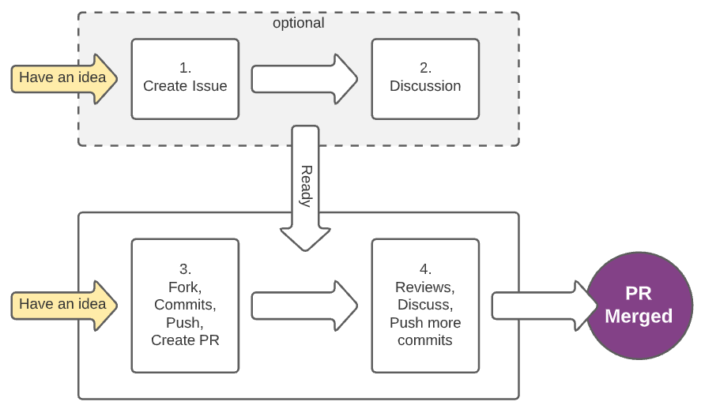

## How to contribute



### 1. Create an Issue
[Create a new issue](https://github.com/dotnetthailand/dotnetthailand.github.io/issues/new). Please describe details of what you want to do. You can see [our previous issues](https://github.com/dotnetthailand/dotnetthailand.github.io/issues) as examples. Create an issue is easy; make it simple. When you have an idea, create it. It does not need to be perfect from the start. (Try type `g i` and then `c` with your keyboard.)

### 2. Make a Discussion
Let you, the admin team, and other members a chance to make conversation on the issue topic:

  - Discuss solutions and alternatives. Two heads are better than one.
  - From the discussion, we may prevent duplicate or unnecessary works that save your valuable time later.
  - Ask any questions that you want people to help.
  - Let people know in advance what you are going to do is always a good idea.

Once things ready, set `Assignees` to a member who wishes to work on the issue. It can be either the issue's creator or anyone else. And you can remove `help wanted` label, if any.

> These first two steps are not required in all scenarios, but we encourage you because more collaboration makes things better and more enjoyable.✨

### 3. Open a Pull Request
- Fork this repository to your own GitHub account and then clone it to your local machine.
- Create a new branch, name it to what you are going to change/add. Please use `kebab-case` naming.
  ```sh
  git checkout -b your-branch-name
  ```
- Start your work, commit the code.
- Push your changes to your origin.
  ```sh
  git push origin -u your-branch-name
  ```

- Create a new Pull Request (PR) targeting the `main` branch of `dotnetthailand.github.io`

### 4. Review and Complete the Work
- Waiting for reviewing. Push more commits if needed to fix your work from pull request feedback. 
  ```sh
  git push
  ```
- A pull request needs at least one careful approval before anyone can merge to `main` branch. Then it will automatically deploy to the server.