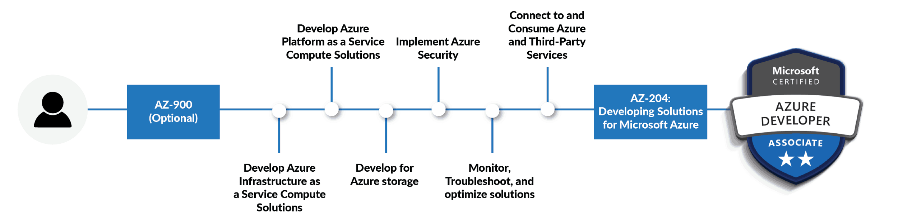
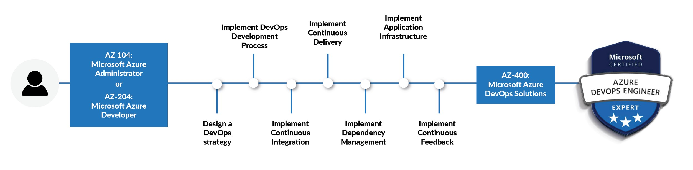

# Microsoft Azure Certifications Path
ผมอยากขออธิบายแนวทางการสอบวัดระดับ Microsoft Azure Certifications เผื่อเป็นแนวทางสำหรับท่านที่ต้องการต่อยอดใบ Certificate ซึ่งมีด้วยกันอยู่ 4 ระดับครับ 

[ดูรายละเอียดเพิ่มเติมได้ที่นี้](https://www.microsoft.com/en-us/learning/browse-all-certifications.aspx)

ระดับที่ 1 : Fundamentals
- Microsoft Certified: Azure Fundamentals (ศึกษาเพิ่มเติม [ที่นี้](../azure-fundamental))
- Microsoft Certified: Azure AI Fundamentals
- Microsoft Certified: Azure Data Fundamentals

ระดับที่ 2 : Associate
- Microsoft Certified: Azure Database Administrator Associate
- Microsoft Certified: Azure Security Engineer Associate
- Microsoft Certified: Azure Administrator Associate
- Microsoft Certified: Azure AI Engineer Associate
- Microsoft Certified: Azure Data Engineer Associate
- Microsoft Certified: Azure Data Scientist Associate
- Microsoft Certified: Azure Developer Associate

ระดับที่ 3 : Expert
- Microsoft Certified: DevOps Engineer Expert
- Microsoft Certified: Azure Solutions Architect Expert

ระดับที่ 4: Specialty
- Microsoft Certified: Azure IoT Developer Specialty
- Microsoft Certified: Azure for SAP Workloads Specialty

## Certification Path for Developer
ในหัวข้อนี้ผมอยากจะแนะนำ Path สำหรับการเรียนรู้และการสอบวัดผลเพื่อได้รับ Certificate โดยอิงจากตำแหน่ง Software Developer นะครับ

### Exam AZ-900 -> Azure Fundamentals ★

เมื่อเราทำการสอบ AZ-900 ผ่านแล้ว เราจะได้รับ Certificate Azure Fundamentals

ภาพจาก <a href="https://k21academy.com/microsoft-azure/az-400/az-400-azure-devops-certification-path">k21academy</a>

- ศึกษาข้อมูลการสอบเพิ่มเติมได้ที่ [docs.microsoft.com](https://docs.microsoft.com/en-us/learn/certifications/exams/az-900)

### Exam AZ-204 -> Azure Developer Associate ★★
เมื่อเราทำการสอบ AZ-204 ผ่านแล้ว เราจะได้รับ Certificate Azure Developer Associate

ภาพจาก <a href="https://k21academy.com/microsoft-azure/az-400/az-400-azure-devops-certification-path">k21academy</a>

- แนวทางการเตรียมตัวสอบ [AZ-204 รีวิว การเตรียมตัวสอบ](https://www.youtube.com/watch?v=bLhs9gXOank)

- ศึกษาข้อมูลการสอบเพิ่มเติมได้ที่ [docs.microsoft.com](https://docs.microsoft.com/en-us/learn/certifications/exams/az-204)

### Exam AZ-400 -> Azure DevOps Engineer Expert ★★★
เมื่อเราทำการสอบ AZ-400 ผ่านแล้ว เราจะได้รับ Certificate Azure DevOps Engineer Expert

ภาพจาก <a href="https://k21academy.com/microsoft-azure/az-400/az-400-azure-devops-certification-path">k21academy</a>

- ศึกษาข้อมูลการสอบเพิ่มเติมได้ที่ [docs.microsoft.com](https://docs.microsoft.com/en-us/learn/certifications/exams/az-400)