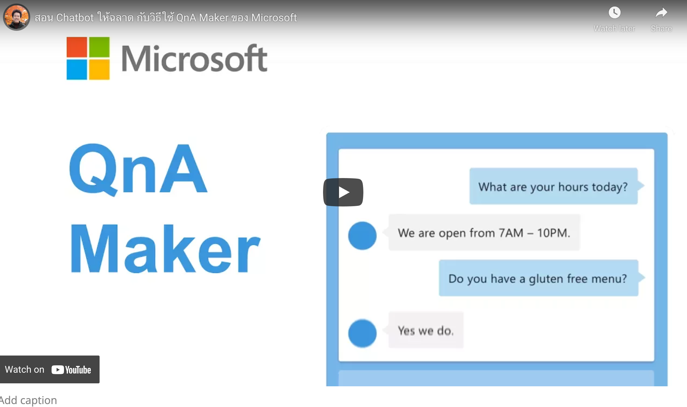

# Azure Cognitive Service

ในบริการของ Microsoft Azure ด้านที่เกี่ยวข้องกับบริการนำปัญญาประดิษฐ์ หรือ AI มาใช้ ก็จะมีบริการที่ชื่อ Azure Cognitive Service และอีกตัวคือ Azure Applied AI Service ที่เพิ่งเปิดตัวในปี 2021 นี้

ในที่นี้พลจะเล่าเกี่ยวกับ Azure Cognitive Service ก่อนละกันนะ 

ในที่นี้ให้นึกภาพว่าถ้าเราอยากกินบะหมี่น้ำสักชาม เราไม่ต้องนวดแป้งทำเส้นเอง แต่ Microsoft ทำรูปแบบของเส้นบะหมี่ พร้อมสำหรับการเอามาต้มยำทำแกงเลย 

บริการ AI ที่อยู่ในชุดของ Cognitive Service จึงพัฒนาขึ้นมาจากความต้องการทั่วไปในการใช้ AI ในโปรเจคงานต่างๆ ให้เราไม่ต้องไปวุ่นวายในระดับที่ลึกมากเกินไป และสามารถเอามารวมกับแอพพลิเคชั่นของเราได้ง่าย

## รูปแบบการใช้งานแบบ API-based 

ทีนี้ตอนเราจะเอามาใช้งาน ตัว Cognitive Service จะอยู่ในรูปแบบของ API เพื่อให้นักพัฒนานำมาใช้งานกับระบบโปรแกรมที่มีอยู่ได้โดยง่าย ซึ่งคนที่ไม่มีพื้นฐานในการโปรแกรมก็ไม่ต้องตกใจแต่อย่างใด Cognitive Service จะมีส่วนการจัดการ (ที่เรียกเท่ๆ ว่า dashboard) ซึ่งมักมาในรูปแบบของเว็บแอพพลิเคชั่น ให้ใช้งานได้ง่าย ส่วนนี้มักจะเป็นส่วนของการจัดการ และ train ตัว Model สำหรับบริการต่างๆ 

เช่น QnAMaker ที่ทำให้เราสร้างกลไกการตอบคำถามทางแชทที่ต้องการ ส่วนของการฝึกปัญญาประดิษฐ์จะอยู่ในรูปแบบเว็บแอพพลิเคชั่น (หน้าตาในปัจจุบันอาจจะแตกต่างจากในวิดีโอเล็กน้อย)

## ภาพรวมของบริการใน Cognitive Service

Microsoft ได้แบ่งประเภทของการใช้งาน AI ออกเป็น 4 กลุ่มบน Azure Cognitive Service ดังนี้ 

### Decision 

- Anomaly Detector
- Content Moderator
- Personalizer

### Language

- Language Understanding
- QnA Maker
- Text Analytics
- Translator

### Speech

- Speech to Text
- Text to Speech
- Speech Translation
- Speaker Recognition

### Vision 

- Computer Vision
- Custom Vision
- Face API 

## เนื้อหาเพิ่มเติม

เดิมทีพลมีการเขียนเล่าประสบการณ์และวิธีใช้งาน Azure Cognitive Service และ Azure Applied AI Service ไว้ที่ blog ของพล สามารถดูหัวข้อที่สนใจ ที่ติด tag ตามนี้ได้เลย

- [Azure AI](https://nextflow.in.th/tag/azure-ai/)
- [Azure Cognitive Service](https://nextflow.in.th/2020/azure-content-moderator-with-thai-language/)
- [Azure Applied AI Service](https://nextflow.in.th/tag/azure-applied-ai/)

หรือติดตามอัพเดตได้[ที่แฟนเพจของพล](https://www.facebook.com/nextflow/) แต่ก็จะมาเขียนใน .NET Thailand บ่อยขึ้น ถ้ายังไงฝากติชมด้วยนะครับ :)
