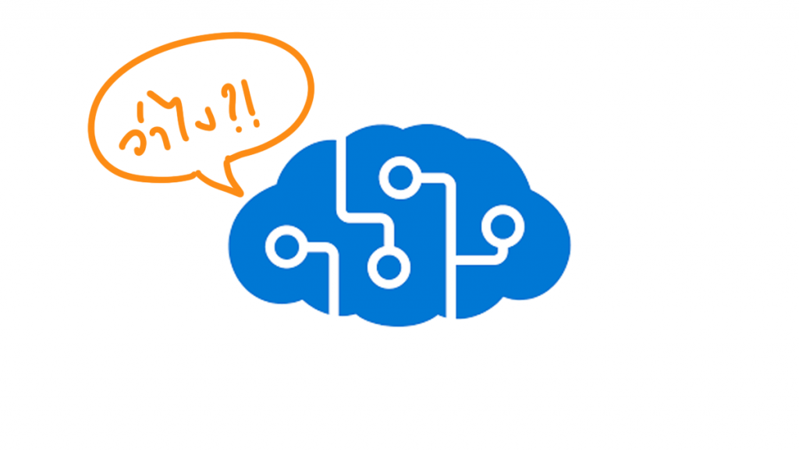
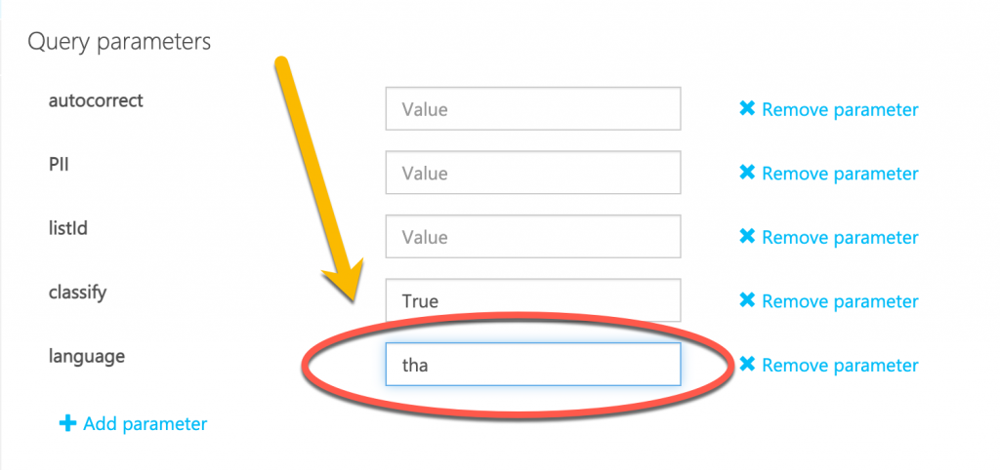

# ทดสอบการใช้งานภาษาไทยกับ Azure Content Moderator 



* บทความนี้อาจจะมีคำหยาบ เพื่อการทดสอบการตรวจจับของ Content Moderator ควรมีผู้ปกครองดูแล และให้แนะนำ ถ้าเป็นหนังก็คงเรท PG-13 

เนื่องจากพลเคยแนะนำ[วิธีการใช้งานเบื้องต้นของ Azure Content Moderator ไปในบทความนี้](https://nextflow.in.th/2020/azure-content-moderator-console-thai/)แล้ว มาในส่วนนี้จะมารีวิวการทดสอบข้อมูลภาษาไทยกับ Azure Content Moderator ครับ

ซึ่งโดยเบื้องต้นตัว Content moderator สามารถใช้งานภาษาไทยในส่วน Profanity ได้แล้ว 

## ทดลองใช้งาน Content Moderator 

1. เอาล่ะ เรามี Azure Resource แล้ว ก็เข้ามาที่ [Content Moderator Console](https://southafricanorth.dev.cognitive.microsoft.com/docs/services/57cf753a3f9b070c105bd2c1/operations/57cf753a3f9b070868a1f66f/console) กันเลย
2. การกำหนดค่าทั่วไป [ให้ทำแบบตัวอย่างหลัก](https://nextflow.in.th/2020/azure-content-moderator-console-thai/)
3. โดยเราจะกำหนดในส่วนของ Query parameter ที่ชื่อ language เป็น **tha** เพื่อให้มันค้นหาชุดคำ Profanity โดยใช้ชุดคำภาษาไทย [โดยอ้างอิงจากมาตรฐาน ISO 639](https://iso639-3.sil.org/code_tables/639/data) 



1. สำหรับ request body จะทดลองใส่คำหยาบลงไปเป็นค่าที่ส่งให้ Content Moderator


5. ด้านล่างจะเป็นตัวอย่างผลลัพธ์ที่ได้กลับมาจาก Content Moderator

```
{
  "OriginalText": "เหี้ย มองอะไร สนใจเริ่มต้น AI ลอง Azure Cognitive Service สิ",
  "NormalizedText": "เหี้ย มองอะไร สนใจเริ่มต้น AI ลอง Azure Cognitive Service สิ",
  "Misrepresentation": null,
  "Language": "tha",
  "Terms": [{
    "Index": 0,
    "OriginalIndex": 0,
    "ListId": 0,
    "Term": "เหี้ย"
  }],
  ...
}
```