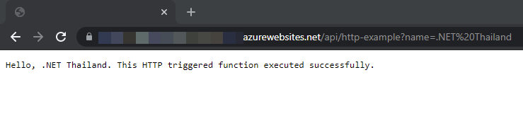

# Develop Azure function app

## Prerequisite
- [Install Azure CLI](/cloud-hosting/azure/azure-cli)
- [Install Azure Functions Core Tools](https://docs.microsoft.com/en-us/azure/azure-functions/functions-run-local?tabs=linux%2Ccsharp%2Cbash#v2)

## Create a new project with TypeScript template
- Create a new project with `func` command.
  ```sh
  $ func init dotnet-thailand-azure-functions --typescript
  ```
- You can change a project name to what is appropriate for you.
- CD to the project folder.
  ```sh
    $ cd dotnet-thailand-azure-functions
  ```
- Add a new function to the project.
  ```sh
    $ func new --name http-example --template "HTTP trigger" --authlevel "anonymous"
  ```
- You can change a function name to what is appropriate for you.

## Run the function locally
- We can test `http-example` function locally by CD back to the root of the project and run some Node package manage commands.
- In this example, we are going to use `Yarn` but you can use `NPM` as well.
- To use Yarn, we need to update scrips section in package.json to use Yarn as the following code.
  ```json
    "scripts" : {
      "build": "tsc",
      "build:production": "yarn run prestart",
      "watch": "tsc --w",
      "prestart": "yarn run build && func extensions install",
      "start:host": "func start",
      "start": "npm-run-all --parallel start:host watch"
    }
  ```
- Run the following commands to launch the project:
  ```sh
    $ yarn install
    $ yarn start
  ```
- You should now see an output message in your terminal showing the application is running at URL and port number.
- Copy the URL of http-example function, e.g. http://localhost:7071/api/http-example to a browser address bar and append query string `?name=<YOUR_NAME>`.
- Press enter to execute the function.
- You should see a message like `Hello <YOUR_NAME>` in a browser.

# Deploy Azure function app

## Prepare Azure Functions app
- You need to have a valid subscription.
- Log in to Azure with `az login`.
- Create a new resource group or use an existing one that you have. [Learn how to create a new resource group](https://www.dotnetthailand.com/cloud-hosting/azure/azure-cli#createaresourcegroupwithdefaultsubscription.).
- Create a storage account, which is used to maintain state and other information about your function app.
- Use the following command to create a general-purpose storage account in your resource group.
  ```sh
    $ az storage account create --name <STORAGE_ACCOUNT_NAME> --resource-group <RESOURCE_GROUP_NAME>--sku Standard_LRS
  ```
- Storage account name must be between 3 and 24 characters in length.  Use numbers and lower-case letters only
- Accepted values for storage account's sku are: `Premium_LRS`, `Premium_ZRS`, `Standard_GRS`, `Standard_GZRS`, `Standard_LRS`, `Standard_RAGRS`, `Standard_RAGZRS`, `Standard_ZRS`.
- Storage account's location is default to a location of a resource group.
- Create a new function app (Consumption plan) with the following command:
  ```sh
    $ az functionapp create \
      --name <APP_NAME> \
      --storage-account <STORAGE_ACCOUNT_NAME> \
      --resource-group <RESOURCE_GROUP_NAME> \
      --consumption-plan-location southeastasia \
      --runtime node \
      --runtime-version 12 \
      --functions-version 3 \
      --disable-app-insights true
  ```
- If you use other Node.js version, please change --runtime-version value.
- We have disable Application Insight because this is an example app and we don't want to pay for Application Insights.
- Use `az functionapp list-consumption-locations --output table` to view available locations for Azure functions.

## Manually deploy the function app to Azure
- CD to root of the project and use the following command to build the project:
  ```sh
    $ yarn run build
  ```
- Publish your app to Azure with the following command:
  ```sh
    $ func azure functionapp publish <APP_NAME>
  ```
- After the app has been deployed, you should see `Deployment completed successfully` message in a terminal and a URL of your function.

## Test the function app on Azure
- Copy the invoke URL from a terminal into a browser address bar. The URL pattern should be `https://<APP_NAME>.azurewebsites.net/api/<FUNCTION_NAME>`.
- Append query string `?name=<YOUR_NAME>` and press enter to execute the function.
- You should see a message like `Hello <YOUR_NAME>` in a browser.



# Linke to the source code
- https://github.com/dotnetthailand/dotnet-thailand-azure-functions

# Useful commands for Azure function app
## Delete a function app
```sh
  $ az functionapp delete \
    --name <APP_NAME> \
    --resource-group <RESOURCE_GROUP_NAME>
```

# Credit & Reference
- https://docs.microsoft.com/en-us/azure/azure-functions/create-first-function-cli-typescript
