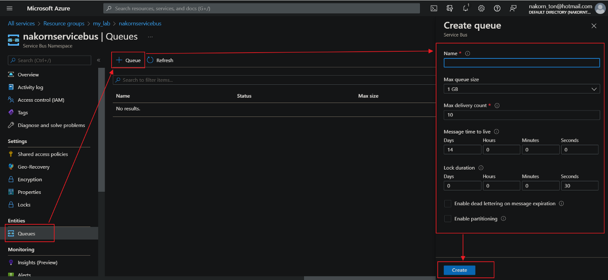
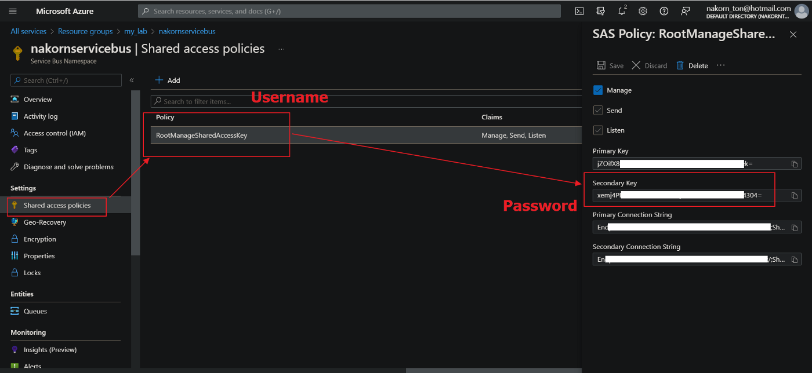
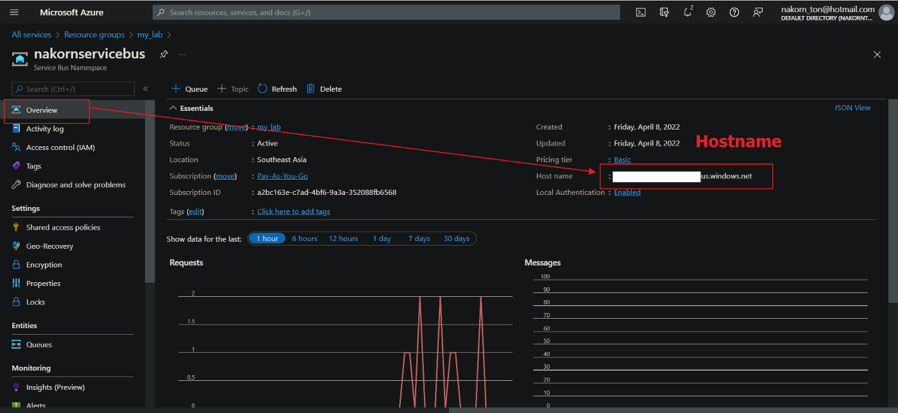
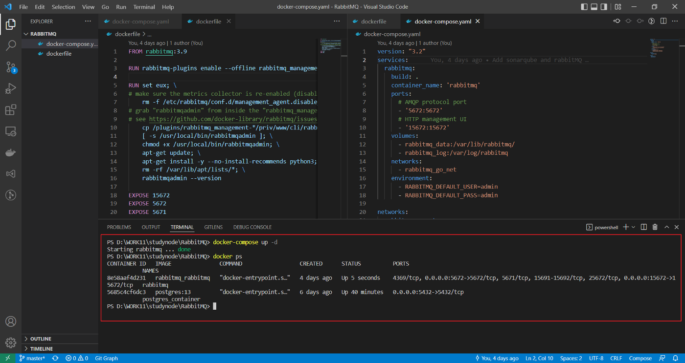
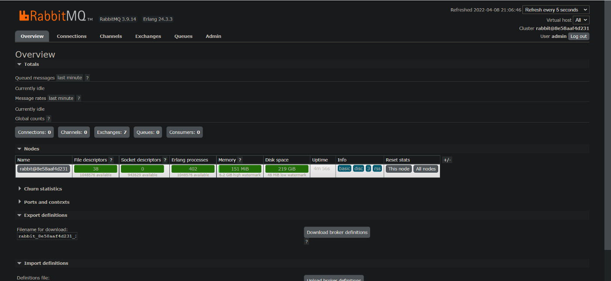
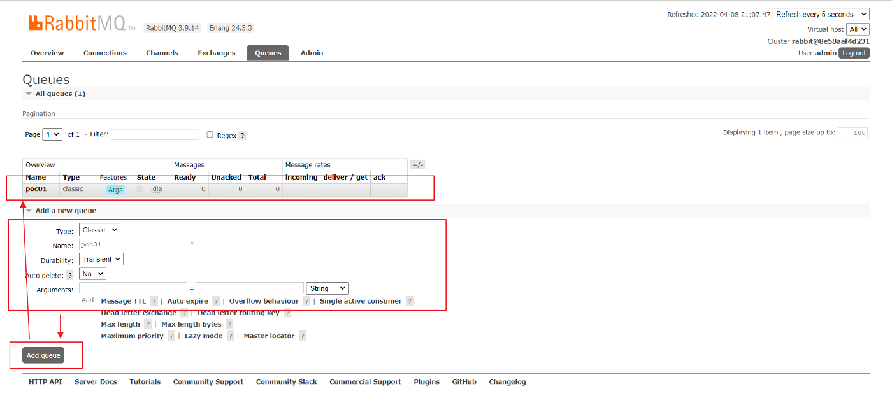
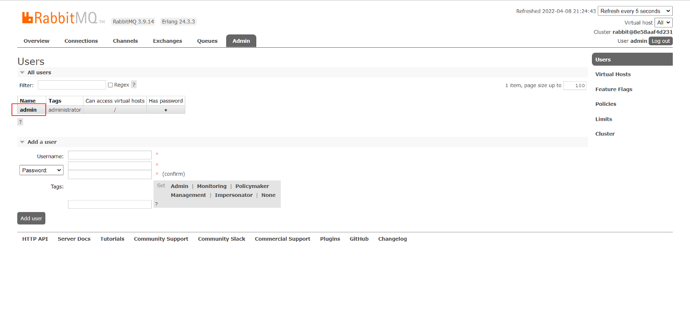
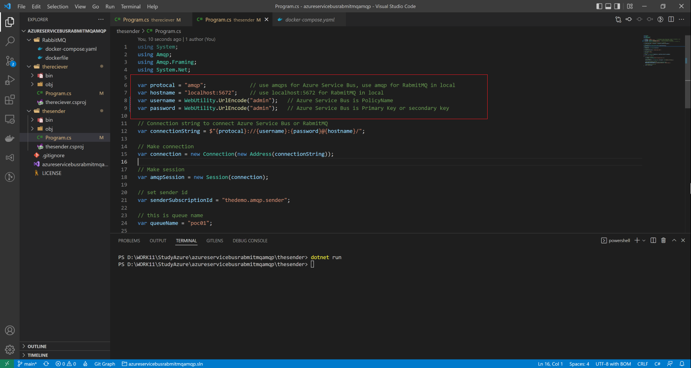
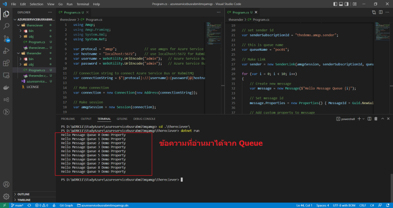

# การเขียน C# เพื่อจัดการ Message Queue ผ่าน Azure Service Bus และ RabbitMQ ด้วย Code ชุดเดียวกัน


เมื่อสัปดาห์ที่แล้ว ได้มีโอกาศรับงานต่อจากเพื่อนมา เพื่อจะนำระบบ Message Queue มาใช้งานจริงใน project ที่กำลังดำเนินการอยู่ ซึ่งเพื่อนก็ทำการบ้านมาเป็นอย่างดี มีตัวอย่างการใช้งาน Azure Service Bus มาให้

แต่อย่างไรก็ตาม สุดท้ายผมติดปัญหาการนำมาใช้จริง เนื่องจากการ implement ด้วย Azure Service Bus สามารถทำงานได้บน Cloud แต่ถ้าเราจะทดสอบระบบ ระหว่างที่ debug ในเครื่องตัวเอง, การจะเปิด Queue บน Cloud สำหรับทุกคน นั่นค่อนข้างลำบากและมีค่าใช้จ่าย จึงจำเป็นต้องหาหนทาง ในการทำให้ทำงานใน local ได้, และ deploy ไปใช้งานร่วมกับ Cloud Service ได้ โดยใช้ code ชุดเดียวกัน โดยในที่สุด ผมก็ทำได้ โดยเก็บ source code ไว้ที่นี่ นะคับ

[https://github.com/nakornttss/azureservicebusrabmitmqamqp](https://github.com/nakornttss/azureservicebusrabmitmqamqp)


จากการศึกษา พบ Mesage Queue ที่น่าสนใจคือ RabbitMQ ซึ่งใช้ protocal ชื่อ AMQP (https://www.amqp.org/) เป็นโปรโตคอล พื้นฐานสำหรับจัดการคิว ซึ่งเป็นตัวเดียวกันกับที่ Azure Service Bus ใช้

แต่อย่างไรก็ตาม แต่ละโปรแกรม จะมี library ในการจัดการคิวของตนเอง ดังนี้

- Azure Service Bus ศึกษาได้จาก https://docs.microsoft.com/en-us/dotnet/api/overview/azure/service-bus
- RabbitMQ จะให้ใช้ dotnet add package RabbitMQ.Client โดยดูตัวอย่างได้จาก https://www.rabbitmq.com/tutorials/tutorial-one-dotnet.html

จากข้อมูลข้างต้น ทำให้เราไม่สามารถใช้ code ชุดเดียวกัน ในการรันทั้ง local และ cloud ได้ จึงจำเป็นจะต้องใช้ library อื่นมาเป็นสะพานกลาง เพื่อให้ code เดียวกัน ใช้งานกับทั้งคู่ได้ ซึ่งผมศึกษาเพิ่ม พบว่า มีตัวที่น่าสนใจคือ http://azure.github.io/amqpnetlite/

จากนั้น ผมก็ทดสอบ เอามาใช้งาน ปรากฏว่า ติดปัญหาเพิ่มอีกนิดหน่อย คือว่า Azure Service Bus ใช้ protocal version 1.0 แต่ RabbitMQ ใช้ protocal version 0.9.x ซึ่ง พอไม่ตรงกัน เลยต้องมีการ configure ให้ RabbitMQ สามารถใช้ 1.0 ได้ด้วย ซึ่งผมได้จัดการ สร้าง dockerfile ขึ้นมา โดย inherit ต่อมาจาก official 3.9 และได้จัดแจงเปิด service เพิ่มเติม เพื่อให้ RabbitMQ ของผม สามารถดู dashboard ใน local ได้ด้วย จึงได้ผล ออกมาเป็น dockerfile และ docker compose ดังนี้

dockerfile

  ```dockerfile
  FROM rabbitmq:3.9

  RUN rabbitmq-plugins enable --offline rabbitmq_management rabbitmq_amqp1_0

  RUN set eux; \
  # make sure the metrics collector is re-enabled (disabled in the base image for Prometheus-style metrics by default)
    rm -f /etc/rabbitmq/conf.d/management_agent.disable_metrics_collector.conf; \
  # grab "rabbitmqadmin" from inside the "rabbitmq_management-X.Y.Z" plugin folder
  # see https://github.com/docker-library/rabbitmq/issues/207
    cp /plugins/rabbitmq_management-*/priv/www/cli/rabbitmqadmin /usr/local/bin/rabbitmqadmin; \
    [ -s /usr/local/bin/rabbitmqadmin ]; \
    chmod +x /usr/local/bin/rabbitmqadmin; \
    apt-get update; \
    apt-get install -y --no-install-recommends python3; \
    rm -rf /var/lib/apt/lists/*; \
    rabbitmqadmin --version

  EXPOSE 15672
  EXPOSE 5672
  EXPOSE 5671
  ```

docker-compose.yaml

  ```yml
  version: "3.2"
  services:
    rabbitmq:
      build: .
      container_name: 'rabbitmq'
      ports:
        # AMQP protocol port
        - '5672:5672'
        # HTTP management UI
        - '15672:15672'
      volumes:
        - rabbitmq_data:/var/lib/rabbitmq/
        - rabbitmq_log:/var/log/rabbitmq
      networks:
        - rabbitmq_go_net
      environment:
        - RABBITMQ_DEFAULT_USER=admin
        - RABBITMQ_DEFAULT_PASS=admin

  networks:
    rabbitmq_go_net:
      driver: bridge

  volumes:
    rabbitmq_data:
    rabbitmq_log:
  ```

เมื่อความรู้ และองค์ประกอบเริ่มต้น พร้อมแล้ว, ผมจึงจะขอนำเสนอ วิธีการดำเนินการ ดังนี้ครับ

# การสร้าง Azure Service Bus เพื่อทำ Message Queue

ทำการสร้าง Azure Service Bus เพื่อใช้ในการทดสอบเชื่อมต่อด้วย AMQP.net list ให้ทำตามขั้นตอนดังนี้

1.กดสร้าง resource โดยเลือก ประเภทเป็น Service Bus (รายละเอียดในการสร้าง ให้ทำตามขั้นตอนที่ปรากฏในหน้าจอ ไปจนจบนะครับ)


2.เมื่อสร้างเรียบร้อยแล้ว กดที่เมนู Queue ด้านซ้าย, จากนั้น กดเพิ่ม Queue และใส่รายละเอียดตามกรอบสีแดง, แล้วกด create



3.หากสำเร็จ จะพบ Queue ใหม่ โผล่ขึ้นมา ดังนี้ (ให้จดชื่อ queue ที่สร้างขึ้นนี้ เพื่อใช้ทดสอบในโปรแกรมด้วยนะครับ)


4.เข้าสู่เมนู Shared access policies แล้วจดบันทึก username / password ไว้ เพื่อใช้ในโปรแกรม ดังรูป



5.เข้าสู่เมนู Overview แล้วจดบันทึกค่า Host name ไว้ ดังรูป



# การติดตั้งและรัน RabbitMQ ในเครื่อง Local เพื่อทำ Message Queue

1.ดาวโหลด dockerfile และ docker-compose.yaml ตามที่อธิบายตอนต้น มาที่เครื่อง แล้วใช้คำสั่ง docker-compose up -d เพื่อรัน RabbitMQ, ถ้าสำเร็จ ควรจะขึ้นตามกรอบสีแดง



2.ถ้าเรียบร้อยดี ให้ลองเข้า browser ที่ URL http://localhost:15672/ มันควรจะแสดงหน้าจอ ดังนี้ ขึ้นมา


3.ใส่ username = admin, password = admin เข้าไป จะพบหน้าจอ overview ดังนี้



4.ที่ด้านบนสุด, กดเมนู Queues แล้วทำการกรอกข้อมูล เพื่อทำการสร้าง Queue ชื่อ poc01 ขึ้นมา ดังรูป



5.เข้าสู่เมนู admin เพื่อตรวจสอบและกำหนดค่า username / password ดังนี้ โดยคุณสามารถ เพิ่มผู้ใช้งานใหม่ในเมนูนี้, อย่างไรก็ตาม สำหรับการทดสอบนี้ เราจะใช้ username =admin, password = admin ในการทดสอบเชื่อมต่อ



# การเขียน code เพื่อเชื่อมต่อกับ Azure Service Bus หรือ RabbitMQ

ผมได้ทำการ commit ตัวอย่าง code ไปเก็บไว้ที่

[https://github.com/nakornttss/azureservicebusrabmitmqamqp](https://github.com/nakornttss/azureservicebusrabmitmqamqp)

ซึ่งคุณสามารถ Clone ลงมาดูได้ โดยในชุดของ source code จะประกอบไปด้วย โปรแกรมดังนี้

Thesender ใช้สำหรับส่ง message ไปยัง Message Queue มีดังนี้

  ```cs 
    using System;
    using Amqp;
    using Amqp.Framing;
    using System.Net;

    var protocal = "amqp";              // use amqps for Azure Service Bus, use amqp for RabmitMQ in local
    var hostname = "localhost:5672";    // use localhost:5672 for RabmitMQ in local
    var username = WebUtility.UrlEncode("");   // Azure Service Bus is PolicyName
    var password = WebUtility.UrlEncode("");   // Azure Service Bus is Primary Key or secondary key

    // Connection string to connect Azure Service Bus or RabmitMQ
    var connectionString = $"{protocal}://{username}:{password}@{hostname}/";  

    // Make connection
    var connection = new Connection(new Address(connectionString));

    // Make session
    var amqpSession = new Session(connection);

    // set sender id
    var senderSubscriptionId = "thedemo.amqp.sender";

    // this is queue name
    var queueName = "poc01";

    // Make Link
    var sender = new SenderLink(amqpSession, senderSubscriptionId, queueName);

    for (var i = 0; i < 10; i++)
    {
        // Create new message
        var message = new Message($"Hello Message Queue {i}");
        
        // Set message id
        message.Properties = new Properties() { MessageId = Guid.NewGuid().ToString() };

        // Add custom property to message
        message.ApplicationProperties = new ApplicationProperties();
        message.ApplicationProperties["Message.Type.Method"] = "Demo Property";

        // Send message to service bus
        sender.Send(message);
    }
  ```

Thereciever ใช้สำหรับรับ message จาก Message Queue มีดังนี้

  ```cs 
    using Amqp;
    using Amqp.Framing;
    using System.Xml;
    using System.Net;

    var protocal = "amqp";              // use amqps for Azure Service Bus, use amqp for RabmitMQ in local
    var hostname = "localhost:5672";    // use localhost:5672 for RabmitMQ in local
    var username = WebUtility.UrlEncode("");   // Azure Service Bus is PolicyName
    var password = WebUtility.UrlEncode("");   // Azure Service Bus is Primary Key or secondary key

    // Connection string to connect Azure Service Bus or RabmitMQ
    var connectionString = $"{protocal}://{username}:{password}@{hostname}/";  

    // Make connection
    var connection = new Connection(new Address(connectionString));

    // Make session
    var amqpSession = new Session(connection);

    // set receiver id
    var receiverSubscriptionId = "thedemo.amqp.receiver";

    // this is queue name
    var queueName = "poc01";

    // Make link
    var consumer = new ReceiverLink(amqpSession, receiverSubscriptionId, $"{queueName}");

    // Register handler to manage menage when get any new message
    consumer.Start(5, OnMessageCallback);

    // Wait until press some key
    Console.Read();

    // Handler for manage activity when getting the new message
    static void OnMessageCallback(IReceiverLink receiver, Amqp.Message message)
    {
        try
        {
            // Get custom property from message
            var messageType = message.ApplicationProperties["Message.Type.Method"];

            // Read message body
            var rawBody = message.Body;
            Console.WriteLine(rawBody.ToString() + " " + messageType);

            // Accept message once compled reading
            receiver.Accept(message);
        }
        catch (Exception ex)
        {
            // Reject message in case got any error
            receiver.Reject(message);
            Console.WriteLine(ex);
        }
    }
  ```

ในการทดสอบกับ RabbitMQ ให้กำหนดค่า ดังนี้



โดยเมื่อทำการรันโปรแกรม thesender โปรแกรมจะส่ง message ไปเก็บไว้ใน Queue


จากนั้น เมื่อรันโปรแกรม thereceiver ก็จะเป็นการดึง message จาก Queue ออกมาแสดงผล




ในการทำงานร่วมกับ Azure Service Bus ให้ทำการกำหนดค่าในโปรแกรม ดังนี้ (ค่าต่างๆ ให้เอามาจาก ที่จดไว้ ในขั้นตอน setup Azure Service Bus)


และเมื่อทดสอบดู ก็จะได้ผลเช่นเดียวกัน


ท้ายนี้ ขอขอบคุณที่อ่านมาถึงตรงนี้, หวังว่า บทความนี้ จะมีประโยชน์บ้าง ไม่มาก ก็น้อย