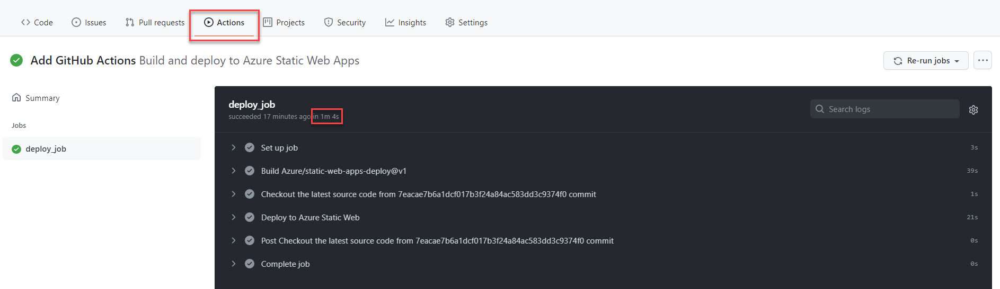

# Requirements
- Create an Azure Account.
- Setup Azure CLI.
- Log in with Azure CLI.
- Create a resource group.
- If you haven't done these requirements, please refer to [Azure CLI content](/cloud-hosting/azure/azure-cli).
- GitHub repository with source code that consists of an HTML page (index.html) or an output from static site generator, e.g. Gatsby, Jekyll.

# Create a static app from existing source code
- Use the following command to create Azure static web app with a free plan.
  ```sh
  az staticwebapp create \
    --name <STATIC_WEB_APP_NAME> \
    --resource-group <RESOURCE_GROUP_NAME> \
    --location <LOCATION_NAME> \
    --source <GITHUB_REPOSITORY_URL_OF_STATIC_SITE> \
    --branch <REPOSITORY_BRANCH_TO_DEPLOY> \
    --token <GITHUB_PERSONAL_ACCESS_TOKEN>
  ```
- For RESOURCE_GROUP_NAME, use `az group list --output table`.
- Available regions for the location are westus2, centralus, eastus2, westeurope, eastasia.
- To list all locations, use `az account list-locations --output table`.
-
- For GITHUB_REPOSITORY_URL_OF_STATIC_SITE, use `https://github.com/account-name/repository-name` pattern.
- For REPOSITORY_BRANCH_TO_DEPLOY, use a branch that you want to deploy source code to a static app, e.g. main, develop.
- For GITHUB_PERSONAL_ACCESS_TOKEN, please refer to
  ["Creating a personal access token"](https://docs.github.com/en/github/authenticating-to-github/keeping-your-account-and-data-secure/creating-a-personal-access-token) document.
  Get only repo (full control of private repo) permission.
- Learn more about `az staticwebapp create` command, please refer to
  https://docs.microsoft.com/en-us/cli/azure/staticwebapp?view=azure-cli-latest#az_staticwebapp_create
- After you have configured all options, execute the command and wait until deployment has finish.

# Create an empty static app
- As mentioned in this issue (https://github.com/Azure/static-web-apps/issues/446) setting up DevOps is not currently supported.
  However, you can create an empty static app by setting empty values to required options.
- For example:
  ```sh
  az staticwebapp create \
    --name codesanook-example-static-web-app \
    --resource-group codesanook-example-resource-group \
    --location eastasia \
    --source "" \
    --branch "" \
    --token dummy
  ```

# Testing a website
- You should get `defaultHostname` value as a result from `az staticwebapp create` command.
- Copy a value of `defaultHostname` and paste it into an address bar of your browser and press enter.
- You should see an HTML page with message `Your Azure Static Web App is live and waiting for your content`.

# Deploy website's source code with GitHub Action
- In a root of you project folder, create `.github/workflows/build-and-deploy-to-azure-static-web-apps.yml` file.
- Add the following content to the workflow file to deploy a main branch to Azure Static Web Apps.

  ```yaml
  # .github/workflows/build-and-deploy-to-azure-static-web-apps.yml

  # Learn more about Azure/static-web-apps-deploy https://docs.microsoft.com/en-us/azure/static-web-apps/github-actions-workflow
  name: Build and deploy to Azure Static Web Apps
  on:
    push:
      branches:
        - main

  jobs:
    deploy_job:
      runs-on: ubuntu-latest
      steps:
        - name: Checkout the latest source code from ${{ github.sha }} commit
          uses: actions/checkout@v2

        - name: Deploy to Azure Static Web Apps
          uses: Azure/static-web-apps-deploy@v1
          with:
            azure_static_web_apps_api_token: ${{ secrets.AZURE_STATIC_WEB_APPS_API_TOKEN }}
            action: upload

  ```
- Create GitHub secret `AZURE_STATIC_WEB_APPS_API_TOKEN` and set a value which we can get from `Deployment Token` in Azure portal.
  
- Commit your code and push to a main branch.
- In GitHub's Actions tab, you should see your deployment log and status.
  
- After deployment has finished, check your website in a browser.
- Open a browser and navigate to your static app URL.
- You should now see a homepage from your source code.

# Get a deployment token with Azure CLI
- Command:
  ```sh
  az staticwebapp secrets list \
    --name <STATIC_WEB_APP_NAME> \
    --resource-group <RESOURCE_GROUP_NAME>
  ```
- Example code to get a deployment token:
  ```sh
  az staticwebapp secrets list \
    --name codesanook-example-static-web-app \
    --resource-group codesanook-example-resource-group
  ```

# Other useful commands

# Show details of an existing static web app
- Command:
  ```sh
  az staticwebapp show \
    --name <STATIC_WEB_APP_NAME> \
    --resource-group <RESOURCE_GROUP_NAME>
  ```
- Example code to show details of an existing static web app:
  ```sh
  az staticwebapp show \
    --name codesanook-example-static-web-app \
    --resource-group codesanook-example-resource-group
  ```

## Delete an existing static web app
- Command:
  ```sh
  az staticwebapp delete \
    --name <STATIC_WEB_APP_NAME> \
    --resource-group <RESOURCE_GROUP_NAME> \
    --yes
  ```
- Example code to delete an existing static web app:
  ```sh
  az staticwebapp delete \
    --name codesanook-example-static-web-app \
    --resource-group codesanook-example-resource-group \
    --yes
  ```

# Useful resources
- [Deploy Gatsby to Azure Static Web Apps](/programming-cookbook/github-actions/deploy-gatsby-to-azure-static-web-apps)
