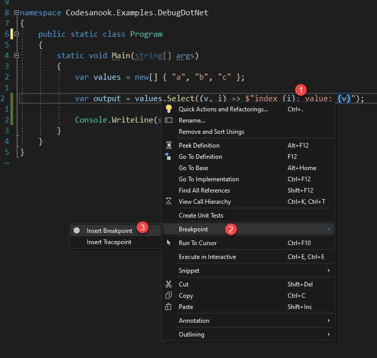

# Debug C# Code
- Open a project with Visual Studio
- Put a breakpoint (F9) on a line that you want to pause a program and inspect value of a variable.
- Start a program by pressing F5 or go to `Debug > Start Debugging`.
  - If you want to debug LINQ, put a cursor on Lambda expression and `right click > Breakpoint > Insert Breakpoint`
- A program will be launched and pause on a line that you put a breakpoint.
- You can inspect current values of variables in Locals window, add variable to watch and see call stack.

