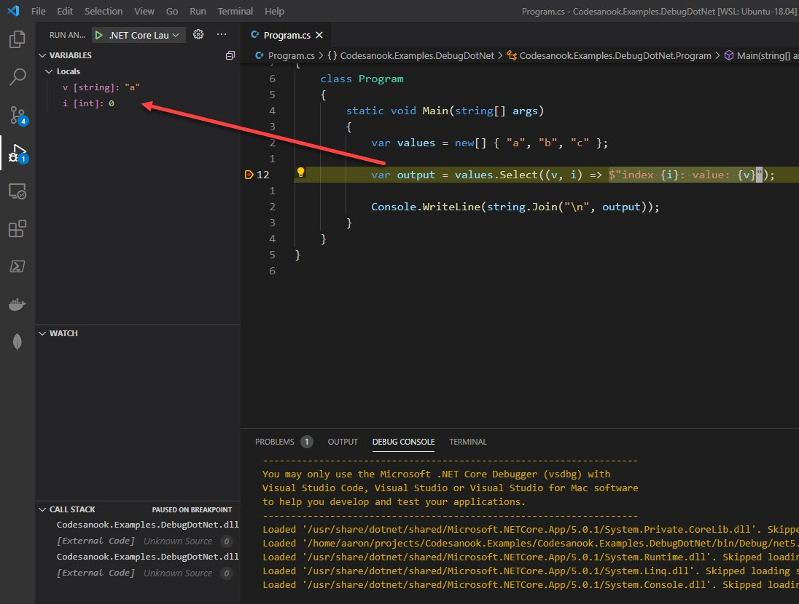

# Debug C# Code

- Create `.vscode/launch.json` file.
- Add the following content and change program value to your output file.

```json
{
  "version": "0.2.0",
  "configurations": [
    {
      "name": ".NET Core Launch (console)",
      "type": "coreclr",
      "request": "launch",
      "preLaunchTask": "build",
      // TODO Change program value to your output file.
      // If you have changed target frameworks, make sure to update the program path.",
      "program": "${workspaceFolder}/bin/Debug/net5.0/MyProgram.dll",
      "args": [],
      "cwd": "${workspaceFolder}",
      "console": "internalConsole",
      "stopAtEntry": false
    }
  ]
}
```

- Create `.vscode/tasks.json` file.
- Add the following content and use your project file.

```json
{
  "version": "2.0.0",
  "tasks": [
    {
      "label": "build",
      "command": "dotnet",
      "type": "process",
      "args": [
        "build",
        // TODO Change a value to your project file.
        "${workspaceFolder}/MyProgram.csproj",
        "/property:GenerateFullPaths=true",
        "/consoleloggerparameters:NoSummary"
      ],
      "problemMatcher": "$msCompile"
    }
  ]
}
```

- Alternatively you can use VS Code to generate launch.json and tasks.json.
  1. Click Debug icon
  2. Click create a launch.json file
  3. Click .NET Core


- Open a project with VS Code.
- Put a breakpoint (F9) on a line that you want to pause a program and inspect value of a variable.
- Start a program by pressing F5 or go to `Run > Start Debugging`
  - If you want to debug LINQ, put a cursor on Lambda expression and go to `Run > New Breakpoint > Inline Breakpoint`.
  - You can also put a cursor on a lambda expression and press F9.
- A program will be launched and pause on a line that you put a breakpoint.
- You can inspect current values of variables in variable window, add variable to watch and see call stack.




