# What is OAuth 2 ?

OAuth 2 is a protocol that grants applications access to protected resources
from another application by requesting an authorization grant from the user who owns the resources or the application itself.

---
# Major components
- Resource owner (user)
- Client (application)
- Authorization server
- Resource server

---

# Flow

The four components will have interaction with each other as below:

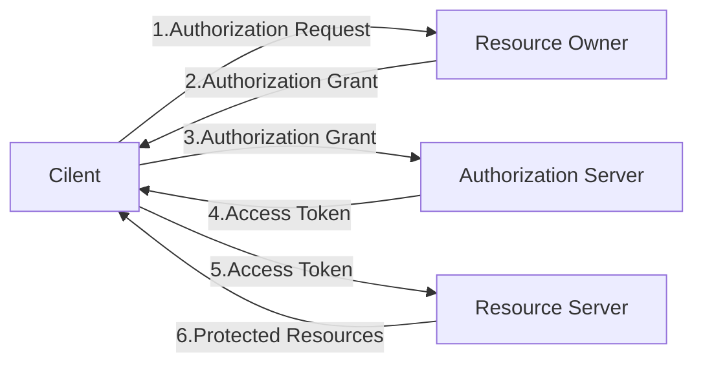

1. The client requests access to resources on the target server from the resource owner.
2. The client receives an **authorization grant** which is the credentials of the resource owner (eg. username and password). This authorization grant is different depending on the grant type used by the authorization server.
3. The client authenticates with the authorization server and presenting the received authorization grant.
4. The authorization server authenticates the client and validates the grant. If the grant is valid, the server will issue **an access token** to the client.
5. The client sends the received access token to request resources from the resource server.
6. The resource server validates the access token and sends resources if valid.

---

# Client Registration
- Before a client application can request an access to resources on a resource server, the client application must be registered on an authorization server associated with the resource server.
- The registration is typically a one-time task. Once registered, the registration remains valid, unless the client app registration is revoked.
- At registration, the client application is assigned a client ID and a client secret (password) by an authorization server.
- An authorization server will use client ID and secret for authentication a client application and a redirect URI for sending a authorization code.

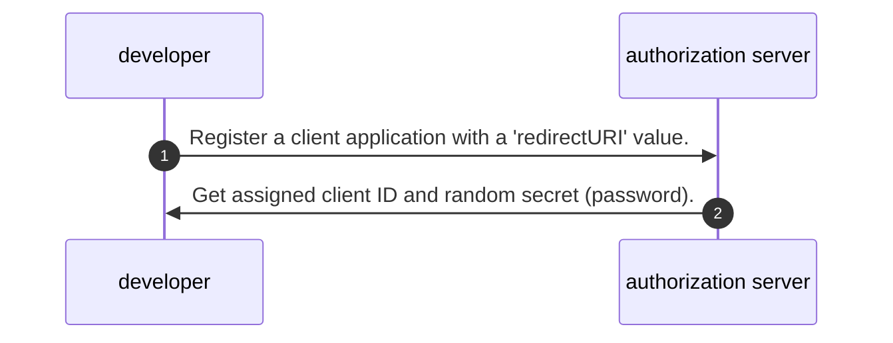

- Client ID and secret are unique to a client application on that authorization server.
- All web, mobile or single page applications for the same client application have the same client ID specific to that authorization server.
- Given some scenarios that `application A` has many types of applications e.g. mobile, single page app:

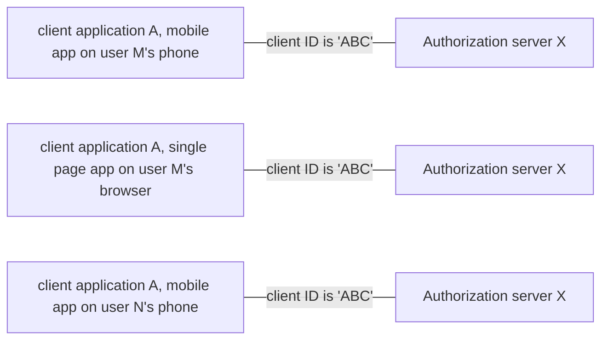

- If a client application registers with multiple authorization servers (e.g. both Facebook, Twitter and Google), each authorization server will issue its own unique client ID to the client application.
- Given the following example:

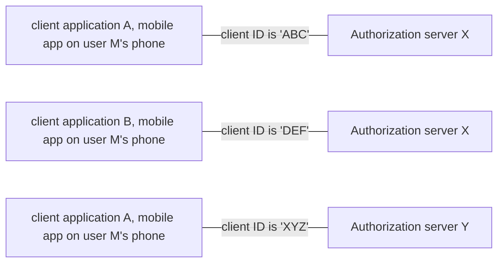
---
# Redirect URI
- During the registration the client also registers a redirect URI.
This redirect URI is used when a resource owner grants authorization to the client application.
- When a resource owner has successfully authorized the client application via the authorization server, the authorization server will use the redirect URI to redirect back to the client.
- **❗❗❗ Don't store a secret on mobile app and single page app.**
For those kind of the app, use redirect URI and Authorization code grant type with PKCE for security.
---

# Sequence diagrams of each grant type

## Assumption
- We have registered user and client application on Authorization server database.
- Our authorization and resource are on the different machines.
- However, the authorization server may be the same server as the resource server or a separate entity as mentioned in https://tools.ietf.org/html/rfc6749#section-1.1


## Grant Types

1. Client credentials

2. Password

3. Authorization code

4. Authorization code with PKCE


###  1. Client credentials Grant

- client send client id and secret and get token in response body
- No URL redirect, if someone can steal id and secret, one can get an access token
- The main usage is for **server to server**.

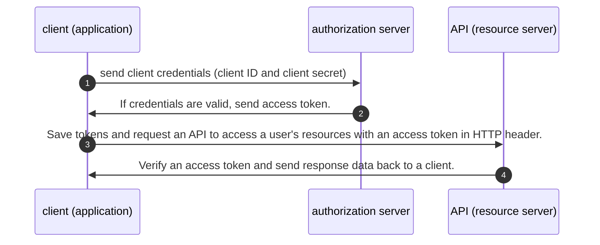

### 2. Password Grant

- Beside client ID and secret, the client also send resource owner's credentials (username and password)
- Used by legacy application and should not be used by modern applications according to an article "[Why the Resource Owner Password Credentials Grant Type is not Authentication nor Suitable for Modern Applications](https://www.scottbrady91.com/OAuth/Why-the-Resource-Owner-Password-Credentials-Grant-Type-is-not-Authentication-nor-Suitable-for-Modern-Applications)".

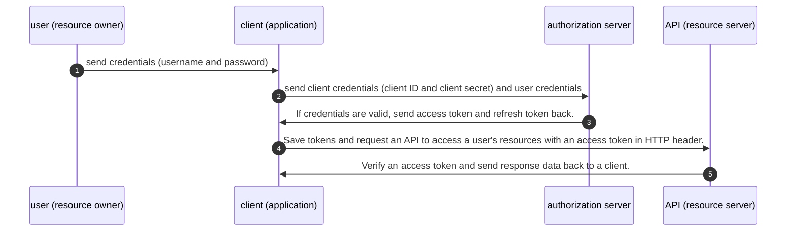

### 3. Authorization code Grant
- Unlike the Clients Credentials grant type, it involves a user for approval.
- This process requires a user to logged in before getting an authorization code.

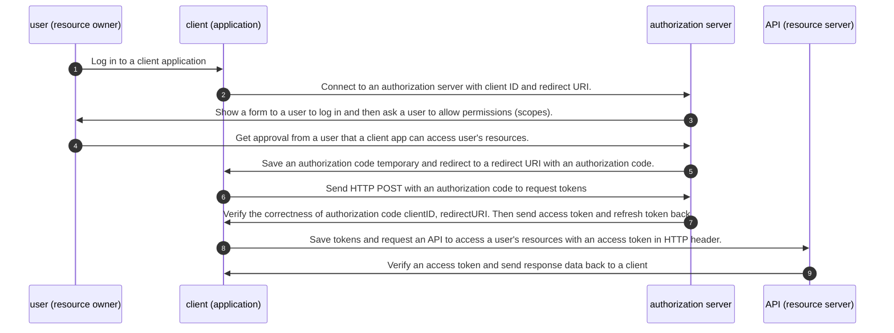
- If someone can steal client ID and redirectURI, one can't get an authorization code because it requires a user to log in allow permission.
- However, a hacker can fake a redirect URI and an authorization code especially on mobile device.

### 4. Authorization code with PKCE

#### What is PKCE?

"PCKE" stands for **"Proof Key for Code Exchange"** and usually pronounce **"Pixie"**. It is a superset feature on top of OAuth2 Authorization Code grant type and will be forced to use by OAuth 2.1 for security.

With this grant type, A hacker can get an authorization code and code challenge but cannot know a **"code verifier"**. Then one cannot get an access token.

The flow is similar to regular authorization code grant type, but the client must generate "code verifier" and "code challenge" (from the code verifier) and send the generated code challenge with its credentials to the authorization server.

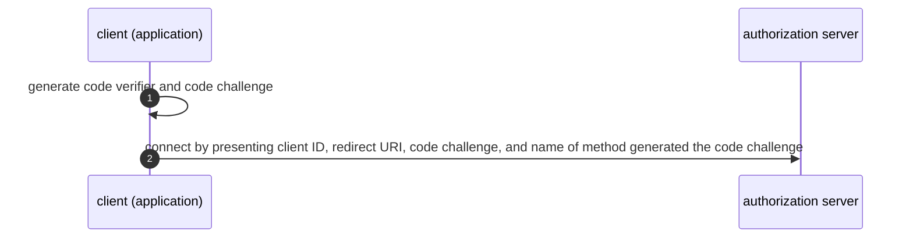

Then the authorization server will store the code challenge and send an authorization code to the client.

When the client would to requests an access token, It has to send the received authorization code with code verifier generated at the first. Beside authorization code, the authorization server will also validate the code verifier by generating another code challenge from the received code verifier and comparing it with the stored code challenge before sending tokens.


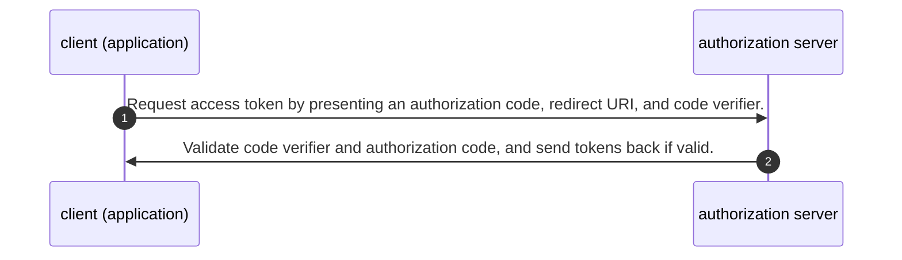

Full Diagram:


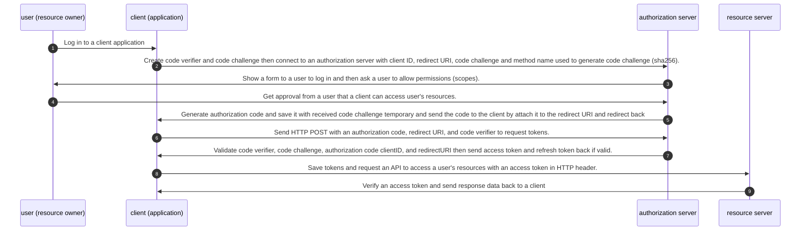
In summary, The authorization code flow with PKCE has some extra work as following:

- **code verifier** and **code challenge** generation in the client
  - **Code verifier** is generated from a random string (>=43 characters)
  - **Code challenge** is generated from `BASE64URL-ENCODE(SHA256(ASCII(code_verifier)))` as defined in https://tools.ietf.org/html/rfc7636#section-4.2
- Client send code challenge when connect to a authorization server for getting a  authorization code
- Client send code verifier when exchange token with an authorization code

---

# Tokens

Token is a random string generated by **authorization server** and send to a client
if authorization grant sent by the client is valid. Tokens used by OAuth2 have 2 types

1. **Access Token**

- It is a token that allows clients to access user data.
- It is a replacement for a user's username and password.
- It will be sent from authorization server to the client through response body, with a limited validity period (`expires_in`) sent as shown in the code below, and will be in the requests that are sent by the client to the resource server.

```json
{
 "access_token":"2YotnFZFEjr1zCsicMWpAA",
 "token_type":"bearer",
 "expires_in":3600,
 "refresh_token":"tGzv3JOkF0XG5Qx2TlKWIA",
}
```

2. **Refresh Token**

- It is a token that a client uses to request a new access token from the authorization server when the access token expires.
- In generally, it is valid longer than the access token.
- It eliminates the need to request an authorization grant to request access to the token every time.
- It is sent with the access token from the authorization server to the client and is used by client like the following:

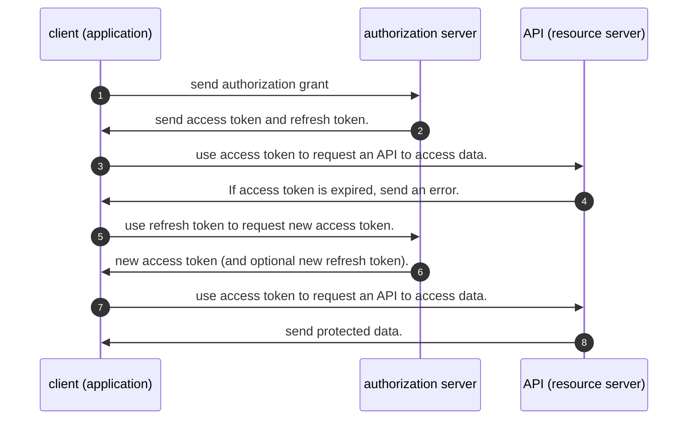


---
# Common mistakes
- Be careful for authorization code get URI encoded because it return as part of query string value
- We don't store client secret on a public client application e.g. mobile app, single page app, desktop app.
- https://www.oauth.com/oauth2-servers/mobile-and-native-apps/
- https://www.valentinog.com/blog/oauth2/

# Tips
- We use token as value of Authorization header when making a request to a resource server
```
  Authorization: `Bearer ${tokens.access_token}`
```

# Credit and Useful links
-  OAuth 2.0 กับ Grant Types ทั้ง 6 by Sakul Montha https://iamgique.medium.com/oauth-2-0-%E0%B8%81%E0%B8%B1%E0%B8%9A-grant-types-%E0%B8%97%E0%B8%B1%E0%B9%89%E0%B8%87-6-e9c82ca978b
- OAuth 2 Simplified https://aaronparecki.com/oauth-2-simplified/
- The OAuth 2.0 Authorization Framework (rfc 6749) https://tools.ietf.org/html/rfc6749
- Express with TypeScript https://medium.com/the-andela-way/how-to-set-up-an-express-api-using-webpack-and-typescript-69d18c8c4f52
- JWT passport https://medium.com/front-end-weekly/learn-using-jwt-with-passport-authentication-9761539c4314
- Express Route with TypeScript https://dev.to/aryclenio/configuring-routes-in-nodejs-with-typescript-2281
- Passport Local https://github.com/jaredhanson/passport-local
- Get HTTP POST Body in Express.js https://stackabuse.com/get-http-post-body-in-express-js/
- cookie JWT https://dev.to/mr_cea/remaining-stateless-jwt-cookies-in-node-js-3lle
- custom authenticate function https://dmitryrogozhny.com/blog/easy-way-to-debug-passport-authentication-in-express
- oauth2orize_client_credentials_example https://github.com/reneweb/oauth2orize_client_credentials_example
- oauth2orize_authorization_grant_example https://github.com/reneweb/oauth2orize_authorization_grant_example
- mongojs https://howtonode.org/node-js-and-mongodb-getting-started-with-mongojs
- Building a RESTful API With Node — OAuth2 Server https://medium.com/@henslejoseph/building-a-restful-api-with-node-oauth2-server-4236c134be4
- check if cookie pass through HTTPS only https://security.stackexchange.com/a/101
- PKCE example https://github.com/Vavassor/Glance-March-2019/blob/master/controllers/oauth2.js
- https://mermaid-js.github.io/mermaid/#/sequenceDiagram
- Should we add role in JWT https://stackoverflow.com/a/53527119/1872200
- http://tutorials.jenkov.com/oauth2/authorization.html
