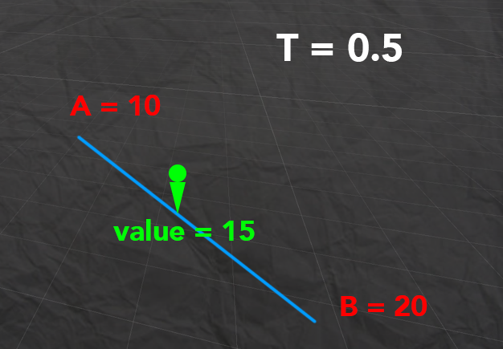

# Inverse Lerp
**Inverse lerp** แปลตรงๆว่า **Lerp** แบบย้อนกลับ ถ้าใครยังไม่รู้จักกับ **Lerp**
แนะนำให้ไปอ่านเรื่อง  **Lerp** ก่อนครับ โดยทั่วไป lerp จะคืนค่าระหว่าง a b มาโดยมี t เป็นตัวกำหนดใช่ไหมครับ ทีนี้เจ้า inverse lerp เนี่ยจะทำหน้าที่ หา t ออกมาจาก ค่าlerp โดย input ของ invert lerp คือ a b และ value ครับ

---
# Formula
## inverse lerp = (value - a) / (b - a)

Inverse lerp มันก็ตามชื่อแหละครับเป็นการย้อนLerp เหมือนกับการย้อนสมการนั่นแหละครับ

a = ค่าเริ่มต้น
b = ค่าสิ้นสุด
value = ค่าlerpของ a กับ b

---
# Example
ถ้าถามว่าเราจะเอา inverse lerp ไปทำอะไรอันนี้ให้ลองนึกถึงถ้าเราจะพวกคำนวนดาเมจจากระเบิดว่าถ้าอยู่ใกล้ให้โดนแรกเท่าไหร่อยู่ไกลให้โดนแรงเท่าไหร่แล้วเรามี
ค่าความเสียหายตั้งต้น ทีนี้ถ้าเราเอาค่า T ที่เราได้จาก invert lerp มาใช้ ทีนี้เราก็จะได้ ตัวคูณของแรงระเบิดของเราแล้ว จากภาพถ้าคิดจากระยะทาง

a = 10
b = 20
value คือตำแหน่งของตัวละครของเรา = 15

หมายความว่าเราจะได้ T ที่ 0.5 ถ้าเราคำนวนง่ายๆ เราก็จะโดนความเสียหายจากระเบิดแค่ครึ่งเดียว

---
# External Link
[Lerp](https://www.dotnetthailand.com/faq/fundamentals/math-for-game/lerp)

