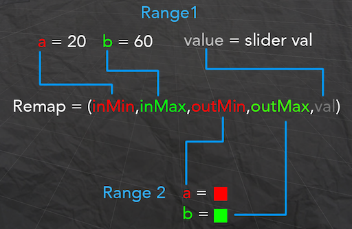
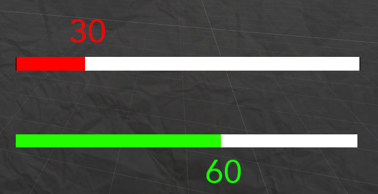

# Remap
**Remap** ถ้าหากใครเคยเขียน Shader มาแล้วก็น่าจะรู้ๆกันดีนะครับว่า remap เนี่ยมันคืออะไร แต่สำหรับคนที่ไม่เคยเขียนShaderมาก่อนนะครับ Remap คือการที่เราต้องรู้ค่าที่เปลี่ยนค่าจากช่วงหนึ่งไปยังอีกช่วงหนึ่งครับ เช่น ผมมีค่า 10ถึง20 แล้วอยากเปลี่ยนไป 50ถึง100
แบบนี้อ่ะครับเราจะใช้ remap ซึ่งในการเขียน shader เนี่ยเราจะใช้บ่อยมากๆครับเพื่อใช้ในการปรับrangeของสีหรือค่าตัวเลขพวกนี้ครับ

---
# Formula
Remap นั้นเกิดมาจาก inverse lerp + กับ lerp
### float t = inverseLerp(inMin,inMax,value)
### Remap = lerp(outMin,outMax,t)
  หรือแบบสั้นๆ
## Remap = (inMin,inMax,outMin,outMax)

inMin = ค่าเริ่มต้นของช่วงที่ 1
inMax = ค่าจบของช่วงที่ 1
outMin = ค่าเริ่มต้นของช่วงที่ 2
outMax คือค่าจบชองช่วงที่ 2
value = valueปัจจุบันของช่วงที่ 1

และสุดท้ายoutput ของฟังก์ชันนี้คือ ค่า valueใหม่ของ rangeใหม่ที่ใส่เข้าไปครับ

---
# Example
เราจะเอามันไปทำอะไรได้บ้างอันนี้ผมจะยกตัวอย่างที่เห็นภาพง่ายที่สุดเลยนะครับ เวลาเราทำหลอดHPของเกมเราอ่ะครับ ถ้าเราอยากได้อะไรแบบ ถ้า HPต่ำกว่า 20%ให้เลือกเป็นสีแดงแต่ถ้าHp มากกว่า 60% ให้เป็นสีเขียว แต่ถ้าอยู่ระหว่าง 20-60% ให้เป็นสีส้ม
เราจะทำยังไงครับ วิธีที่ง่ายที่สุดคือ การเขียน If else ใช่ไหมครับ แต่ถ้าเราเอาเจ้า Remap นี่ไปใช้เราจะได้ HP Bar ที่เปลี่ยนสีตามเลือดที่ลดลงไปด้วยCode แค่ 2 บรรทัดครับ

เรามาเริ่มลองกันเลยครับ
 Hp < 20% = สีแดง
 Hp > 60% = สีเขียว
 HP >= 20 && HP <= 60 เป็น สีส้ม

สิ่งที่เป็นปัญหาของเราคือ สีระหว่างแดงกับเขียวถูกป่าวครับ
ถ้าย้อนไปมองที่ Lerp สีเรายังขาดค่า t ที่จะบอกว่าตอนนี้ ควร blend สีกันยังไง เราจึงต้องหาค่า t ก่อน ทีนี้เราลองมาดูข้อมูลที่เรามีนะครับ

Range 1 ของเรา คือ 20 กับ 60 แล้วก็ value ของ slider
Range 2 ของเรา คือ แดง กับ เขียว ครับ
หมายความว่าเราสามารถใช้ remap ได้แล้วครับ เพราะเรามีของที่จะใช้ครบแล้วถูกป่ะครับ ข้อดีของRemap คือ Remap สามารถใช้กับสิ่งที่ input กับ output ไม่เหมือนกันได้ด้วยครับ เพราะว่าถ้าเราดูจากสูตร สิ่งที่เราต้องการคือค่า t เพื่อเอาไปใส่กับ range2
เราจะเห็นแล้วว่าเรามี ของสำหรับ input เพื่อเอาไปเข้า inverse lerp ครบแล้ว
ส่วนของ output คือ a = Red b = Green ก็ครบแล้วถูกป่ะครับ เราก็เอาทั้งหมดมาเข้าสูตรง remap ของเราเป็นอันเสร็จครับผม

คนที่อ่านมาถึงตรงนี้แล้วจะเห็นได้เลยว่า Math นั้นถามว่าจำเป็นกับการเขียนเกมมั้ย ถ้าจะบอกว่าไม่จำเป็นก็ไม่ถูกแล้วใช่ป่าวครับเพราะถ้าเรารู้เนี่ยดูปริมาณโค้ดที่เราต้องเขียนมันถูกลดลงไปอย่างเห็นได้ชัดเลยครับ

---
# External Link
[Lerp](https://www.dotnetthailand.com/faq/fundamentals/math-for-game/lerp)
[Inverse Lerp](https://www.dotnetthailand.com/faq/fundamentals/math-for-game/inverse-lerp)

