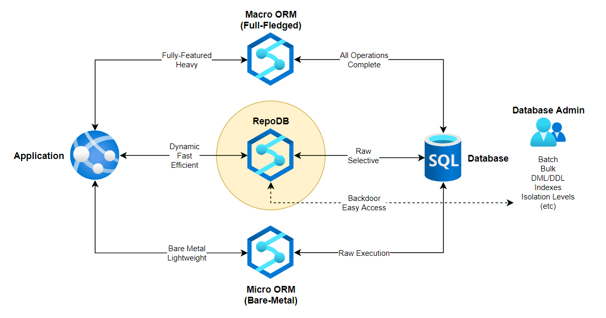

# RepoDb, a hybrid-ORM library for .NET - Part I



อย่างที่เราทราบกันดีว่าการเข้าถึงฐานข้อมูลมีส่วนสำคัญในการพัฒนาผลิตภัณฑ์และซอฟต์แวร์ และเป็นส่วนที่สำคัญที่สุดอย่างหนึ่งของการใช้งาน เนื่องจากจำเป็นต้องได้รับการออกแบบมาเป็นอย่างดีเพื่อให้สามารถเปลี่ยนแปลงได้ง่าย

ด้วยเหตุนี้ การใช้ object relational mapping (ORM) จึงเข้ามามีบทบาท เป็นพื้นฐานทั่วไปสำหรับนักพัฒนาส่วนใหญ่เมื่อพูดถึงการเข้าถึงข้อมูล ไลบรารี ORM ช่วยลดความซับซ้อนและทำให้การนำข้อมูลใน Database ไปใช้งานง่ายขึ้น และในขณะเดียวกันก็ช่วยให้การพัฒนาเร็วขึ้น มันทำงานในส่วนที่ซับซ้อนไปพร้อมกันในขณะที่เราใช้มัน แต่แน่นอนว่าเราควรทราบ "ข้อดี" และ "ข้อเสีย" ของการใช้ ORM ในแอปพลิเคชันของเราด้วย

ปัจจุบันโลกของ C# (หรือ .NET โดยรวม) มีไลบรารี ORM จำนวนมากในตลาด ทั้งแบบโอเพ่นซอร์สและเชิงพาณิชย์ เฟรมเวิร์กที่ได้รับความนิยมมากที่สุดคือ Entity Framework (เฟรมเวิร์กจาก Microsoft) นอกจากนี้ยังมีส่วนอื่นๆ เช่น NHibernate, **Dapper** (micro-ORM จาก StackOverflow) และ LLBLGen Pro

ด้วยเหตุนี้เอง เราในฐานะนักพัฒนาจึงมีหน้าที่เลือกสิ่งที่ดีที่สุดสำหรับความต้องการของเราเพราะเราต้องคำนึงถึง เวลาในการพัฒนา,ความเรียบง่าย,ประสิทธิภาพ ฯลฯ 

##  ทำไมต้อง RepoDb ??

เป็นไลบรารี ORM แบบไฮบริดแบบไดนามิก ที่เบา(lightweight),มีสมรรถภาพ และมีประสิทธิภาพ(high-performance) สูงสำหรับ
.NET

1. คำว่า "สมรรถภาพ" หมายถึง "ความเร็ว" ORM นี้จะแปลงข้อมูลดิบเป็นอ็อบเจ็กต์คลาส และขนส่งอ็อบเจ็กต์คลาสเป็นข้อมูลจริงในฐานข้อมูล
2. คำว่า "มีประสิทธิภาพ" หมายถึง "การจัดการที่ดี" ORM นี้ใช้หน่วยความจำคอมพิวเตอร์เมื่อจัดการกับวัตถุตลอดการใช้งาน (cycle of the process.)

เราจะเรียก RepoDb ว่า hybrid-ORM ก็พราะว่ามันมีคสามสามารถที่ micro-ORM และ full-ORM มีในการที่มันทำให้เกิดความยืดหยุ่นแก่นักพัฒนาในการทำให้งานเกี่ยวกับ Database

ไลบรารีนี้รองรับคุณสมบัติเต็มรูปแบบของ micro-ORM เนื่องจากสามารถดำเนินการ CRUD ผ่าน “Raw SQL” นอกจากนี้ยังรองรับคุณสมบัติพิเศษของ full-ORM

ลองดูตัวอย่างข้องการ  `execute Raw SQL`
```cs
// Query
using (var connection = new SqlConnection(connectionString))
{
     connection.ExecuteQuery<Person>("SELECT * FROM [Person] WHERE Id = @Id;", new { Id = 10045 });
}

// Insert
using (var connection = new SqlConnection(connectionString))
{
     var entity = new
     {
          Id = 10045,
          FirstName = "John",
          LastName = "Smith",
          LastUpdatedUtc = DateTime.UtcNow
     };
     var affectedRows = connection.ExecuteNonQuery("INSERT INTO [Person] (Id, FirstName, LastName, LastUpdatedUtc, CreatedDateUtc) " +
          "VALUES (@Id, @FirstName, @LastName, @LastUpdatedUtc, GETUTCDATE());", entity);
}

// Update
using (var connection = new SqlConnection(connectionString))
{
     var entity = new
     {
          Id = 10045,
          FirstName = "John",
          LastName = "Smith",
          LastUpdatedUtc = DateTime.UtcNow
     };
     var affectedRows = connection.ExecuteNonQuery("UPDATE [Person] SET FirstName = @FirstName, LastName = @LastName, LastUpdatedUtc = @LastUpdatedUtc " +
          "WHERE Id = @Id;", entity);
}

// Delete
using (var connection = new SqlConnection(connectionString))
{
     var affectedRows = connection.ExecuteNonQuery("DELETE FROM [Person] WHERE Id = @Id;", new { Id = 10045 });
}
```

หรือจะให้แบบการเรียก `method-based`
```cs
// Query
using (var connection = new SqlConnection(connectionString))
{
     var person = connection.Query<Person>(p => p.Id == 10045).First();
}

// Insert
using (var connection = new SqlConnection(connectionString))
{
     var person = new Person
     {
          FirstName = "John",
          LastName = "Smith",
          LastUpdatedUtc = DateTime.UtcNow,
          CreatedDateUtc = DateTime.UtcNow
     };
     var personId = connection.Insert(person);
}

// Update
using (var connection = new SqlConnection(connectionString))
{
     var person = connection.Query<Person>(p => p.Id == 10045).First();
     person.FirstName = "John (Updated)";
     person.LastName = "Smith (Updated)";
     person.LastUpdatedUtc = DateTime.UtcNow;
     var updatedRows = connection.Update(person);
}

// Delete
using (var connection = new SqlConnection(connectionString))
{
     var deletedRows = connection.Delete<Person>(p => p.Id == 10045);
}
```

ฟีเจอร์อื่นๆ ของ ORM แบบอื่นยังมีอยู่ในไลบรารีนี้ผ่านการเรียกใช้ตามวิธีการ (เช่น BatchQuery, BulkInsert, Delete, DeleteAll, Insert, InsertAll, Update, UpdateAll, Merge, MergeAll เป็นต้น)

## Batch Operations
การดำเนินการแบบแบตช์ในไลบรารีนี้เป็นคำสั่งแบบแพ็กทั้งหมด โดย DbCommand เดียวใช้เพื่อดำเนินการคำสั่ง SQL หลายรายการในครั้งเดียว กระบวนการนี้เป็น ACID โดยค่า default chunk คือ 10 records ลองดูตัวอย่างด้านล่าง

```cs
// Create a list
var orders = new List<Order>();

// Add each item
orders.Add(new Order { CustomerId = 10045, Quantity = 1, ProductId = 24 });
orders.Add(new Order { CustomerId = 10045, Quantity = 4, ProductId = 27 });

// More orders here

// Call the InsertAll
using (var connection = new SqlConnection(connectionString))
{
    connection.InsertAll<Order>(orders);
}
```

## Bulk-Operations
นทางกลับกัน การดำเนินการจำนวนมากใช้ (bulk-operations) ที่ ADO.NET ให้บริการ ตามค่าเริ่มต้น ไลบรารีกำลังใช้คลาส SqlBulkCopy เพื่อดำเนินการ bulk-insert ไปยัง Database ลองดูตัวอย่างด้านล่าง

```cs
// Create the list
var orders = new List<Order>();

// Add each item
orders.Add(new Order { CustomerId = 10045, Quantity = 1, ProductId = 24 });
orders.Add(new Order { CustomerId = 10045, Quantity = 4, ProductId = 27 });

// More orders here

// Call the BulkInsert
using (var connection = new SqlConnection(connectionString))
{
    connection.BulkInsert<Order>(orders);
}
```

## Replicating Big Data via BulkInsert
เรายังสามารถนำมา Replicating Big Data  จาก soource ไปอีก source ได้ด้วย ลองดูตัวอย่างด้านล่าง

```cs
// Variables for paging
var lastId = 10000;
var batchSize = 1000000;
var page = 1;

// Create a source connection (Oracle)
using (var sourceConnection = new OracleConnection(sourceConnectionString))
{
     // Read the data with target columns
     using (var reader = sourceConnection.ExecuteReader("SELECT Id, FirstName, LastName, LastUpdatedUtc, DateInsertedUtc FROM [dbo].[Person] WHERE Id > @Id OFFSET @Offset FETCH NEXT @BatchSize ROWS ONLY;", new { Id = lastId, Offset = (batchSize * page), BatchSize = batchSize }))
     {
          // Create a destination connection (SqlServer)
          using (var destinationConnection = new SqlConnection(destinationConnectionString))
          {
                // Call the BulkInsert by passing the reader
                var insertedRows = destinationConnection.BulkInsert("Person", reader);
          }
     }
}
```
Note: อันนี้ยังไม่ได้ทดสอบ :) 

## Executing a Stored Procedure
เรายังสามารถเรียก Stored Procedure ได้ด้วย ยกตัวอย่างว่าเรามี `sp_get_customer_orders`  ที่  Database
```sql
CREATE PROCEDURE [dbo].[sp_get_customer_orders]
(
     @CustomerId INT
)
AS
BEGIN
     SELECT *
     FROM [dbo].[Orders]
     WHERE (CustomerId = @CustomerId)
     ORDER BY OrderDateUtc ASC;
END
```
ดังนั้นเราก็จะเรียกได้ดังนี้
```cs
using (var connection = new SqlConnection(connectionString))
{
     var orders = connection.ExecuteQuery<Order>("[dbo].[sp_get_customer_orders]",
          new { CustomerId = 10045 },
          commandType: CommandType.StoredProcedure);
}
```

ขอจบตอนแรกไว้เท่านี้ก่อน แล้วเจอกัน