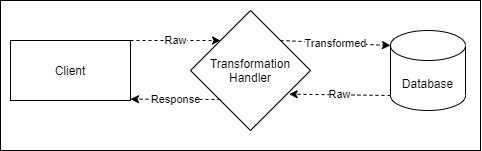

# Why choose RepoDb ORM over Dapper
Dapper เป็น micro-ORM น้ำหนักเบาสำหรับ .NET ซึ่งใช้งานบน StackOverflow มาหลายปี ได้รับการพัฒนาขึ้นเพื่อแก้ไขปัญหาประสิทธิภาพของไซต์ StackOverflow ในช่วงแรกๆ

ในขณะที่ RepoDb เป็น micro-ORM แบบไฮบริดใหม่สำหรับ .NET ที่ออกแบบมาเพื่อรองรับส่วนที่ขาดหายไปของทั้ง micro-ORM และ macro-ORM (หรือที่เรียกว่า full-ORM) นอกจากนี้ยังได้รับการออกแบบเพื่อให้ใช้งานง่าย มีความใกล้เคียงกับการเขียน code ปกติมากกว่า micro-ORM และในขณะเดียวกันก็รักษาประสิทธิภาพของแอปพลิเคชัน

ทั้งสอง library ถือว่าทำงานเร็วและใช้งานง่ายทั้งคู่ แต่โดยสวนตัวของผู้เขียนชอบ RepoDb มากกว่าโดยจะบอกในบทความนี้ต่อไป

## The Development Experience 🙉
เราทุกคนชอบความยืดหยุ่นและควบคุมได้ในระหว่างการพัฒนา โดยเฉพาะหากเราคำนึงถึงประสิทธิภาพและประสิทธิผล นี่คือเหตุผลหลักที่เราเลือก Dapper micro-ORM แทน Entity Framework (ความคิดเห็นของผู้เขียน) อย่างไรก็ตาม micro-ORM ดังกล่าวต้องการให้เราเขียน SQL ในส่วนที่เกี่ยวข้องกับฐานข้อมูลทั้งหมด

### คุณชอบเขียน SQL ตลอดเวลาหรือไม่?
ถ้าใช่ Dapper ก็เหมาะสำหรับคุณ 😀 แล้วเราก็ลงเอยด้วยการสร้างโค้ดของเราที่เต็มไปด้วย SQL ที่ซ้ำซ้อนใน repository  หรือ  DAL และมันก็คือฝันร้ายเมื่อเรามีการแก้ไข SQL บ่อยๆ
ลองดูตัวอย่างโค้ดสำหรับการสืบค้นข้อมูลด้านล่าง
```cs
/* Dapper */
using (var connection = new SqlConnection(ConnectionString))
{
    var customers = connection.Query<Customer>("SELECT Id, Name, DateOfBirth, CreatedDateUtc FROM [dbo].[Customer];");
}

/* RepoDb - Raw */
using (var connection = new SqlConnection(ConnectionString))
{
    var customers = connection.ExecuteQuery<Customer>("SELECT Id, Name, DateOfBirth, CreatedDateUtc FROM [dbo].[Customer];");
}

/* RepoDb - Fluent */
using (var connection = new SqlConnection(ConnectionString))
{
    var customers = connection.QueryAll<Customer>();
}
```
### แล้วสำหรับการ insert ข้อมูลเป็นอย่างไง?
```cs
/* Dapper */
using (var connection = new SqlConnection(connectionString))
{
    var id = connection.Query<int>("INSERT INTO [dbo].[Customer] (Name, DateOfBirth, CreatedDateUtc) VALUES (@Name, @DateOfBirth, GETUTCDATE()); SELECT SCOPE_IDENTITY();",
        new { Name = "John Doe", DateOfBirth = DateTime.Parse("1970/01/01") });
}

/* RepoDb - Raw */
using (var connection = new SqlConnection(connectionString))
{
    var id = connection.ExecuteScalar<int>("INSERT INTO [dbo].[Customer] (Name, DateOfBirth, CreatedDateUtc) VALUES (@Name, @DateOfBirth, GETUTCDATE()); SELECT SCOPE_IDENTITY();",
        new { Name = "John Doe", DateOfBirth = DateTime.Parse("1970/01/01") });
}

/* RepoDb - Fluent */
using (var connection = new SqlConnection(connectionString))
{
    var id = connection.Insert<Customer, int>(new Customer
    {
        Name = "John Doe",
        DateOfBirth = DateTime.Parse("1970/01/01"),
        CreatedDateUtc = DateTime.UtcNow
    });
}
```
**Note:** เราจะเปรียบเทียบ  feature ที่เป็น out of the box  นะครับ!!!

นอกจากนี้ยังมีการดำเนินการอื่น ๆ เช่น Delete, Merge, Update และ อีกมากมาย เพื่อช่วยให้เรามีความยืดหยุ่นและสามารถควบคุมได้ สิ่งสำคัญที่ควรรู้คือ "RepoDb สามารถดำเนินการอะไรก็ได้ที่ Dapper สามารถดำเนินการได้ใน raw-SQL" ตัวที่ผมชอบคือ Merge(Upsert) มันคือหาร Insert ถ้าหากยังไม่มีข้อมูล หรือ Update หากมีข้อมูลอยู่แล้ว เยี่ยมมากๆ ดังนั้นเมื่อใช้ RepoDb ประสบการณ์การพัฒนาจะเหมือนกับ Dapper ที่มีความยืดหยุ่น การควบคุม ความคล่องแคล่ว และจัดการง่าย

### The main features, Performance 🚀& Efficiency ⚡️
หลายคนมีความคิดแบบนี้ “ถ้าคุณต้องการประสิทธิภาพ ให้เลือก Dapper มิฉะนั้นก็ Entity Framework” ดูเหมือนว่าจะทางเลือกแค่ Entity Framework หรือ Dapper เสมอ แล้วตัวเลือกอื่นๆล่ะ


ลองดู  statistics ของ RepoDb เสียก่อน มันเป็น ORM ที่เร็วและมีประสิทธิภาพมากที่สุดใน .NET ในปัจจุบัน (ทั้งการดำเนินการ "raw-SQL" และ “fluent” execution) เหตุผลเพียงพอหรือป่าวถ้าคนที่สนใจเรื่องประสิทธิภาพ และมันยังใช้ memory ได้ดีกว่า dapper ในทึกเรื่องนะบอกเลย ⚡️

### The on-the-fly real “Bulk Operations” Support ⚡️

นี่เป็นคุณลักษณะเฉพาะที่ขาดหายไปใน micro-ORM และ full-ORM ส่วนใหญ่ก่อน RepoDb และมีบางสถานการณ์ที่เราจำเป็นต้องใช้  feature นี้ ใช่เรากำลังพูดถึงวิธีที่เร็วที่สุดในการ Insert, Delete, Merge and Update.

ใน Dapper เราต้องเขียนวิธี ADO.NET โดยใช้คลาส SqlBulkCopy เพื่อใช้งาน
```cs
//Dapper
using (var connection = new SqlConnection(ConnectionString))
{
    var customers = GenerateCustomers(1000);
    var table = ConvertToTable(customers);
    using (var transaction = connection.BeginTransaction())
    {
        using (var sqlBulkCopy = new SqlBulkCopy(connection, options, transaction))
        {
            sqlBulkCopy.DestinationTableName = "Customer";
            sqlBulkCopy.WriteToServer(table);
            transaction.Commit();
        }
    }
}
```
ใน RepoDb ทุกสิ่งสามารถทำได้ในโค้ดเพียงบรรทัดเดียว เราไม่จำเป็นต้องแปลงโมเดลเป็นวัตถุ "System.DataTable" ด้วยซ้ำ ส่งผลให้การประมวลผลเร็วขึ้นและมีประสิทธิภาพมากขึ้น
```cs
using (var connection = new SqlConnection(ConnectionString))
{
    var customers = GenerateCustomers(1000);
    var insertedRows = connection.BulkInsert(customers);
}
```
ด้านล่างนี้คือการเปรียบเทียบประสิทธิภาพโดยการเปรียบเทียบการดำเนินการ `Bulk` จากการดำเนินการ `Batch` กับคำสั่ง `packed SQL-statements` ทำให้เวลา `48` วินาทีลดลงเหลือ `1.74` วินาทีสำหรับข้อมูล 200K ที่มี 5 คอลัมน์


### แล้วการทำ Merging multiple rows?
ใน Dapper เราต้องสร้าง Table-Valued-Parameters (TVP) โดยใช้ User-Defined-Types (UDT) และสร้าง stored-procedures  มันก็ทำได้แต่จะน่าเบื่อและต้องการการบำรุงรักษาการเพิ่มเติม

RepoDb นั้นง่ายมาก
```cs
using (var connection = new SqlConnection(ConnectionString))
{
    var customers = GetUpdatedCustomers();
    var mergedRows = connection.BulkMerge(customers);
}
```

### The complete support to Atomic, Batch and Bulk Operations ⚡️
นักพัฒนาส่วนใหญ่ไม่สนใจว่า "เมื่อใดควรใช้อะไร" ในสถานการณ์บางอย่าง เราควรจะคำนึงถึงข้อจำกัดของระบบเราด้วยเช่น On-premise/Cloud, Windows/Linux, Low/High Specs.

อย่างน้อยเราต้องพิจารณาสิ่งต่อไปนี้:
- Network/Latency
- Infrastructure
- Number of Columns
- ฯลฯ

เพื่อให้เข้าใจมากขึ้น ด้านล่างนี้คือภาพ high-level ของความแตกต่างระหว่างการดำเนินการต่างๆ


การ call แต่ละครั้งข้างต้นกล่าวถึงสถานการณ์ที่แตกต่างกันซึ่งเกี่ยวข้องกับประสิทธิภาพ และสถานการณ์ของผู้ใช้

การทำแบบ Atomic
```cs
using (var connection = new SqlConnection(ConnectionString))
{
    var customers = CreateCustomers(1000);
    foreach (var customer in customers)
    {
        var id = connection.Insert<Customer, int>(customer);
    }
}
```
การทำแบบ Batch
```cs
using (var connection = new SqlConnection(ConnectionString))
{
    var customers = CreateCustomers(1000);
    var insertedRows = connection.InsertAll<Customer>(customers, batchSize: 100);
}
```

การทำแบบ Bulk
```cs
using (var connection = new SqlConnection(ConnectionString))
{
    var customers = CreateCustomers(1000);
    var insertedRows = connection.BulkInsert(customers);
}
```

ในหลายๆกรณี การดำเนินการดังกล่าวได้มีให้ใช้งานใน RepoDb เลย ในกรณีของ Dapper และ/หรือ ORM อื่นๆ เราต้องใช้เวลาในการเขียนการใช้งานของเราเองและอาจจะต้องดูแลรักษา code เอง ถึงตรงนี้คุณองคิดดูซิว่ามันประหยัดเวลาเราได้ขนาดไหน

## The support to 2nd-Layer Cache 🐢→ 🐇
นี่เป็นหนึ่งในคุณสมบัติที่สำคัญมากที่ขาดหายไปใน ORM อื่นๆ ทั้งหมดที่ผมเคยยเจอมา นี่เป็นสิ่งสำคัญมากในแง่ที่ว่าตารางทั้งหมดบนฐานข้อมูลของเราที่อาจจจะไม่ได้มีการเปลี่ยนแปลงอย่างจริงจัง อันที่จริง 30% ของตารางของคุณ (อาจ) ใช้งานอยู่ ในขณะที่อีก 70% เป็นเพียงตารางค้นหาหรือตารางค่าคงที่ (อื่นๆ)


ลองมาดู code  การใช้งานกัน
```cs
/* SqConnection method */
var cache = CacheFactory.GetCache(); // new MemoryCache();
using (var connection = new SqlConnection(connectionString).EnsureOpen())
{
    var expirationInMinutes = 60 * 24; // 1 day
    var products = connection.QueryAll<Product>(cacheKey: "products",
        cacheItemExpiration: expirationInMinutes,
        cache: cache);
}

/* Repository method */
using (var repository = new DbRepository(connectionString))
{
    var expirationInMinutes = 60 * 24; // 1 day
    var products = repository.QueryAll<Product>(cacheKey: "products",
        cacheItemExpiration: expirationInMinutes);
}
```

## The flexibility of the Property Transformations 👌🏻
คุณอาจพบว่าบางครั้งคุณจำเป็นต้องจัดการกับการเปลี่ยนแปลงค่าบางอย่างก่อน นำเข้า หรือส่งออกข้อมูลจาก Database



คุณลักษณะดังกล่าวมีความสำคัญต่อข้อเท็จจริงที่ว่า .NET เองไม่สามารถบังคับข้อมูลทุกประเภทจากฐานข้อมูลได้โดยอัตโนมัติ (เช่น XML, JSON เป็นข้อความ เป็นต้น) ในกรณีเช่นนี้ เราลงเอยด้วยการเขียน converters

ด้วยคุณสมบัตินี้ ทำให้ง่ายต่อการจัดระเบียบ และรวมทุกอย่างไว้ในที่เดียว

สมมติว่าคุณมีตาราง "[sales].[Customer]" ที่มีคอลัมน์ "Address" ประเภท "NVARCHAR(MAX)" จากนั้น คุณต้องการให้เป็น Json data ใน database แต่เป็น Address class เมือดึงขึ้นมาใช้งานเราก็ทำตาม code ด้านล่าง
```cs
public class CustomerAddressPropertyHandler : IPropertyHandler<string, Address>
{
    public Address Get(string input, ClassProperty property)
    {
        if (!string.IsNullOrEmpty(input))
        {
            return JsonConvert.Deserialize<Address>(input);
        }
        return null;
    }

    public string Set(Address input, ClassProperty property)
    {
        if (input != null)
        {
            return JsonConvert.Serialize(input);
        }
        return null;
    }
}
```
ยังมี feature อีกเช่น `Class Handler` เป็นต้น

## Coding Experience and Comparisons 🙉

ข้อดีอย่างหนึ่งเมื่อใช้ไลบรารีนี้คือ "Query Expression" และ "Fluency" เมื่อใช้ไลบรารีนี้ ประสบการณ์ของเราจะเป็นการผสมผสานระหว่าง Dapper และ Entity Framework
```cs
// Query
using (var connection = new SqlConnection(connectionString).EnsureOpen())
{
    var countries = new [] { "Denmark", "Iceland", "Norway", "Sweden", "Finland" };
    var customer = connection.Query<Customer>(
        e => e.LastName.StartsWith("Ander%") && countries.Contains(e.State));
}

// Delete
using (var connection = new SqlConnection(connectionString).EnsureOpen())
{
    connection.Delete<Customer>(10045);
}

// Insert
using (var connection = new SqlConnection(connectionString).EnsureOpen())
{
    var id = connection.Insert<Customer>(new Customer
    {
        Name = "John Doe",
        Country = "Denmark"
    });
}

// Merge
using (var connection = new SqlConnection(connectionString).EnsureOpen())
{
    var id = connection.Merge<Customer>(new Customer
    {
        Id = 10045
        Name = "John Doe",
        Country = "Denmark"
    });
}
```
มันง่ายเหมือน Dapper เมื่อเปิดการเชื่อมต่อ และง่ายเหมือน Entity Framework เมื่อดำเนินการดำเนินการ ไม่จำเป็นต้องเขียน SQL และอ็อบเจ็กต์ตรงกลาง เช่น “DbContext” เมื่อติดต่อกับฐานข้อมูล

บางคนอาจจะบอกว่า "ผมชอบ Dapper เพราะชอบคำสั่ง SQL หรือการใช้ SP"
จัดไปครับแบบ RepoDb

```cs
// ExecuteQuery
using (var connection = new SqlConnection(connectionString).EnsureOpen())
{
    var customer = connection.ExecuteQuery<Customer>("[sp_GetCustomersByCountry]", new { Country = "Denmark" });
}

// ExecuteQueryMultiple
using (var connection = new SqlConnection(connectionString).EnsureOpen())
{
    var sqlText = "SELECT * FROM [dbo].[Customer] WHERE (Id = @CustomerId); SELECT * FROM [dbo].[Order] WHERE (CustomerId = @CustomerId);";
    var customer = connection.ExecuteQueryMultiple<Customer, Order>(sqlText, new { CustomerId = 10045 });
}

// ExecuteScalar
using (var connection = new SqlConnection(connectionString).EnsureOpen())
{
    var serverDateTime = connection.ExecuteScalar<DateTime>("SELECT GETUTCDATE();");
}

// ExecuteNonQuery
using (var connection = new SqlConnection(connectionString).EnsureOpen())
{
    var affectedRows = connection.ExecuteNonQuery("DELETE FROM [dbo].[Customer] WHERE (Id = @Id)", new { Id = 10045 });
}

// ExecuteReader
using (var connection = new SqlConnection(connectionString).EnsureOpen())
{
    using (var reader = connection.ExecuteReader())
    {
        // Utilize the reader here
    }
}
```

## อื่นๆ ตามอ่านได้เลยครับ ♻️
ด้านล่างนี้เป็นคุณสมบัติอื่นๆ ที่ยังไม่ได้พูดถึง คุณสมบัติพวกนี้ช่วยแก้ปัญหาได้หลากหลาย
- [Class Mapping](https://repodb.net/feature/classmapping) vs [Implicit Mapping](https://repodb.net/feature/implicitmapping)
- [Connection Persitency](https://repodb.net/feature/connectionpersistency)
- [Dynamics](https://repodb.net/feature/dynamics)
- [Enumeration Support](https://repodb.net/feature/enumeration)
- [Hints](https://repodb.net/feature/hints)
- [Multiple Query](https://repodb.net/feature/multiplequery)
- [Repositories](https://repodb.net/feature/repositories)
- [Tracing](https://repodb.net/feature/tracing)
- [Type Mapping](https://repodb.net/feature/typemapping)


ทั้งหมดคือสิ่งที่ผมคิดว่า RepoDb น่าใช้มากกว่า Dapper
Thank you for reading.
