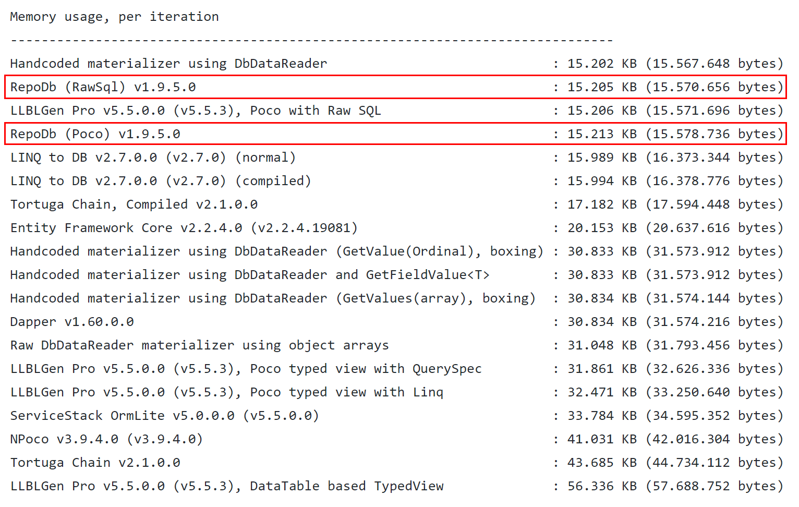

# RepoDb, a hybrid-ORM library for .NET - Part II
บทความแรกเราได้พูดจบถึงเรื่อง Executing a Stored Procedure ตามไปอ่านกันได้ที่ Part I นะครับ :point_up:

## Multiple Resultsets via MultipleQuery
คุณลักษณะนี้ได้ถูกแนะนำเพื่อช่วยให้นักพัฒนาลดการติดต่อระหว่างแอปพลิเคชันและฐานข้อมูล โดยอนุญาตให้นักพัฒนาดำเนินการคำสั่ง SQL หลายรายการในการเรียกครั้งเดียว มี 2 วิธีในการเรียกใช้ ผ่านวิธี ExecuteQueryMultiple และอีกวิธีคือการเรียกผ่าน QueryMultiple<T1, T2> ตามวิธีการ
### ExecuteQueryMultiple
ExecuteQueryMultiple ต้องการให้ผู้เรียกเขียนคำสั่ง SQL หลายชุด ดูตัวอย่างโค้ดด้านล่าง
``` cs
using (var connection = new SqlConnection(connectionString))
{
     // Call the method by passing multiple statements
     var extractor = connection.ExecuteQueryMultiple("SELECT * FROM [dbo].[Customer] WHERE Id = @CustomerId; " +
          "SELECT * FROM [dbo].[Order] WHERE CustomerId = @CustomerId; " +
          "SELECT GETUTCDATE() AS RetrievedDateTimeUtc;",
          new { CustomerId = 10045 });

     // Extract the results
     var customer = extractor.Extract<Customer>().FirstOrDefault();
     var orders = extractor.Extract<Order>().ToList();
     var retriveDateTime = extractor.Scalar<DateTime>();
}
```
หรือเราจะรวม stored procedure ไปด้วยก็ได้
```cs
using (var connection = new SqlConnection(connectionString))
{
     // Call the method by passing multiple statements
     var extractor = connection.ExecuteQueryMultiple("SELECT * FROM [dbo].[Customer] WHERE Id = @CustomerId; " +
          "EXEC [dbo].[sp_get_customer_orders] @CustomerId; " +
          "SELECT GETUTCDATE() AS RetrievedDateTimeUtc;",
          new { CustomerId = 10045 });

     // Extract the results
     var customer = extractor.Extract<Customer>().FirstOrDefault();
     var orders = extractor.Extract<Order>().ToList();
     var retriveDateTime = extractor.Scalar<DateTime>();
}
```
## QueryMultiple<T1, T2>
QueryMultiple<T1, T2> วิธีทำงานก็จะคล้ายกับวิธี ExecuteQueryMultiple ยกเว้นว่านักพัฒนาจำเป็นต้องส่งประเภท type ในระหว่างการเรียก
และยังต้องส่งอาร์กิวเมนต์ query expressions ตามไปด้วย แล้วสิ่งที่ return  ออกมาจะเป็น Tuple ของผมลัพธ์
```cs
using (var connection = new SqlConnection(connectionString))
{
     // Call the method, returns Tuple<T1, T2>
     var tuple = connection.QueryMultiple<Customer, Order>(c => c.Id == customerId, o => o.CustomerId = customerId);

     // Get each item from the Tuple
     var customer = tuple.Item1.FirstOrDefault();
     var orders = tuple.Item2.ToList();
}
```
**Note:** ทั้งวิธี ExecuteQueryMultiple และ QueryMultiple รองรับจนถึง 7 Tuples

## Dynamic Objects
การที่จะรองรับ dynamic objects สำหรับ RepoDb นั้นถือว่ายากและแพงมากแต่ RepoDb นั้นก็รองรับ ทั้ง dynamic Object และ ExpandoObject สำหรับ arguments ลองดู code ด้านล่าง

```cs
using (var connection = new SqlConnection(connectionString))
{
     var people = connection.Query<Customer>(new { LastName = "Santiago", Country = "Spain" });
}
```
**Note:** ค่าที่ส่งคืนคือ `IEnumerable<ExpandoObject>`


## Repositories
การทำ  Repository Pattern สำหรับ Database นั้น  RepoDb ได้ provide class ให้เรา 2 ตัวคือ
1. DbRepository
1. BaseRepository

### DbRepository
มาดูกันที่ตัวแรกกันก่อน `DbRepository<TDbConnection>` โดยตัวนี้จะใช้ได้แบบ higher-level คือให้นึกว่าเป็น  extension ของ DbConnection ที่สามารถทำงานกับ Table ไหนก้ได้เลย เราแค่ส่ง connection string ให้ base class

```cs
public class NorthwindDbRepository : DbRepository<SqlConnection>
{
     public NorthwindDbRepository(string connectionString) :
          base(connectionString)
     { }

     public IEnumerable<Order> GetCustomerOrders(int customerId)
     {
          return Query<Order>(o => o.CustomerId == customerId);
     }

     public IEnumerable<Customer> GetAllActiveCustomers()
     {
          return Query<Customer>(c => c.IsActive == true };
     }

     public void AllowIdentityInsert<TEntity>() where TEntity : class
     {
          return ExecuteNonQuery($"SET IDENTITY_INSERT {typeof(TEntity).Name} ON");
     }
}
```
โดยเวลาเรียกใช้ก็ง่ายๆเลย
```cs
using (var repository = new NorthwindDbRepository(connectionString))
{
     var orders = repository.GetCustomerOrders(10045);
}
```
หรือจะเรียก  method ของ  base class ตรงๆเลยก็ได้
```cs
using (var repository = new DbRepository<SqlConnection>(connectionString))
{
     var customers = repository.Query<Customer>(c => c.IsActive == true);
}
```

### BaseRepository<TEntity, TDbConnection>
ตัวนี้จะต่างออกไปเพราะเราจะต้องระบุ Model(Table) ที่จะทำงานด้วย เช่นจะทำงานกับ Customer Table
```cs
public class CustomerRepository : BaseCustomer<Customer, SqlConnection>
{
     public CustomerRepository(string connectionString) :
          base(connectionString)
     {

     }

     public IEnumerable<Customer> GetAllActiveCustomers()
     {
          return Query(c => c.IsActive == true);
     }

     public IEnumerable<Customer> GetCustomersByCountry(string country)
     {
          return Query(c => c.Country == country && c.IsActive == true);
     }
}
```

## Performance and Efficiency
RepoDb ให้ความสำหรับกับเสถียรภาพและประสิทธิภาพมากโดย benchmark ออกมาแล้วอยู่ลำดับต้นๆ โดยแพ้เพียง code ที่เขียนเองเท่านั้น

**performance test**


**memory-efficiency test**

Note: [The official results.](https://github.com/FransBouma/RawDataAccessBencher/blob/master/Results/20190520_netcore.txt).

## Caching
คุณลักษณะนี้ช่วยให้นักพัฒนาสามารถแคชผลลัพธ์ของการดำเนินการ Query และ QueryAll โดยค่าเริ่มต้นของ MemoryCache คือ 180 นาที.

ในการแคชผลลัพธ์เราแค่ส่งค่าไปยังอาร์กิวเมนต์ cacheKey ของการดำเนินการ Query หรือ QueryAll ดูตัวอย่างโค้ดด้านล่าง
```cs
using (var connection = new SqlConnection(connectionString))
{
     var products = connection.QueryAll<Product>(cacheKey: "AllProducts");
}
```
การเรียกครั้งต่อไปผลลัพธ์จะมากจาก cache ไม่ใช่จาก  Database เป็นเวลา 3 ชั่วโมง :)

Note: [cache document.](https://repodb.net/feature/caching).

## Library Quality
สำหรับ RepoDb เจ้าของได้ประกาศไว้ว่าเรียน test หนักมาก โดยทำตามหลักการของ TDD และมี  Integration test ถึง 2300+ tests และ 1200+ Unit tests


## Summary
โดยสรุป ผมมองว่า ไลบรารีนี้เรียบง่ายและน้ำหนักเบามาก ใช้งานง่าย กิน memory น้อยและถ้าใครเคยชินกับ  Dapper ก็น่าจะทำความเข้าใจได้ไม่ยาก แต่ มันยังถือว่าเป็น micro-ORM เนื่องจากไม่มีคุณสมบัติขั้นสูงของ ORM ขนาดใหญ่ เช่น Change Tracking หรือ State Tracking นั้นเอง

:tada: ถ้าใครได้อ่านถึงตรงนี้ ผมก็ขอขอบคุณครับ /@pommatt :tada:
