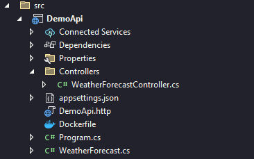

How to create simple Angular Web App with .NET API in Visual Studio

## Steps
1. Create .NET Web API with optional support for OpenAPI




Program.cs

```cs
var builder = WebApplication.CreateBuilder(args);

// Add services to the container.

builder.Services.AddControllers();
// Learn more about configuring Swagger/OpenAPI at https://aka.ms/aspnetcore/swashbuckle
builder.Services.AddEndpointsApiExplorer();
builder.Services.AddSwaggerGen();

var app = builder.Build();

// Configure the HTTP request pipeline.
if (app.Environment.IsDevelopment())
{
    app.UseSwagger();
    app.UseSwaggerUI();
    app.UseCors(x => x
    .AllowAnyOrigin()
    .AllowAnyMethod()
    .AllowAnyHeader());
}

app.UseHttpsRedirection();
app.UseAuthorization();
app.MapControllers();
app.Run();
```
Run debug


2. Create Angular Web App


and install node modules and axios http (about https://axios-http.com/)

set up environment.ts

```ts
export const environment = {
    production: false,
    version: '0.0.0',
    api: {
        host: 'https://localhost:44325',
        endpoint: {
            WeatherForecast: 'WeatherForecast'
        },
    }
};
```

create api.service.ts

```ts
import { Injectable } from '@angular/core';
import { environment } from 'src/environments/environment';
import axios from 'axios';

@Injectable()
export class ApiService {

    constructor() { }

    getWeatherForecast() {
        return axios.get(`${environment.api.host}/${environment.api.endpoint.WeatherForecast}`);
    }
}
```
add api service in app.module.ts

```ts
import { NgModule } from '@angular/core';
import { BrowserModule } from '@angular/platform-browser';
import { AppComponent } from './app.component';
import { ApiService } from './pages/services/api.services';

@NgModule({
  declarations: [
    AppComponent
  ],
  imports: [
    BrowserModule
  ],
  providers: [
    ApiService
  ],
  bootstrap: [AppComponent]
})
export class AppModule { }
```

create model weatherforecast.ts

```ts
export interface WeatherForecast {
    date: string,
    temperatureC: number,
    temperatureF: number,
    summary: string
}
```

modify app.component.ts for test WeatherForecast API

```ts
import { Component } from '@angular/core';
import { ApiService } from './pages/services/api.services';
import { WeatherForecast } from './pages/models/weatherforecast';

@Component({
  selector: 'app-root',
  templateUrl: './app.component.html',
  styleUrls: ['./app.component.css']
})
export class AppComponent {

  title = 'DemoApp';
  weatherForecast: WeatherForecast[] = [];

  constructor(
    private apiService: ApiService,
  ) {

  }

  ngOnInit() {
    this.apiService.getWeatherForecast()
      .then(response => {
        this.weatherForecast = response.data;
      })
      .catch(error => {
        console.log(error);
      });
  }
}
```
app.component.html

```html
...

<table>
  <caption>Weather Forecast</caption>
  <thead>
    <tr>
      <th scope="col">date</th>
      <th scope="col">temperatureC</th>
      <th scope="col">temperatureF</th>
      <th scope="col">summary</th>
    </tr>
  </thead>
    <tbody>
      <tr *ngFor="let item of weatherForecast">
        <td>{{item.date}}</td>
        <td>{{item.temperatureC}}</td>
        <td>{{item.temperatureF}}</td>
        <td>{{item.summary}}</td>
      </tr>
    </tbody>
</table>

...

```

Run web app

