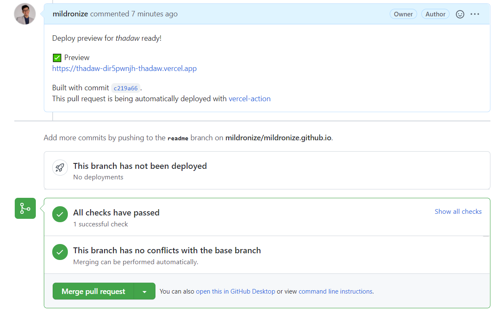

# Preview deploy using vercel

[Pull request example](https://github.com/mildronize/mildronize.github.io/pull/29)




## How to use
1. You should disable Vercel for GitHub
2. You should link Github Project with vercel. You can link on vercel dashboard or [locally](https://github.com/marketplace/actions/vercel-action#project-linking)
3. Define Github Actions

  ```yml
  # https://github.com/marketplace/actions/vercel-action
  name: Preview deploy
  on:
    pull_request:
      branches:
        - main
    pull_request_target:
  jobs:
    deploy:
      runs-on: ubuntu-latest
      steps:
        - uses: actions/checkout@v2
        - uses: amondnet/vercel-action@v20
          id: vercel-action
          with:
            vercel-token: ${{ secrets.VERCEL_TOKEN }} # Required
            github-token: ${{ secrets.PUBLIC_REPO_ACCESS_TOKEN }} #Optional
            vercel-org-id: ${{ secrets.VERCEL_ORG_ID}}  #Required
            vercel-project-id: ${{ secrets.VERCEL_PROJECT_ID}} #Required
        - name: preview-url
          run: |
            echo ${{ steps.vercel-action.outputs.preview-url }}
  ```

4. กำหนดค่าที่ต้องใช้
     - `github-token` ต้องกำหนด **repo** access
     - `vercel-token` ต้องสร้างจาก https://vercel.com/account/tokens
     - `vercel-project-id` เอามาจาก Project ID ใน Project Setting
     - `vercel-org-id` ID ของ team ที่เราใช้ แต่ถ้าใช้ Personal ให้เอาจาก [account setting](https://vercel.com/account) ใน Your ID

# Read More
- [Vercel Action - GitHub Action](https://github.com/amondnet/vercel-action)
- [Deploy your pull requests with GitHub Actions and GitHub Deployments](https://sanderknape.com/2020/05/deploy-pull-requests-github-actions-deployments/)
