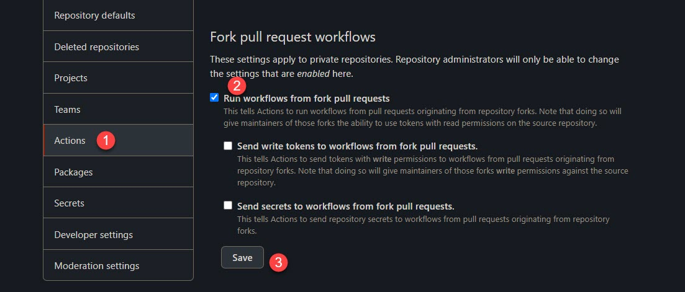
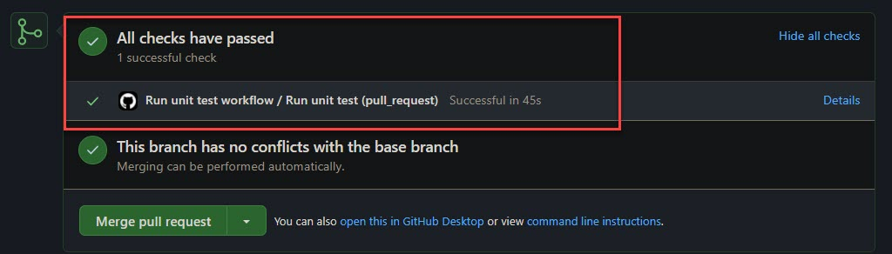

# Run Jest unit test
- We need to enable `Run workflows from fork pull requests` to get workflow triggered.
  - Go to setting of enterprise, organization or repository settings.
  - Example URL of an organization settings URL: https://github.com/organizations/your-oganization-name/settings/profile.
  - Go to Actions > Fork pull request workflows section
  - Check `Run workflows from fork pull requests`
  - Click `Save`



- Example of workflow:

```yaml
name: Run unit test workflow
on: pull_request # Pull request on any branches

env:
  NODE_VERSION: 14.x # Set this to change the Node.js version to use

jobs:
  run_unit_test:
    name: Run unit test
    # Find more virtual environment. https://github.com/actions/virtual-environments
    runs-on: ubuntu-18.04
    steps:
      - name: Checkout the latest source code from the current branch
        uses: actions/checkout@v2

      - name: Use Node.js version ${{ env.NODE_VERSION }}
        # https://github.com/actions/setup-node
        uses: actions/setup-node@v2
        with:
          node-version: ${{ env.NODE_VERSION }}

      - name: Run all test cases with Jest
        # https://classic.yarnpkg.com/en/docs/cli/workspaces/#toc-yarn-workspaces-run
        # Yarn Yarn 1.22.5 is already installed https://docs.github.com/en/actions/guides/building-and-testing-nodejs#installing-dependencies
        # https://github.com/actions/virtual-environments/blob/main/images/linux/Ubuntu1604-README.md
        working-directory: src # We must be in a path that has yarn workspaces package.json
        run: |
          echo ${{ github.repository }}
          git rev-parse HEAD
          git log -1
          node --version
          yarn --version
          yarn install
          yarn run test
```

## Result in GitHub PR checks



# Run xUnit unit test
Coming soon

## Useful links
- https://github.blog/2020-08-03-github-actions-improvements-for-fork-and-pull-request-workflows/
- https://github.community/t/will-github-actions-support-pull-request-events-from-a-fork-to-a-private-base-repository/17471/56
