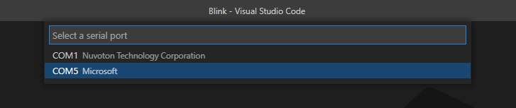

# How to setup VS Code Arduino extension for Windows OS

# Install Chocolatey
- Open a new PowerShell session with with administration permission.
- Install Chocolatey with the following command:
```ps
Set-ExecutionPolicy Bypass -Scope Process -Force; [System.Net.ServicePointManager]::SecurityProtocol = [System.Net.ServicePointManager]::SecurityProtocol -bor 3072; iex ((New-Object System.Net.WebClient).DownloadString('https://chocolatey.org/install.ps1'))

```
- Wait for a while for the command to complete and check if you are ready to use Chocolatey with the following command:
```ps
choco -v
```
- If you see a version number, it means you have installed Chocolatey successfully.

# Install Arduino IDE
- Continue the current PowerShell session or open a new session with administration permission if you have closed it.
- Execute the following command to install Arduino IDE:
```ps
choco install arduino -y
```

# Install VS Code Arduino extension
1. Open VS Code, click Extensions icon
2. Search "arduino"
3. Select Arduino extension from `Microsolf` and click install.


# Create a new Arduino project
- Press `ctrl+shift+p`, type `arduino: examples`. Then press enter to select.
- Expand Built-in Examples > 01.Basics.
- Click `Blink`.
- VS will open a new window with LED blink project.
- An auto generated source code is saved at `~/Documents/Arduino/generated_examples/Blink`.

# Connect Arduino board
- Connect your Arduino board to a computer.
- Wait until driver installation complete.
- In this example, I use `Arduino Uno` and is connected via COM5 port.
- In VS Code, change a serial port by pressing `ctrl + shift p`. Then type `Arduino: Select Serial Port` and press enter to select.
- Select a serial port that connects to Arduino.


- In VS Code, change Arduino board by pressing `ctrl + shift + p`. Then type `Arduino: Change Board Type` and press enter to select.
- Select your connected Arduino board.


# Fix IntelliSense
- Normally, after you have set a serial port and a board type correctly, VS Code automatically analyzes source code and creates `c_cpp_properties.json` with a configuration named `Arduino` and IntelliSense should work.
- Optionally, if IntelliSense does not work, we need to run code analysis manually by pressing `alt + ctrl + i`.
  Alternatively, type `Arduino: Rebuild IntelliSense Configuration`. Then press enter to select.
- At status bar (bottom right conner), you should find a configuration named Arduino and other connection values. These values, you can click to change.


# Example code of Blink project
- Open Blink.ino, you should find source code as following:

```c
// the setup function runs once when you press reset or power the board
void setup() {
  // initialize digital pin LED_BUILTIN as an output.
  pinMode(LED_BUILTIN, OUTPUT);
}

// the loop function runs over and over again forever
void loop() {
  digitalWrite(LED_BUILTIN, HIGH);   // turn the LED on (HIGH is the voltage level)
  delay(1000);                       // wait for a second
  digitalWrite(LED_BUILTIN, LOW);    // turn the LED off by making the voltage LOW
  delay(1000);                       // wait for a second
}

```

# Upload source code to Arduino board
- Press `ctrl + shift + p`. Then type `Arduino: Upload` and press enter to select.
- You will see logging messages in OUTPUT window. Wait for a while until you see `[Done] Uploading sketch 'Blink.ino'`.


A few seconds later, you should see LED on a board starts to blink.


