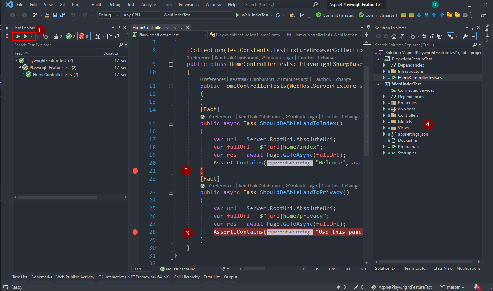

# 🎭 Playwright for .NET

##Demo project

1. ให้ทำการ Clone this repo : https://github.com/execution/AspnetPlaywrightFeatureTest.git
2. จากนั้น solution 
3. เราสามารถทดสอบ E2E test ได้เลยจาก vs2019 ตามรูปครับ 
    3.1 หมายเลข 2 คือเราสามารถ add break point ได้เลย
    3.2 เวลา run test  ตัว `PlaywrightSharpBaseTest` จะ  spawn server ให้เลยพร้อมทั้ง random port ให้เลย
   ที่การทดสอบนี้ มันจะ request ไปที่  project  WebUnderTest ซึ่งก็คือ web application  ของเรานั้นเองครับ

อ่านรายละเอียดเพิ่มได้ที่ https://pommatt.medium.com/writing-e2e-test-with-playwright-for-net-d21879b73168