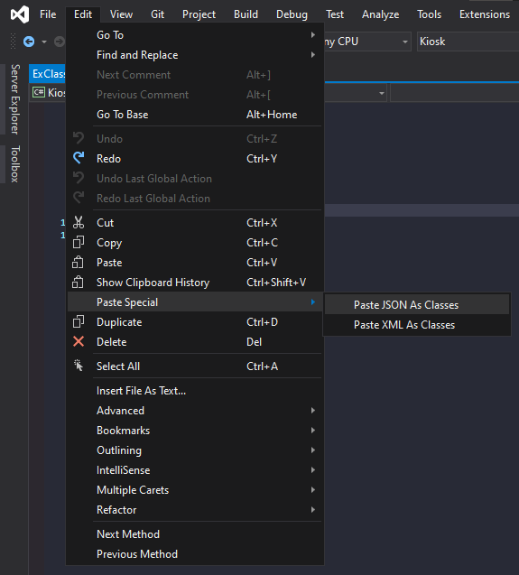

# Visual Studio

- Example JSON data
```json
{
    "id": 1,
    "name": "Peter",
    "lastname": "Parker"
}
```

- Create your .cs class
- Copy your JSON data
- Select Edit => Paste Special => Paste JSON As Classes



- Result

```c#
using System;

namespace Ex.Models
{
    public class Rootobject
    {
        public int id { get; set; }
        public string name { get; set; }
        public string lastname { get; set; }
    }
}
```