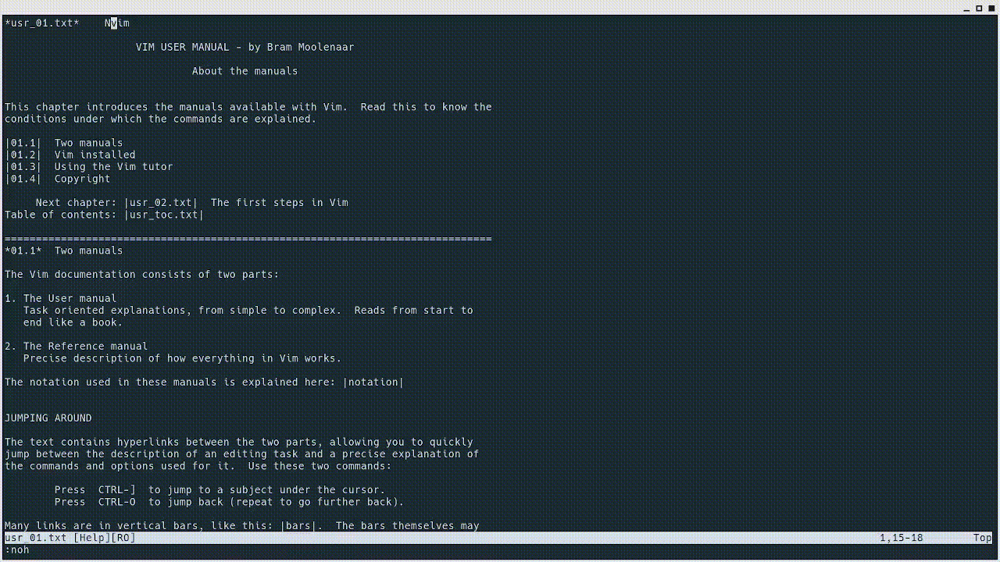

> How to search in vim?

It's very easy, you need to be on `Normal` mode.

Press `/` (forward slash) or press `?` (question mark) then... follow by keyword than you want to search like this:

`/foo` and hit `Enter`, it's will search word foo in your page.

Press `n` to search for next occurrence or uppercase `N` to search opposite direction.

You can type `:noh` (in normal mode) for disable highlight search.

