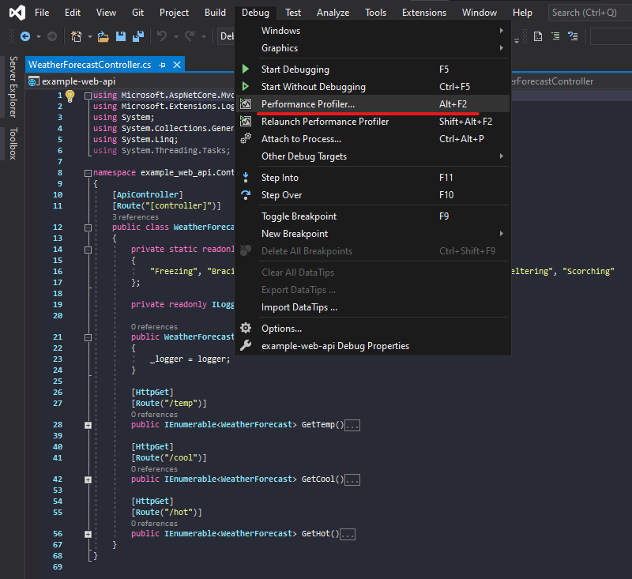
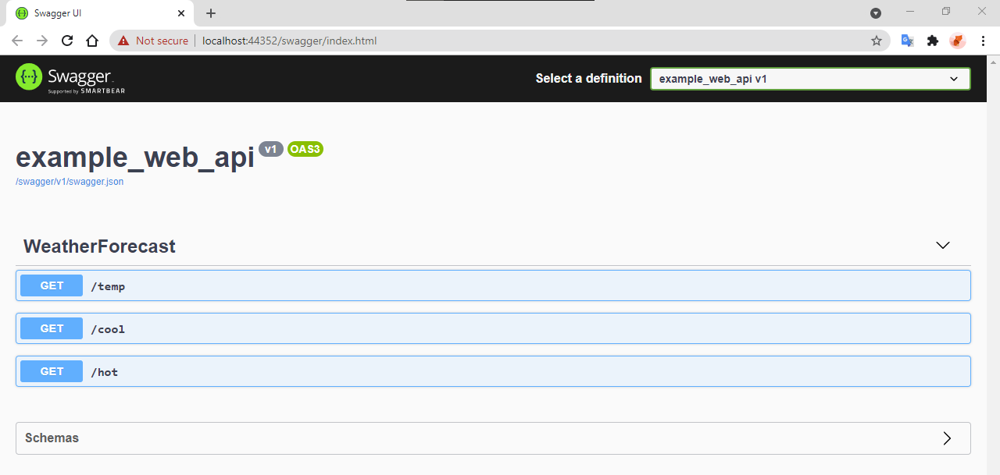

## Performance profiler
Reference: https://docs.microsoft.com/en-us/visualstudio/profiling/profiling-feature-tour?view=vs-2019

## Analyze performance of .NET asynchronous code
This content we'll use .NET Async Tool for detect and improvement our Web API

## Steps
1. Go to Debug and select Performance profiler or press Alt+F2

2. Select .NET Async then Start

3. Go to Swagger UI then select your end point. Press Try it out and Execute.
   In this content we select all end point.
    - /temp
    - /cool
    - /hot

4. If you done. Back to visual studio and press Stop Collection.

## Result
Completed!

We'll see the result displays its start time, end time, and duration.
We can use this to find the end point of slow processing.
