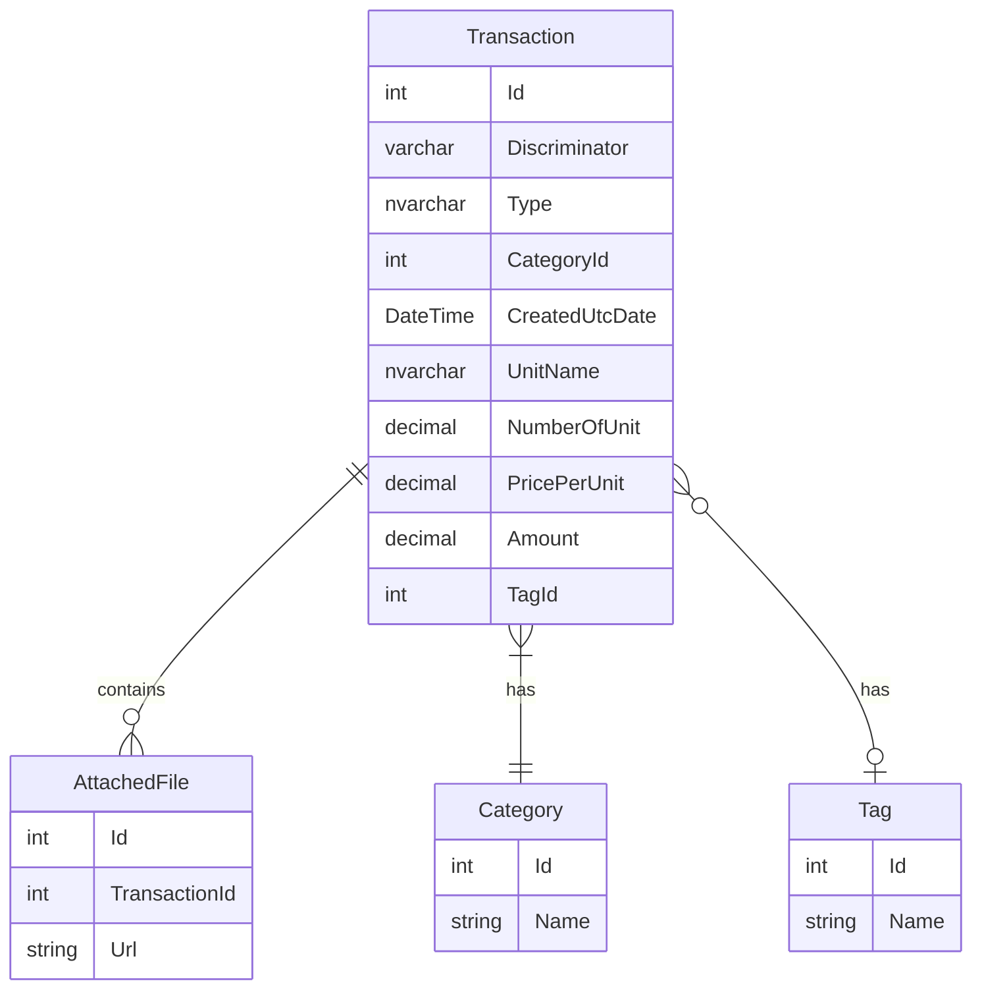
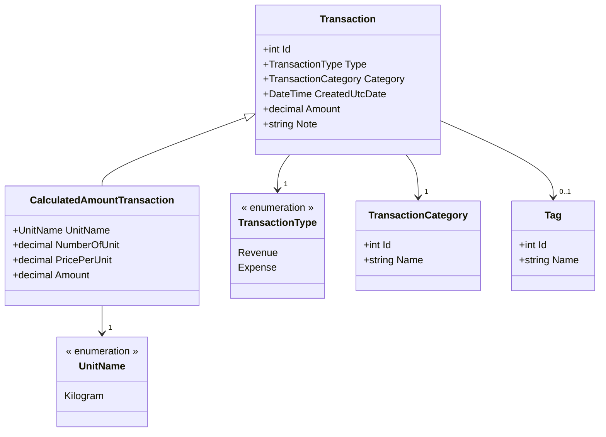

# Revenue/Expense App modelling diagram 

## Table per hierarchy (TPH)
- Transaction table represent table per hierarchy which contains two types: 
  Transaction and CalculatedAmountTransaction which derives from Transaction

## ER diagram

## Class diagram

# Questions
- Should I rename Tag to LogicalGroup?
- Is it okay to create TransactionType and TransactionCategory to enumeration? 
