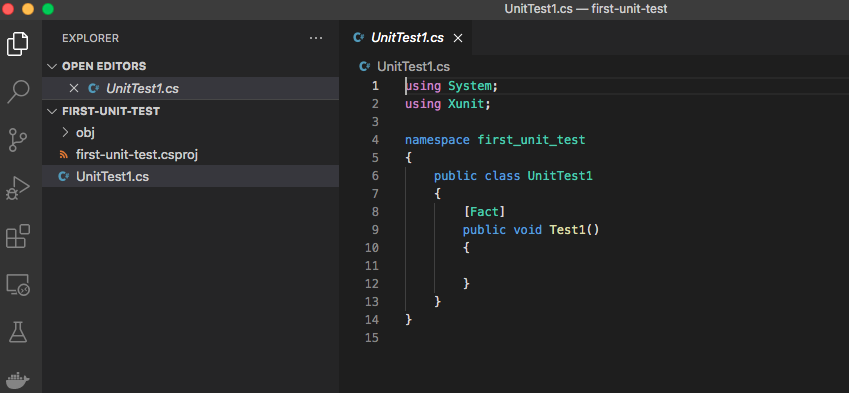
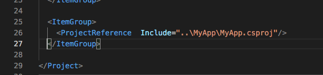
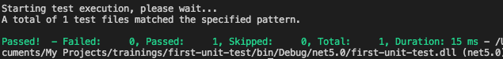

# Setting up xUnit project

### Prerequisite

- ดาวน์โหลดและ install .NET SDK 5.0 https://dotnet.microsoft.com/download

### 1. สร้าง unit test project ด้วย dotnet CLI

```
$ mkdir first-unit-test
$ cd first-unit-test
$ dotnet new xunit
```

### 2. Install dependencies
```
$ dotnet add package Microsoft.NET.Test.Sdk
$ dotnet add package xunit 
```

หลังจากรันคำสั่งข้างต้น เราจะได้ c# project ที่มี unit test class สร้างมาให้พร้อมใช้งาน โดย function ที่มี attribution `[Fact]` จะเป็น function ที่ตัว test runner จะมาอ่านเพื่อเอาไปรันเทสต์




### 3. Unit test pattern

ก่อนที่เราจะเริ่มเติม test เรามาทำความรู้จักกับ pattern การเขียนเทสต์ที่นิยมใช้กันก่อน

Test method ควรประกอบไปด้วย 3 ส่วนคือ Arrange, Act, Assert เรามักจะแบ่งแต่ละส่วนโดยเว้น 1-2 บรรทัด และใส่ comment ชัดเจนก่อนเริ่มแต่ละส่วนเพื่อให้ง่ายต่อการอ่านและทำความเข้าใจในภายหลัง

- **Arrange** : ประกอบด้วย code ที่จำเป็นเพื่อใช้ในการรันเทสต์ เช่น เตรียม input, สร้าง test object, สร้าง mock ของ dependecies ทึ่ class เราต้องใช้

- **Act** : เป็นส่วนที่เรียก method ที่เราต้องการ test เทสต์ที่ดีความส่วน act สั้นที่สุด นั่นก็คือควรโฟกัสไปที่การเทสต์เพียงแค่ method เดียวเท่านั้น

- **Assert** : เป็นส่วนที่ทำการตรวจสอบผลลัพธ์ที่ได้จากการเรียก method (assertion) ว่าตรงตาม expected output ที่ method ควรจะ return หรือไม่


### 4. Adding reference ไปยัง project ที่เราต้องการจะ test

เพ่ิม project reference โดยแก้ใช้การ add project reference (ถ้าใช้ visual studio สามารถ right click > add project referenece)

หรือใช้การแก้ไฟล์ .csproj ของ unit test project ตรงๆก็ได้ ยกตัวอย่างเช่น ถ้า class ที่เราต้องการเทสต์ อยู่ใน project ชื่อ MyApp.csproj



### 5. Install ตัวช่วย อื่นๆ

เพื่อให้การเขียนเทสต์ของเราง่ายชั้น Framework ที่นำใช้เพื่อมาช่วยในขั้นตอนการ Arrange เพื่อให้การสร้าง test oject และทำ mock object ได้ง่ายคือ **NSubstitue**

```
$ dotnet add package NSubstitute

```

Framework อีกตัวที่เอามาช่วยในการ Assert คือ **FluentAssertions**

```
$ dotnet add package FluentAssertions

```

### 6. Run test

ทดลองรันดู เพื่อเช็คว่าเราเซ็ตอัพ project ถูกหรือไม่

```
$ dotnet test
```
