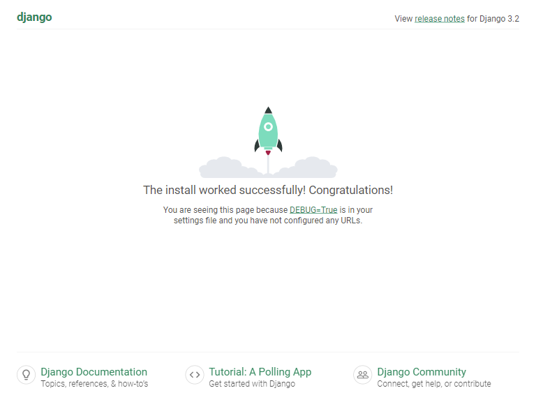

To use Django and MySQL Docker compose, we need to create these required files and add some contents to them.
- Dockerfile for a custom docker image
- requirements.txt
- docker-compose.yml
- .env file

# Dockerfile
- We create a Dockerfile for a custom a Django image.
- Example content of `Dockerfile`
```sh
# Dockerfile
FROM python:alpine3.14

# Set Python output is sent straight to terminal to see the output in realtime.
ENV PYTHONUNBUFFERED=1

WORKDIR /code
COPY requirements.txt /code/
RUN pip install -r requirements.txt

```

# requirements.txt
- We use requirements.txt for installing all Python requirement.
- Example content of `requirements.txt`
```txt
Django>=3.0,<4.0
mysqlclient>=2.0.3

```

# docker-compose.yml
- Example content of docker-compose.yml
```yml
# docker-compose.yml
version: "3.9"

services:
  web:
    container_name: web
    build: .
    # TODO remove hard code sleep, it should use short sleep retry in entrypoint.sh
    command: bash -c "sleep 15 && python manage.py runserver 0.0.0.0:8000"
    volumes:
      - .:/code # mount current folder to /code folder in side a container
    ports:
      - 8000:8000
    depends_on:
      - db
    networks:
      - compose_network

  db:
    container_name: mysql-server
    image: mysql:8.0
    restart: always
    environment:
      MYSQL_ROOT_PASSWORD_FILE: "/run/secrets/mysql_root_password"
      MYSQL_USER: my-user
      MYSQL_PASSWORD_FILE: "/run/secrets/mysql_password"
      MYSQL_DATABASE: my-db
    ports:
      - 3306:3306
    secrets:
      - mysql_root_password
      - mysql_password
    healthcheck:
      test: mysqladmin ping -h localhost -u $$MYSQL_USER --password=$$(cat /run/secrets/mysql_password)
      timeout: 10s
      retries: 10
    volumes:
      # Use name volumes, managed by Docker for local development
      - mysql-data:/var/lib/mysql
      - mysql-logs:/var/log/mysql
    command:
      [
        --character-set-server=utf8mb4,
        --collation-server=utf8mb4_unicode_ci,
        --lower-case-table-names=1,
        --default-authentication-plugin=mysql_native_password
      ]
    networks:
      - compose_network

# https://docs.docker.com/compose/compose-file/compose-file-v3/#external-1
volumes:
  mysql-data:
  mysql-logs:

# https://serverfault.com/questions/871090/how-to-use-docker-secrets-without-a-swarm-cluster
secrets:
  mysql_root_password:
    file: ./mysql_root_password.txt
  mysql_password:
    file: ./mysql_password.txt

networks:
  compose_network:

```

# docker secrets
- Create docker secret files to be used for database passwords

```shell
echo "MySQL1234\!" > mysql_root_password.txt
echo "pa\$\$w@rd"  > mysql_password.txt
```

# .env file
- Explicit prefix volume/network name with this value or use -P with docker run
- More details https://docs.docker.com/compose/reference/envvars/#compose_project_name
```sh
# .env
COMPOSE_PROJECT_NAME=django

```

# File structure of our Django Docker compose
```sh
$ tree . -a
├── .env
├── Dockerfile
├── docker-compose.yml
└── requirements.txt

```

# Create a new Django project
- CD to the root of the project where we have docker-compose.yml file.
- Launch a web container and run `django-admin` to create a new Django project by running the following commands:
```
$ projectName=my_django_site
$ docker-compose run web django-admin startproject $projectName . // docker compose run if you use compose v2

```
- This will create a new Django project to a current working directory
- Optionally, you can change a project name to any name that you like.

# Change files permission
- At the root of project, execute the following command.
```sh
$ sudo chown -R $USER:$USER .
```
- Then checking files permission to make sure that the current user must have ownership of all files.
```sh
$ ls -l
```

# Update a database connection
- Open `my_django_site/settings.py` file with your text editor.
- Update `DATABASES` as the following:.

```python
# my-django-site/settings.py
DATABASES = {
    'default': {
        'ENGINE': 'django.db.backends.mysql',
        'HOST': 'db',
        'PORT': 3306,
        'NAME': 'my-db',
        'USER': 'my-user',
        'PASSWORD': 'pass@rd',
    }
}

```

# Launch a website
- Run the following command to launch web and db containers.
```sh
$ docker-compose up # docker compose up if you use compose v2
```
- Open a browser and navigate to http://localhost:8000
- You should find a welcome page of Django site.


# Stop and remove containers
- To stop containers, press `ctrl + c`.
- To remove containers and all volumes, run `docker-compose down ---volumes or docker compose down ---volumes if you use compose v2`

# Useful resources
- [Compose v2](https://github.com/docker/compose-cli)
- [Quickstart: Compose and Django](https://docs.docker.com/samples/django/)
- [What is the use of PYTHONUNBUFFERED in docker file?](https://stackoverflow.com/a/59812588/1872200)