# Architecture
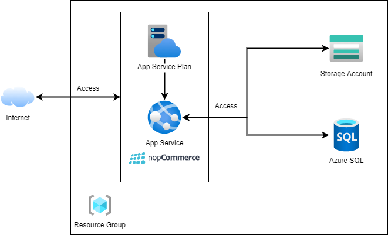
## Login to Azure account
https://portal.azure.com
## Create Azure resource group
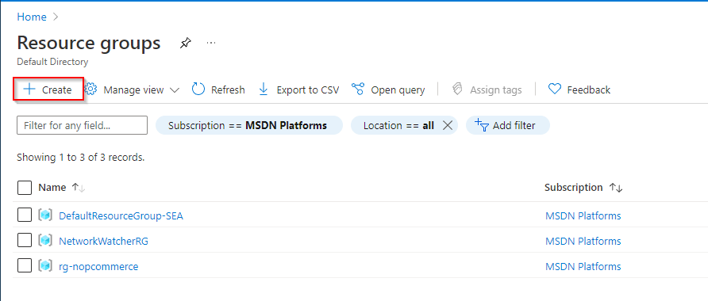

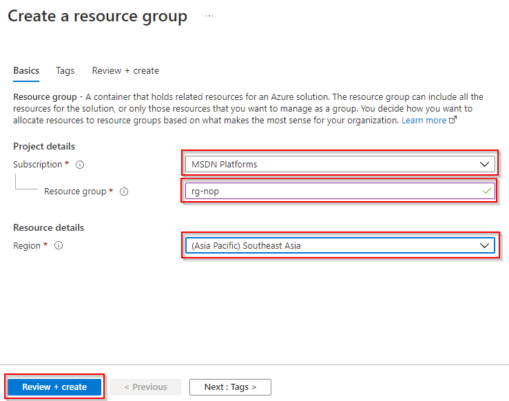

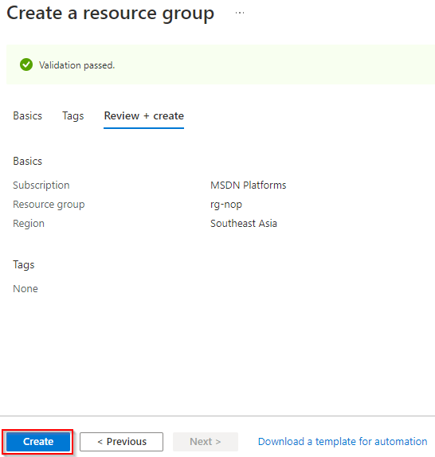
## Create Azure blob storage

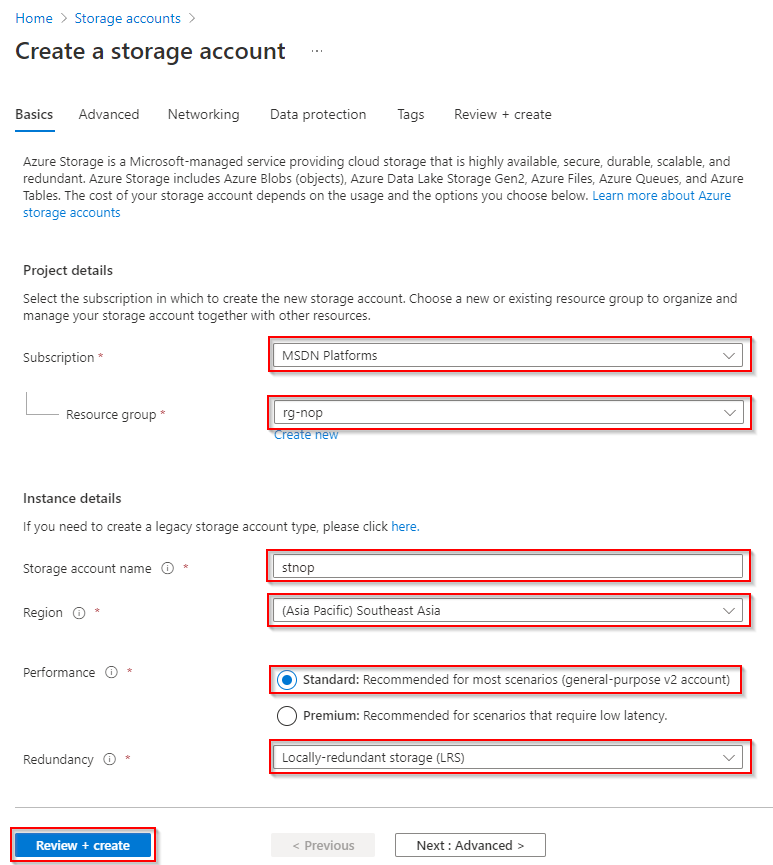
## Create Azure SQL server

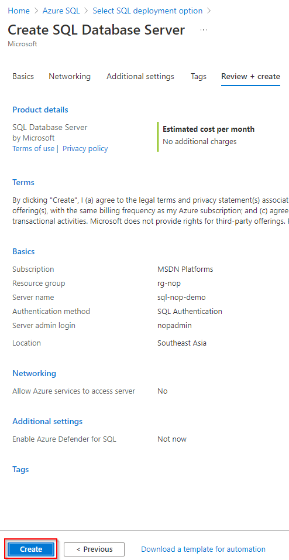

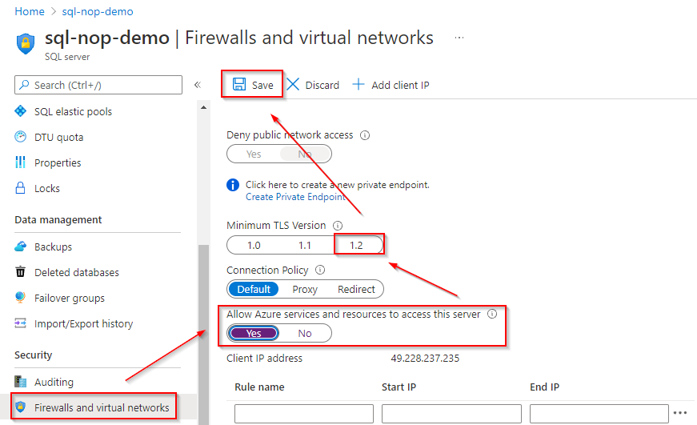
## Create Azure SQL database

## Create Azure app service plan
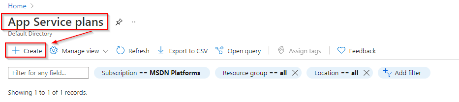

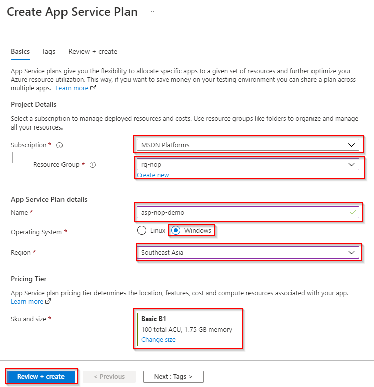
## Create Azure app service
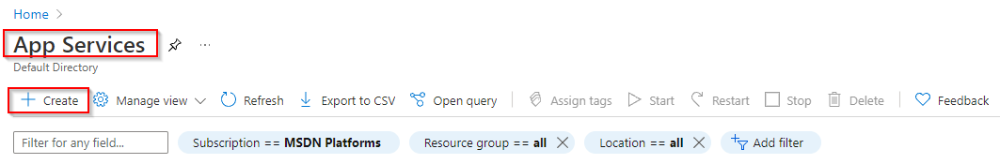

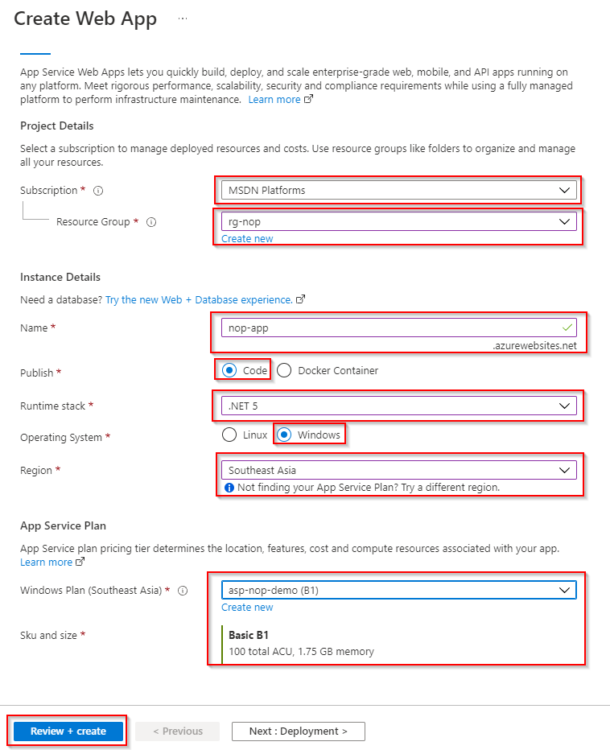

## Setup NopCommerce
Download from: https://www.nopcommerce.com/en/download-nopcommerce
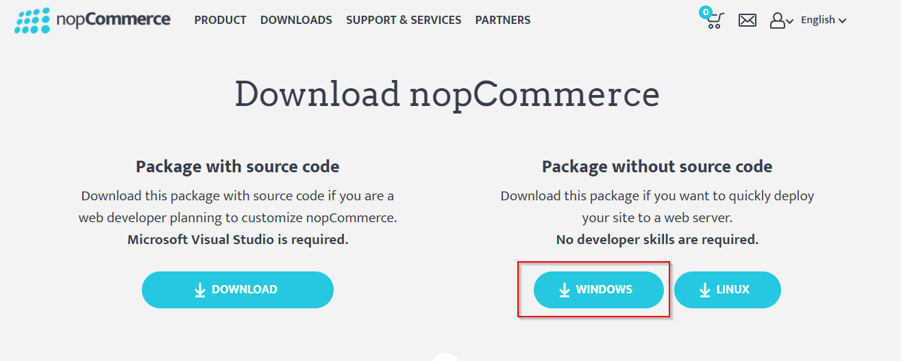

Upload all files to above FTP credential.

## Setup Azure blob storage on NopCommerce AppSettings page
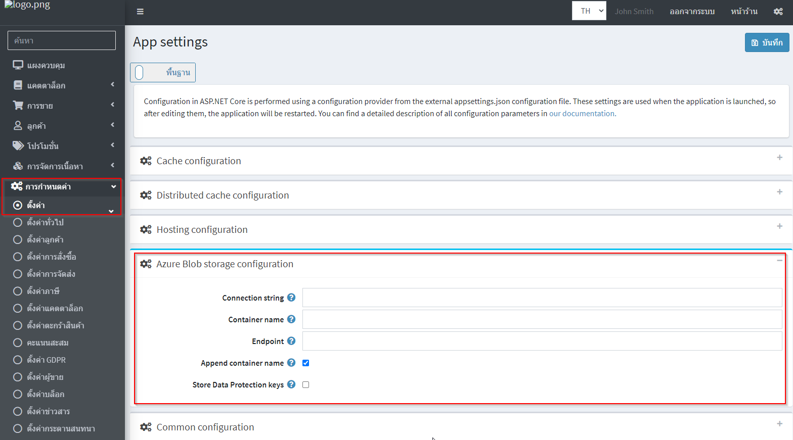
## References
- https://docs.microsoft.com/en-us/azure/architecture/example-scenario/private-web-app/private-web-app