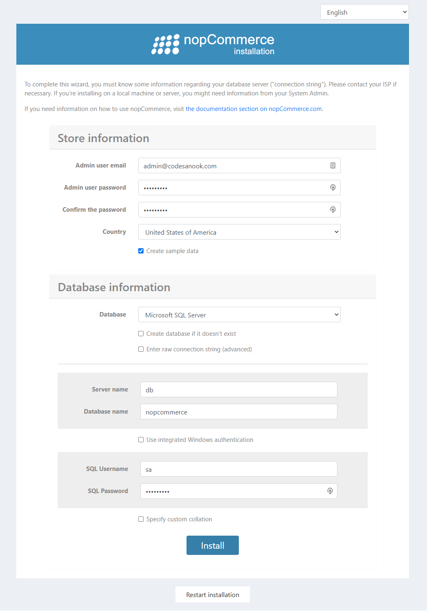
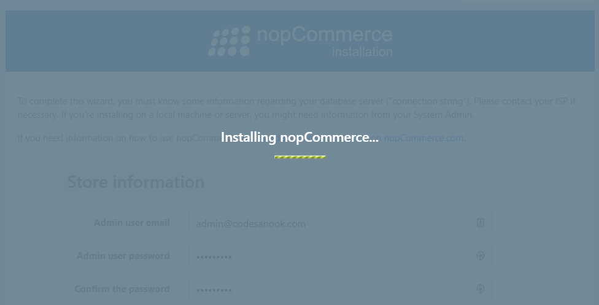
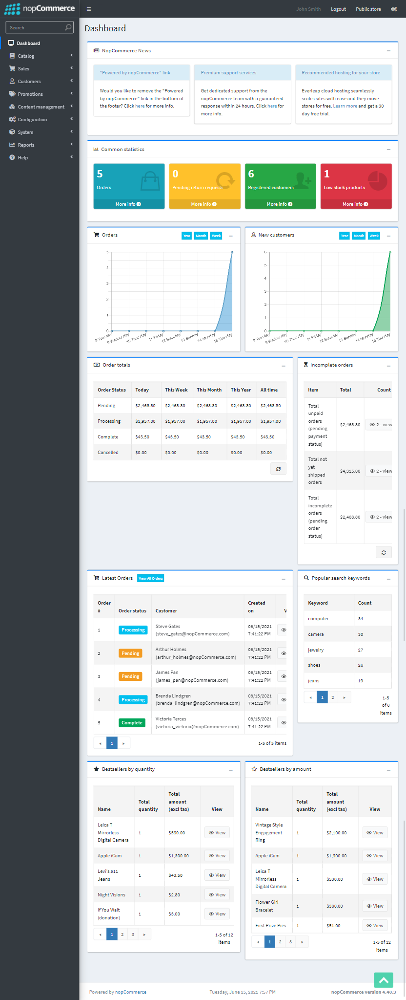

# Prepare Docker compose
- Create `docker-compose.yml` and other required files from instruction in [Docker compose for nopCommerce
](web-frameworks/nopcommerce/docker-compose-for-nopcommerce).
- Your project will have file structure as:
```sh
tree . -a
.
├── .env
├── Dockerfile
├── docker-compose.yml
├── entrypoint.sh
├── init-db.sql
└── initialize.sh

```

# Launch Docker containers
- At root folder, run the following command:
```sh
docker-compose up

```
- This will take a several minutes because you have to wait for downloading SQL Server for Linux image.
- Wait until you see a message **"Done initialize a database"**

# Setup
- Open a browser and navigate to [http://localhost:8080](http://localhost:8080).
- A browser will show nopCommerce installation page.
- Fill all required information:
  - Your admin email and password
  - Select a country.
  - Check "Create sample data".
  - Select Microsoft SQL Server database
  - For Server name, enter **db**.
  - For Database name, enter **nopcommerce**.
  - For SQL Username, enter **sa**.
  - For SQL Password, enter **12345Abc$**



- Click **Install**.
- Wait for a while until installation is completed.


- You will find a message **"nopcommerce_compose_web exited with code 0"** in a terminal.

# Start a website
- In fact, nopCommerce tries to restart a website after installation is completed, but this does work in Docker context. Therefore, you need to manually restart a container.
- Stop and start Docker containers. Kill Docker containers by pressing `CTRL+C` and then run `docker-compose up` again.
- Open a browser and navigate to [http://localhost:8080](http://localhost:8080)
- You will find a home page of nopCommerce with some sample products.


# Log in to admin panel.
- Open a browser and navigate to [http://localhost:8080/admin](http://localhost:8080/admin)

- Fill your admin email, password and click "LOG IN".


- You will be redirect to admin panel.


- You can manage your products on products page.


# Learn more about nopCommerce
- [nopCommerce Documentation
](https://docs.nopcommerce.com/en/index.html)
