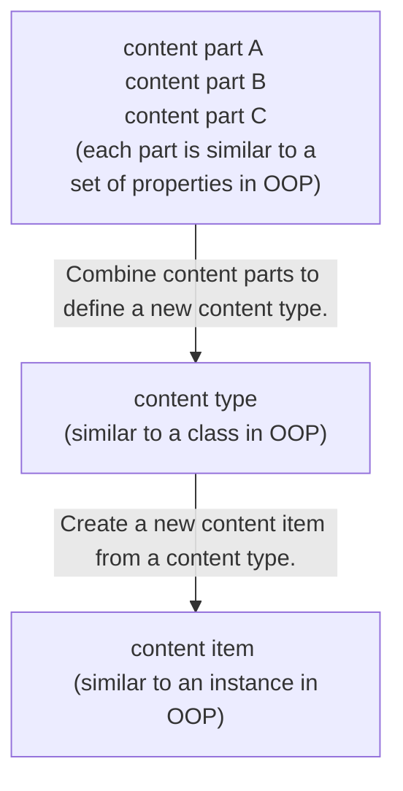

# How to create a new custom module in Orchard Core CMS

# Introduction

## Main basic concept of Orchard components

To understand how to develop Orchard extension, we need to understand these terms:
`Content item`, `Content type`, `Content part` and `Content field`.

### Content item
**Content item** is a single piece of content, often associate with a single URL on the site.
Examples of content items are pages, blog posts or products.
With OOP concept, you can think it is **an instance of a class**.

### Content type
**Content type** is like a template of content item.
Before creating a content type, we must define a content type first.
With OOP concept, you can think it is **a class**.

Those three content item examples that we mentioned before have these content types: page, blog post and product type.
In other words what we call a product is just an item of product type.

### Content part

A content type is built from multiple smaller parts which called content parts.
A content part is an atom of content that is enough to build a specific coherent behavior and it can be reused across content types.
With OOP concept, you can think it is a set of reusable properties and we creates a new content type from multiple content parts.

Example of content parts are:
- Title part for providing a title to a content item
- Autoroute part for proving a custom URL to a content item.
- HtmlBody part for providing an HTML Body to a content item.

### Content field

A Content field is a piece of information that can be added to a content type.
It has a name and a type that is specific to a content type.
A content type can have multiple same content fields with but can have only one unique content part.

For example, a product content type can have a text field representing its SKU,
a numeric field representing its price, and another numeric field representing its weight.
Each of these fields probably only makes sense on a product type.

## How content part, content type and content item work together


# Create a custom module

## Define a new content type

In our example, we want to create a web page to show an event information.
The page will have the following information:

- A custom friendly URL from event's title
- Event's title
- HTML Body for event details
- Map for event's location

Therefore, we will create a new **Event content item** from **Event content type**.
Let's define our Event content type.
It will consist of these parts:

- Autoroute part
- Title part
- HtmlBody part
- Map part

Autoroute, Title, HtmlBody are existing content parts in Orchard CMS.
They are in OrchardCore.Autoroute, OrchardCore.Title, OrchardCore.Html projects (modules) respectively.
However, we don't have a built-in Map part so we need create a new one.


---

## Create new projects from dotnet tool
Let's create a new module for Map part.

- A module is a set of extensions for Orchard that are grouped under a single sub-folder of the **OrchardCore.Modules.Cms** directory.
- Actually it is just a ASP.NET Core MVC project.
- We don't need to create it manually, we can use **dotnet tool** to create a module with a scaffold content part for us.
- We will create a new module by following steps.

### Install the latest version of .NET
- Follow [this instruction](/programming-cookbook/wsl-powershell-useful-scripts/install-dotnet) to install .NET.
- Then, use the following command to install Orchard Core CMS project template.
  ```sh
  $ dotnet new -i OrchardCore.ProjectTemplates::1.5.0
  ```
- **Note** Add `--nuget-source https://nuget.cloudsmith.io/orchardcore/preview/v3/index.json` option, if a template is from preview source.

### Create the main project from a template
- Create a folder that you want to save OrchardCore CMS source code and CD to it.
- In this example, I will use `orchard-example/src` to store all source code.
- Then, use dotnet command to create Orchard Core CMS project with name `OrchardExample.Cms`.
  ```sh
  $ mkdir -p orchard-example/src
  $ cd orchard-example/src
  $ dotnet new occms --name OrchardExample.Cms --framework net8.0
  ```
- *Note* `OrchardExample.Cms` is our main web project and it references `OrchardCore.Application.Cms.Targets` package.

### Create the module project from a template
- Next, create a folder name `Modules` inside `orchard-example/src` for adding a new module. Then CD to inside the folder that we have just created.
- Create a custom module with dotnet tool.
- You can create a new module with any name that represents a feature that you are going to build.
- In this example, we are going to create `OrchardExample.Map` module for providing `Map part` which can be used in an event content type.
  ```sh
  $ cd orchard-example/src
  $ mkdir Modules
  $ cd Modules
  $ dotnet new ocmodulecms --name OrchardExample.Map --AddPart True --PartName Map
  ```
- *Note* **Part** suffix is appended automatically to the end of the supplied PartName.

### Reference OrchardExample.Map to OrchardExample.Cms project
- CD back to `OrchardExample.Cms` folder.
- Then reference `OrchardExample.Map` with dotnet command.
  ```sh
  $ cd ../OrchardExample.Cms
  $ dotnet add reference ../Modules/OrchardExample.Map/OrchardExample.Map.csproj
  ```
---

## Use IDE and build the project

### Open a project with VS Code
- CD to the root of the project which contains `OrchardExample.Cms` and `Modules` folders.
- Open the project with VS Code.
  ```sh
  code .
  ```
- Current project's file structure:
  ```
  orchard-example/
  |--OrchardExample.Cms/
  |--Modules/
    |--OrchardExample.Map/
  ```

### Add preview package source
- At root of the project create `nuget.config` file.
- Add the following code to the file.
  ```xml
  <?xml version="1.0" encoding="utf-8"?>
  <configuration>
    <packageSources>
      <clear />
      <add key="NuGet" value="https://api.nuget.org/v3/index.json" />
      <add key="OrchardCorePreview" value="https://nuget.cloudsmith.io/orchardcore/preview/v3/index.json" />
    </packageSources>
    <disabledPackageSources />
  </configuration>
  ```
- *Waring* We do not suggest you to use the dev packages in production.

### Restore all Nuget packages and run a website
- Use VS Code integrated terminal by typing **ctrl+`**
- CD to `OrchardExample.Cms` and run the following command.
  ```
  dotnet restore
  ```
- *Note* Please make sure you save all changes before running the command.
- Wait until we have restored all packages successfully.
- Then run:
  ```
  dotnet watch run
  ```
---

## Set up new Orchard CMS website
- Open a browser and navigate to http://localhost:5000
- You will find Orchard Core CMS setup page.


- *Tip* you can put **chrome://flags/#allow-insecure-localhost** in Chrome's address bar, enable that setting and relaunch Chrome to not show warning message on localhost.
- Set up a new website with any name you like and use **Blog recipe**.
- Use SQLite to simplify our project. For using it as production database, please check  https://www.sqlite.org/whentouse.html.
- *Note* If you are going to use other database type,  you need to create an empty database before setting up a website.**.
- Set admin username and email to what ever you want.
- Click `Finish setup` button.
- You will be redirected to home page.
- Go to admin panel by navigating to http://localhost:5000/admin and log in with your admin's username and password.
- On the left-hand side menu of admin panel, go to `Configuration` > `Features`.
- Search for **map** and you will find `OrchardExample.Map` has not been enabled yet.
- We will be back to enable it later after we have updated our module and our Map part is ready to use.


---

## Update Map part

- You can update a manifest file as you like. I will only change an author and website URL.
- Edit `Manifest.cs` in OrchardExample.Map project to:
```cs
using OrchardCore.Modules.Manifest;

[assembly: Module(
    Name = "OrchardExample.Map",
    Author = "OrchardExample Team",
    Website = "https://www.OrchardExample.com",
    Version = "0.0.1",
    Description = "OrchardExample.Map",
    Dependencies = new[] { "OrchardCore.Contents" },
    Category = "Content Management"
)]
```

- Go to the Models folder in OrchardExample.Map project `(Modules/OrchardExample.Map/Models)`, you will find that we have the generated `MapPart.cs` file.
- This file is our main model.
- It is a content part that we will add new features.
- Add new properties to the model and it will look like this.
```cs
using OrchardCore.ContentManagement;

namespace OrchardExample.Map.Models
{
    public class MapPart : ContentPart
    {
        public double Latitude { get; set; }
        public double Longitude { get; set; }
    }
}
```
- Please note that a content part derives from **ContentPart** class.

---

## Update ContentPartDisplayDriver

You can think `ContentPartDisplayDriver` class is a mini MVC controller for displaying or editing our content part.
To use it, we create a derived class from ContentPartDisplayDriver with a generic type of our content part.

- Go to `Drivers` folder and you will find we have `MapPartDisplayDriver.cs`.
- There are three main methods that we need to override:
  - **Display/DisplayAsync** for creating a shape to render a part in frontend
  - **Edit/EditAsync** for creating a shape to render a part as editing form
  - **Update/UpdateAsync** for updating a part with a new value
- All methods have pairs of async method that we can override.
- Before updating our ContentPartDisplayDriver, we need to understand a content shape.

### What is a content shape?
- It is a small object that contains all the information required in order to display on the screen.
- Before showing a content item, everything get mapped into a tree of shapes that are sort of abstract representation of the final page.
- The advantage of such trees of shapes is that any module can modify existing shapes or create a new one.

### Explore the auto generated MapPartDisplayDriver.cs

Here is the auto generated code to create create a MapPart Shape.
```cs
public override IDisplayResult Display(MapPart part, BuildPartDisplayContext context)
{
    return Initialize<MapPartViewModel>(
            GetDisplayShapeType(context),
            m => BuildViewModel(m, part, context)
        )
        .Location("Detail", "Content:10")
        .Location("Summary", "Content:10");
}
```
- We use `Initialize` method with a generic of view model `MapPartViewModel` to create IDisplayResult
- We use `GetDisplayShapeType` to resolve **MapPart shape** for showing a map in a details page and **MapPart_Summary shape** for showing a map in a summary page or list view page.
- Orchard uses convention to bind a view template (\*.cshtml or \*.liquid) and shape name.
- Given our shape type **MapPart**, it will use **MapPart.cshtml** or **MapPart.liquid** in Views folder to render a shape.
- Then, we construct a Lambda to create a view model with `BuildViewModel` method.
- `MapPartViewModel` view model will be passed as a model to a template of a shape.
- Orchard knows how to render it correctly depend on display type `Details` or `Summary`.
- We also set a position to display a shape at Content zone position 10.
- Next, we are going to make our MapPart ready to render in details and summary page.

---

## Update MapPartViewModel
- Open MapPartViewModel.cs in `Modules/OrchardExample.Map/ViewModels/MapPartViewModel.cs` and update the content as following:
```cs
using Microsoft.AspNetCore.Mvc.ModelBinding;
using OrchardCore.ContentManagement;
using OrchardExample.Map.Models;

namespace OrchardExample.Map.ViewModels
{
    public class MapPartViewModel
    {
        public double Latitude { get; set; }
        public double Longitude { get; set; }

        [BindNever]
        public ContentItem ContentItem { get; set; }

        [BindNever]
        public MapPart MapPart { get; set; }
    }
}

```
- Go back to `MapPartDisplayDriver.BuildViewModel` method and update the method body as following:
```cs
private void BuildViewModel(MapPartViewModel model, MapPart part)
{
    model.Latitude = part.Latitude;
    model.Longitude = part.Longitude;
    model.MapPart = part;
    model.ContentItem = part.ContentItem;
}
```
- As you can see, we set the part properties to view model's properties.
- Reference the part itself to MapPart property.
- Reference a content item that the current MapPart belongs to, to ContentItem property.

- Update `MapPartDisplayDriver.BuildViewModel` to use a new signature of `BuildViewModel` method.
```cs
public override IDisplayResult Display(MapPart part, BuildPartDisplayContext context)
{
    return Initialize<MapPartViewModel>(
            GetDisplayShapeType(context),
            m => BuildViewModel(m, part)
        )
        .Location("Detail", "Content:10")
        .Location("Summary", "Content:10");
}
```

## Edit MapPart.cshtml
- We will use MapPart.cshtml as view template of a shape in details page.
- Rename MapPart.liquid in `Modules/OrchardExample.Map/Views` to MapPart.cshtml.
- We use Razor instead of Liquid template.
- Update the content of MapPart.cshtml to:
```html
@model MapPartViewModel
@{
    // From https://developers.google.com/maps/documentation/javascript/adding-a-google-map
    const string apiKey = "YOUR_API_KEY";
}

<!--The div element for the map -->
<div id="map"></div>

<style type="text/css">
    /* Set the size of the div element that contains the map */
    #map {
        height: 400px;
        /* The height is 400 pixels */
        width: 100%;
        /* The width is the width of the web page */
    }
</style>

<script src="https://maps.googleapis.com/maps/api/js?key=@apiKey&callback=initMap&libraries=&v=weekly" defer></script>
<script>
    // Initialize and add the map
    function initMap() {
        // The location of Uluru
        const uluru = { lat: @Model.Latitude, lng: @Model.Longitude };
        // The map, centered at Uluru
        const map = new google.maps.Map(
            document.getElementById("map"),
            {
                zoom: 4,
                center: uluru,
            }
        );

        // The marker, positioned at Uluru
        const marker = new google.maps.Marker({
            position: uluru,
            map: map,
        });
    }
</script>
```
- Learn how to get Google map API key from https://developers.google.com/maps/documentation/javascript/adding-a-google-map#step_3_get_an_api_key.
-  After you have got the key, change "YOUR_API_KEY" to your Google map API key.

- Update content of MapPart_Summary.liquid that use for summary page to:
```html
<a href="{{ Model.ContentItem | display_url }}>{{ Model.ContentItem.ContentItemId }}</a>
```

## Make MapPart editable
- Open MapPartDisplayDriver.cs and update Edit method to:
```cs
public override IDisplayResult Edit(MapPart part, BuildPartEditorContext context)
{
    return Initialize<MapPartViewModel>(
        GetEditorShapeType(context),
        m => BuildViewModel(m, part)
    );
}
```
- This method creates a **MapPart\_Edit shape** that will use `MapPart_Edit.cshml` or  `MapPart.Edit.cshml` as a view template for rendering Map part in edit page.
- Next, open existing MapPart.Edit.cshtml or MapPart_Edit.cshtml and update the content to:

```html
@model MapPartViewModel

<h3>Location</h3>
<div class="form-group" asp-validation-class-for="Latitude">
    <label asp-for="Latitude">
        @T[nameof(Model.Latitude)]
    </label>
    <input asp-for="Latitude" class="form-control" />
</div>

<div class="form-group" asp-validation-class-for="Longitude">
    <label asp-for="Longitude">
        @T[nameof(Model.Longitude)]
    </label>
    <input asp-for="Longitude" class="form-control" />
</div>
```

### Update UpdateAsync method

- Open MapPartDisplayDriver.cs and update `UpdateAsync` method to:

```cs
public override async Task<IDisplayResult> UpdateAsync(MapPart model, IUpdateModel updater)
{
    await updater.TryUpdateModelAsync(
        model,
        Prefix,
        t => t.Latitude,
        t => t.Longitude
    );
    return Edit(model);
}
```
- This method uses `updater.TryUpdateModelAsync` to update our Map part and save it to a database by taking HTTP form data as input.
- We explicit update only Latitude and Longitude properties.
- It returns the shape result of Edit method which is MapPart_Edit shape.
- Therefore, this method will end up with returning the edit page with a new content data.

### Full content of MapPartDisplayDriver.cs

```cs
using System.Threading.Tasks;
using OrchardCore.ContentManagement.Display.ContentDisplay;
using OrchardCore.ContentManagement.Display.Models;
using OrchardCore.ContentManagement.Metadata;
using OrchardCore.DisplayManagement.ModelBinding;
using OrchardCore.DisplayManagement.Views;
using OrchardExample.Map.Models;
using OrchardExample.Map.Settings;
using OrchardExample.Map.ViewModels;

namespace OrchardExample.Map.Drivers
{
    public class MapPartDisplayDriver : ContentPartDisplayDriver<MapPart>
    {
        private readonly IContentDefinitionManager _contentDefinitionManager;

        public MapPartDisplayDriver(IContentDefinitionManager contentDefinitionManager) =>
            _contentDefinitionManager = contentDefinitionManager;

        public override IDisplayResult Display(MapPart part, BuildPartDisplayContext context)
        {
            return Initialize<MapPartViewModel>(
                    GetDisplayShapeType(context),
                    m => BuildViewModel(m, part)
                )
                .Location("Detail", "Content:10")
                .Location("Summary", "Content:10");
        }

        public override IDisplayResult Edit(MapPart part, BuildPartEditorContext context)
        {
            return Initialize<MapPartViewModel>(
                GetEditorShapeType(context),
                m => BuildViewModel(m, part)
            );
        }

        public override async Task<IDisplayResult> UpdateAsync(MapPart model, IUpdateModel updater)
        {
            await updater.TryUpdateModelAsync(
                model,
                Prefix,
                t => t.Latitude,
                t => t.Longitude
            );
            return Edit(model);
        }

        private void BuildViewModel(MapPartViewModel model, MapPart part)
        {
            model.Latitude = part.Latitude;
            model.Longitude = part.Longitude;
            model.MapPart = part;
            model.ContentItem = part.ContentItem;
        }
    }
}

```

## Update a Startup.cs of OrchardExample.Map project
- Update `Modules/OrchardExample.Map/Startup.cs` as the following code to simplify our Startup class:
```cs
using Microsoft.Extensions.DependencyInjection;
using OrchardCore.ContentManagement;
using OrchardCore.ContentManagement.Display.ContentDisplay;
using OrchardCore.Data.Migration;
using OrchardExample.Map.Drivers;
using OrchardExample.Map.Models;
using OrchardCore.Modules;

namespace OrchardExample.Map
{
    public class Startup : StartupBase
    {
        public override void ConfigureServices(IServiceCollection services)
        {
            services.AddContentPart<MapPart>().UseDisplayDriver<MapPartDisplayDriver>();
            services.AddScoped<IDataMigration, Migrations>();
        }
    }
}
```

## Create an Event content type
- We have a Migrations.cs at root of the module project.
- We have generated code which already create a part for us.
- We use `contentDefinitionManager.AlterPartDefinition` to create a part with a name matches our part model.
- Since OrchardCore stores data of MapPart in JSON document format, we don't need to define any tables/columns like Orchard version 1. With this, our migration is much simpler.
- Update content of Migrations.cs to:

```cs
using OrchardCore.ContentManagement.Metadata.Settings;
using OrchardCore.ContentManagement.Metadata;
using OrchardCore.Data.Migration;
using OrchardExample.Map.Models;

namespace OrchardExample.Map
{
    public class Migrations : DataMigration
    {
        IContentDefinitionManager _contentDefinitionManager;
        public Migrations(IContentDefinitionManager contentDefinitionManager) =>
          _contentDefinitionManager = contentDefinitionManager;

        public int Create()
        {
            _contentDefinitionManager.AlterPartDefinition(
                nameof(MapPart),
                part => part
                    .Attachable()
                    .WithDescription("Provide a map part for a content item")
            );

            return 1;
        }
    }
}
```

## Remove unused files from OrchardExample.Map project

- Remove Handlers folder and files inside, we don't need them for our project.
- Remove MapPartDisplayDriver.GetMapPartSettings method.
- Remove Settings folder that we don't use setting in this example.
- Remove MapPartSettings.Edit which a view of content part setting.
- Remove Controller folder.
- Remove Views/Home folder.

screenshot of the current project structure


## Enable the module that contains Map part

- Now we have a MapPart is ready to use.
- In our example, we are going to create the Event content type.
- We can attach the Map content part to the content type via code or UI in the admin panel.
- To simplify our example, we will start by using admin panel.
- Before using Map part, we need to enable OrchardExample.Map module.
- Go to admin panel, on left-hand side menu:
  1. Click Configuration.
  2. Click Features.
  3. Search "map".
  4. Click `Enable` button.


- Verify if our Map part is ready to use:
  1. Click Content menu.
  2. Click Content Definition.
  3. Click Content Parts.
  4. Search "map" and verify if you have Map content part.

content part is ready to use


## Create an Event content type and attach the Map part
- In admin panel.
- On the left-hand side menu.
- Click Content > Content Definition > Content Types.
- On top right corner of the screen, click `Create new type` button > Name it "Event" > Click `Create` button.
- You will be redirected to a page to add parts to Event content type.
- Check following parts:
  - [x] Autoroute
  - [x] Title
  - [x] Html Body
  - [x] Map
- Click Save button.
- Now you are redirected to edit content type page.
- Keep Creatable, Listable Draftable checked.
- At the button of the screen, you can sort the order of parts by drag and drop.
- In addition, you can edit Event content type later by going to Content > Content Types > search for "Event" and then click `Edit` button.

screenshot of Event content type definition


## Create a new **Event content item**

- On left-hand side menu > Click Content menu > Content Items.
- Click New button at top right of the screen > Select Event.
- Then you will see a form to create a new event, fill information to all fields
  - Title
  - HtmlBody content (It uses shortcode by default)
  - Latitude e.g. -25.344
  - Longitude e.g. 131.036

- Click Publish button.
- Then the event that you have just created will show in the list.
- Click View button to view the event on frontend.

screenshot of event content item details page


## Summary
I hope this tutorial will help you understand how to create a custom OrchardCore module and content part.
Thanks.

## Full source code
- [https://github.com/codesanook/orchard-example](https://github.com/codesanook/orchard-example)

## References & useful links
- Content adjusted from https://docs.orchardproject.net/en/latest/Documentation/Writing-a-content-part
- [A closer look at Content Types, Drivers, Shapes and Placement](http://www.ideliverable.com/blog/a-closer-look-at-content-types-drivers-shapes-and-placement)
- [Code Generation Templates](https://docs.orchardcore.net/en/dev/docs/getting-started/templates/)
- [Add preview package source](https://docs.orchardcore.net/en/dev/docs/getting-started/preview-package-source/)
