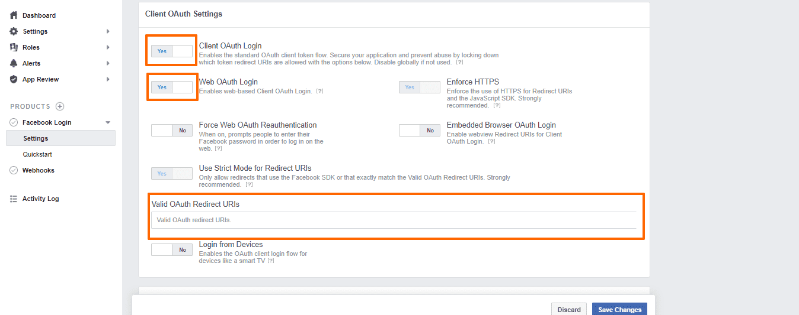
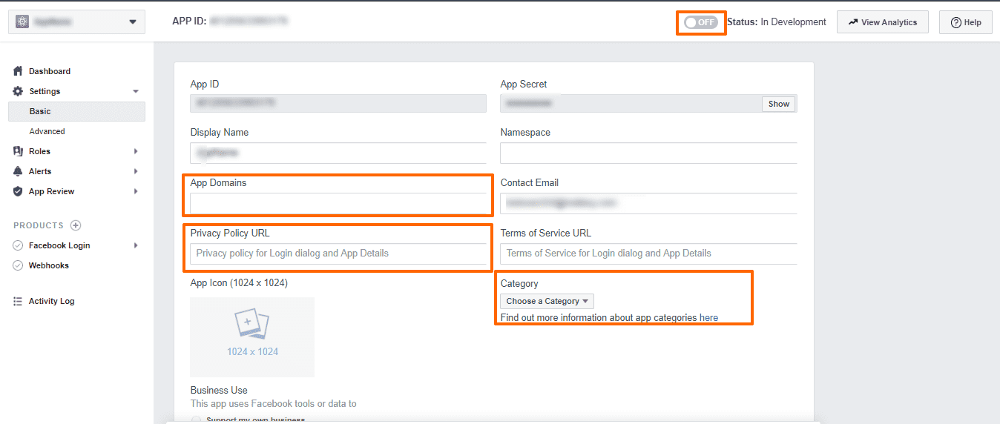

Orchard Core CMS allows you to create a new user with Facebook login.
Here is the step by step to enable Facebook login in Orchard Core CMS website.

# Create a new Facebook app
- Go to https://developers.facebook.com/apps/.
- Create a new Facebook app with your personal information.
- After a Facebook has been created, add a new product, select Facebook Login.
- Click Settings of Facebook Login product.
- Verify if `Client OAuth login` and `Web OAuth login` are turned on
- Set callback URL to https://your-domain.com/signin-facebook e.g. https://www.orchardexample.com/signin-facebook
  
- Go to main Settings of Facebook app and click Basic.
- Set App domain, Privacy Policy and Category.
  
- More information of how to create Facebook app
  - https://www.loginradius.com/blog/engineering/login-with-facebook/
  - https://docs.microsoft.com/en-us/aspnet/core/security/authentication/social/facebook-logins

# Enable Facebook Login
- Go to your Orchard Core CMS website and log in to admin site.
- Go to Configuration > Features > Enable `Facebook Login` module. This will also enable Facebook module which Facebook Login module depends on.
- Go to Configuration > Settings > Facebook app > Enter APP Id and Secret Id that we can copy from Basic settings of your Facebook app.

# Enable User Registration module
- We can control how user can register by Facebook log in by enable User Registration module
- In admin site, go to Configuration > Features > enable `Users Registration` module.
- Go to Security > Settings > User Registration and configure these settings:
  - Set `Configure users registration` to `AllowOnlyExternalUsers` to let user register by Facebook login only.
  - Uncheck `Users must verify their email address`.
  - Uncheck `Users must be approved before they can log in`.
  - Check `Use site theme for registration page`.
  - Check `Use a script to generate userName based on external provider claims`
  - Set the following code to generate a username from Facebook user's first name.
    ```js
      log('Information', JSON.stringify(context));
      context.userName = context.externalClaims.find(
        c => c.type.includes('givenname')
      ).value.toLowerCase();
    ```
  - Code reference for a custom script to set a username.
    - https://github.com/OrchardCMS/OrchardCore/blob/main/src/OrchardCore.Modules/OrchardCore.Users/Handlers/ScriptExternalLoginEventHandler.cs
    - https://github.com/OrchardCMS/OrchardCore/blob/main/src/OrchardCore/OrchardCore.Scripting.JavaScript/JavaScriptEngine.cs
    - https://github.com/OrchardCMS/OrchardCore/blob/main/src/OrchardCore.Modules/OrchardCore.Scripting/Providers/LogProvider.cs

- Check `Do not ask username`.
- Check `Do not ask email address`.
- Check `Do not create local password for external users`.

# Make callback URL correct for a website under proxy server.
- If you website run under proxy server, you may get incorrect generated callback URL.
- You need to enable `Reverse Proxy Configuration` module.
- Go to Configuration > Settings >  Reverse Proxy > Enter APP Id and Secret Id that we can copy from Basic settings of your Facebook app.
- Enable these settings:
  - Enables the forwarding of the HTTP header X-Forwarded-For
  - Enables the forwarding of the HTTP header X-Forwarded-Proto
  - Enables the forwarding of the HTTP header X-Forwarded-Hos
- More information about how to fix incorrect callback URL for a website under a proxy server.
  - https://docs.microsoft.com/en-us/aspnet/core/security/authentication/social/facebook-logins?view=aspnetcore-6.0#forward-request-information-with-a-proxy-or-load-balancer
  - https://stackoverflow.com/a/69389665/1872200
  -https://github.com/OrchardCMS/OrchardCore/blob/main/src/OrchardCore.Modules/OrchardCore.ReverseProxy/Services/ForwardedHeadersOptionsConfiguration.cs#L18


# Credit and reference
- https://www.loginradius.com/blog/engineering/login-with-facebook/
- https://docs.microsoft.com/en-us/aspnet/core/security/authentication/social/facebook-logins?view=aspnetcore-6.0
- https://github.com/OrchardCMS/OrchardCore/tree/main/src/OrchardCore.Modules/OrchardCore.Facebook/Login
