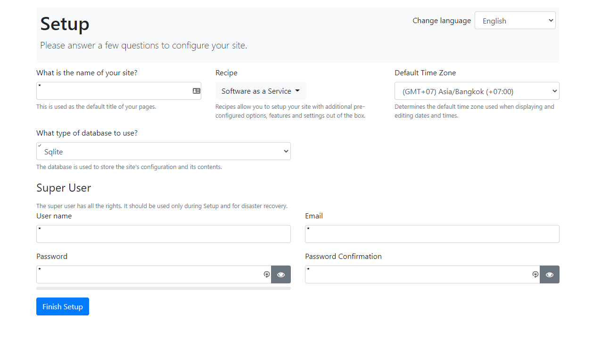

# Install .NET on Ubuntu LTS
- Follow [How to install .NET on Ubuntu LTS document](/programming-cookbook/wsl-powershell-useful-scripts/install-dotnet) to install .NET on Ubuntu LTS.

# Install Orchard Template
- Use the following command to install a new project template
  It'll [release package](https://github.com/OrchardCMS/OrchardCore/releases).
  ```sh
  $ dotnet new -i "OrchardCore.ProjectTemplates::1.5.0"
  ```
- Create a new folder with name `orchard-example`, we will use it as a root folder of our project.
- Inside the root folder, create a folder `src` to store the project's source code.
- CD to `orchard-example/src`.
- Use `dotnet new occms` command to create a new OrchardCore CMS project with name `OrchardExample.Cms`.
- You can change a project's name to any name that you want.
  ```sh
  $ mkdir -p orchard-example/src
  $ cd orchard-example/src
  $ dotnet new occms --name OrchardExample.Cms --framework net6.0
  ```

# Open the project with VS Code
- CD back to the root folder (`orchard-example`).
- Launch VS Code.
  ```sh
  $ cd orchard-example
  $ code .
  ```

# Optionally add preview package source
- At root of the project, create `nuget.config` file.
- Add the following code to the file.
  ```xml
    <?xml version="1.0" encoding="utf-8"?>
    <configuration>
      <packageSources>
        <clear />
        <add key="NuGet" value="https://api.nuget.org/v3/index.json" />
        <add key="OrchardCorePreview" value="https://nuget.cloudsmith.io/orchardcore/preview/v3/index.json" />
      </packageSources>
      <disabledPackageSources />
    </configuration>
  ```
- *Warning*, we do not suggest you to use the dev packages in production.

# Explore the project's file structure
  ```sh
  $ tree -I "bin|obj" orchard-example
  orchard-example
  ├── nuget.config
  └── src
      └── OrchardExample.Cms
          ├── NLog.config
          ├── OrchardExample.Cms.csproj
          ├── Program.cs
          ├── Properties
          │   └── launchSettings.json
          ├── appsettings.json
          └── wwwroot
  ```

# Launch a website
- Use VS Code integrated terminal by pressing **ctrl + `**
- CD to `src/OrchardExample.Cms` folder.
- Run the project with the following commands:
  ```sh
  $ cd src/OrchardExample.Cms
  $ dotnet run
  ```
*Note*, please make sure you've saved all changes before running the command.
- FYI, `dotnet run` automatically download all Nuget packages so you don't need to explicitly run `dotnet restore`.
- Please refer to https://docs.microsoft.com/en-us/dotnet/core/tools/dotnet-run#implicit-restore for more information.

# Set up a new Orchard CMS website
- Open a browser and navigate to https://localhost:5001.
- You will find Orchard Core CMS setup page.


- *Tip*, you can put **chrome://flags/#allow-insecure-localhost** command setting in Chrome's address bar, enable that setting and relaunch Chrome to not show warning message on localhost.
- Set up a new website with any name you want and use **Blog recipe**.
- Use SQLite to simplify our project. For using it as production database, please refer to https://www.sqlite.org/whentouse.html.
- *Note*, if you are going to use other database types, you need to create an empty database before setting up a website.**.
- Set an admin's username and email to any values you want.
- Click `Finish setup` button.
- You will be redirected to a home page.
- Go to an admin site by navigating to https://localhost:5001/admin and log in with your admin's username and password.

# Example of a home page set up with blog recipe


# Example of an admin site


# All Orchard Core Cms Templates
- You can use `dotnet new` to list all installed templates, and you can select it by using `Short Name` of a template.


# Other useful tips

## Update Orchard Core CMS template
  - Execute the following command to update Orchard Core CMS template:
    ```sh
    $ dotnet new --install OrchardCore.ProjectTemplates::1.5.0
    ```
  - Example of the result after running `dotnet new`.
  ```sh
  $ dotnet new
  Templates                                     Short Name      Language    Tags
  --------------------------------------------  --------------  ----------  ----------------------
  Orchard Core Cms Module                       ocmodulecms     [C#]        Web/Orchard Core/CMS
  Orchard Core Cms Web App                      occms           [C#]        Web/Orchard Core/CMS
  Orchard Core Theme                            octheme         [C#]        Web/Orchard Core/CMS
  Orchard Core Mvc Module                       ocmodulemvc     [C#]        Web/Orchard Core/Mvc
  Orchard Core Mvc Web App                      ocmvc           [C#]        Web/Orchard Core/Mvc
  ```

- Example command to use **Orchard Core Cms Web App Template** to create a new Orchard Core CMS website project.
  ```sh
  $ dotnet new occms --name [PROJECT_NAME]
  ```
