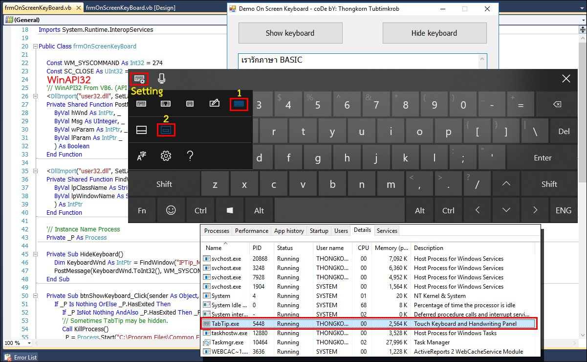

Original Author: [Suraphon Yotsanga](https://www.facebook.com/g2gnet)

โค้ด VB .NET ในการติดต่อและควบคุมแป้นคีย์บอร์ดเสมือน (Virtual Keyboard) ซึ่งเราจะเรียกใช้งานผ่านไปยังไฟล์ TABTIP.EXE ซึ่งไม่ใช่ OSK.EXE (On Screen Keyboard) และ TABTIP.EXE จะทำงานได้ดีกว่าครับ ... โค้ดชุดนี้ใช้การติดต่อกับแป้นคีย์บอร์ดเสมือนผ่านทาง WinAPI32 เป็นการดึงพลังของ Windows ออกมาใช้งาน ซึ่งสาย VB6 นี่ขาดไม่ได้เลย ...

Source Code: https://github.com/thongkorn/OnScreenKeyboard

# Reference

- Article: https://www.facebook.com/groups/dotnetthailand/permalink/4225657807520044/
- Fork Project: https://github.com/dotnetthailand/OnScreenKeyboard
