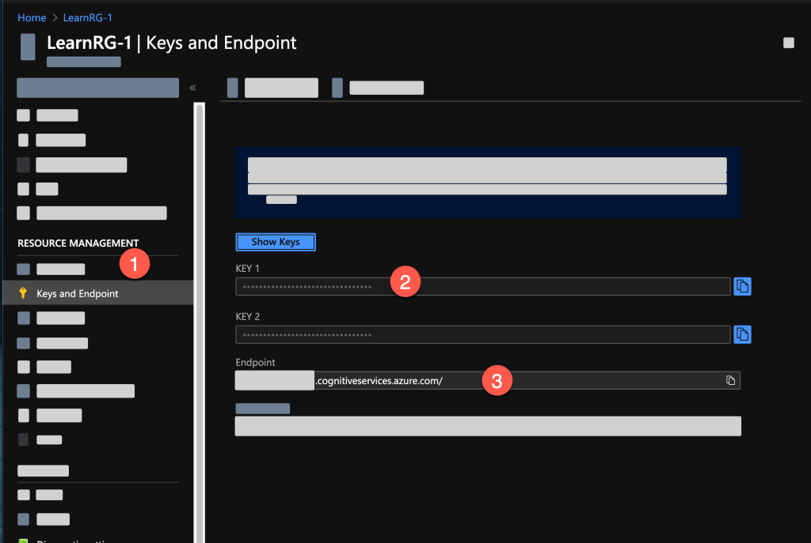
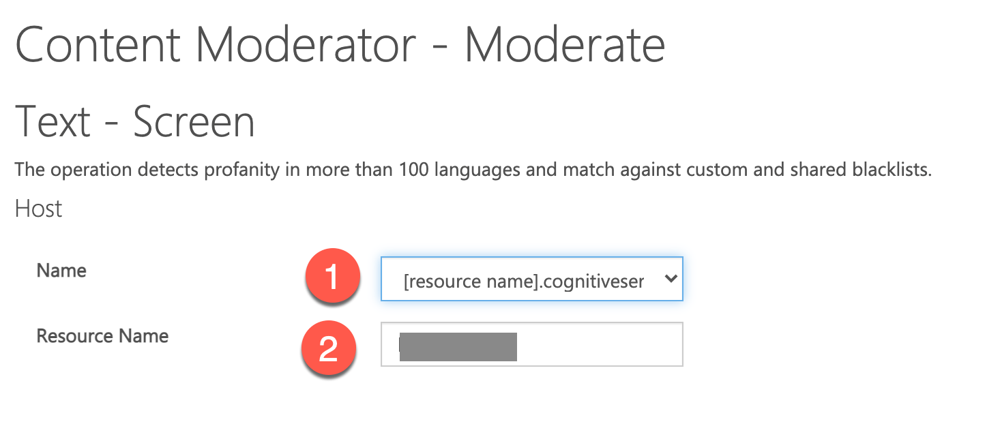
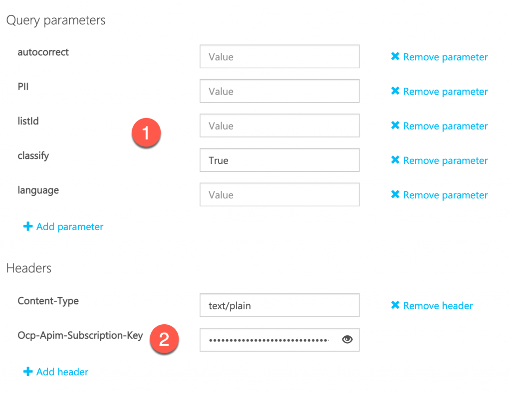
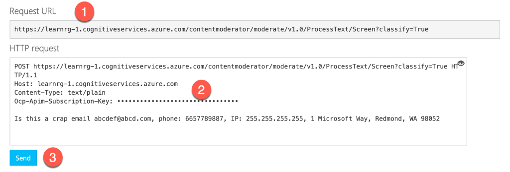
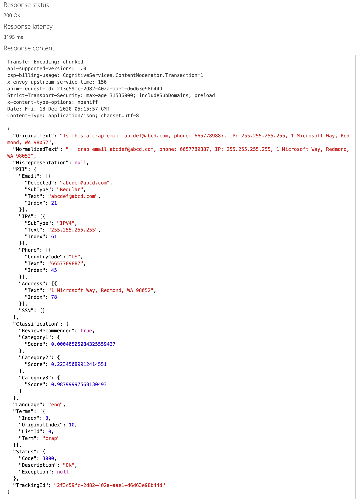

# เริ่มต้นใช้งาน Azure Content Moderator

ก่อนเริ่มต้นใช้งาน ให้ทำการสร้าง Azure Resource และทำการ copy API key เอาไว้[จากขั้นตอนที่พลเขียนไว้ที่นี่](https://nextflow.in.th/2020/get-resource-key-azure-content-moderator-thai/)

## ขั้นตอนทดสอบ

### 1. คัดลอกข้อมูลจาก Azure Resource

1. ไปที่ Resource Management > Keys and Endpoint
2. ให้กดปุ่มทางด้านขวา เพื่อคัดลอกส่วน Key 1 มาเก็บไว้
3. ส่วนด้านหน้าของ Endpoint ที่มีลักษณะคล้าย URL ของเว็บ https://**XXXX**.cognitiveservices.azure.com/ ส่วนที่เน้นตัวหนาต้องคัดลอกเอามาใช้ใน Content Moderator Console

### 2. ให้เปิดมาที่ Content Moderator Console

- เปิดเข้าใช้งาน Cognitive Service ใน[ส่วน Content Moderator](https://westus.dev.cognitive.microsoft.com/docs/services/57cf753a3f9b070c105bd2c1/operations/57cf753a3f9b070868a1f66f)
- ในส่วนของ **Text - Screen** ให้เลือก **Region** ให้ตรงกับที่เราสร้าง Resource ไว้

และในส่วนแรก เราจะกำหนดค่าลงไปดังนี้

1. จากตัวเลือกให้เลือกเป็น **[resource name]**
2. Resource Name ให้ใส่ชื่อ Resource ที่ได้มาจากขั้นตอนที่ 1 ลงไป
เช่นถ้า Endpoint ของเราคือ https://**nextflowinth**.cognitiveserviceazure.com

**Resource Name** ก็คือ **nextflowinth**

### 3. กำหนด Parameter ในการส่งข้อมูล

1. ส่วนของการใช้บริการทั่วไป จะสังเกตว่า Classity (Classification) จะกำหนดเป็น True เพื่อเปิดใช้งานเป็นค่าเริ่มต้น
2. ส่วน Header จะมีส่วน Subscription-key เราต้องเอา Key ที่ได้จาก Resource ที่สร้างไว้มาใส่
3. ส่วนที่อยู่ถัดลงมาเป็นข้อความที่ต้องการให้ content moderator ตรวจสอบ

### 4. ตรวจสอบข้อมูล

1. ส่วน Request URL เราสามารถนำส่วนนี้ไปใช้ในโค้ดโปรแกรมได้
2. สรุปข้อมูล
3. กดปุ่ม Send เพื่อส่งข้อมูลทั้งหมด

### 5. ตรวจสอบผลลัพธ์

ผลลัพธ์การวิเคราะห์จะถูกส่งกลับมา ซึ่งส่วนที่ควรสังเกตมีดังนี้

- **Response status** ควรเป็น 200 OK
- **Response latency** เป็นระยะเวลาที่ใช้ในการวิเคราะห์และตอบกลับ
- **Response Content** เป็นข้อมูลที่ส่งกลับมา

## การใช้งานกับภาษาไทย

ตอนที่พลเขียนเรื่องนี้อยู่ ตัว Azure Content Moderator เริ่มใช้งานกับภาษาไทยได้แล้ว [ลองดูที่นี่เลย](testing-azure-content-moderator-with-thai-language.md)

## ดูเพิ่มเติม

- [Azure Content Moderator](https://azure.microsoft.com/en-us/services/cognitive-services/content-moderator/)
- [เรื่อง AI อื่นๆ บน Nextflow](https://nextflow.in.th/tag/azure-ai/)
