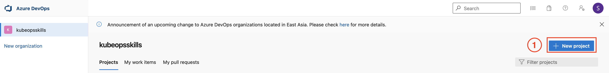
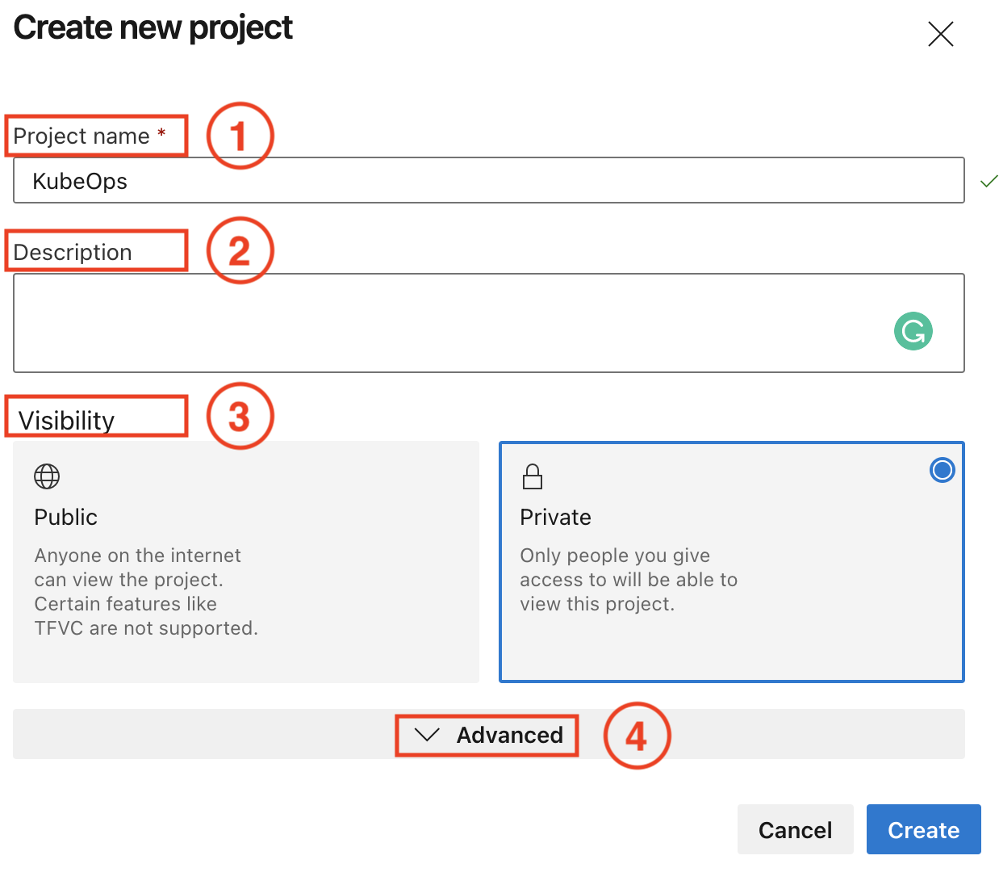
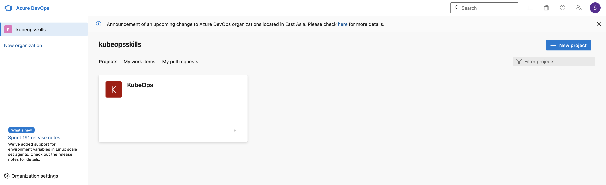
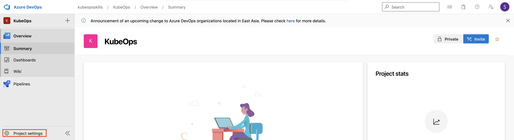
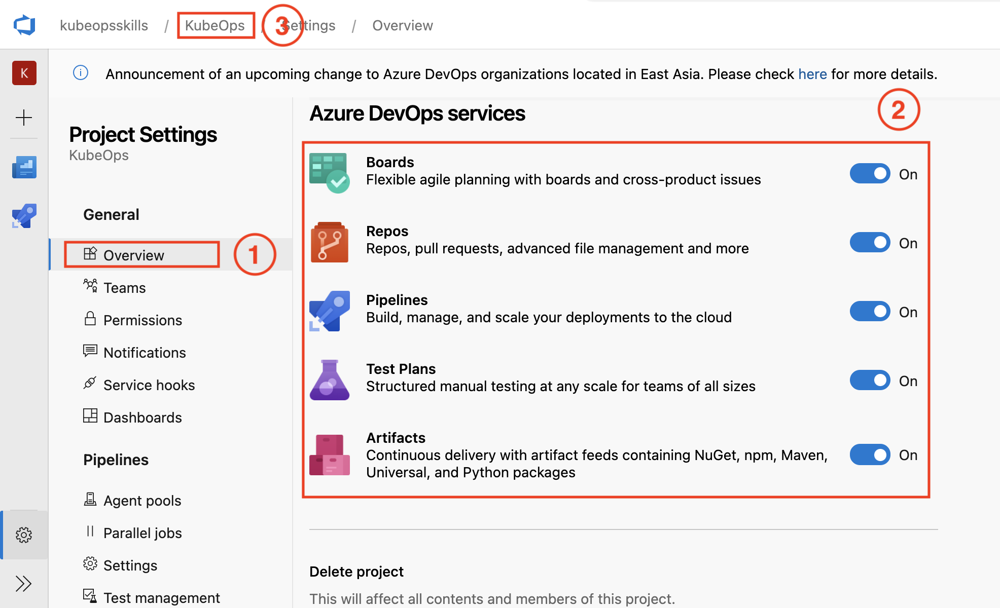
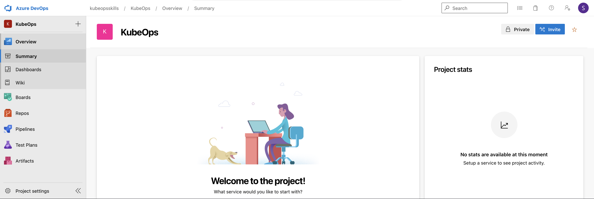

# Getting Started

## Create New Project

การเริ่มต้นใช้งาน AzureDevOps จำเป็นที่จะต้องสร้าง Project เพื่อสะดวกในการจัดการ Project ต่างๆ ซึ่งมีวิธีการสร้างดังนี้

### 1. สร้าง Project โดยการกดที่ `New Project` (รูปที่ 1) 

รูปที่ 1 สร้าง AzureDevOps Project

### 2. ใส่รายละเอียด Project ที่ต้องการ (รูปที่ 2) แล้วกดปุ่ม `Create` เพื่อสร้าง Project

รูปที่ 2 Create new project

**(1) Project Name:** ตั้งชื่อ Project

**(2) Description:** คำอธิบาย Project

**(3) Visibility:** สถานะในการมองเห็น `public`: เปิดให้ใครก็ได้, `private`: เฉพาะคนใน project

(4) Advanced: ตั้งค่าส่วนอื่นๆ

**ในตัวอย่างเราได้ทำการตั้งค่าตามนี้**

- **Project Name:** `kubeops`
- **Description:**  `-`
- **Visibility:** `default`

เมื่อสร้างเสร็จจะได้ Project ขึ้นมาดังรูปที่ 3

รูปที่ 3 Azure DevOps Project 

## Enable AzureDevOps Services

เมื่อเราทำการสร้าง Project เสร็จเรียบร้อยแล้วเราสามารถเลือกใช้งาน AzureDevOps services ต่างๆ ได้ดังนี้ 

### 1. เข้าไปที่ Project แล้วเลือก Project settings (รูปที่ 4)

รูปที่ 4 Project settings

### 2. เลือก Overview (1) เลื่อนมาในส่วน Azure DevOps services (2) ทำการเลือกเปิดใช้งาน services ต่างๆ ที่ต้องการ จากนั้นกด ชื่อ Project (3) เพื่อเริ่มต้นใช้งาน 

รูปที่ 5 การตั้งค่าใช้งาน service ด้วย Project setting

### 3. เริ่มต้นใช้งาน Project 

รูปที่ 6 Project หลังเปิดใช้งาน services ต่างๆ

