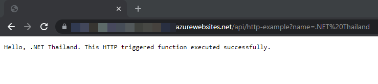
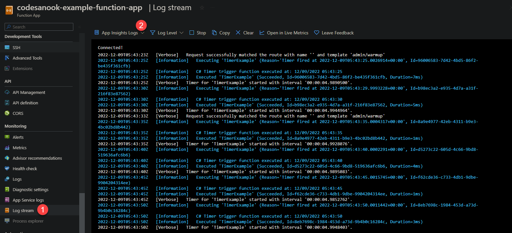

# Deploy Azure Function App

## Prerequisite
- [Install Azure CLI](/cloud-hosting/azure/azure-cli)
- [Install Azure Functions Core Tools](https://docs.microsoft.com/en-us/azure/azure-functions/functions-run-local?tabs=linux%2Ccsharp%2Cbash#v2)
- Azure Function App project, you can follow [this document](create-azure-functions-app-project) to create a new Azure Function App project.
- Azure Function App on Azure cloud, you can follow [this document](create-azure-functions-app-on-azure-cloud) to create a new Azure Function App on Azure cloud.

## Deploy Azure Function App to Azure cloud manually
- CD to root of a function project and build the project:
- If your project is TypeScript, use `yarn run build` to build to project.
- If your project is .NET, it will automatically build when you publish a function app.
- Publish your function app to Azure cloud with the following command:
  ```sh
  $ az login
  $ func azure functionapp publish <APP_NAME>
  ```
- Change `APP_NAME` to your function app's name that you have created in Azure cloud.
- After the app has been deployed, you should see `Deployment completed successfully` message in a terminal and list of functions in the app.

# Test the function app on Azure
- If it is HTTP function, copy an invoke URL from a terminal into a browser's address bar. The URL pattern should be `https://<APP_NAME>.azurewebsites.net/api/<FUNCTION_NAME>`.
- Append query string `?name=<YOUR_NAME>` and press enter to execute the function.
- You should see a message as `Hello <YOUR_NAME>` in a browser.
  
- If your app is timer trigger, you can view realtime log stream with the following commands:
  ```sh
  $ func azure functionapp logstream <APP_NAME>
  ```
- By default, your log messages does not show with `func azure functionapp logstream command`, you need to login to Azure portal.
  Then navigate to `Log stream > Change to Application Insights Logs` and a function app must has **enabled Application Insights** option.
  

# Useful resources
- [Azure Functions Core Tools reference](https://learn.microsoft.com/en-us/azure/azure-functions/functions-core-tools-reference?tabs=v2)
