# Azure Account, Support Options, Architecture, Service Guarantees, Manage Services Tools

Image from 
 <a href="https://mwesterink.wordpress.com/2018/09/20/case-study-availability-sets-vs-availability-zone/">mwesterink</a>

 ## Introduction to Microsoft Azure

 บริการทั้งหมดบน Azure จะทำงานอยู่บน Microsoft Data Center ที่ครอบคลุมพื้นที่ทั่วโลกจึงทำให้เรารองรับลูกค้าได้ทั้งในและต่างประเทศครับ

เราสามารถเลือกบริการที่เป็นและไม่ได้เป็นของ Microsoft นะครับ เช่นการใช้งาน Windows หรือ Linux Server รวมไปถึงความยืดหยุ่นในการเพิ่มลดบริการที่ใช้ให้ตอบโจทย์กับปริมาณงานตามสถานะการครับ

Azure มีบริการที่หลากหลายครอบคลุมที่ช่วยลดเวลาการพัฒนาระบบและค่าใช้จ่ายได้เยอะเลยครับ โดยก่อนที่เราจะเริ่มเลือกใช้บริการบน Azure เรามาเรียนรู้โครงสร้างการออกแบบ Data Center และการรับประกันในบริการต่างๆบน Azure กันครับ

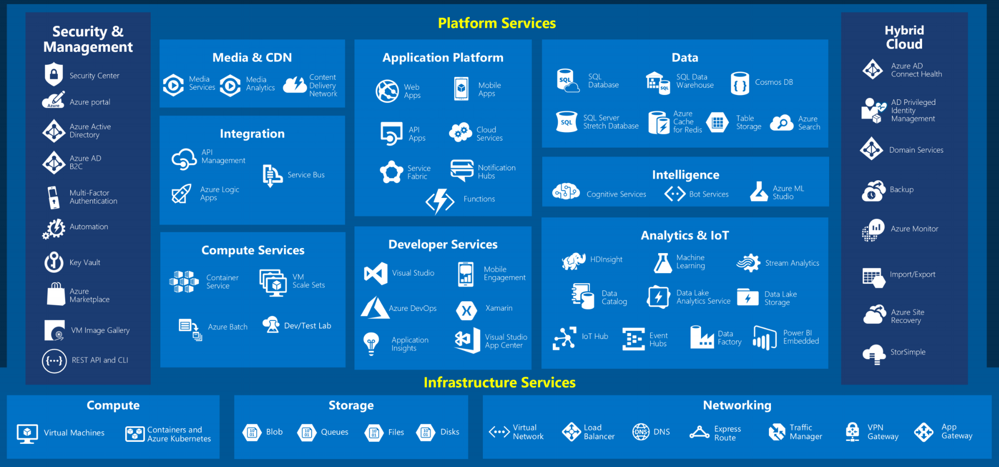

## Azure Service Guarantees

### Service-Level Agreements (SLAs)
เป็นการรับประกันการใช้บริการจาก Microsoft ให้ลูกค้าได้บริการที่มีคุณภาพในช่วงเวลาที่กำหนด เช่น ถ้าระบบล่มจะ Down นานขนาดไหนกว่าจะกลับมาใช้ได้อีกครั้ง

ถ้าเกิดเหตุการที่บริการไม่สามารถใช้งานได้เกินกว่าที่กำหนดใน SLAs นั้น ทาง Microsoft จะทำการชดเชยให้กับเราครับ

โดยแต่ล่ะ Service จะมี SLAs ที่ต่างกันน่ะครับซึ่งเป็นเรื่องสำคัญที่เราต้องคำนึงถึง SLAs มากๆเพื่อสามารถให้คำมั่นกับลูกค้าได้ถึงระยะเวลาที่ระบบสามารถดำเนินการ

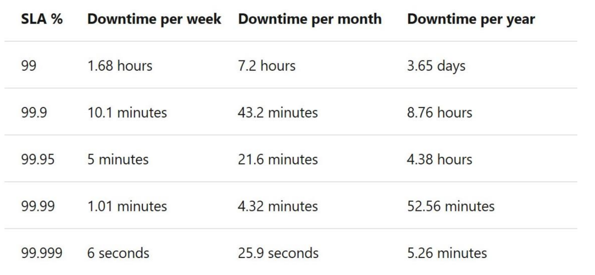

ตารางเปรียบเทียบ SLA กับ Downtime ในหน่วย สัปดาห์, เดือน และ ปี

### Compose SLAs across Services
การนำ SLAs ในแต่ละบริการมาใช้ร่วมกันนั้นทำให้เกิดการคำนวนหา SLAs สุทธิ ซึ่งเราเรียกว่า Composite SLAs

ตัวอย่างเช่น นำ SLAs 99.95% มาใช้ร่วมกันกับบริการ SLAs 99.99% จะได้ผลลัพธ์ดังนี้

> (SLAs 99.95%) x (SLAs 99.99%) = SLAs 99.94%

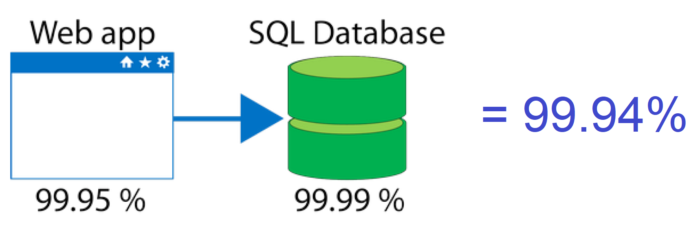

## Azure Architecture

### Azure Region
เป็นการรวมกลุ่มของ Microsoft Data Center ในเขตพื้นที่ต่างๆเข้าด้วยกัน โดยเราสามารถเพิ่มประสิทธิภาพการเข้าถึงบริการได้ด้วยการเลือก Region ที่ใกล้กับลูกค้าที่สุด

เราจำเป็นต้องศึกษาและคำนวนราคาก่อนเลือกใช้งานบริการใน Region นั้นเพราะราคาบริการในแต่ละ Region จะมีราคาที่ไม่เท่ากันน่ะครับ

> ตอนนี้ Azure มี Region ทั้งหมด 60+ Regions ที่ครอบคลุมพื้นที่ 140 ประเทศทั่วโลกครับ

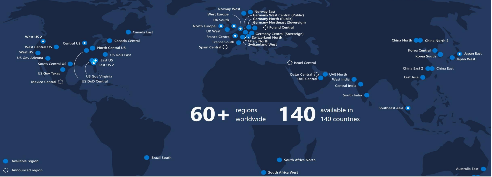

### Special Region
เป็น Regions พิเศษเพื่อเพื่อรองรับกับข้อกฏหมายและมาตราฐานสำหรับบางพื้นที่โดยเฉพาะ เราไม่สามารถเข้าไปใช้งาน Special Region เหล่านี้ได้

ตัวอย่างเช่น Region สำหรับรัฐบาลสหรัฐ (US DoD Central, US Gov Virginia, lowa) หรือ Region ใน เยอรมัน เช่น Germany Central/ Northeast/ West Central/ North

บาง Region ไม่ได้ดูแลโดย Microsoft โดยตรง เช่น 21Vianet ที่ดูแลให้กับจีนโดยเฉพาะ (China East, North)

### Geography
ย้อนกลับไปทบทวน Region กันก่อนน่ะครับ โดย Region คือกลุ่มของ Data Center

ส่วน Geography คือกลุ่มของ Region ครับซึ่งมีจุดประสงค์เพื่อการรองรับข้อกำหนดต่างๆในพื้นที่แต่ล่ะเขต และยังรวมไปถึงในเรื่องของการทำ Fault Tolerant ในระดับ Region ครับ โดยเมื่อมี Region ใด Region นึงใช้งานไม่ได้ ก็จะยังสามารถใช้ Region ใน Geography เดียวกันได้

มีทั้งหมด 4 Geography ได้แก่ Americas, Europe, Asia Pacific, Middle East and Africa

### Availability Sets
คือการจัดการบริการที่เราใช้ให้มี High Availability อยู่ภายใน Data Center เดียวกัน ซึ่งเน้นไปที่การป้องกัน Hardware Failure ครับ

โดย Azure จะทำสำรองบริการให้เราบน Physical สำรองใน Data Center เดียวกัน ถ้า Physical นึงไม่สามารถใช้งานได้ ก็ยังสามารถใช้งาน Physical อื่นที่อยู่ใน Data Center เดียวกันได้ครับ ได้ SLA 99.95% ครับ

สามารถใช้ได้กับบางบริการเท่านั้น เช่น Azure Virtual Machine

### Availability Zone
คือการจัดการ Data Center ที่อยู่กันคนละสถานที่ แต่อยู่ภายใน Region เดียวกัน โดยมีจุดประสงค์เพื่อสร้าง High Availability ในระดับ Data Center โดยถ้า Data Center ใดไม่สามารถใช้งานได้ ก็ยังสามารถใช้งาน Data Center อื่นที่อยู่ใน Region เดียวกันได้ SLA 99.99% ครับ

สามารถใช้ได้กับบางบริการเท่านั้น เช่น Azure Virtual Machine และมีบริการเฉพาะบาง Region เท่านั้น ได้แก่ Central US, East US 2, West US 2, West Europe, France Central, North Europe, Southeast Asia

### Region Pair
Region ใน Geography เดียวกันที่มีระยะห่างจากกันอย่างน้อย 300 Miles จะมีการ Pair กันเพื่อการทำการสำรองการใช้งานในระดับ Region

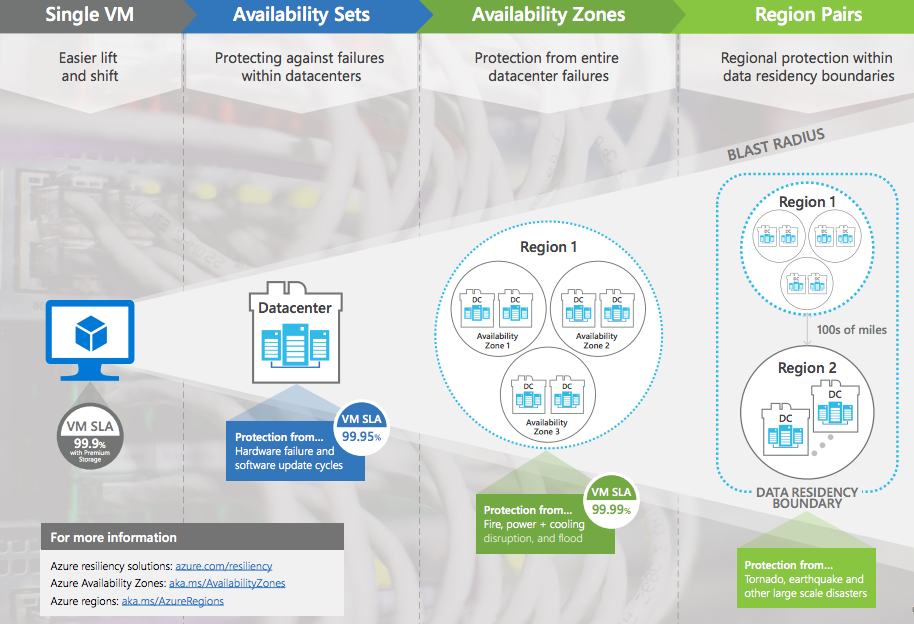

Image from <a href="https://mwesterink.wordpress.com/2018/09/20/case-study-availability-sets-vs-availability-zone/">mwesterink</a>

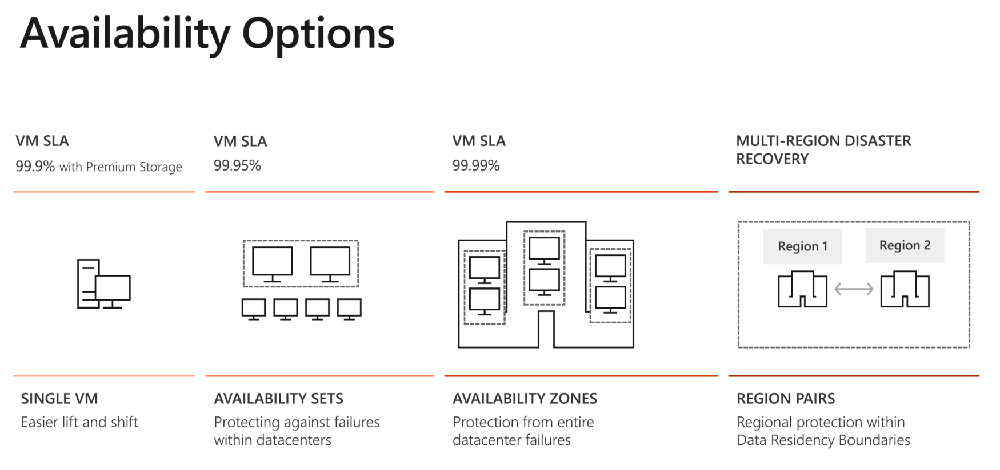

## Reliability

### Resiliency 
คือความสามารถในการกู้คืนระบบให้กลับมาทำงานได้ดังเดิมเมื่อระบบเกิดปัญหาขึ้น โดยหลีกเลี่ยงทั้ง Downtime และ Data Loss

Resiliency นั้นประกอบไปด้วยการทำ High Availability (เช่นการทำ Cluster ของ Web Server หลายๆเครื่อง ถ้าพังเครื่องนึงก็ยังมีเหลือเครื่องอื่น) และ Disaster Recovery (เช่นการ Backup และ Recovery จาก Site นึงไปอีก Site นึง)

## Azure Account
เราจำเป็นต้องใช้ Microsoft Account ในการเปิดใช้งาน Azure นะครับ

### Free Account
โดยในการใช้งานขั้นต้นเราสามารถเลือกสร้าง Free Account ได้จากลิ้งนี้นะครับ 

[ลิ้ง](https://azure.microsoft.com/en-us/free/)

โดยเราจะได้รับเครดิต 200 USD สำหรับทดลองใช้ Azure ใน 30 แรกนะครับ หลังจากนั้นเราจะสามารถใช้บางบริการ Free ได้อีก 12 เดือน และบางบริการที่ Free ตลอดไปครับ

Free Account จะถูกระงับสิทธิการเป็นสมาชิกเมื่อ Credit หมด หรือถึงระยะเวลาที่
กำหนดน่ะครับ

### Azure Subscription
คือพื้นที่ที่รวบรวมข้อมูลการใช้บริการบน Azure ซึ่งเราจะต้องจ่ายเมื่อถึงสิ้นเดือนครับ

รูปแบบการคิดเงินของ Azure จะเป็นแบบ Pay as You Go นะครับ คือจ่ายเท่าที่เราใช้ตามจริง โดยเราสามารถซื้อ Subscription ได้จาก 3 ช่องทางคือ
- ผ่าน Azure Portal (จ่ายผ่านบัตรเครดิต, PostPaid)
- ตัวแทนของ Microsoft (Volumn License, PrePaid)
- Partner ของ Microsoft (PostPaid)

เราวางแผนในการออกแบบ Subscription ได้หลายรูปแบบ เช่น แบ่งตามทีม, แบ่งตามองค์กร, แบ่งตามลูกค้า

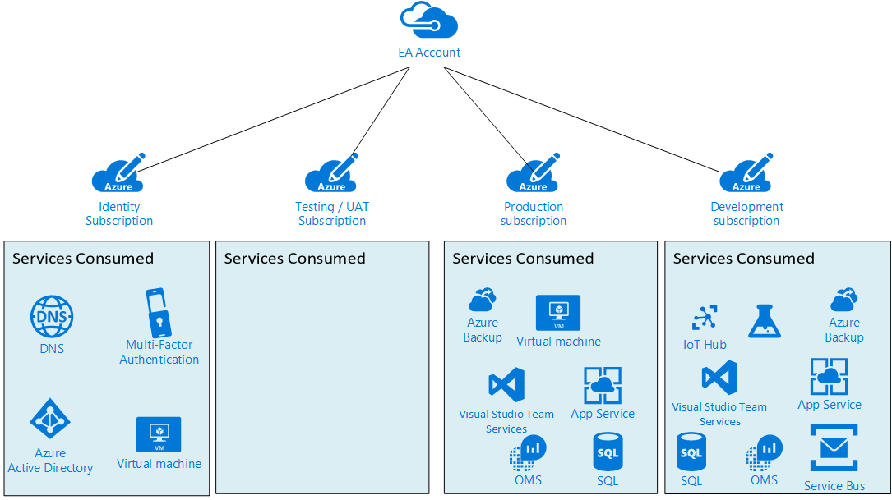

Azure Subscription Image from <a href="https://cloudinfrastructureservices.co.uk/choosing-the-best-azure-subscription-service-model/">cloudinfrastructureservices.co.uk</a>

### Azure Support Option
แนะนำบางส่วนของบริการ Support ฟรีที่น่าสนใจครับ
- Azure Service Health ช่วยแจ้งเตือนเราในกรณีที่บริการของเราอยู่ใน Data Center ที่มี Maintenance Plan
- Azure Advisor ที่ปรึกษาส่วนตัวที่น่ารักมากครับ ทั้งแนะนำ Security ที่ควรติดตั้ง, ปรับแต่ง Service ให้มี Performance ที่ดีขึ้น และยังรวมไปถึงตรวจสอบการใช้งานเพื่อแนะนำการปรับลดให้เหมาะสมกับงาน โดยชี้แจงเป็นค่าใช้จ่ายที่ลดลงให้เราเห็นชัดๆเลยครับ

ส่วนในแบบเสียเงินจะมีอยู่ 3 บริการคือ Developer, Standard, Professional Direct ถ้าสนใจรายละเอียดเพิ่มเติมดูได้ที่ Link นี้นะครับ

[ลิ้ง](https://azure.microsoft.com/en-us/support/plans/)

## Manage Services Tools
เราสามารถจัดการกับบริการบน Azure ได้หลายช่องทางไม่ว่าจะเป็น Web Application, Mobile Application และ Command Line น่ะครับ

### Azure Portal
เป็น Web UI ที่นิยมใช้งานกันมากครับ

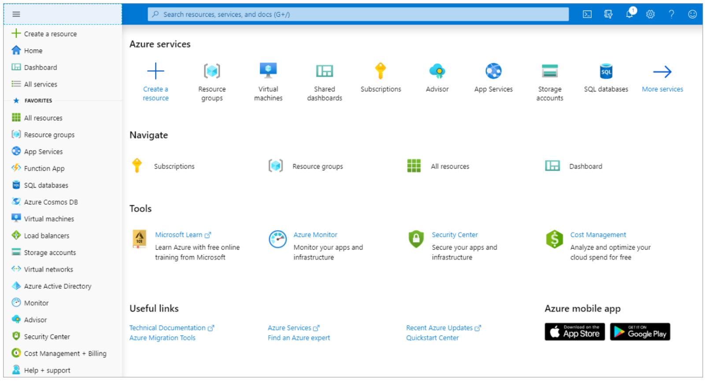

### Azure Powershell and Azure Command-Line Interface
เป็นการใช้งานแบบ Command-Line รันที่เครื่องของเรา

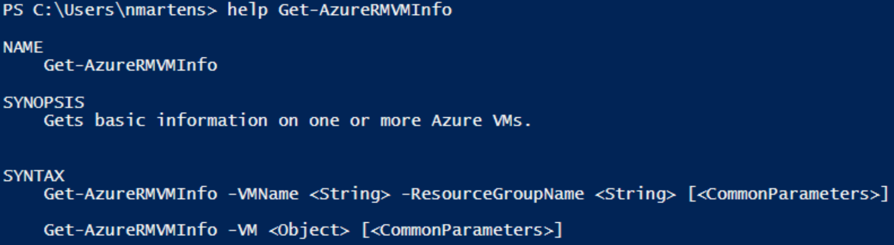

### Azure Cloud Shell
เป็นการใช้งาน Command-Line แบบรันบน Web UI

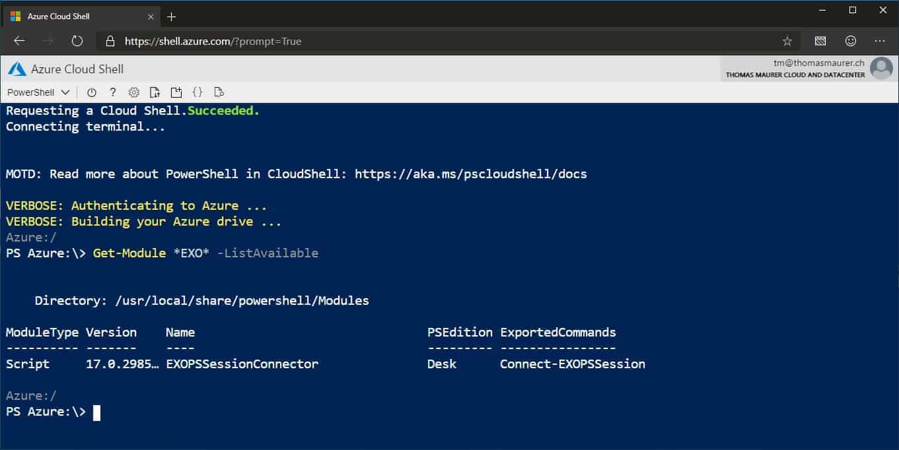

Azure Cloud Shell Image from  <a href="https://www.thomasmaurer.ch/2019/04/manage-office-365-exchange-online-from-cloud-shell/">thomasmaurer.ch</a>

### Azure Mobile App

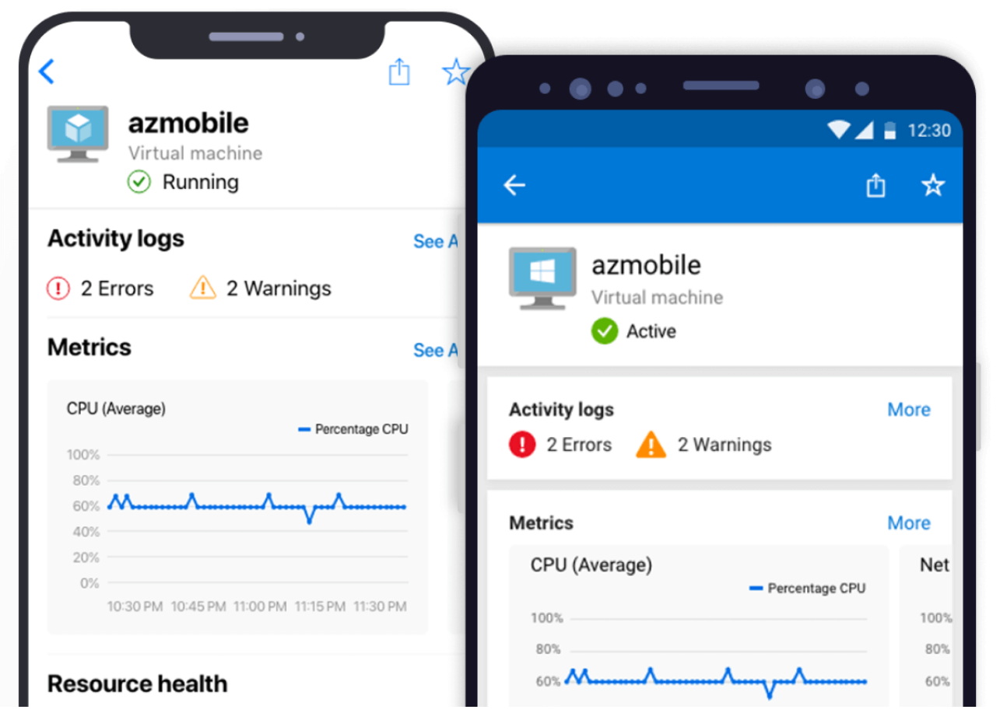

Azure Mobile App Image from  <a href="https://azure.microsoft.com/en-us/features/azure-portal/mobile-app/">azure.microsoft.com</a>

## เนื้อหาเพิ่มเติมที่เกี่ยวข้องกับการสอบครับ
- [Digital Skill — Azure Fundamentals (ภาษาไทย)](https://course.digitalskill.org/courses/course-v1:Microsoft+AZ-LEARN-0+2019/about)
- [ExamTopics — AZ-900 Exam Actual Questions](https://www.examtopics.com/exams/microsoft/az-900/view/1/)
- [Facebook — Data TH.com — Data Science ชิลชิล (ภาษาไทย)](https://www.facebook.com/datasciencechill/posts/872166769835048/)
- [Github — Microsoft Certified Azure Fundamentals (ภาษาไทย)](https://github.com/Tizcom/AZ-900/blob/main/Microsoft%20Azure%20Fundamentals_Handout.pdf)
- [Medium — Azure AZ-900 Exam Preparation Guide: How to pass in 3 days](https://medium.com/weareservian/azure-az-900-exam-preparation-guide-how-to-pass-in-3-days-dabf5534507a)
- [Medium — วีธีลงทะเบียนสอบ AZ-900 Online ที่บ้านด้วย Azure Exam Voucher](https://medium.com/@ponggun/%E0%B8%A7%E0%B8%B5%E0%B8%98%E0%B8%B5%E0%B8%A5%E0%B8%87%E0%B8%97%E0%B8%B0%E0%B9%80%E0%B8%9A%E0%B8%B5%E0%B8%A2%E0%B8%99%E0%B8%AA%E0%B8%AD%E0%B8%9A-az-900-online-%E0%B8%97%E0%B8%B5%E0%B9%88%E0%B8%9A%E0%B9%89%E0%B8%B2%E0%B8%99%E0%B8%94%E0%B9%89%E0%B8%A7%E0%B8%A2-azure-exam-voucher-c0d027253d34)
- [Medium — AZ-900 รีวิวแนวข้อสอบและวิธีลงสอบที่ศูนย์สอบ](https://link.medium.com/bX2BY3vin8)
- [Medium — AZ-900 สรุปละเอียดสุดๆ](https://medium.com/@manita.swwp/virtual-academy-for-microsoft-azure-fundamental-in-thai-language-f5354c2f8634)
- [Microsoft Learn-Azure Fundamentals](https://docs.microsoft.com/en-us/learn/paths/azure-fundamentals/)
- [Udemy — Microsoft Azure — Beginner’s Guide + AZ-900 (มีค่าใช้จ่าย)](https://www.udemy.com/course/microsoft-azure-beginners-guide)
- [WhizLabs — AZ-900 (มีค่าใช้จ่าย)](https://www.whizlabs.com/learn/course/microsoft-azure-az-900)
- [Workshop เล็กๆจาก Microsoft สำหรับ AZ-900 ครับผม](https://microsoftlearning.github.io/AZ-900T0x-MicrosoftAzureFundamentals/)

## สรุป

ในบทความนี้เราได้เรียนรู้คุณภาพในบริการของ Azure ผ่านเนื้อหา Region, Geography, Availability Option, Free Account, Subscription, Support Option, Manage Services Tools

โดยมีสิ่งที่เราต้องพิจารณาก่อนที่จะตัดสินใจเลือกใช้บริการดังนี้น่ะครับ
- เรื่องของ SLA เพื่อให้เราทราบว่าระยะเวลาที่ระบบเราทำงานได้ตามปรกติ
- เรื่องของตำแหน่งของบริการที่ตอบโจทย์ต่อ ความเร็วในการเข้าถึง, ความปลอดภัยและข้อระเบียบต่างๆของลูกค้า
- เรื่องของราคาของบริการต่างๆครับ