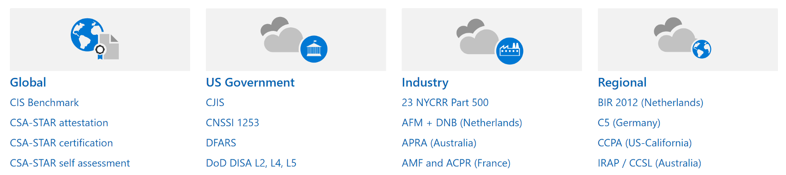
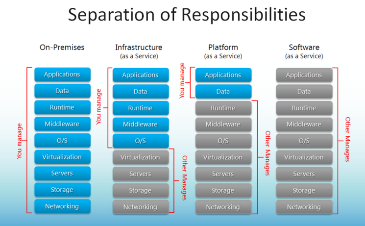
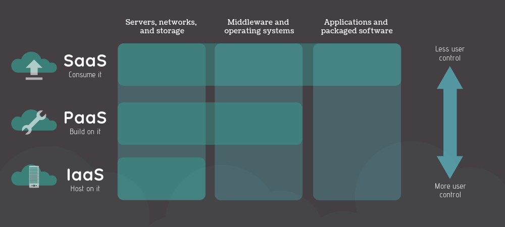
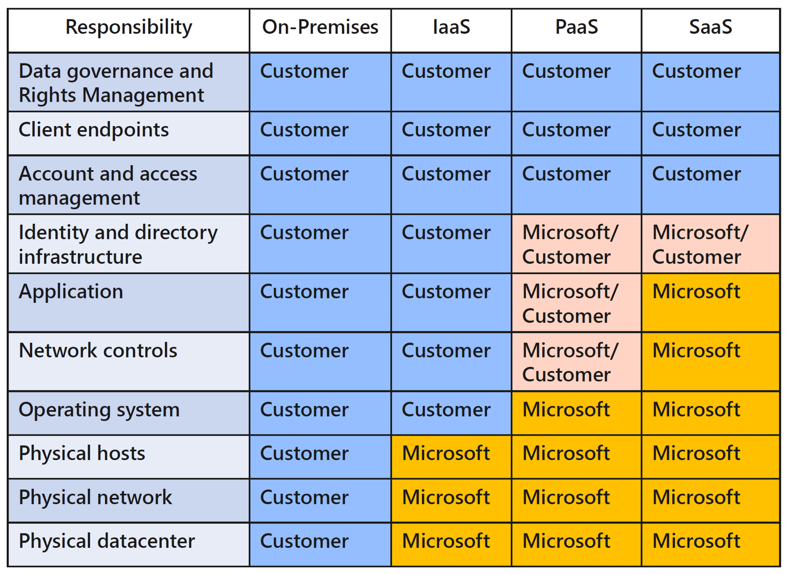
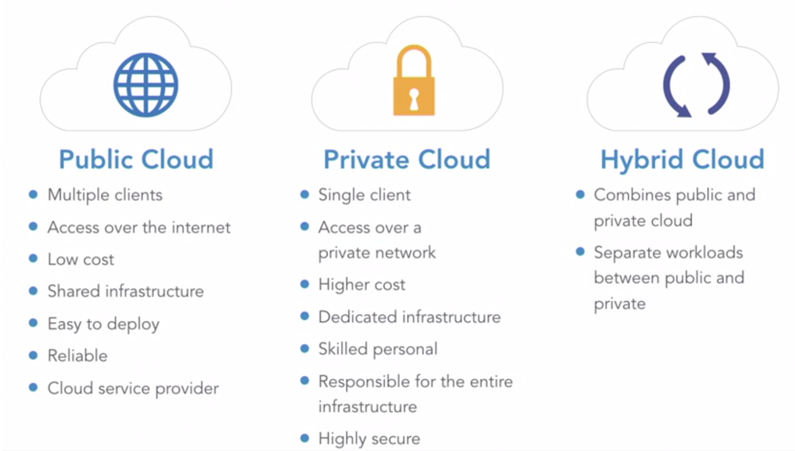

# Cloud Concepts — Principles of cloud computing

## Cloud Computing คืออะไร
คือบริการให้เช่าทรัพยากรบนคอมพิวเตอร์โดยที่เราจ่ายเงินค่าบริการเท่าที่ใช้ตามจริงเท่านั้น ตัวอย่างบริการก็เช่น
- Compute Power เช่น Linux Servers และ Web Applications
- Storage เช่น ไฟล์, ฐานข้อมูล
- Networking เช่น การเชื่อมต่ออย่างปลอดภัยระหว่าง Cloud Provider และผู้ใช้
- Analytics เช่น Visualizing Telemetry และ Performance Data

## Cloud Provider คืออะไร
คือผู้ให้บริการที่มีมาตรฐานทั้ง 5 คุณสมบัตินี้ครับ (Five characteristics of cloud computing) เช่น Microsoft, Amazon และ Google
- On-demand self-service
- Broad network access
- Multi-tenancy and resource pooling
- Rapid elasticity and scalability
- Measured service

ศึกษารายละเอียดเพิ่มเติมได้ [ที่นี้](https://www.saladpuk.com/basic/cloud101)

## ประโยชน์ของ Cloud Computing
- คุ้มค่าต่อการลงทุน (Cost-Effective)
- สามารถปรับขนาดได้ (Scalable)
- มีความยืดหยุ่นสูง (Elastic)
- เราดูแลเฉพาะพัฒนาระบบเพียงอย่างเดียว อย่างอื่นให้ Cloud - Provide ช่วยดูแลให้ (Current)
- น่าเชื่อถือ (Reliable)
- มีบริการครอบคลุมทั่วโลก (Global)
- มีความปลอดภัยสูง (Secure)

## Cloud Computing Compliance
Azure จริงจังกับเรื่องการของบริการที่ตอบรับกับ Compliance ต่างๆในระดับสากล ตัวอย่างเช่น GDPR ในสหภาพยุโรป, HIPAA, ISO และยังรวมไปถึง PDPA ของประเทศไทยด้วยน่ะครับ

ศึกษารายละเอียดเพิ่มเติมได้ที่ [ที่นี้](https://docs.microsoft.com/en-us/microsoft-365/compliance/offering-home?view=o365-worldwide)

ตัวอย่าง Compliance Offerings ครับ

## Economies of Scale
เป็นจุดเด่นของ Cloud Computing ที่ช่วยลดต้นทุนแต่ได้ผลลัพธ์ที่มากขึ้นในการดำเนินกิจการ โดยจะมีแผนการลงทุนสองรูปแบบที่เกี่ยวข้องได้แก่

### Capital Expenditure (CapEx)
เป็นการลงทุนค่าใช้จ่ายโดยทั่วไปของ On-Premises Data Center ที่ต้องลงทุนล่วงหน้าไปกับ Physical Infrastructure ซึ่งจะมีค่าใช้จ่ายล่วงหน้าที่สูงมาก เพราะต้องลงทุนกับ Server, Storage, Network, Backup, Disaster Recovery, Data Center Infrastructure และยังต้องการผู้เชี่ยวชาญในการดูแลอีกด้วยครับ

> ข้อดีของ CapEx คือทราบตัวเลขการลงทุนที่ชัดเจนว่าจะต้องจ่ายแค่ไหนและเมื่อไร เพราะสามารถวางแผนค่าใช้จ่ายได้ล่วงหน้าตั้งแต่เริ่มโครงการ หรือจะวางแผนตามรอบระยะเวลางบประมาณ

### Operational Expenditure (OpEx)
เป็นการลงทุนค่าใช้จ่ายบน Cloud Computing ซึ่งเป็นการลงทุนกับสินค้าและบริการเท่าที่ได้ใช้งานและไม่มีค่าใช้จ่ายล่วงหน้าเหมือน CapEx

ค่าบริการมีได้หลายรูปแบบ เช่น เรียกเก็บตามจำนวนผู้ใช้งาน, ตามระยะเวลาที่ใช้งาน CPU, RAM, IOPS หรือตามปริมาณพื้นที่จัดเก็บข้อมูล รวมไปถึงการคิดค่าบริการตามจำนวน bandwidth ที่ใช้ทั้งนี้ เช่น backup traffic และ data recovery traffic

เราจำเป็นต้องหมั่นตรวจสอบการใช้บริการอยู่เสมอ เพื่อให้ทรัพยากรได้ถูกใช้งานอย่างเต็มที่ไม่สูญเปล่าเพื่อประหยัดต้นทุนให้ได้มากที่สุด

> ข้อดีของ OpEx คือ ความสามารถในการปรับเปลี่ยนบริการให้สอดคล้องกับความต้องการที่เปลี่ยนแปลงทางธุรกิจที่มีความผันผวนได้เป็นอย่างดี สามารถทดลองใช้บริการบางอย่างเพื่อทดลองและสามารถยกเลิกได้เมื่อเสร็จสิ้น เพิ่มค่าใช้จ่ายเมื่อมีบริการที่ต้องการสูงขึ้น และลดได้เมื่อมีความต้องการที่ลดลง

## Cloud Service Models
คือรูปแบบการให้บริการบน Cloud Computing โดยจะขอพูดถึงเฉพาะรูปแบบที่ได้รับความนิยม 3 ประเภทน่ะครับ คือ IaaS, PaaS และ SaaS

ขอบคุณภาพจาก <a href="http://robertgreiner.com/">robertgreiner</a>

### On-Premise
เราจะต้องดูแลทุกอย่างเองทั้งหมด ทั้ง Hardware และ Software เช่น จะตั้งค่า Network ยังไง จะ Patch OS เมื่อไหร่ ติดตั้งโปรแกรมอะไรบ้าง ไฟดับ เน็ทหลุด harddisk เสีย ต่างๆ ซึ่งปัญหาพวกนี้เราต้องดูแลเองทั้งหมดเลย

### Infrastructure as a Service (IaaS)
เป็นรูปแบบการให้บริการพื้นฐานบน Cloud Cumputing เหมาะสำหรับสถานะการณ์ที่เราอยากจะได้เครื่องเซิฟเวอร์ไปใช้งาน แต่ให้ Cloud Provider เป็นผู้ดูแล Physical Infrastructure โดยเราจะเน้นไปที่ความยืดหยุ่นในการใช้งานที่มากที่สุด เช่นเราสามารถจัดการได้ว่าจะ Patch OS เมื่อไหร่ จะติดตั้งโปรแกรม หรือลง Antivirus โดย

เป็นรูปแบบที่ย้ายจาก On-Premises มาง่ายที่สุด (“Lift & Shift”)

> ตัวอย่างบริการ: Container Service, Virtual Machines, Azure Storage Accounts

### Platform as a Service (PaaS)
เป็นบริการมุ่งเน้นไปที่การอำนวยความสะดวกให้ผู้ใช้บริการสามารถสร้างแอปพลิเคชันได้อย่างรวดเร็ว โดยไม่ต้องกังวลกับ Infrastructure เพราะเราเน้นดูแค่ โปรแกรมและข้อมูลที่ใช้ ส่วนอื่นๆทาง Azure จะเป็นคนดูแลให้ครับ เช่น Windows เราก็ไม่ต้องคอย update หรือ จัดการกับความปลอดภัยต่างๆด้วยตัวเราเอง

> ตัวอย่างบริการ: Azure App Service, Azure SQL Database, Azure Functions

### Software as a Service (SaaS)
เป็นบริการที่มีไว้เพื่อเน้นให้ End Customer ใช้งานโปรแกรมที่อยู่บนคลาว์อย่างเดียวเท่านั้น ดังนั้นในระดับนี้เราจะไม่ต้องไปยุ่งอะไรกับการตั้งค่าเลย

> ตัวอย่างบริการ: Dynamics 365, Outlook, Office 365

ภาพเปรียบเทียบความสามารถในการจัดการ IaaS, PaaS, SaaS จาก <a href="https://www.nigelfrank.com/blog/iaas-vs-saas-vs-paas-a-guide-to-azure-cloud-service-types/">nigelfrank.com</a> ซึ่งเราจะพบว่า IaaS สามารถควบคุมได้มากสุด (แต่ก็แลกมากด้วยเวลาในการดูแลรักษาที่เยอะกว่า) จนมาถึง SaaS ที่ควบคุมได้น้อยแต่ใช้งานได้เร็วครับ

ถ้าใครสนใจเนื้อหาประเภทของ Cloud Services ต่างๆ ผมขอแนะนำบทความจาก [สลัดผัก](https://www.saladpuk.com/cloud/azure101/service-types) น่ะครับ

## Cloud Deployment Models

### Public Cloud
เป็นรูปแบบบริการที่นิยมมากที่สุด เพราะลูกค้าไม่ต้องดูแล Hardware เอง ให้ Cloud Provider เป็นผู้ดูแลและปรับปรุงให้ระบบทันสมัยอยู่ตลอดเวลา เข้าถึงด้วย Internet ช่วยลดต้นทุนโดยการแชร์ทรัพยากรกับผู้ใช้บริการรายอื่นๆ ด้วย

> ข้อดีของ Public Cloud คือ จ่ายค่าบริการตามการใช้งานจริง ไม่มี CapEx (ค่าใช้จ่ายล่วงหน้า), เราไม่ต้องรับภาระในการบำรุงรักษาหรืออัปเดตฮาร์ดแวร์ ทำให้ได้ ความสามารถในการปรับขนาดของบริการได้อย่างรวดเร็ว, ไม่จำเป็นต้องมีความรู้ในการติดตั้งและใช้งานมากนัก

### Private Cloud
เราติดตั้ง Cloud Environment ลงใน Data-center ของเราเอง จัดการกำหนดสิทธิการเข้าถึงทรัพยากรเพื่อใช้ภายในองค์กรของเรา โดยเราต้องรับภาระเพิ่มเติมในการการจัดซื้อและบำรุงรักษา Hardware และ Software

> ข้อดีของ Private Cloud คือ รองรับการทำงานในองกรณ์ได้เต็มที่, เชื่อมต่อด้วย Network ภายใน, ควบคุมจัดการทรัพยากรได้มาก, ทรัพยากรไม่ได้ถูกแบ่งกับบุคคลหรือองค์กรภายนอก

### Hybrid Cloud
เป็นรูปแบบผสมระหว่าง Public และ Private Cloud เพื่อปรับใช้ทรัพยากรที่ตอบโจทย์ขององค์กร
เช่น ในกรณีที่เราไม่สามารถนำข้อมูลบางอย่างขึ้น Public Cloud ได้เนื่องด้วยข้อจำกัดด้านกฎหมาย เช่น เรามีข้อมูลทางการแพทย์ที่ไม่สามารถเปิดเผยต่อสาธารณะได้ทำให้เราจำต้องเก็บไว้ในฐานข้อมูลส่วนตัวเท่านั้น เราจึง Host Web Application บน Public Cloud แต่เชื่อมต่อมายัง Database ที่มีความปลอดภัยสูงที่อยู่ใน Private Cloud ของเรา

> ข้อดีของ Hybrid Cloud คือ มีทางเลือกในการควบคุมต้นทุน (Economies of Scale) โดยเลือกใช้ Public Cloud ในกรณีที่ต้นทุนที่ต่ำกว่า หรือใช้ Private Cloud ในกรณีที่ Public Cloud มีต้นทุนที่สูงกว่า, รวมไปถึงการควบคุมด้าน Security, Compliance และ รองรับ Legacy Applications ขององค์กร

## เนื้อหาเพิ่มเติมที่เกี่ยวข้องกับการสอบครับ
- [Digital Skill — Azure Fundamentals (ภาษาไทย)](https://course.digitalskill.org/courses/course-v1:Microsoft+AZ-LEARN-0+2019/about)
- [ExamTopics — AZ-900 Exam Actual Questions](https://www.examtopics.com/exams/microsoft/az-900/view/1/)
- [Facebook — Data TH.com — Data Science ชิลชิล (ภาษาไทย)](https://www.facebook.com/datasciencechill/posts/872166769835048/)
- [Github — Microsoft Certified Azure Fundamentals (ภาษาไทย)](https://github.com/Tizcom/AZ-900/blob/main/Microsoft%20Azure%20Fundamentals_Handout.pdf)
- [Medium — Azure AZ-900 Exam Preparation Guide: How to pass in 3 days](https://medium.com/weareservian/azure-az-900-exam-preparation-guide-how-to-pass-in-3-days-dabf5534507a)
- [Medium — วีธีลงทะเบียนสอบ AZ-900 Online ที่บ้านด้วย Azure Exam Voucher](https://medium.com/@ponggun/%E0%B8%A7%E0%B8%B5%E0%B8%98%E0%B8%B5%E0%B8%A5%E0%B8%87%E0%B8%97%E0%B8%B0%E0%B9%80%E0%B8%9A%E0%B8%B5%E0%B8%A2%E0%B8%99%E0%B8%AA%E0%B8%AD%E0%B8%9A-az-900-online-%E0%B8%97%E0%B8%B5%E0%B9%88%E0%B8%9A%E0%B9%89%E0%B8%B2%E0%B8%99%E0%B8%94%E0%B9%89%E0%B8%A7%E0%B8%A2-azure-exam-voucher-c0d027253d34)
- [Medium — AZ-900 รีวิวแนวข้อสอบและวิธีลงสอบที่ศูนย์สอบ](https://link.medium.com/bX2BY3vin8)
- [Medium — AZ-900 สรุปละเอียดสุดๆ](https://medium.com/@manita.swwp/virtual-academy-for-microsoft-azure-fundamental-in-thai-language-f5354c2f8634)
- [Microsoft Learn-Azure Fundamentals](https://docs.microsoft.com/en-us/learn/paths/azure-fundamentals/)
- [Udemy — Microsoft Azure — Beginner’s Guide + AZ-900 (มีค่าใช้จ่าย)](https://www.udemy.com/course/microsoft-azure-beginners-guide)
- [WhizLabs — AZ-900 (มีค่าใช้จ่าย)](https://www.whizlabs.com/learn/course/microsoft-azure-az-900)
- [Workshop เล็กๆจาก Microsoft สำหรับ AZ-900 ครับผม](https://microsoftlearning.github.io/AZ-900T0x-MicrosoftAzureFundamentals/)

## สรุป
เนื้อหาในบทความนี้เป็นการปูทางความรู้ในด้าน Cloud Computing ที่ช่วยให้เราเข้าใจรูปแบบและบริการของ Cloud มากยิ่งขึ้นน่ะครับ เพื่อช่วยให้ผู้อ่านที่กำลังสนใจจะสอบ Microsoft Certified: Azure Fundamentals (AZ-900) ได้เข้าใจเนื้อหาเพื่อเตรียมตัวในการสอบมาก

ในบทถัดไปจะเป็นรายละเอียดที่เกี่ยวกับ Azure มากขึ้นน่ะครับ
- Introduction to Microsoft Azure
- Azure architecture and service guarantees
- Create an Azure account
- Manage services with the Azure portal
