# Core Cloud Services (Compute Options, Data Storage Options, Networking Options)

ในบทความนี้จะพาทำความเข้าใจในบริการหลักๆบน Azure ให้มีความคุ้นเคยกันมากขึ้นน่ะครับ เพราะว่าก่อนที่เราจะใช้บริการไหน เราควรทำความเข้าใจแนวคิดของบริการนั้นก่อนว่าทำมาเพื่อตอบโจทย์อะไร หลังจากนั้นเราจะพิจารณาถึงค่าใช้จ่ายเพื่อให้ทราบต้นทุนเบื้องต้นก่อนเลือกใช้บริการ

## Compute Options
Azure Compute คือทรัพยากรสำหรับการประมวลผลที่เราสามารถเลือกใช้งานได้ตามความต้องการ เช่นเรื่องของ CPUs บน VM, รัน Code โดยไม่ต้องเตรียม Infrastructure ด้วย Serverless Computing

ตัวอย่างบริการได้แก่ Virtual Machines, Containers, Azure App Service, Serverless Computing

Flowchart สำหรับการเลือกใช้ Azure Compute Options จาก  
 <a href="https://docs.microsoft.com/en-us/azure/architecture/guide/technology-choices/compute-decision-tree">docs.microsoft.com</a>

 ส่วนตัวประทับใจ Flowchart ในการเลือกใช้บริการ Computation บน Azure มากๆเลยครับ ที่รองรับได้หลากหลาย Platform มากขึ้น เช่น Spring, Openshift 

- ถ้าต้องการ Managed Service ต่างๆเช่น Monitoring, Backup, ก็สามารถเลือกใช้ Azure Spring Cloud, Azure Red Hat Openshift

- ถ้าไม่ต้องการ Managed Service ก็เลือกสร้าง VM แล้วจัดการทุกอย่างเองก็ได้ ยืดหยุ่นในการขึ้น Cloud มากๆเลยครับ

### Virtual Machines
เป็นบริการแบบ IaaS ที่อยู่คู่กับ Azure มานานที่ช่วยให้เราสามารถสร้าง Virtual Machine โดยเบื้องหลังจะมีการทำงานอยู่บน Hyper-V

เราสามารถเลือกขนาดความแรงของเครื่องที่เราต้องการและยังรวมไปถึง OS ต่างๆ ทั้ง Windows และ Linux

ซึ่งราคาก็จะคิดตามขนาดและ License ของ Software ที่เลือกน่ะครับ เช่น ถ้าผมเลือก VM ที่ติดตั้ง MSSQL Standard Edition เราก็จะต้องเสียค่า License ของ MSSQL Standard ด้วยน่ะครับ

ผมมีบทความที่เคยทำสรุปไว้เกี่ยวกับการใช้ VMs ในงานต่างๆน่ะครับเผื่อท่านใดสนใจครับผม

- [ติดตั้ง Microsoft SQL Server 2017 Express และ Windows Server 2019 บน Azure Virtual Machine](https://medium.com/@ponggun/%E0%B8%95%E0%B8%B4%E0%B8%94%E0%B8%95%E0%B8%B1%E0%B9%89%E0%B8%87-microsoft-sql-server-2017-express-%E0%B9%81%E0%B8%A5%E0%B8%B0-windows-server-2019-%E0%B8%9A%E0%B8%99-azure-virtual-machine-d3bc79062a09)
- [สร้าง Azure VM — Ubuntu ด้วย Free Credit จาก ม.ขอนแก่น (ไม่ต้องใช้บัตรเครดิต)](https://medium.com/@ponggun/%E0%B8%AA%E0%B8%A3%E0%B9%89%E0%B8%B2%E0%B8%87-azure-vm-ubuntu-%E0%B8%94%E0%B9%89%E0%B8%A7%E0%B8%A2-free-credit-%E0%B8%88%E0%B8%B2%E0%B8%81-%E0%B8%A1-%E0%B8%82%E0%B8%AD%E0%B8%99%E0%B9%81%E0%B8%81%E0%B9%88%E0%B8%99-%E0%B9%84%E0%B8%A1%E0%B9%88%E0%B8%95%E0%B9%89%E0%B8%AD%E0%B8%87%E0%B9%83%E0%B8%8A%E0%B9%89%E0%B8%9A%E0%B8%B1%E0%B8%95%E0%B8%A3%E0%B9%80%E0%B8%84%E0%B8%A3%E0%B8%94%E0%B8%B4%E0%B8%95-c6dd53843d04)
- [Clone Azure VM — Windows Srver 2016 แบบรวดเร็ว](https://medium.com/@ponggun/clone-azure-vm-windows-srver-2016-%E0%B9%81%E0%B8%9A%E0%B8%9A%E0%B8%A3%E0%B8%A7%E0%B8%94%E0%B9%80%E0%B8%A3%E0%B9%87%E0%B8%A7-5c342f54f2d6)
- [[บันทึกการใช้งาน] Azure DevTest Labs](https://medium.com/@ponggun/%E0%B8%9A%E0%B8%B1%E0%B8%99%E0%B8%97%E0%B8%B6%E0%B8%81%E0%B8%81%E0%B8%B2%E0%B8%A3%E0%B9%83%E0%B8%8A%E0%B9%89%E0%B8%87%E0%B8%B2%E0%B8%99-azure-devtest-labs-2b2603586568)

### Availability Sets
คือบริการที่ช่วยทำให้เราได้ระบบที่มี High Availability สำหรับปัญหาที่อาจจะเกิดขึ้นได้ใน Data Center เช่น Hardware พัง โดยระบบจะทำการสำรอง VMs ของเราไว้ในตู้ Rack ที่แตกต่างกัน แต่อยู่ใน Data Center เดียววันครับ

ถ้า VMs ตัวนึงพัง เราก็จะยังสามารถใช้ตัวสำรองต่อได้ครับ เราจะได้ SLA 99.95% จากบริการนี้ (ต้องเลือก Harddisk เป็น SSD ด้วยน่ะครับ ถ้า Harddisk ทั่วไปจะไม่ได้ SLA)

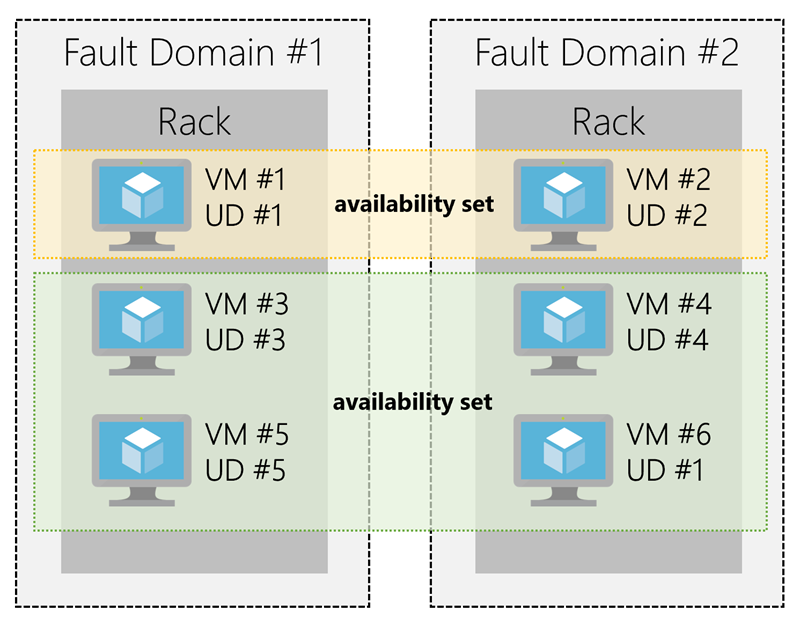

### Virtual Machine Scale Sets
คือบริการที่ช่วยให้เราสามารถเพิ่มประสิทธิภาพในการใช้งาน VMs โดยการเพิ่มจำนวนของ VMs ที่เหมือนกันขึ้นมาและกระจายการทำงานไปยัง VMs หลายๆเครื่องแทนที่จะทำแค่เครื่องเดียว

โดยข้อควรระวัง คือ การจัดการกับ Disk น่ะครับ เพราะการเพิ่มจำนวนเครื่อง ไม่ได้เป็นการ Sync ให้ข้อมูลใน Disk ของแต่ล่ะ VMs ให้มีจำนวนที่เท่ากันอยู่ตลอดเวลา

กล่าวคือ ณ ตอนแรกที่เริ่มสร้างเครื่องที่ 2 นั้น จะได้ทุกอย่างเหมือนเครื่องแรกเลยครับ แต่หลังจากนั้นก็จะทำงานแยกกัน เพราะงั้นจึงไม่เหมาะกับการใช้ ScaleOut Database น่ะครับ เหมาะกับการใช้ ScaleOut Web App มากกว่าครับ (แบบ Stateless)

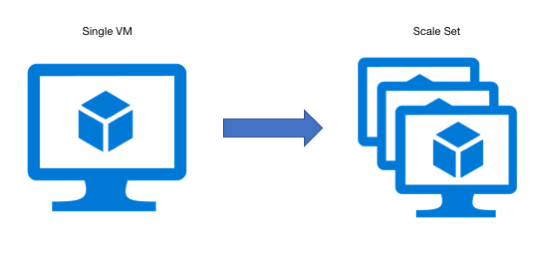

Virtual Machine Scale Sets จาก 
 <a href="https://cloudmonix.com/blog/azure-virtual-machine-scale-sets/">cloudmonix.com</a>

### Azure App Service
คือบริการแบบ PaaS ที่ช่วยให้เราสามารถนำ Code หรือ Container ของเราไปรันเป็น Web App, RESTful API, Background Jobs ของเราได้โดยที่ไม่ต้องกังวลในเรื่องของ Infrastructure เลย และยังมาพร้อมกับคุณสมบัติในเรื่องของ High Availability และ Auto ScaleOut อีกด้วยครับ การทำ CI/CD ก็ทำได้สะดวกมากเพราะมีวิธีที่รองรับหลากหลายรูปแบบ

รวมไปถึงยังมี Runtime ที่เตรียมมาให้พร้อมใช้งานในหลายภาษา เช่น Python, Node.js, PHP, ASP.Net/ASP.Net Core, Java เราแค่นำ Code ในภาษาเหล่านี้มาติดตั้งที่ App Service ก็พร้อมทำงานเลยครับ

ผมมีบทความที่เคยทำสรุปไว้เกี่ยวกับการใช้ App Service เบื้องต้นไว้ เผื่อท่านใดสนใจน่ะครับ
- [สร้าง Azure App Service ฟรี ใน 10 นาที](https://medium.com/@ponggun/%E0%B8%AA%E0%B8%A3%E0%B9%89%E0%B8%B2%E0%B8%87-azure-app-service-%E0%B8%9F%E0%B8%A3%E0%B8%B5-%E0%B9%83%E0%B8%99-10-%E0%B8%99%E0%B8%B2%E0%B8%97%E0%B8%B5-e3a5c25ef749)
- [แชร์ Mock-up ให้กับทีมแบบไม่มีค่าใช้จ่ายด้วย Pencil + Azure](https://medium.com/@ponggun/%E0%B9%81%E0%B8%8A%E0%B8%A3%E0%B9%8C-mock-up-%E0%B9%83%E0%B8%AB%E0%B9%89%E0%B8%81%E0%B8%B1%E0%B8%9A%E0%B8%97%E0%B8%B5%E0%B8%A1%E0%B9%81%E0%B8%9A%E0%B8%9A%E0%B9%84%E0%B8%A1%E0%B9%88%E0%B8%A1%E0%B8%B5%E0%B8%84%E0%B9%88%E0%B8%B2%E0%B9%83%E0%B8%8A%E0%B9%89%E0%B8%88%E0%B9%88%E0%B8%B2%E0%B8%A2%E0%B8%94%E0%B9%89%E0%B8%A7%E0%B8%A2-pencil-azure-2142ee7d85f8)
- [สาธิตการติดตั้ง Azure — PaaS สำหรับ การ Migrate ASP.Net Core 2 และ Entity Framework Core](https://medium.com/@ponggun/%E0%B8%AA%E0%B8%B2%E0%B8%98%E0%B8%B4%E0%B8%95%E0%B8%81%E0%B8%B2%E0%B8%A3%E0%B8%95%E0%B8%B4%E0%B8%94%E0%B8%95%E0%B8%B1%E0%B9%89%E0%B8%87-azure-paas-%E0%B8%AA%E0%B8%B3%E0%B8%AB%E0%B8%A3%E0%B8%B1%E0%B8%9A-%E0%B8%81%E0%B8%B2%E0%B8%A3-migrate-asp-net-core-2-%E0%B9%81%E0%B8%A5%E0%B8%B0-entity-framework-core-6196eaeaefec)

### Azure App Service Plan
เป็นบริการที่เสมือนกับให้เราเลือก Web Server เพื่อนำมาการประมวลผล App Service ที่ต้องการ

โดยเราจะต้องเลือกว่าจะเลือก Plan บน OS ไหน (Windows, Linux) เพราะจะมีผลกับทั้งราคาและบริการเสริมที่แตกต่างกัน

เรายังสามารถเลือกขนาดของ Web Server เพื่อให้ตอบโจทย์ต่อการทำงานเช่น Development/Test เราอาจจะเลือก Plan ที่มีไม่แรงมาก ซึ่งก็จะมีค่าใช้จ่ายที่ถูกกว่าหรือเลือกขนาดที่ใหญ่ขึ้นเพื่อใช้เป็น Production ต่อไป

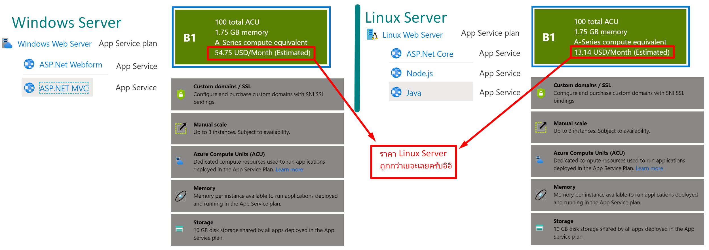

### Containers
ตัว Container นั้นเป็น Technology ที่ช่วยในการจัดการ Environment ในคอมพิวเตอร์หลายๆเครื่องให้เหมือนกันและทำงานได้ผลลัพธ์ในแบบเดียวกันครับ

โดยจะทำการรวม Code, Runtime, System Tools/Libraries/Settings ที่เกี่ยวข้องเข้าด้วยกัน (เราเรียกว่า Container Image) และนำ Container Image ไปทำงานบนคอมพิวเตอร์เครื่องอื่นๆที่ติดตั้ง Container Technology ครับ

เมื่อ Container Image ถูกนำมารันที่เครื่องจะกลายเป็น Container น่ะครับ

โดย Docker ได้รับความนิยมมากที่สุดในตอนนี้

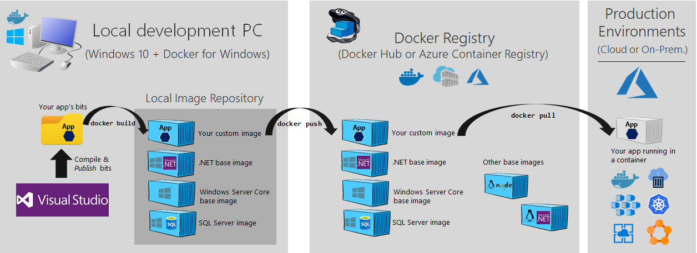

Docker Container from  
 <a href="https://github.com/dotnet-architecture/eShopModernizing/wiki/03.-Publishing-your-Windows-Container-images-into-a-Docker-Registry">dotnet-architecture</a>

### Azure Container Instance (ACI)
เป็นบริการที่ทำให้เราสามารถนำ Container Image มาทำงานได้อย่างรวดเร็ว ไม่จำเป็นต้องตั้งค่าอะไรเพิ่มมากนัก

โดยค่าใช้จ่ายจะคิดตามปริมาณการใช้งานจริง เช่นเราเปิดระบบไว้ 30 วัน แต่มีคนใช้งาน Web เราแค่ 1 วัน เราก็เสียค่าใช้จ่ายแค่ 1 วันน่ะครับ

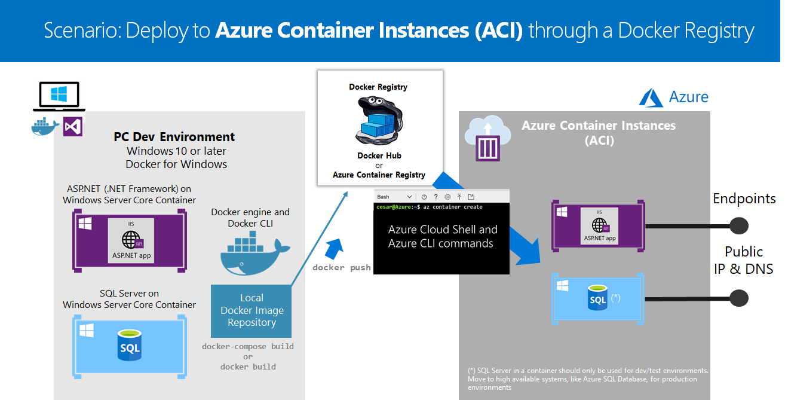

Azure Container Instance (ACI) จาก  
 <a href="https://github.com/dotnet-architecture/eShopModernizing/blob/master/README.md">dotnet-architecture </a>

### Azure App Service for Containers
เป็นบริการที่คล้ายกับ Azure Container Instance (ACI) แต่จะต่างกันตรงที่การจัดการจะเป็นในมุมของการใช้ Web App Service เช่นถ้าอยาก Scaleup ก็ต้องไปเพิ่ม Size ของ App Service Plan

ในเรื่องของค่าใช้จ่ายก็จะแตกต่างจาก Azure Container Instance (ACI) เพราะว่า ใช้รูปแบบ Azure App Service Plan ที่จะเหมาจ่ายรายเดือนตาม Plan ที่เราเลือกครับ ถึงลูกค้าจะใช้งานหรือไม่ได้ใช้งาน Web เราก็จะมีรายจ่ายคงที่ตามเดิมน่ะครับ

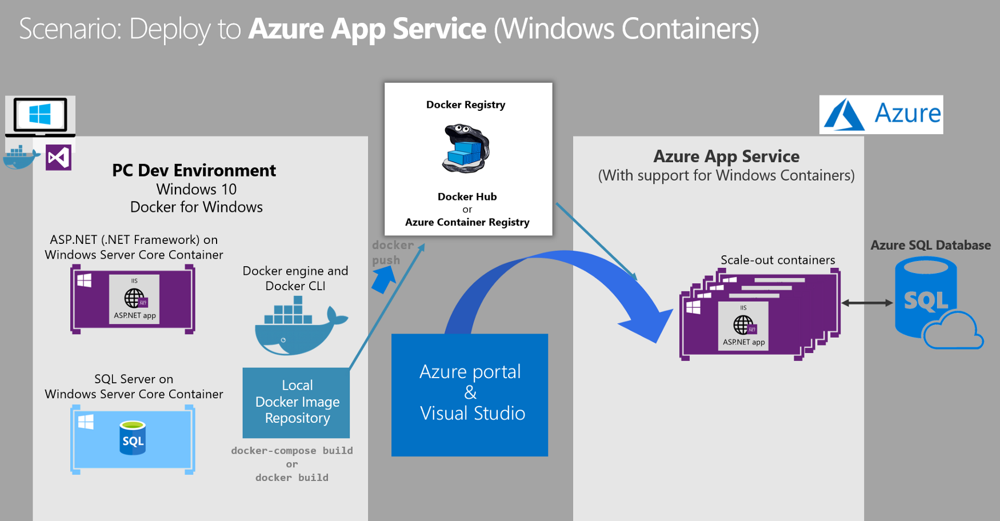

Azure Web App Service for Containers จาก 
 <a href="https://github.com/dotnet-architecture/eShopModernizing/blob/master/README.md">dotnet-architecture</a>

### Azure Kubernetes Service (AKS)
เป็นบริการที่ช่วยให้เราจัดการกับการ ScaleOut Container Images ให้มีหลายๆ Instances ได้อย่างสะดวก (เราเรียก Technology นี้ว่า Container Orchestration) ด้วย Kubernetes (K8s) ที่รันอยู่บน Azure ครับ

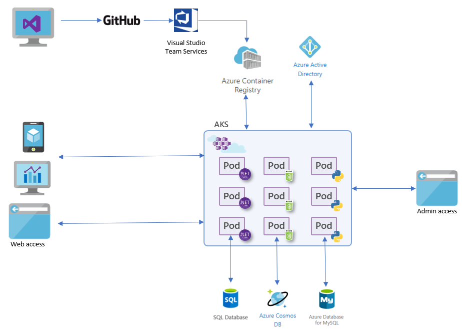

Azure Kubernetes Service (AKS) จาก 
 <a href="http://ilikesqldata.com/orchestrating-production-grade-workloads-with-azure-kubernetes-service/
">ilikesqldata.com</a>

### Serverless Computing
จะเป็นบริการที่เราสนใจเฉพาะการพัฒนา Code ที่จะนำมารันเท่านั้น ในส่วนของ Infrastructure นั้น Azure จะดูแลให้

โดยมีส่วนที่ต่างจาก App Service คือเราจะไม่สามารถปรับแต่งอะไรได้มากนัก เพราะทาง Azure จะทำให้อัตโนมัติ เช่นเรื่องของ Scaling

และการคิดเงินจะคิดตามปริมาณการใช้งานจริง ซึ่งจะแตกต่างจาก App Service ที่คิดเหมาจ่ายตาม Package รายเดือน (App Service Plan) เพราะงั้นถ้าระบบมีผู้ใช้งานน้อยค่าใช้จ่ายก็จะถูกลงมากครับ

#### Azure Function
เป็น Serverless Computing ในรูปแบบ Code-Based ที่รองรับหลายๆภาษาน่ะครับ โดยการทำงานจะขึ้นอยู่กับ Event ที่เราเลือกไว้

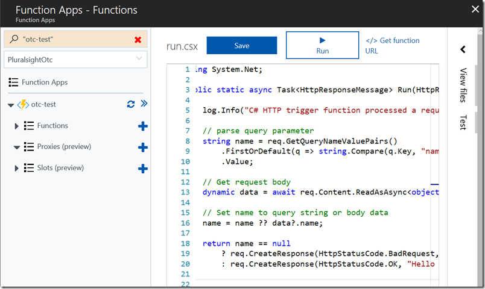

Azure Function จาก 
 <a href="https://odetocode.com/blogs/scott/archive/2017/07/10/thoughts-on-azure-functions-and-serverless-computing.aspx">odetocode.com</a>

#### Azure Logic App
เป็น Serverless Computing ในรูปแบบ Web-Based Designer ที่เราสามารถเลือกขั้นตอนการทำงานได้ในรูปแบบ Worflow ได้โดยที่เราไม่ต้องเขียน Code นะครับ

ตัวอย่างการใช้งานเช่น เขียนเงื่อนไขให้ส่ง Email ทุกครั้งที่มี Twitter จาก Microsoft

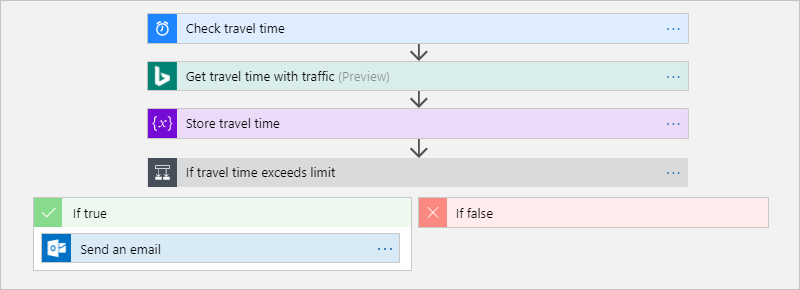

Azure Logic App จาก 
 <a href="https://docs.microsoft.com/en-us/azure/logic-apps/tutorial-build-schedule-recurring-logic-app-workflow">docs.microsoft.com</a>

## Data Storage Options
เป็นบริการที่เกี่ยวกับการจัดเก็บข้อมูลที่มาพร้อมกับกับบริการเสริมที่ช่วยให้เราจัดเก็บข้อมูลได้อย่างมีประสิทธิภาพ

ตัวอย่างเช่น
- การเข้ารหัสข้อมูล (Encryption)
- การสำรองข้อมูล (Backup)
- การสำรองข้อมูลไปยัง Data Center อื่นเพื่อ High Availability(Replication)
- รองรับข้อมูลหลายรูปแบบ เช่น Text/Imag/Vdeo File, SQL, NoSQL
- รองรับการใช้งาน Disk ทั้งก้อน (Virtual Disk)
- ควบคุมค่าใช้จ่ายได้ด้วยการกำหนดการเข้าถึงข้อมูล (Storage Tiers) เช่น ถ้าเป็นข้อมูลที่เข้าถึงบ่อยๆ เราควรเป็นเป็น Hot Tier ที่จะใช้เวลาในการอ่านข้อมูลได้เร็ว, แต่ถ้าข้อมูลที่เอาไว้เก็บรักษาแต่ไม่ค่อยได้เข้าถึงเราควรเลือกแบบ Cool Tier ซึ่งจะมีราคาที่ถูกกว่า แต่จะใช้เวลาในการอ่านข้อมูลนานกว่า

### Type of Data

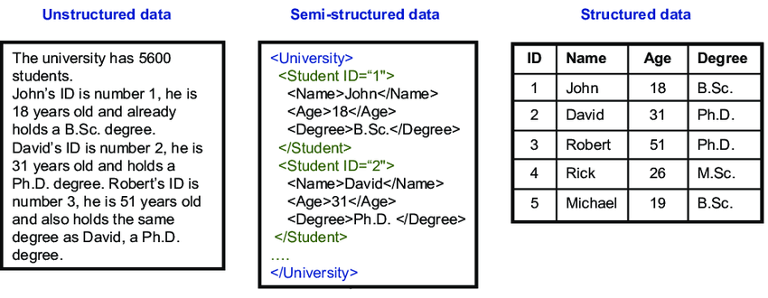

Type of Data จาก 
 <a href="https://www.researchgate.net/figure/Unstructured-semi-structured-and-structured-data_fig4_236860222">researchgate.net</a>

#### Structured Data
เป็นข้อมูลในรูปแบบที่มีโครงสร้าง (Schema) ทำให้ข้อมูลที่จัดเก็บจะมีจำนวน Fields, Properties ที่เท่ากัน

ตัวอย่างเช่นการเก็บข้อมูลในฐานข้อมูล แบบ Relational Database เช่น Microsoft SQL Server, MySql, PostgreSQL

ข้อดีคือทำการสืบค้นข้อมูลได้ง่าย แต่ก็แลกมาด้วยโครงสร้างการจัดเก็บข้อมูลที่ซับซ้อน

#### Semi-structured Data
จะเป็นโครงสร้างในรูปแบบลำดับขั้น (Hierarchy) ที่ไม่ได้มีโครงสร้างที่ชัดเจนแบบ Table, Row เหมือน Structured Data

ใช้ tags หรือ keys ในการจัดการข้อมูล ตัวอย่างเช่น NoSQL เช่น Redis, Cassandra, MongoDB, Elasticsearch

ข้อดีคือมีความยืดหยุ่นในการปรับเปลี่ยนการจัดเก็บข้อมูล, ทำ Cluster ได้ง่าย แต่ก็แลกมาด้วยการสืบค้นข้อมูลที่ซับซ้อนขึ้น

#### Unstructured Data
คือข้อมูลที่ไม่มีโครงสร้างทำให้ไม่มีข้อจำกัดในการจัดเก็บข้อมูล ตัวอย่างเช่น Text/PDF/Document/Image/Video File

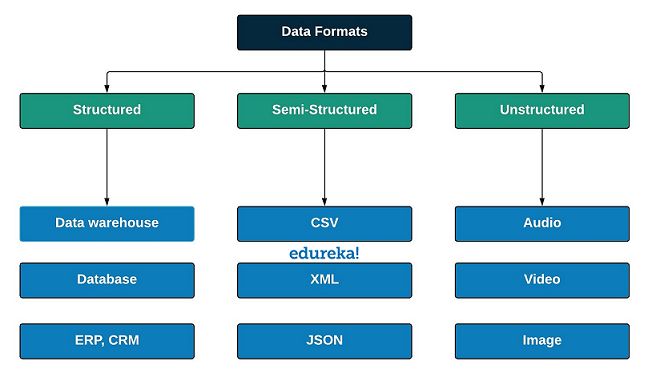

Type of Data จาก 
 <a href="https://www.edureka.co/blog/big-data-testing/">edureka.co</a>

### Azure SQL Database
คือบริการแบบ PaaS ที่ช่วยจัดเก็บข้อมูล Structured Data ด้วย Microsoft SQL Server Database (ขอเรียกย่อๆว่า MSSQL น่ะครับ)

โดยมีบริการเสริมที่ช่วยให้เราดูแลข้อมูลได้อย่างมีประสิทธิภาพ เช่น การเพิ่มลดขนาดในการประมวลผลของ Database Server, การทำ Failover Cluster, การสำรองและกู้คืนข้อมูล (Backup & Recovery)

ที่เทพมากๆคือ Azure มี AI ที่ช่วยตรวจสอบการทำงานของฐานข้อมูลเราและให้คำแนะนำเพิ่มเติมครับ เช่นเราควรจะเพิ่ม Index ให้ Field นี้เป็นต้น

ถ้าลูกค้าที่ใช้ MSSQL อยู่แล้วสามารถที่จะนำฐานข้อมูลขึ้นมาใช้บน Azure SQL Database ได้สะดวกมากครับ แต่จะติดข้อจำกัดบางอย่างที่ทำให้ไม่สามารถเอาขึ้นได้ เช่นข้อจำกัดในการ Join ข้อมูลข้าม Database, การใช้ Link Server และอาจจะต้องพิจารณาบริการอื่นแทนเช่น MSSQL on VM, SQL Managed Instance

ผมมีสรุปบทความตัวอย่างการใช้งาน SQL Database เบื้องต้นกับงานจริงครับ เผื่อเป็นประโยชน์น่ะครับ

- [สาธิตการติดตั้ง Azure — PaaS สำหรับ การ Migrate ASP.Net Core 2 และ Entity Framework Core](https://medium.com/@ponggun/%E0%B8%AA%E0%B8%B2%E0%B8%98%E0%B8%B4%E0%B8%95%E0%B8%81%E0%B8%B2%E0%B8%A3%E0%B8%95%E0%B8%B4%E0%B8%94%E0%B8%95%E0%B8%B1%E0%B9%89%E0%B8%87-azure-paas-%E0%B8%AA%E0%B8%B3%E0%B8%AB%E0%B8%A3%E0%B8%B1%E0%B8%9A-%E0%B8%81%E0%B8%B2%E0%B8%A3-migrate-asp-net-core-2-%E0%B9%81%E0%B8%A5%E0%B8%B0-entity-framework-core-6196eaeaefec)
- [ตรวจสอบ Query บน Azure Database ด้วย SQL Server Profiler for Azure Data Studio](https://medium.com/@ponggun/%E0%B8%95%E0%B8%A3%E0%B8%A7%E0%B8%88%E0%B8%AA%E0%B8%AD%E0%B8%9A-query-%E0%B8%9A%E0%B8%99-azure-database-%E0%B8%94%E0%B9%89%E0%B8%A7%E0%B8%A2-sql-server-profiler-for-azure-data-studio-873cd1234268)
- [ติดตั้ง Microsoft SQL Server 2017 Express และ Windows Server 2019 บน Azure Virtual Machine](https://medium.com/@ponggun/%E0%B8%95%E0%B8%B4%E0%B8%94%E0%B8%95%E0%B8%B1%E0%B9%89%E0%B8%87-microsoft-sql-server-2017-express-%E0%B9%81%E0%B8%A5%E0%B8%B0-windows-server-2019-%E0%B8%9A%E0%B8%99-azure-virtual-machine-d3bc79062a09)

### Azure Cosmos DB
คือบริการจัดเก็บข้อมูลแบบ Semi-structured Data โดยมีความสามารถพิเศษคือเป็น Distributed Database ที่กระจายการทำงานไปยังหลายๆ Database ซึ่งทำให้ได้ High Availability เหมาะสำหรับการจัดการข้อมูลแบบ Real-Time มากครับ

### Azure Data Lake Storage (ADLS)
บริการจัดเก็บและวิเคราะห์ข้อมูลในระดับ Big Data โดยเฉพาะครับ

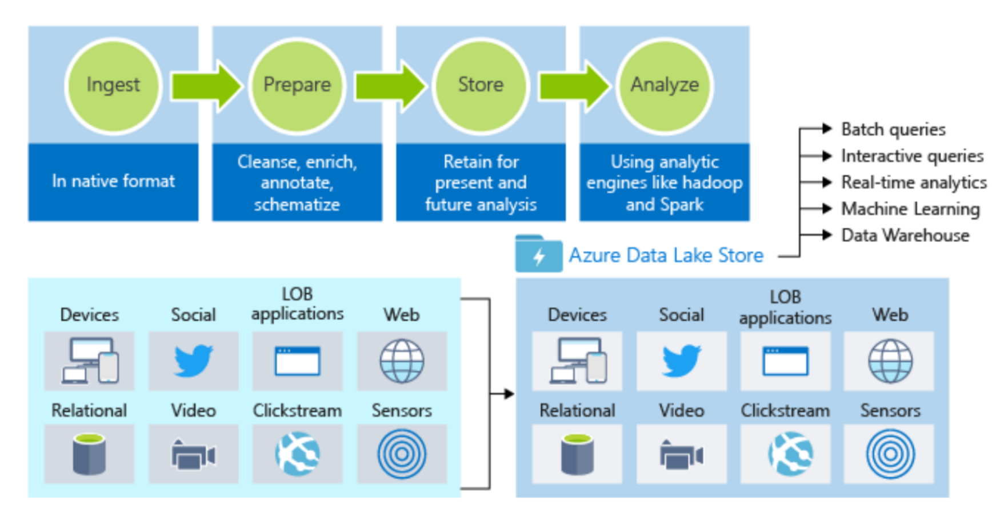

### Azure Storage
คือบริการสำหรับเก็บข้อมูลต่างๆ เช่น ไฟล์รูปภาพ, ไฟล์วีดีโอ, SMB file share ซึ่งจะถูกแบ่งออกเป็น 4 ประเภท คือ BLOB, File Share, Table, Queue

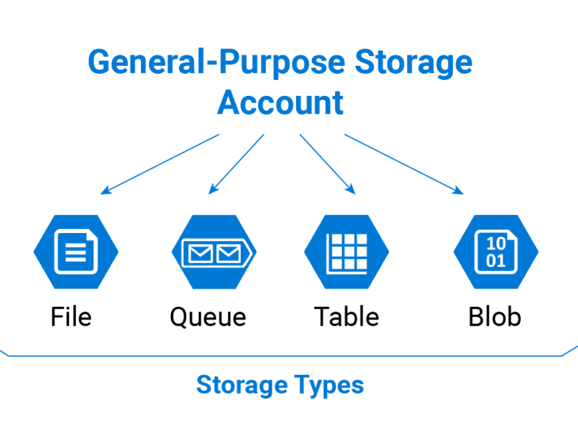

Azure Storage Account จาก 
 <a href="https://abouconde.com/2018/12/12/create-an-azure-storage-account/">abouconde.com</a>

#### Azure Blob Storage
บริการจัดเก็บ Unstructured Data ตัวอย่างเช่น Text / PDF / Document / Image / Video File

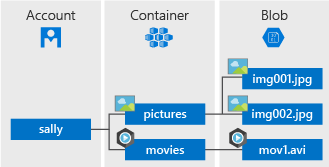

Azure Blob Storage จาก 
 <a href="https://blogit.create.pt/ricardocosta/2017/11/10/azure-blob-storage-metadata-400-bad-request/">blogit.create.pt</a>

 ความเทพคือทำ Video Streaming ได้ด้วยน่ะครับเพื่อตอบโจทย์การทำงานแบบ Video-On-Demand Solution

 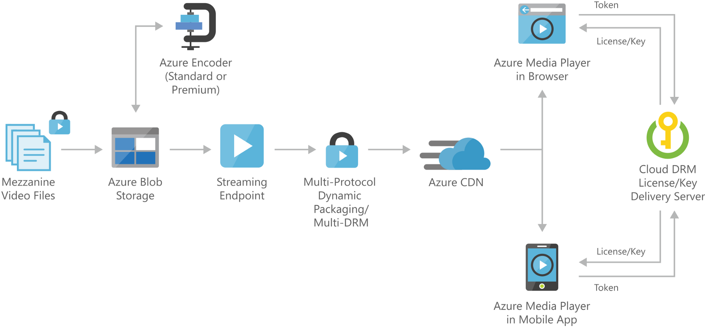

ตัวอย่างการนำ Azure Blob Storage ไปพัฒนาระบบ Video-On-Demand จาก 
 <a href="https://docs.microsoft.com/en-us/azure/architecture/solution-ideas/articles/digital-media-video">docs.microsoft.com</a>

#### Azure File Storage
บริการแบบ PaaS ที่รองรับการ Share File บน Protocal Server Message Block (SMB) ที่ช่วยให้เราเข้าถึง file ได้ผ่านการ Mount Share Drive บน Winidows, Linux, MacOS ครับผม

รองรับการ Encryption ทั้งแบบ At Rest (ข้อมูลที่ถูกจัดเก็บอยู่ใน Storage) และแบบ In Transit (รับส่งข้อมลู) ด้วยครับ

 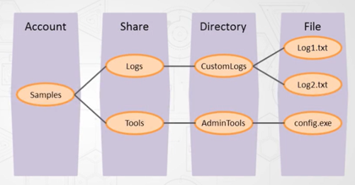

Azure File จาก 
 <a href="https://medium.com/@patiwat/microsoft-azure-storage-account-5949e7958097">medium.com/@patiwat</a>

#### Azure Table Storage
เป็นบริการจัดเก็บข้อมูลแบบ Semi-Structured โดยจะจัดเก็บในรูปแบบของ NoSQL แบบ Key-Value (เก็บข้อมูลเป็น Key คู่กับข้อมูลที่เราต้องการจะเก็บนะครับ)

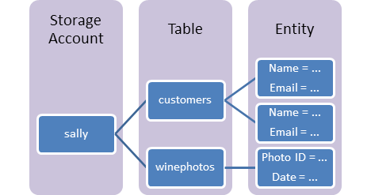

Azure Table Storage จาก 
 <a href="https://medium.com/@patiwat/docs.microsoft.com">medium.com/@patiwat</a>

#### Azure Queue Storage
บริการ Message Queue เพื่อช่วยในการทำงานที่ต้องรองรับการรับส่งข้อมูลจำนวนมาก โดยเปลี่ยนมาเป็นการทำงานแบบ Asynchronous โดยจะเอางานที่เข้ามาใหม่จัดเก็บลงใน Queue หลังจากนั้นจะมีขั้นตอนในการดึงงานจากใน Queue เพื่อมาประมวลผลต่อ

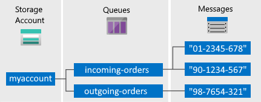

Azure Queue Storage จาก 
 <a href="https://docs.microsoft.com/th-th/azure/storage/queues/storage-nodejs-how-to-use-queues">docs.microsoft.com</a>

เหมาะกับงานที่ไม่ได้ต้องการทันทีทันใด และไม่ได้การเรียงลำดับในการทำงาน เช่น การสร้าง Thumbnails หลังจากที่ User Upload ภาพ

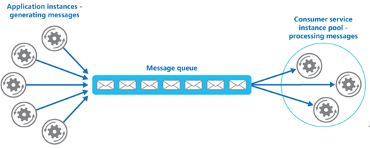

Message Queue จาก 
 <a href="https://medium.com/@patiwat/microsoft-azure-storage-account-5949e7958097">medium.com/@patiwat</a>

### Azure Disk Storage
หรือจะเรียกว่า “Azure Managed Disks” ก็ได้ครับ เป็น Virtual Disk ที่เราจะนำไปใช้ใน VMs โดยตรงเพื่อความสะดวกในการจัดการกับ Disk ครับ

ตัวอย่างเช่น OS Disk, Data Disk

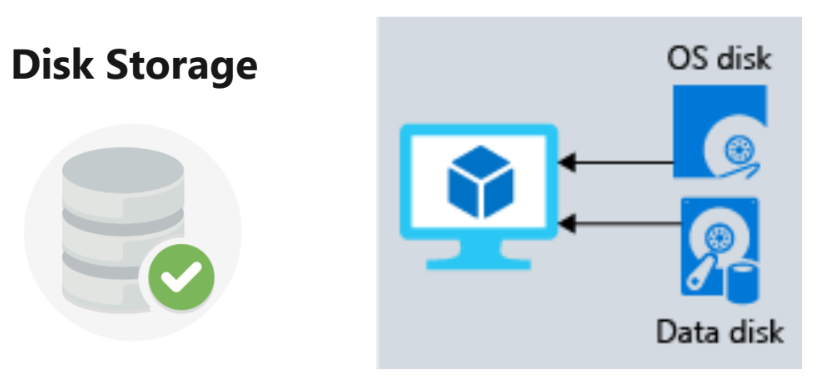

#### Storage Tiers
เป็นชนิดของการความเร็วในการเข้าถึงข้อมูลและราคาที่ใช้จัดเก็บ
- **Hot Storage Tier** เหมาะสำหรับข้อมูลที่เข้าถึงบ่อยๆ ราคาพื้นที่จับเก็บ Storage แพงสุด แต่ราคาในการเข้าถึงข้อมูลถูกสุด ความเร็วในการเข้าถึงข้อมูลไวที่สุด
- **Cool Storage Tier** เหมาะสำหรับข้อมูลที่นานๆเข้าถึงที และเก็บไว้อย่างน้อย 30 วัน ราคาพื้นที่จับเก็บ Storage, ราคาในการเข้าถึงข้อมูล, ความเร็วในการเข้าถึงข้อมูล อยู่ระดับกลางๆ
- **Archive Storage Tier** เหมาะสำหรับข้อมูลที่แทบจะไม่เข้าถึง และเก็บไว้อย่างน้อย 180วัน ราคาพื้นที่จับเก็บ Storage ถูกสุด แต่ราคาในการเข้าถึงข้อมูลแพงสุด ความเร็วในการเข้าถึงข้อมูลช้าที่สุด

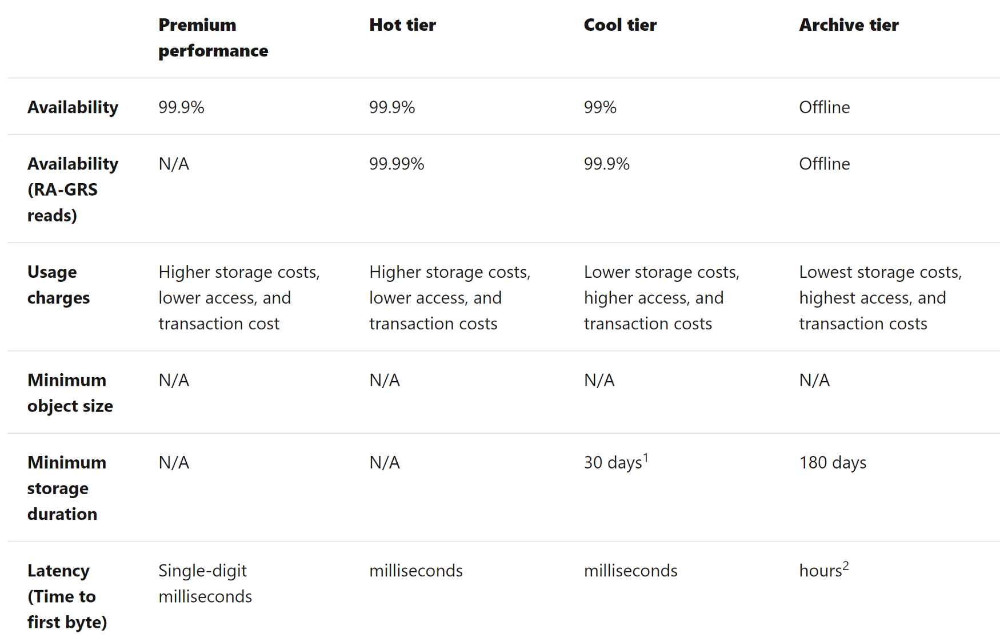

ตารางเปรียบเทียบค่าใช้จ่ายใน Tier ทั้ง 3 จาก 
 <a href="https://docs.microsoft.com/en-us/azure/storage/blobs/storage-blob-storage-tiers?tabs=azure-portal">docs.microsoft.com</a>

## Networking Options
Azure จัดเตรียมบริการที่ช่วยให้เราจัดการ Network ทั้งแบบ On Premise และ Cloud ให้ทำงานร่วมกันได้อย่างปลอดภัยและมีประสิทธิภาพครับ เรามาศึกษาบริการที่มีกันครับ : )

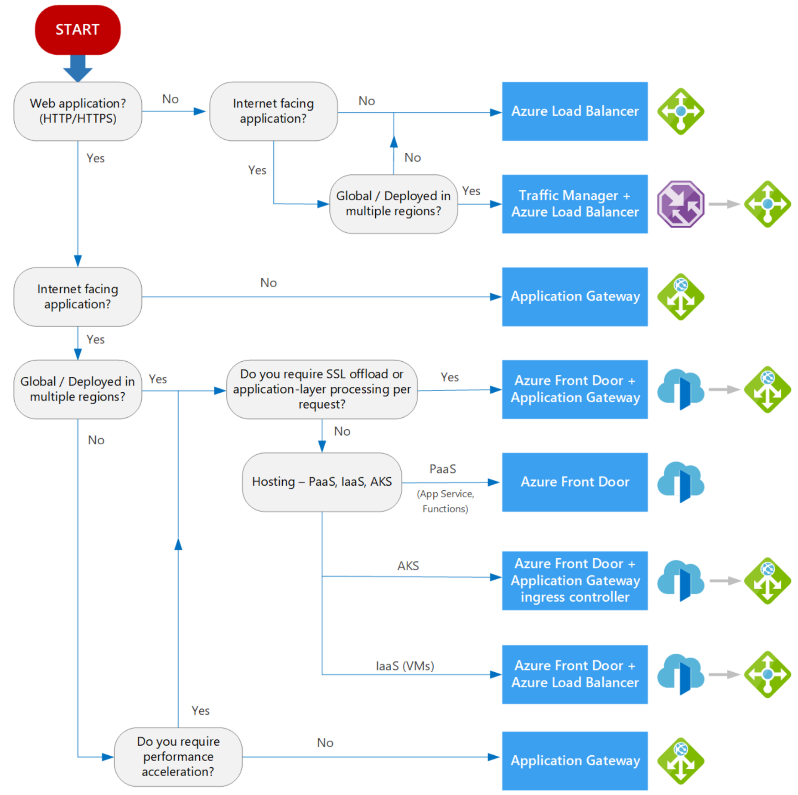

Decision Tree สำหรับการเลือกใช้ Azure Networking Options จาก 
 <a href="https://docs.microsoft.com/en-us/azure/architecture/guide/technology-choices/load-balancing-overview">docs.microsoft.com</a>

### Azure Virtual Network
บริการฟรีในการจัดการ Network เสมือนให้กับบริการบน Azure เชื่อมต่อกันได้อย่างปลอดภัยครับ

เช่นเมื่อเราสร้าง VMs เราก็จำเป็นต้องสร้าง Virtual Network ขึ้นมาเสมอ และยังสามารถทำ VPN Site-to-Site เพื่อเชื่อม Network ของ On-Premise และ Azure เข้าด้วยกัน

เราจำเป็นต้องกำหนด Subnets ให้กับ Virtual Network ด้วย ซึ่งทาง Azure จะกำหนดเป็นแบบ DHCP เพื่อแจก IP ให้โดยอัตโนมัติ

### Network Security Group (NSG)
เป็น Firewall ที่มาพร้อมกับ Virtual Machine ที่เราสร้าง เพื่อจัดการสิทธิในการเปิดปิด Port ถ้าเป็น Windows จะเปิด RDP Port 3389, ถ้าเป็น Linux จะเปิด SSH Port 22 ให้โดยอัตโนมัติ

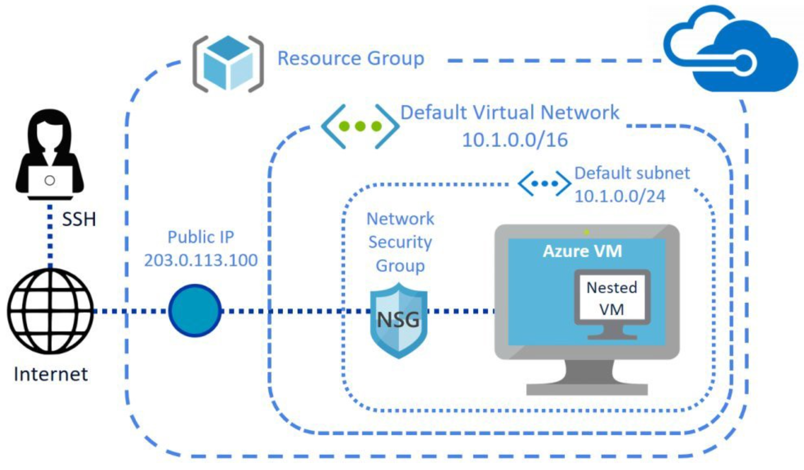

Virtual Network, Subnet, Network Security Group จาก 
 <a href="https://www.brianlinkletter.com/create-a-nested-virtual-machine-in-a-microsoft-azure-linux-vm/">brianlinkletter.com</a>

### Load Balancing in Azure
Load Balancing คือบริการที่ช่วยรองรับจำนวน Request ที่จะเข้ามายัง Servers ของเราได้อย่างเหมาะสม ด้วยการกระจาย Request ไปยังหลายๆ Servers

โดยที่ Servers เหล่านี้ควรทำงานแบบ Stateless เพื่อให้ไม่มี State ถูกจดจำไว้ใน Server ใด Server นึง ทำให้เวลาที่ User คนเดิมถูกโยนไปยัง Server ถัดไปก็สามารถทำงานที่ค้างไว้ต่อได้ตามปรกติ

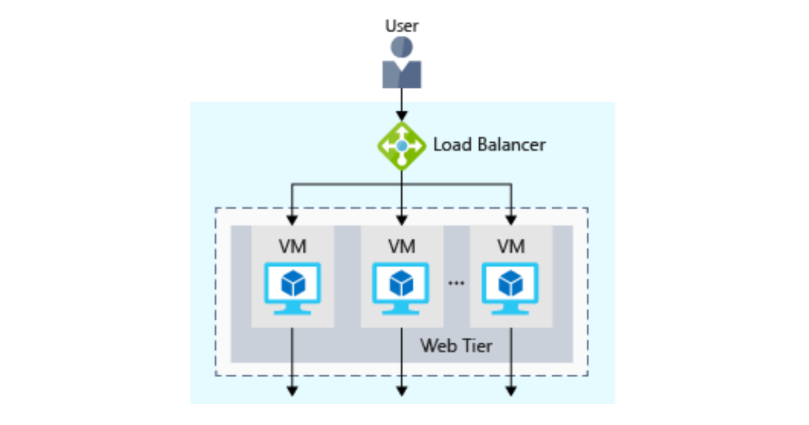

Azure มีบริการ Load Balancing อยู่หลายรูปแบบดังนี้

#### Azure Load Balancer
ทำงานอยู่ใน OSI Model ระดับ 4 (Transport Layer) บน Protocal TCP, UDP ซึ่งเน้นทำหน้าที่ในการรับส่งข้อมูลระหว่าง 2 Endpoint เท่านั้นครับ (Source IP address and port to destination IP address and port)

> เหมาะใช้กับ Azure Virtual Machine

เราจะได้ Public IP เพื่อให้ User เข้าถึง Load Balancer ได้จากข้างหน้า ส่วนหลัง Load Balancer เราสามารถเลือกเป็นการสื่อสารผ่าน Private IP ในการเชื่อม Load Balancer ไปยัง Servers อื่นๆ เพื่อความปลอดภัยมากยิ่งขึ้นเพราะไม่สามารถเข้าถึงได้จากภายนอกโดยตรง

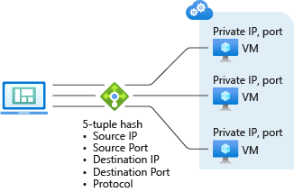

Azure Load Balancer จาก 
 <a href="http://www.subhendumct.com/2018/07/11/azure-load-balancer-vs-azure-application-gateway-vs-azure-traffic-manager/">subhendumct.com</a>

#### Azure Application Gateway
ทำงานอยู่ใน OSI Model ระดับ 7 (Application Layer) ที่นำความสามารถในการรับส่งข้อมูลจาก Transport Layer มาทำงานอื่นๆเพิ่มเติม ทำให้ Application Gateway สามารถทำงานได้มากกว่า Azure Load Balancer 

ตัวอย่างเช่นการทำ Cookie-Based Session Affinity, URL Path-Based Routing, Multisite Hosting

> เหมาะใช้กับ Web Application (HTTP/HTTPS) เช่น Azure App Service, ACI, AKS

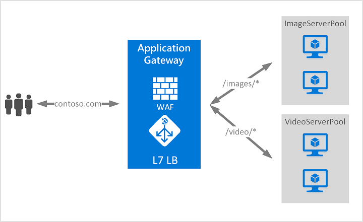

Azure Application Gateway จาก 
 <a href="http://www.subhendumct.com/2018/07/11/azure-load-balancer-vs-azure-application-gateway-vs-azure-traffic-manager/">subhendumct.com</a>

#### Azure Traffic Manager
บริการจัดการ Network ในกรณีที่ลูกค้าเราอยู่หลายประเทศ เราจะใช้ Traffic Manager ในการเลือก DNS Server ที่อยู่ใกล้กับลูกค้าในประเทศนั้นมากที่สุด เพื่อให้ลูกค้าเข้าถึง Web App ที่เราติดตั้งไว้ในพื้นที่นั้น

ตัวอย่างเช่น ถ้าผู้ใช้งานมาจากยุโรป ตัว Traffic Manager จะพาผู้ใช้เข้าถึง Web App ของเราที่ติดตั้งในยุโรป
แต่ถ้าผู้ใช้งานมาจากเอเชีย ตัว Traffic Manager จะพาผู้ใช้เข้าถึง Web App ของเราที่ติดตั้งในเอเชีย

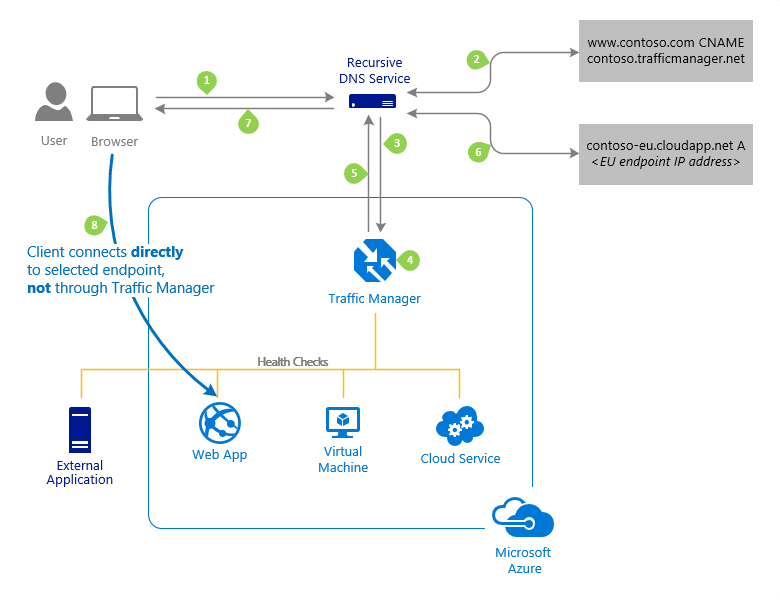

Azure Traffic Manager จาก 
 <a href="http://www.subhendumct.com/2018/07/11/azure-load-balancer-vs-azure-application-gateway-vs-azure-traffic-manager/">subhendumct.com</a>

 #### Azure Content Delivery Network (CDN)
บริการกระจายข้อมูลไปยังตำแหน่งที่ใกล้กับผู้ใช้งานมากที่สุดเพื่อลดเวลาในการเข้าถึงข้อมูล ซึ่ง Azure มี CDN ที่รองรับพื้นที่ได้ทั่วโลกเลยครับ

ตัวอย่าง Content เช่น Images Files, Document Files

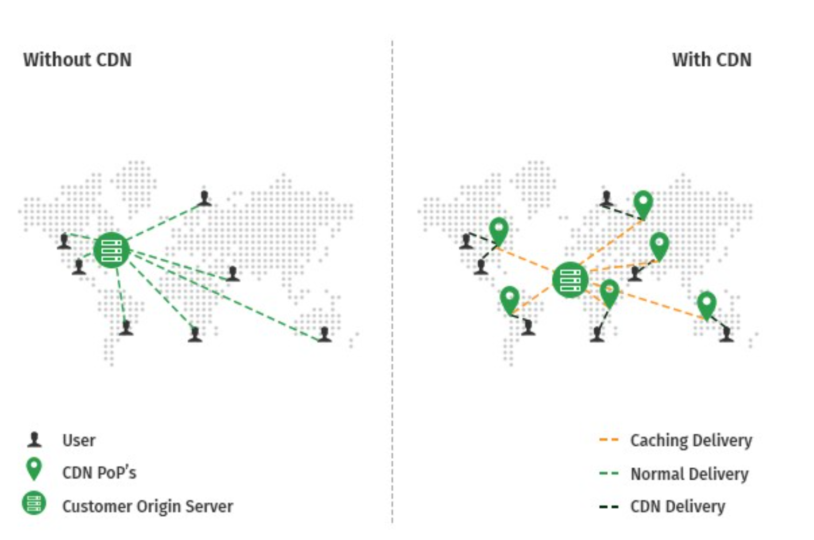

CDN จาก  
 <a href="https://medium.com/@ponggun/3-virtual-academy-for-azure-fundamentals-%E0%B9%82%E0%B8%94%E0%B8%A2-aipen-studio-aa898b2654dd">5centscdn.net</a>

## เนื้อหาเพิ่มเติมที่เกี่ยวข้องกับการสอบครับ
- [Digital Skill — Azure Fundamentals (ภาษาไทย)](https://course.digitalskill.org/courses/course-v1:Microsoft+AZ-LEARN-0+2019/about)
- [ExamTopics — AZ-900 Exam Actual Questions](https://www.examtopics.com/exams/microsoft/az-900/view/1/)
- [Facebook — Data TH.com — Data Science ชิลชิล (ภาษาไทย)](https://www.facebook.com/datasciencechill/posts/872166769835048/)
- [Github — Microsoft Certified Azure Fundamentals (ภาษาไทย)](https://github.com/Tizcom/AZ-900/blob/main/Microsoft%20Azure%20Fundamentals_Handout.pdf)
- [Medium — Azure AZ-900 Exam Preparation Guide: How to pass in 3 days](https://medium.com/weareservian/azure-az-900-exam-preparation-guide-how-to-pass-in-3-days-dabf5534507a)
- [Medium — วีธีลงทะเบียนสอบ AZ-900 Online ที่บ้านด้วย Azure Exam Voucher](https://medium.com/@ponggun/%E0%B8%A7%E0%B8%B5%E0%B8%98%E0%B8%B5%E0%B8%A5%E0%B8%87%E0%B8%97%E0%B8%B0%E0%B9%80%E0%B8%9A%E0%B8%B5%E0%B8%A2%E0%B8%99%E0%B8%AA%E0%B8%AD%E0%B8%9A-az-900-online-%E0%B8%97%E0%B8%B5%E0%B9%88%E0%B8%9A%E0%B9%89%E0%B8%B2%E0%B8%99%E0%B8%94%E0%B9%89%E0%B8%A7%E0%B8%A2-azure-exam-voucher-c0d027253d34)
- [Medium — AZ-900 รีวิวแนวข้อสอบและวิธีลงสอบที่ศูนย์สอบ](https://link.medium.com/bX2BY3vin8)
- [Medium — AZ-900 สรุปละเอียดสุดๆ](https://medium.com/@manita.swwp/virtual-academy-for-microsoft-azure-fundamental-in-thai-language-f5354c2f8634)
- [Microsoft Learn-Azure Fundamentals](https://docs.microsoft.com/en-us/learn/paths/azure-fundamentals/)
- [Udemy — Microsoft Azure — Beginner’s Guide + AZ-900 (มีค่าใช้จ่าย)](https://www.udemy.com/course/microsoft-azure-beginners-guide)
- [WhizLabs — AZ-900 (มีค่าใช้จ่าย)](https://www.whizlabs.com/learn/course/microsoft-azure-az-900)
- [Workshop เล็กๆจาก Microsoft สำหรับ AZ-900 ครับผม](https://microsoftlearning.github.io/AZ-900T0x-MicrosoftAzureFundamentals/)

## สรุป
ในบทความนี้เราได้เรียนรู้ Core Services หลักๆที่ Azure มีให้บริการ ที่มาพร้อมกับคุณภาพ,ความปลอดภัย และ รองรับการขยายตัวในอนาคตน่ะครับ เช่น
- เราเลือกใช้ บริการ Compute แบบ PaaS บน Azure App Service เพื่อติดตั้ง Website โดยดูแลเฉพาะ Code และ Configuration บางอย่าง ส่วน Infrastructure ให้ Azure ช่วยดูแล
- เราเลือกบริการ Storage บน Azure Blob Storage เพื่อจัดเก็บ Unstructured Data เช่น Text/PDF/Document/Image/Video File
- เราเลือกใช้บริการ Network บน Azure Application Gateway ในการทำ Load Balancer ในระดับ Application Layer

หวังว่าบทความจะพอแนะนำให้เห็นภาพของบริการต่างๆบน Azure มากขึ้นน่ะครับ