# Predict Costs and Optimize Spending

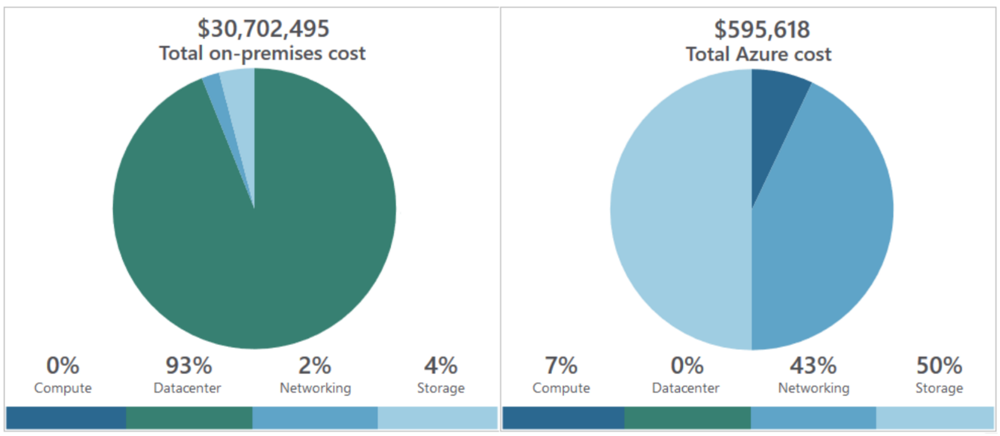

ย้ายจาก On Premise มา Azure แล้วราคาลดลงเยอะเลยครับพี่น้องงงงง!

## Introduction
เนื้อหาในบทความนี้เป็นส่วนที่สำคัญที่สุดในการพิจารณาเลือกใช้ Azure ครับ เพราะเราต้องเลือกสมดุลระหว่างค่าใช้จ่าย (Cost) กับ ประสิทธิภาพ (Performance) ที่ได้รับ เพราะลูกค้าจำเป็นต้องทราบค่าใช้จ่ายทั้งหมดก่อนที่จะตัดสินใจว่าจะเลือกใช้บริการที่เรานำเสนอหรือไหมครับ

คำถามที่เราต้องเตรียมคำตอบให้พร้อมอยู่เสมอคือ
- บริการที่เราจะใช้ทั้งหมดนั้นมีค่าใช้จ่ายต่อเดือนเท่าไหร่
- เราจะลดค่าบริการยังไงได้บ้าง (ใช้ Azure Advisor ช่วยแนะนำเบื้องต้นได้น่ะครับ : P)

ตัวอย่างการคิดค่าบริการ เช่น ค่าใช้จ่ายของ Azure VM จะประกอบไปด้วยค่าใช้จ่าย 2 ส่วนคือ
- **Compute Service** เกี่ยวข้องกับ Spec (CPU, RAM)ของ Server
- **Storage Service** เกี่ยวกับพื้นที่จัดเก็บข้อมูล (Disk)

## Purchase Azure Products and Services

### ประเภทของลูกค้า
- **องค์กร (Enterprise)** — ลูกค้าจากองค์กรได้มีการทำสัญญาลงนามข้อตกลงในการใช้บริการจาก Azure ซึ่งส่วนใหญ่จะจ่ายเป็นรายปี
- **สร้างผ่าน Website (Web Direct)** —เป็นกลุ่ม -ลูกค้าทั่วไปที่สมัครผ่าน Website โดยตรงซึ่งจะมีการชำระเงินแบบรายเดือนผ่าน Website
- **ผู้ให้บริการ Cloud Solution (Cloud Solution Provider)** — ลูกค้าซื้อบริการ ผ่านบริษัทคู่ค้า (Cloud Solution (CSP)) ของ Microsoft การชำระเงินจะทำผ่าน CSP ของลูกค้า

## Azure Marketplace
เป็นพื้นที่รวบรวมบริการทั้งหมดของ Azure ที่มาจาก Microsoft และ Partners

โดยจะมีการแบ่งตามหมวดหมู่ เพื่อให้สะดวกในการเลือกใช้และติดตั้งได้อย่างรวดเร็วครับ

แต่เราต้องพิจารณา Publisher ให้ดีถ้า Publisher เป็น Microsoft ค่าใช้จ่ายจะคิดตาม Azure Subscription เลย แต่ถ้าเป็น Partners ค่าใช้จ่ายจะคิดอยู่ภายนอก Azure Subscription หรือก็คือจ่ายตามผู้ใช้บริการครับ

เช่น ถ้าเราเลือก SendGrid ใน Azure Marketplace เพื่อทำบริการส่งเมล์ เราก็จ่ายกับ SendGrid โดยตรง ไม่ได้ถูกหักที่ Azure Subscription นะครับ

ตัวอย่างบริการเด่นๆเช่น Virtual Machine Images, Security, Networking, Software as a service, Storage, Databases, Blockchain

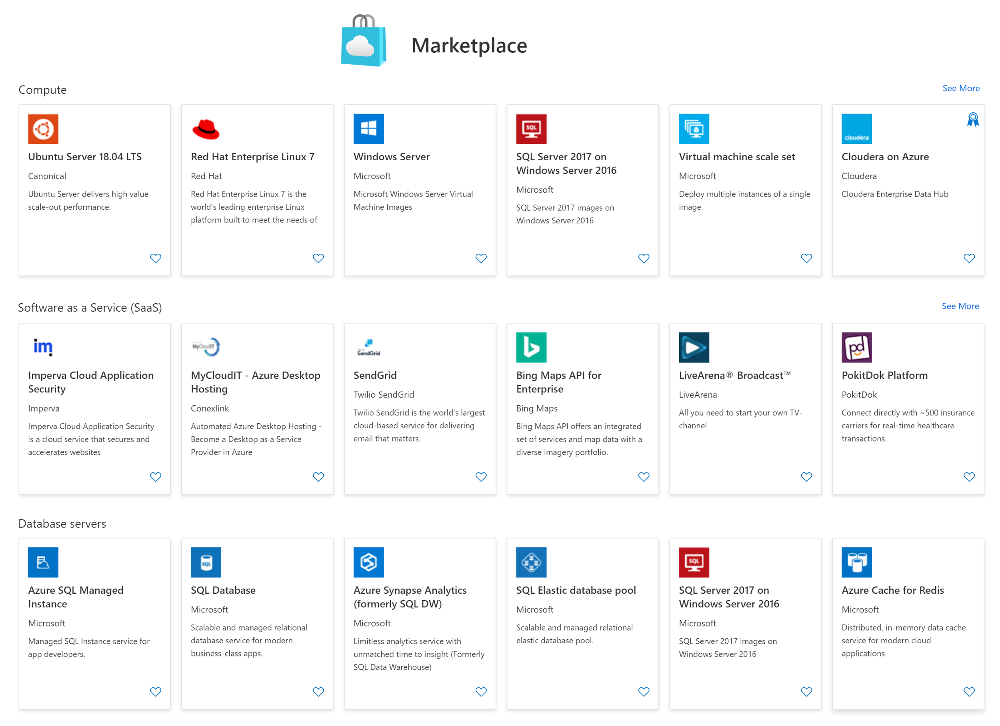

## Usage Meters
เมื่อใดที่เราสร้าง Resource แล้วนั้น Azure จะสร้าง Meter ขึ้นมาอย่างน้อยหนึ่ง Instance เพื่อติดตามการใช้งานและคำนวณค่าใช้บริการของเราครับ

โดยจะมีค่าใช้จ่ายที่แตกต่างกันตามประเภทของ Resource ที่เลือก เช่น Azure VM, Azure App Service Plan และยังรวมไปถึง Pricing Tier ที่เลือก เช่น Free Tier, Standard Tier

เมื่อเราชำระเงินตอนท้ายเดือนแล้ว Meter ก็จะถูกรีเซ็ตใหม่ เราสามารถตรวจสอบค่าใช้จ่ายบน Azure Portal ได้ตลอดเวลา เพื่อสรุปค่าใช้บริการในเดือนปัจจุบัน

เรายังสามารถดูใบแจ้งหนี้จากรอบการเรียกเก็บเงินที่ผ่านมาได้อีกด้วยครับ

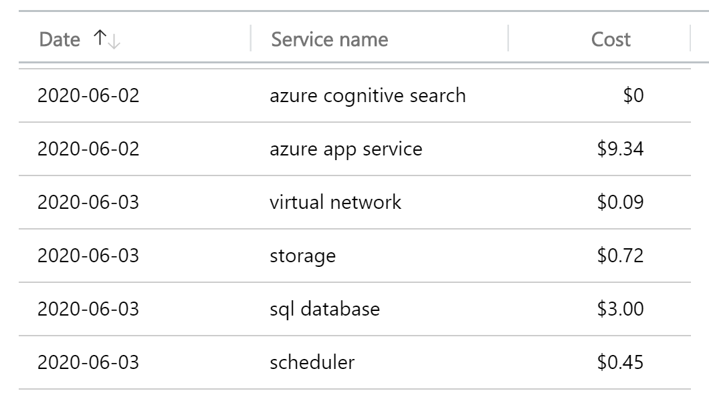

ตัวอย่างรายงานค่าใช้จ่ายในรอบ 2 วัน

## Factors Affecting Costs
มีปัจจัยหลักๆอยู่ 4 ข้อที่มีผลกับค่าบริการบน Azure นะครับ

### Resource Type
จะเป็นปัจจัยสำคัญที่มีผลกับค่าใช้จ่ายบน Azure มากที่สุดนะครับ เช่นถ้าเราเลือก Resource ที่มี Service Model แบบ IaaS ก็จะมีค่าใช้จ่ายที่สูงกว่า PaaS หรือ SaaS ค่อนข้างมาก

### Services
ค่าใช้จ่ายจะแตกต่างกันตามประเภทของลูกค้าน่ะครับ ไม่ว่าจะเป็น Enterprise, Web Direct และ Cloud Solution

> ในลักษณะการจ่ายเงินแบบ Prepaid ให้ระวังการซื้อแบบ Credit ล่วงหน้า เพราะถ้า Credit หมดแล้วระบบทั้งหมดจะหยุดทำงานไปเลย และถ้าหมดเกิน 90 วันทาง Azure จะลบ Resources ของเราทั้งหมดเลยครับ ถ้าเราใช้แบบ Postpaid คือจ่ายหลังจากที่เราใช้บริการแล้วจะจัดการได้ค่อนข้างสะดวกกว่า

### Location
ค่าใช้จ่ายในการใช้งานจะแตกต่างกันไปตาม Azure Data Center ที่มีอยู่ทั่วโลก เพราะแต่ล่ะพื้นที่ก็มีต้นทุน Infrastructure ที่แตกต่างกันครับ

### Azure Billing Zones
จะเกี่ยวข้องกับเรื่องของข้อมูลที่เข้าและออกจาก Azure Data Center (เรียกว่า Bandwidth) ข้อมูลที่เข้าสู่ Azure Data Center (เรียกว่า Inbound) ส่วนใหญ่จะฟรี ส่วนข้อมูลที่ออกจาก Azure Data Center (เรียกว่า Outbound) จะถูกคิดเงินในรูปแบบ Azure Billing Zones โดยแต่ล่ะ Zone ก็จะมีราคาที่แตกต่างกันครับ

- **Zone 1**: สหรัฐอเมริกา, ยุโรป, แคนาดา, สหราชอาณาจักร, ฝรั่งเศส
- **Zone 2**: เอเชียแปซิฟิก, ญี่ปุ่น, ออสเตรเลีย, อินเดีย, เกาหลี
- **Zone 3**: บราซิล
- **DE Zone 1**: เยอรมนี

> ส่วนใหญ่จะฟรีขาออก 5 GB แรกต่อเดือน หลังจากนั้นคุณจะถูกเรียกเก็บเงินในราคาคงที่ต่อ GB

## Azure Pricing Calculator
ก่อนที่เราจะตัดสินใจเลือกใช้บริการ เราสามารถคำนวนค่าใช้จ่ายเบื้องต้น (Estimate Costs) ได้ด้วย Azure Pricing Calculator นะครับ และนำข้อมูลนี้ไปเสนอกับทีมได้ ด้วยการ Export ออกมาเป็น Excel File

สามารถทดลองได้ผ่าน ลิ้งข้างล่างนี้นะครับ
- [Azure Pricing calculator](https://azure.microsoft.com/en-in/pricing/calculator/)

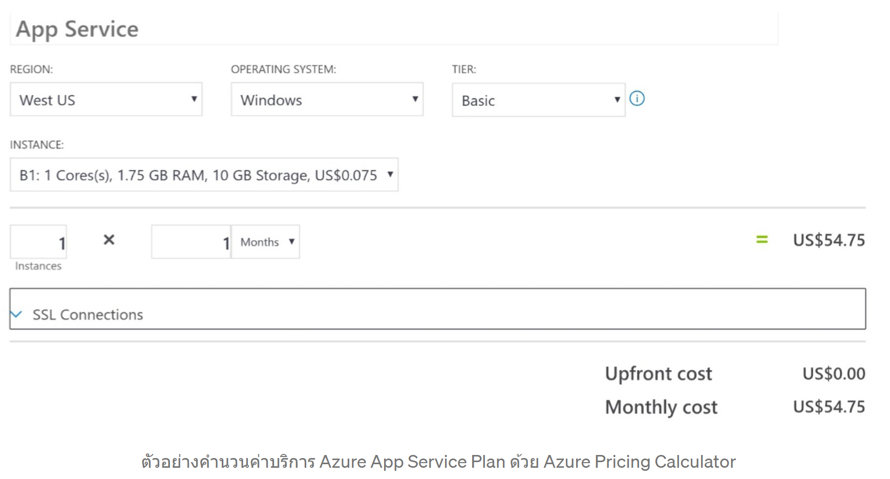

## Azure Advisor
ในกรณีที่ติดตั้งใช้งาน Resource ไปแล้วและอยากรู้ว่าค่าใช้จ่ายในแต่ล่ะเดือนเป็นอย่างไร สามารถที่จะปรับลดค่าใช้จ่ายให้ถูกลงได้ไหม

เราสามารถใช้ Azure Advisor มาช่วยตรวจสอบ High Availability, Security, Performance, Operational Excellence, Cost ได้ทุก Subscription ของเราทั้งหมด และแนะนำแนวทางแก้ไขให้กับเราในการปรับการใช้งานให้เหมาะสมกับค่าใช้บริการที่ต้องเสียไปครับ (Predict and Optimize with Cost Management)

เช่น VM ของเราใช้ CPU น้อยกว่า 5% จึงควรลด VM Size ให้เล็กลงเพื่อให้เลือก CPU ที่เหมาะสมมากขึ้นซึ่งจะช่วยประหยัดเงินได้ครับ : )

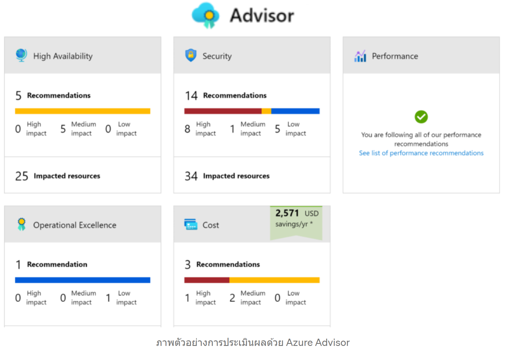

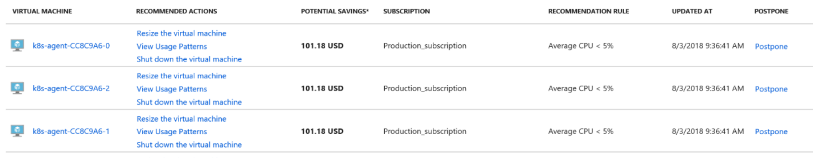

เมื่อลองกดเข้าไปดูรายละเอียดในส่วนของ Cost จะพบคำแนะนำให้ลด Size ของ CPU ลงเพราะว่าใช้เฉลี่ยต่อเดือนแค่ 5% ซึ่งจะช่วยประหยัดเงินได้ 101.18 USD ต่อเครื่องครับ เยอะมากกกก !

## Azure Cost Management
เป็นบริการฟรีที่ช่วยสร้าง Report ในเรื่องของค่าใช้จ่าย และยังสามารถวิเคราะห์, ตั้งงบประมาณเพื่อจำกัดค่าใช้จ่ายได้อีกด้วยครับ

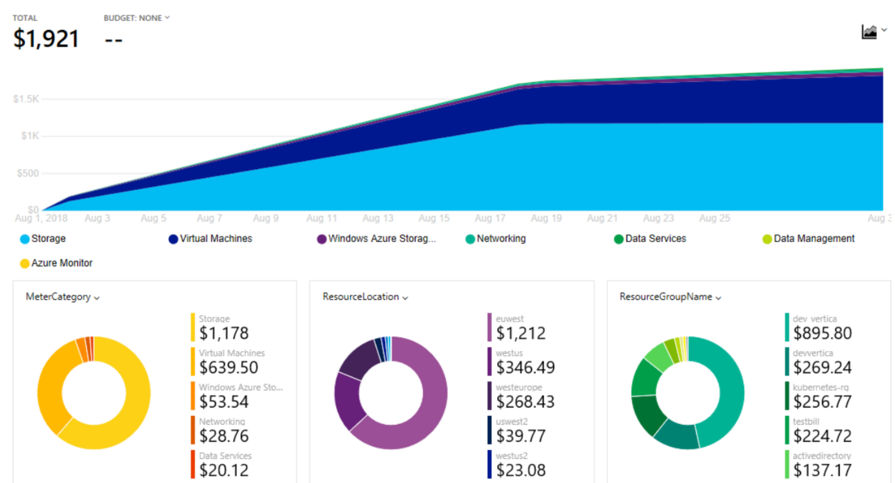

## Azure Total Cost of Ownership (TCO) Calculator
เป็น Web Based Tool ที่ใช้เพื่อเปรียบเทียบค่าใช้ในการย้ายทรัพยากรบน On Premise ขึ้นมาบน Azure เพื่อเปรียบเทียบค่าใช้จ่ายว่ามีความแตกต่างกันอย่างไรบ้าง เหมาะสำหรับการวางแผนประเมินค่าใช้จ่ายในการทำ Cloud Migration ครับ

สามารถทดลองใช้งานได้ที่นี้นะครับ
- [Total Cost of Ownership (TCO) Calculator](https://azure.microsoft.com/en-us/pricing/tco/calculator/)

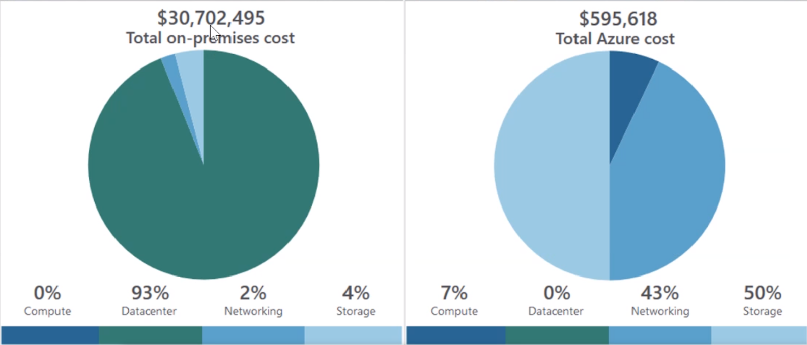

## Save on Infrastructure Costs

### Use Azure Credit
ถ้าเราซื้อ Visual Studio Subscription จะทำให้เรามี Credit ใน Azure ให้ใช้ต่อเดือนเพิ่มเติมน่ะครับ
- 50 USD ต่อเดือนสำหรับ Visual Studio Professional
- 150 USD ต่อเดือนสำหรับ Visual Studio Enterprise

### Use Spending Limit
ถ้าเราใช้ Azure Free Account ก็จะมีการจำกัดปริมาณการใช้งาน (Spending Limit) ของเราให้ไม่เกินที่ Azure กำหนดให้ใช้ฟรีนะครับ

### Use Reserved Instances (RI)
เป็นทางเลือกเพื่อลดค่าใช้จ่ายสำหรับบริการ Azure VM โดยเฉพาะนะครับ
RI สามารถลดค่าใช้จ่ายลงได้เยอะเลยครับ เพราะเป็นการซื้อสัญญาล่วงหน้าในแบบ 1 ปี (ถูกกว่าแบบ Pay as you go) หรือ 3 ปี (ถูกกว่าแบบ 1 ปี) ซึ่งจะเหมาะเป็นอย่างยิ่งในการพิจารณาก่อนที่จะเริ่มสร้าง Virtual Machine ที่วางแผนไว้แล้วว่าจะใช้เป็นระยะเวลานาน, ทราบจำนวนเครื่อง, Spec ที่ต้องใช้, เปิดใช้แบบ 24x7x365

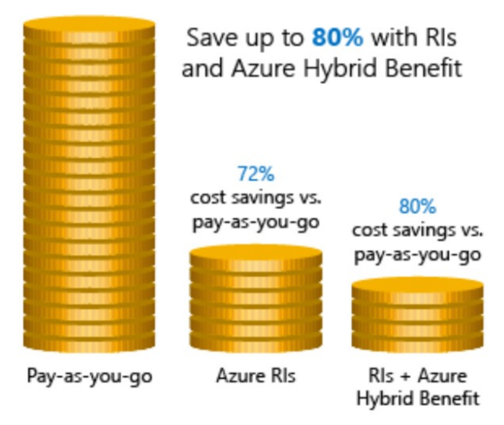

### Choose Low-Cost Locations and Regions
อาจจะพิจารณาเลือก Region ที่มีค่าใช้จ่ายถูกลงโดยยอมแลกกับ Latency ที่มากขึ้น และ Compliance ในการเก็บข้อมูล

### Research Available Cost-Saving Offers
บางช่วงเวลาจะมี Promotion พิเศษ ที่ทำให้ค่าใช้บริการถูกลงนะครับ เช่นช่วงนี้ถ้าใช้ Azure App Service Linux จะใช้งานฟรีใน 1 เดือนแรก

### Right-Size Underutilized Virtual Machines
เลือก Size ของ VM ให้เหมาะสมจะช่วยควบคุมค่าใช้จ่ายเช่นกันครับ เช่นสมมติว่าเรามี VM ด้วย Size Standard_D4sv3 แต่ VM นั้นส่วนใหญ่ไม่ได้ใช้งานถึง 90% ของเวลาทั้งหมด หากปรับขนาด VM นี้เป็น Standard_D2sv3 เราจะสามารถลดต้นทุนการประมวลผลลง 50% เลยครับ

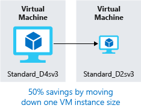

### Deallocate Virtual Machines in Off Hours
คือการปิดการใช้งาน VM ในช่วงเวลาที่เราได้ไม่ใช้นั้นจะช่วยควบคุมค่าใช้จ่ายได้อีกช่องทางนึงนะครับ

โดยต้องมั่นใจว่าเรา Stop VM ของเราในแบบ Deallocate ผ่าน Azure Portal หรือ Powershell เท่านั้น

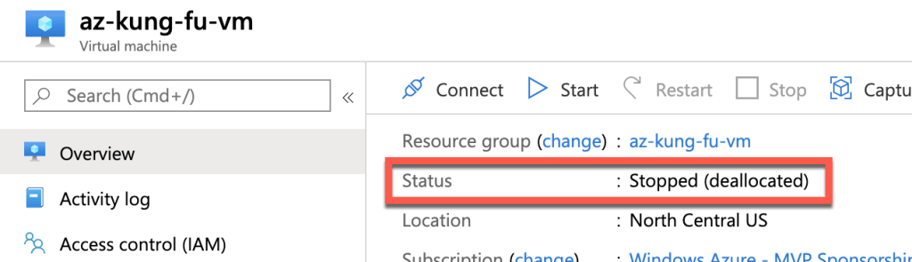

ภาพจาก <a href="https://build5nines.com/properly-shutdown-azure-vm-to-save-money/">build5nines.com</a>

เพราะใน State Deallocate นี้ Azure จะไม่คิดเงินค่า VM ของเรา (ในส่วน Computation นะครับที่ไม่คิด แต่ Storage ยังคิดตามเดิม) เพราะ Azure ไม่ได้สำรอง Compute Service ให้เรา ทำให้เวลาที่เรา Start VM จาก State Deallocate จะใช้เวลาอยู่พักนึงถึงจะรันได้

ถ้าแค่ Shutdown ผ่าน OS ระบบจะยังคิดเงินเหมือนเดิมน่ะครับ เพราะถ้า Shutdown แล้วระบบอยู่ใน สถานะ Stop นั้น Azure ยังสำรอง Compute Service ไว้อยู่ถ้าเรา Start มันจะเร็วมาก

### Delete Unused Virtual Machines
ลบ VM ที่ไม่ได้ใช้เพื่อประหยัดทั้ง Compute Service และ Storage Service

### Migrate to PaaS or SaaS Services
ค่าใช้จ่าย PaaS หรือ Saas ถูกกว่าเยอะครับ ดูแลง่ายกว่าด้วย อิอิ ^^

### Save on Licensing Costs
ค่าใช้จ่ายที่สำคัญอีกส่วนนึงคือเรื่องของ License นะครับ เพราะนอกจากที่เราต้องจ่ายสำหรับทรัพยากรบน Azure แล้ว License ของ Software ก็เป็นค่าใช้จ่ายเสริมที่เราต้องจ่ายด้วยเช่นกันครับ

จะพิเศษหน่อยเฉพาะ Azure VM Windows ครับที่ไม่คิดค่า License Windows Data Center แต่ถ้าเราเอา Software อื่นมาติดตั้งที่ VM ของเราก็จะต้องเสียค่า License ของ Software นั้นเพิ่มเติมน่ะครับ

### Azure Hybrid Benefit for Windows Server
เราสามารถประหยัดค่าบริการบน Azure ในส่วนของ Windows VM ถ้าเรามี License Windows Server ที่มาจาก On Premise แล้ว

แต่การจะมีสิทธิ์ได้รับผลประโยชน์นี้ สิทธิ์การใช้งาน Windows ของคุณต้องได้รับการคุ้มครองโดย Software Assurance เท่านั้น

### Azure Hybrid Benefit for SQL Server
เราสามารถนำ SQL Server License ของเราที่ได้รับความคุ้มครองโดย Software Assurance มาเป็นส่วนลดในการใช้บริการ SQL บน Azure ได้ครับ

คุณสามารถใช้สิทธิประโยชน์นี้ได้แม้ว่าทรัพยากร Azure จะทำงานอยู่ แต่อัตราที่ลดลงจะเริ่มคำนวณตั้งแต่เวลาที่คุณเลือกไว้ใน portal และจะไม่มีการออกเครดิตย้อนหลัง

### Use Dev/Test Subscription Offers
มีส่วนลดที่ถูกว่า Pay As You Go เหมาะสำหรับ Developer ในการนำไปพัฒนาระบบ บน Non-production Environments

### Bring Your Own SQL Server License (BYOL)
สำหรับลูกค้า Enterprise Agreement Subscription นั้นสามารถนำ License SQL Server จาก On Premise มาเป็นส่วนลดประหยัดค่าบริการบน Azure ในส่วนของ SQL ได้น่ะครับ
ขั้นตอนจะเริ่มจากการค้นหา BYOL ใน Marketplace เพื่อค้นหา Image เหล่าที่เกี่ยวข้องเพื่อสร้าง Windows VM และติดตั้ง SQL Server

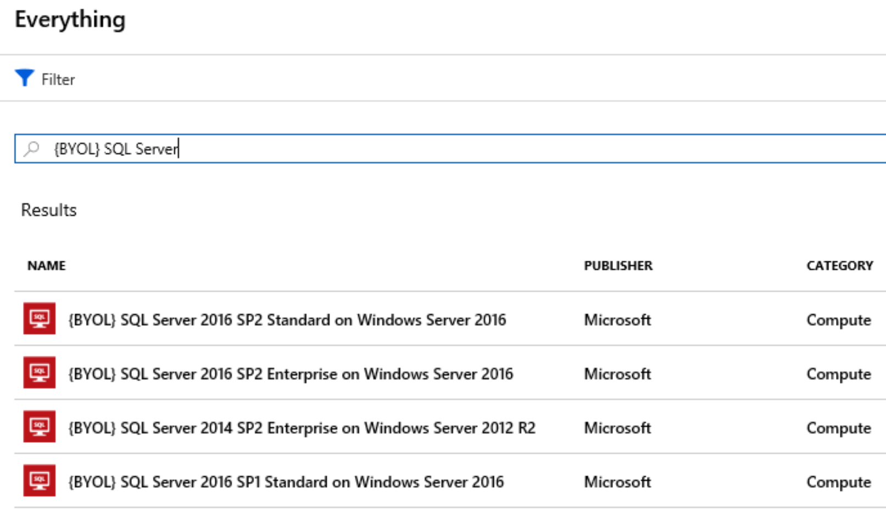

### Use SQL Server Developer Edition
ถ้าเราต้องการทำสอบ Features ที่เหมือนกับ SQL Enterprise Edition เราสามารถใช้ SQL Developer Edition มาทดลองได้สำหรับงาน Non Production เท่านั้น

### Use Constrained Instance Sizes for Database Workloads
ราคาของ SQL License จะมีผลกับจำนวนของ CPU โดยตรง เพราะงั้นถ้าเราลดจำนวนลง CPU ลงให้เหมาะสม เราจะสามารถประหยัดค่าใช้จ่ายได้มากขึ้นครับ

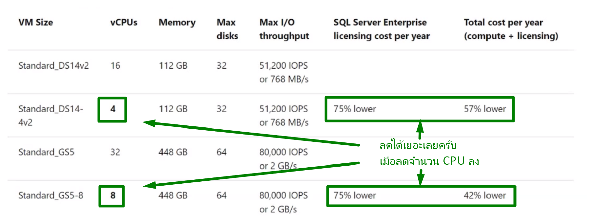

## เนื้อหาเพิ่มเติมที่เกี่ยวข้องกับการสอบครับ
- [Digital Skill — Azure Fundamentals (ภาษาไทย)](https://course.digitalskill.org/courses/course-v1:Microsoft+AZ-LEARN-0+2019/about)
- [ExamTopics — AZ-900 Exam Actual Questions](https://www.examtopics.com/exams/microsoft/az-900/view/1/)
- [Facebook — Data TH.com — Data Science ชิลชิล (ภาษาไทย)](https://www.facebook.com/datasciencechill/posts/872166769835048/)
- [Github — Microsoft Certified Azure Fundamentals (ภาษาไทย)](https://github.com/Tizcom/AZ-900/blob/main/Microsoft%20Azure%20Fundamentals_Handout.pdf)
- [Medium — Azure AZ-900 Exam Preparation Guide: How to pass in 3 days](https://medium.com/weareservian/azure-az-900-exam-preparation-guide-how-to-pass-in-3-days-dabf5534507a)
- [Medium — วีธีลงทะเบียนสอบ AZ-900 Online ที่บ้านด้วย Azure Exam Voucher](https://medium.com/@ponggun/%E0%B8%A7%E0%B8%B5%E0%B8%98%E0%B8%B5%E0%B8%A5%E0%B8%87%E0%B8%97%E0%B8%B0%E0%B9%80%E0%B8%9A%E0%B8%B5%E0%B8%A2%E0%B8%99%E0%B8%AA%E0%B8%AD%E0%B8%9A-az-900-online-%E0%B8%97%E0%B8%B5%E0%B9%88%E0%B8%9A%E0%B9%89%E0%B8%B2%E0%B8%99%E0%B8%94%E0%B9%89%E0%B8%A7%E0%B8%A2-azure-exam-voucher-c0d027253d34)
- [Medium — AZ-900 รีวิวแนวข้อสอบและวิธีลงสอบที่ศูนย์สอบ](https://link.medium.com/bX2BY3vin8)
- [Medium — AZ-900 สรุปละเอียดสุดๆ](https://medium.com/@manita.swwp/virtual-academy-for-microsoft-azure-fundamental-in-thai-language-f5354c2f8634)
- [Microsoft Learn-Azure Fundamentals](https://docs.microsoft.com/en-us/learn/paths/azure-fundamentals/)
- [Udemy — Microsoft Azure — Beginner’s Guide + AZ-900 (มีค่าใช้จ่าย)](https://www.udemy.com/course/microsoft-azure-beginners-guide)
- [WhizLabs — AZ-900 (มีค่าใช้จ่าย)](https://www.whizlabs.com/learn/course/microsoft-azure-az-900)
- [Workshop เล็กๆจาก Microsoft สำหรับ AZ-900 ครับผม](https://microsoftlearning.github.io/AZ-900T0x-MicrosoftAzureFundamentals/)

## สรุป
ในบทความนี้เราได้เรียนรู้แนวทางในการจัดการกับค่าใช้จ่ายบน Azure อย่างมีประสิทธิภาพดังนี้
- 4 ปัจจัยที่มีผลในเรื่องของราคา ประกอบไปด้วย Resource Type, Services, Location, Azure Billing Zones
- แนวทางในการประเมินค่าใช้จ่ายด้วย Azure Pricing Calculator ก่อนที่จะใช้งานจริงๆ
- หลังจากที่เราใช้งานระบบไปสักพักนึงแล้ว เราสามารถควบคุมค่าใช้จ่ายให้เหมาะสมมากขึ้น ด้วย Azure Advisor
- วิเคราะห์ค่าใช้จ่ายที่เกิดขึ้นอย่างละเอียดด้วย Azure Cost Management
- เปรียบเทียบค่าบริหารระหว่าง On-premise และ On Azure
- แนวทางในการลดค่าใช้จ่าย เช่น การใช้ Reserved Instances (RI), เลือก VM Size ที่เหมาะสม, ย้าย IaaS ไปเป็น PaaS
- ลดค่าใช้จ่ายในส่วนของ Software License ด้วยการนำ License จาก On-premise มาใช้ หรือ เลือก Development License สำหรับบงาน Non-production

ผมหวังว่าเนื้อหาในบทความนี้จะช่วยให้เราเข้าใจแนวทางในการจัดการกับค่าใช้จ่ายบน Azure มากขึ้นน่ะครับ
