# Security, Responsibility and Trust in Azure

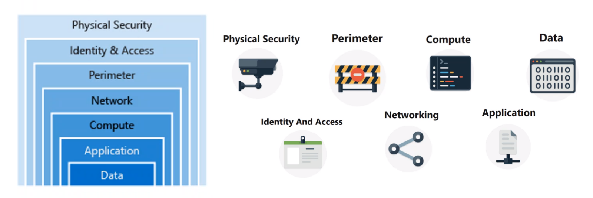

## Introduction
ความปลอดภัยคือเรื่องสำคัญที่เราต้องพิจารณาวางแผนเป็นลำดับต้นๆในการเลือกใช้บริการนะครับ 

ตัวอย่างเช่น
- ถ้าเราเลือก Service Model แบบ IaaS ในการสร้าง Azure VMs นั้นเราจะเลือกใช้ OS อะไร, Role อะไร (Web App, Database, Active Directory) และ เราจะจัดการความปลอดภัยยังไง

- ถ้าเราเลือกบริการแบบ PaaS เช่น Azure App Service, Sql Database เราจะจัดการกับความปลอดภัยยังไง

เรามาร่วมศึกษาไปด้วยกันในบทความนี้น่ะครับ

## Share Responsibility
ความปลอดภัยในการใช้ Cloud นั้นเป็นหน้าที่ความรับผิดชอบร่วมกันทั้งผู้ให้บริการและผู้ใช้บริการครับ จึงเป็นที่มาของคำว่า Share Responsibility

Cloud Service Model จึงเป็นปัจจัยสำคัญ (IaaS, PaaS, SaaS) เพราะเป็น Model ที่บอกถึงความรับผิดชอบของผู้ให้บริการและผู้ใช้บริการอย่างชัดเจน

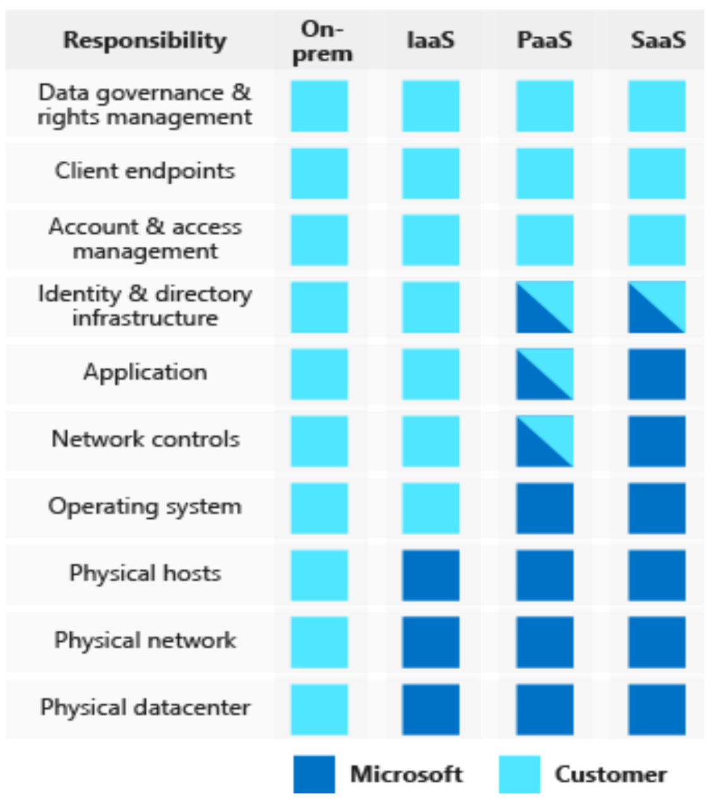

ไม่ว่าจะใช้ Service Model แบบไหน สิ่งที่ผู้ใช้บริการต้องดูแลด้วยตัวเองอยู่เสมอนะครับ คือ
- ข้อมูลของเรา (Data)
- ดูแล Endpoint ให้ปลอดภัย เช่นถ้าเราเลือกใช้ Azure App Service เราจะดูแล Web Server ยังไง
- จัดการ User Account เอง, จัดการสิทธิในการเข้าถึง Resources ต่างๆที่เราสร้างขึ้น (Access Management, ACL)

ส่วนการเลือก Service Model จะมีผลกับความรับผิดชอบของเราที่มากขึ้นหรือน้อยลงนะครับ

เช่น ถ้าเราเลือกบริการแบบ IaaS เช่น Azure VMs นั้นเราต้องดูแลตั้งแต่ OS เอง ทำให้เราต้องจัดการกับความปลอดภัยเอง เช่น การติดตั้ง Antivirus , ดูแล OS Security Patch เอง

แต่ถ้าใช้ PaaS เช่น Azure App Service นั้น Microsoft จะช่วยดูแลจัดการให้เราหมดเลยในระดับ OS ทั้ง Patching, Antivirus

## Defense-In-Depth
เป็นแนวทางในการสร้างความปลอดภัยในระบบของ Azure โดยแบ่งออกเป็น 7 Layes นะครับ

- **Physical**: Microsoft เป็นคนดูแลและจัดการรักษาความปลอดภัยในส่วนของ Data Center โดยคนทั่วไปไม่สามารถเข้า Data Center ของ Microsoft ได้ครับ
- **Identity & Access**: เพื่อระบุว่าคนๆนั้นมีตัวตนเพื่อมอบสิทธิในการเข้าถึงบริการต่างๆที่กำหนดไว้
- **Perimeter**: คือการป้องกันไม่ให้ผู้ใช้หรือระบบภายนอกสามารถเข้าถึงระบบของเรา เช่น การเลือกใช้ Firewall ในการเปิด Port บน Server หรือ Azure Application Gateway ในการจัดการกับการยืนยันตัวตน
- **Network**: คือการดูแลโครงข่ายในระบบเช่น Azure Virtual Network สำหรับการจัดการ Network ให้กับ VMs, VPN Site-to-Site เพื่อเชื่อม Network On-Premise กับ Network Azure
- **Compute**: คือการดูแลความปลอดภัยในระดับ Compute Service เช่น การ Config NSG เพื่ออนุญาตให้ เข้าถึง Azure VMs ได้บาง Port
- **Application**: คือเราป้องกันในระดับ Application ของเราอย่างไร เช่นการเก็บข้อมูลที่เป็นความลับของระบบ เช่น Database Connection ไว้ใน Server เท่านั้น
- **Data**: คือเราดูแลความปลอดภัยข้อมูลของเราอย่างไร เช่นการเข้ารหัสข้อมูลที่ใช้งาน

> แนะนำ [Video](https://youtu.be/OTGMi0ksjXY) อธิบาย [Defense-In-Depth](https://youtu.be/OTGMi0ksjXY) ทั้ง 7 Layers เทียบกับบริการที่ Azure รองรับครับ

## Azure Security Center
เป็นบริการช่วยตรวจสอบการทำงานของบริการต่างๆบน Azure ว่ามีความปลอดภัยหรือไม่ เพื่อแนะนำขั้นตอนในการทำให้บริการมีความปลอดภัยมากขึ้น โดยเบื้องหลังนั้นทาง Microsoft ใช้ AI ในการช่วยตรวจสอบน่ะครับ

ตัวอย่างเช่น การตรวจสอบการติดตั้ง Antivirus บน VMs, การแนะนำให้เข้ารหัสฐานข้อมูล

มีบริการอยู่ทั้งหมด 2 Tiers
- Free
- Standard (ทดลองใช้งานฟรี 30 วัน)

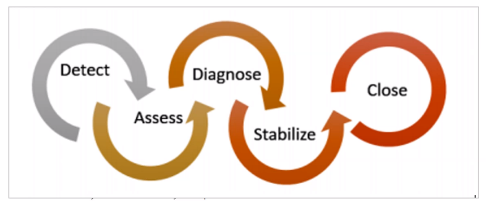

### Azure Security Center Walk Through
เรามาดูตัวอย่างการใช้งานจริงของ Azure Security Center กันครับ

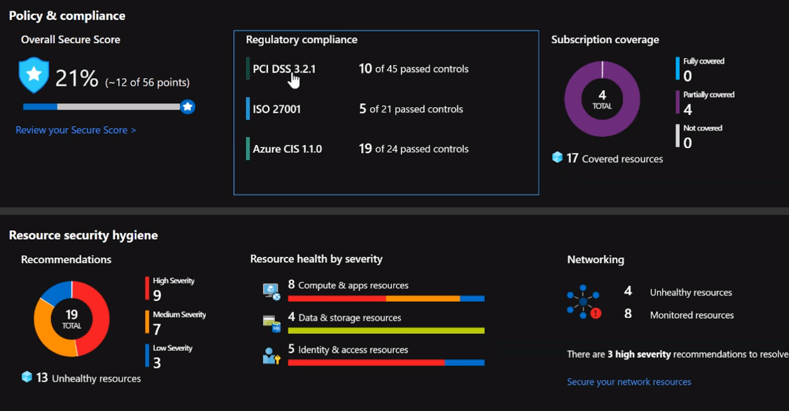

ตัวอย่างหน้าตาของ Azure Security Center ครับ เราจะพบว่าแบ่งประเภทหมวดหมู่ของการแนะนำเยอะเลย ไม่ว่าจะเป็น Compute, Data, Identity, Networking

เมื่อทดลองกดเข้าไปดูรายละเอียดในส่วนของ Compute & app resources เราจะเห็นคำแนะนำที่เกี่ยวข้องเช่น แนะนำให้ Encrypted Disk สำหรับ VMs ครับ

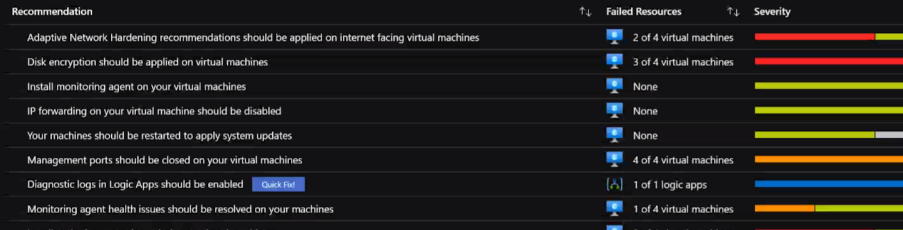

ตัวอย่างคำแนะนำสำหรับบริการ Compute & app resources

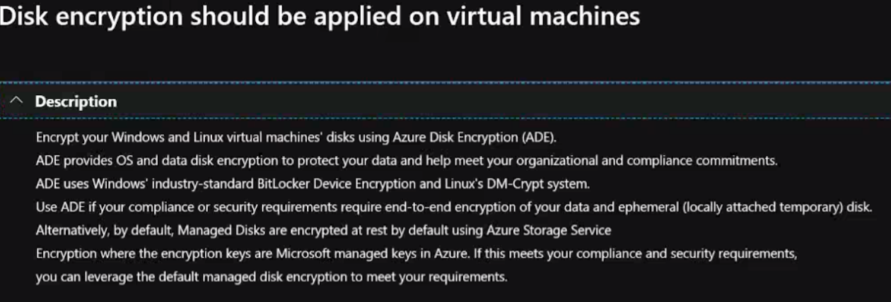

รายละเอียดที่มากขึ้นของการแนะนำให้เข้ารหัส Disk ใน VM

ทดลองกดเข้าไปดูรายละเอียดในส่วนของ Identity & Access น่ะครับ เราจะเห็นคำแนะนำที่เกี่ยวข้องเช่น ให้ลบ Users ที่ได้รับสิทธิ Owner ของ Azure Subscription ที่ไม่ได้ใช้งานแล้ว

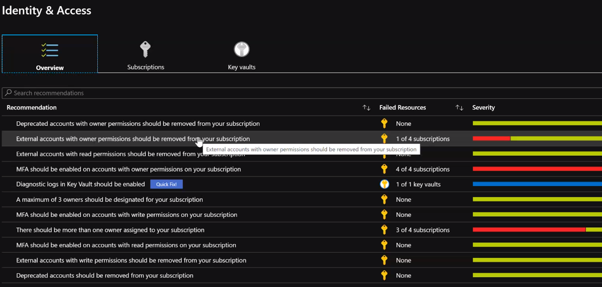

ตัวอย่างคำแนะนำสำหรับบริการ Identity & Access

ทดลองกดเข้าไปดูรายละเอียดในส่วนของ Networking น่ะครับ เราจะเห็นคำแนะนำที่เกี่ยวข้องเช่น ควรปิด Ports ที่ไม่ได้ใช้บน VMs

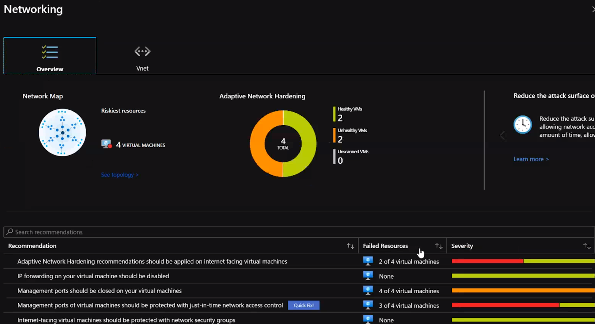

ตัวอย่างคำแนะนำสำหรับบริการ Networking

### บริการที่น่าสนใจของ Azure Security Center
- Threat Protection ช่วยตรวจสอบการใช้งานที่ผิดปรกติในระบบ และแจ้งเตือนผู้ใช้บริการ

- Just-In-Time Access Control จัดการ Policy ในการเข้าถึง VMs เช่น ให้เข้า VMs ได้แค่เวลาที่กำหนด หรือ สามารถ Request ขอสิทธิในการเข้าถึง VMs ได้

พอเราติดตั้ง Just In Time แล้วจะมีตัวเลือกให้เราจัดการสิทธิในการเข้าถึง VMs มากขึ้นนะครับ

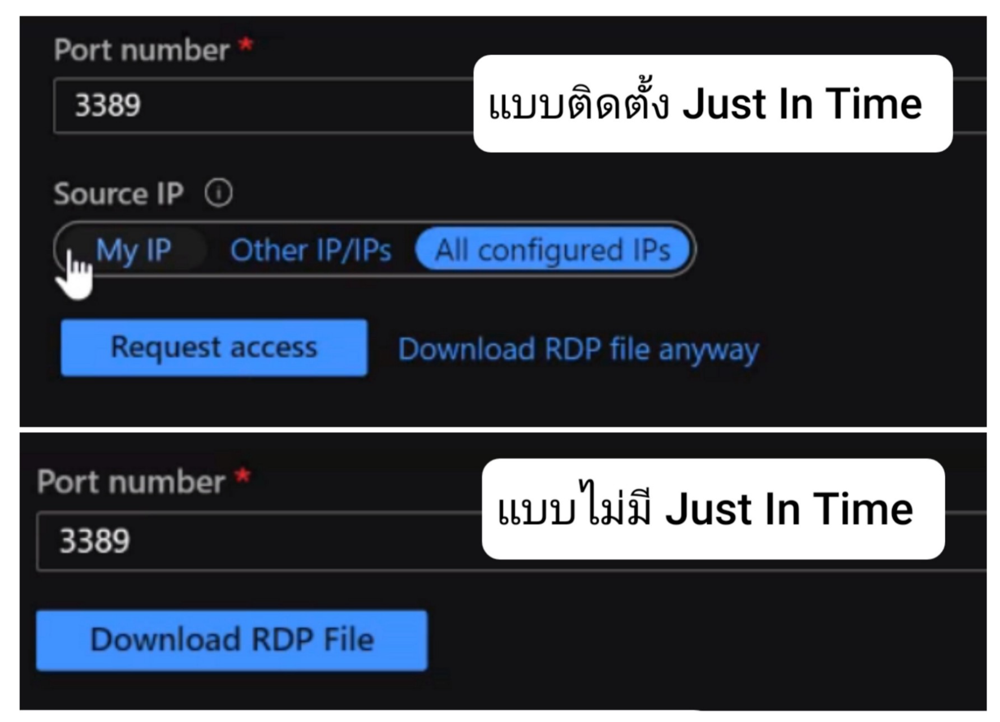

ถ้าเราไม่ติดตั้ง Just-In-Time เราจะพบคำเตือน เช่น ในภาพข้างล่างน่ะครับ ว่าเรากำลังเปิด RDP Port 3389 อยู่ตลอด 24 ชั่วโมง ซึ่งถ้าตาม Practise ที่ดีแล้วเขาควรจะเปิด Remote Desktop Port นี้เฉพาะตอนที่จะใช้จริงๆเท่านั้นน่ะครับ

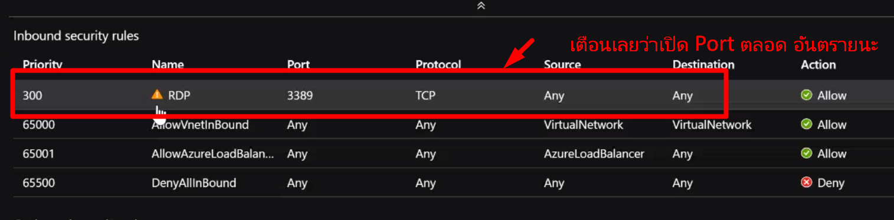

## Identity And Access
เป็นกระบวนการที่เกี่ยวข้องกับ Authentication and Authorization น่ะครับ โดย
- **Authentication** คือการยืนยันตัวตน เช่นการระบุ User Password
- **Authorization** คือการมอบและตรวจสอบสิทธิในการใช้งานระบบหลังจากที่ได้รับการยืนยันตัวตนแล้วครับ

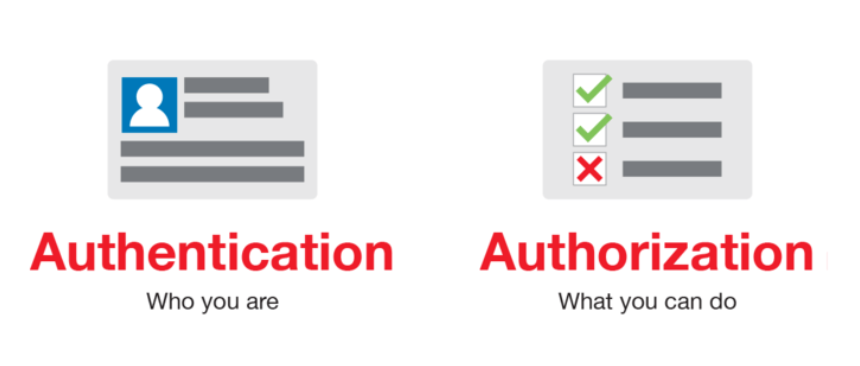

## Azure Active Directory
Azure มีบริการที่ช่วยเราจัดการในเรื่องของ Identity And Access ที่ชื่อว่า Azure Active Directory นะครับ

โดยจะทำหน้าที่เป็น Identity Management On Cloud เพื่อทำหน้าที่ Authentication and Authorization ในการเข้าถึงบริการต่างๆใน Azure ครับ

เราอาจจะกำลังใช้งาน Azure Active Directory อยู่แล้วโดยที่เราไม่รู้ตัวน่ะครับ เช่นการใช้บริการ Office 365, Azure ก็จะมีบริการของ Azure Active Directory ติดตั้งมาด้วยอยู่แล้วครับแบบ Free Edition

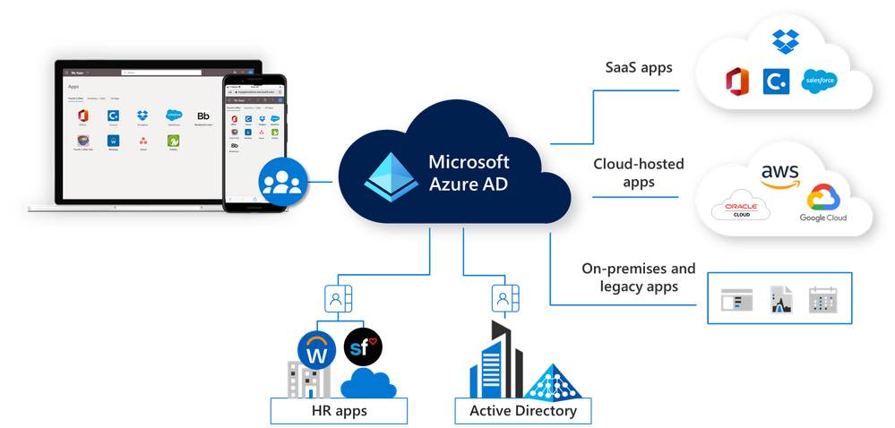

Azure AD จาก 
 <a href="https://techcommunity.microsoft.com/t5/small-and-medium-business-blog/azure-active-directory-premium-p1-is-coming-to-microsoft-365/ba-p/1275496">techcommunity.microsoft.com</a>

### Azure AD and Windows Active Directory Domain Services (AD DS)

สิ่งที่แตกต่างกันคือ Active Directory Domain Service (AD DS) ทำหน้าที่เป็น Directory Service (LDAP Service) ที่มีโครงสร้างแบบ Hierarchical (Forrest, Tree) ที่รวบรวม Resources ต่างๆเข้าด้วยกัน เช่น Computer, Printer, User, Organization มี DC, OU โดยจะทำหน้าทีเป็น Centralization ในการเข้าถึงและเชื่อมต่อ Resources ในองค์กร ช่วยให้เราทำ Single Sign On ได้สะดวก

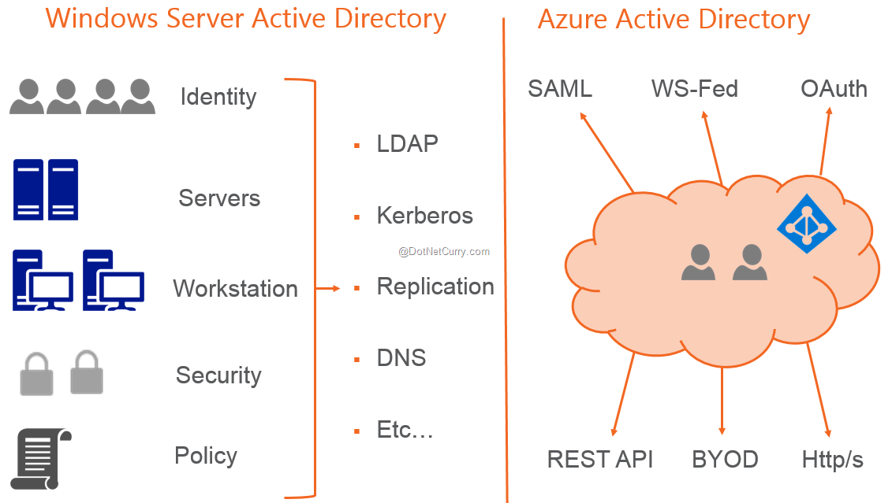

ความแตกต่างของ Azure AD และ AD DS จาก 
 <a href="https://www.dotnetcurry.com/windows-azure/1274/azure-active-directory-basics-aspnet-mvc-developers">dotnetcurry.com</a>

Azure AD เป็น Identity management ไม่ใช้ Directory Service มีโครงสร้างแบบ Flat ไม่ใช่ แบบ Hierarchical ไม่มี DC, OU ทำได้แค่สร้าง User, Group Account และ Join Computer ไม่ได้

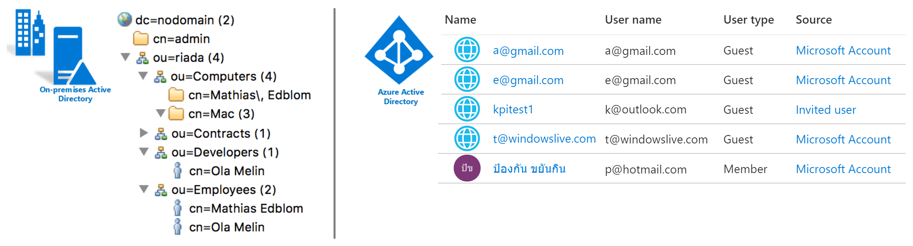

AD DS (ซ้าย) และ Azure AD (ขวา)

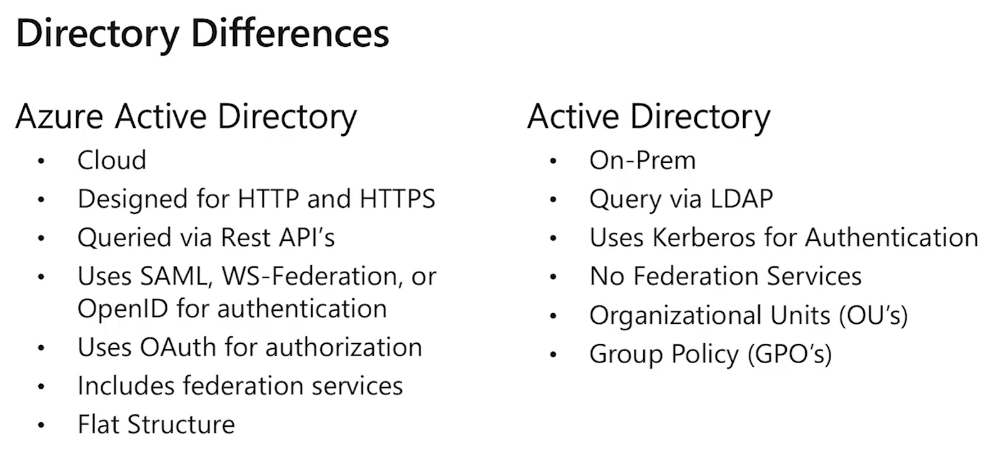

### Hybrid Connection with Azure AD Connect

เราสามารถเข้าถึงบริการใน Azure ได้ผ่าน User Account ในองค์กร ที่อยู่ใน AD DS ได้ด้วยการ Sync User Account จาก AD DS มายัง Azure AD ด้วย Tool ชื่อ Azure AD Connect ซึ่งก็คือ Cloud Deployment Model แบบ Hybrid นั้นเองครับ

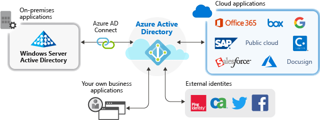

Azure AD Connect จาก
 <a href="https://knowledge-junction.com/2020/02/27/azure-identity-and-access-management-part-1-azure-active-directory-overview/">knowledge-junction.com</a>

โดย Azure AD ใน Free Editioin สามารถที่จะ Sync ข้อมูลจาก AD DS ได้ทั้งหมด 500,000 Objects นะครับ เยอะโฮกกก!

ศึกษารายละเอียดเพิ่มเติมได้ที่นี้น่ะครับ

- [Hybrid Identity Required Ports and Protocols](https://docs.microsoft.com/en-us/azure/active-directory/hybrid/reference-connect-ports)

### Azure AD User Types
มาจากการสร้างใน Azure AD
มาจากการ Sync จาก AD DS ซึ่งจะพบว่า Source ต่างกันนะครับ

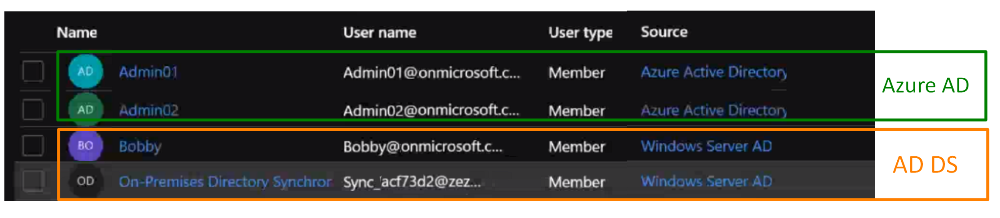

## Multi-Factor Authentication (MFA)
User Name, Password ไม่เพียงพอในการรักษาความปลอดภัยแล้วในทุกวันนี้ เราจำเป็นต้องการความปลอดภัยที่มากขึ้น จึงเป็นที่มาของการ Authentication แบบ Multi-Factor Authenticatioon (MFA) ที่จะเพิ่มขั้นตอนที่มากขึ้น เช่นการ ส่ง Access Code เข้า SMS ในมือถือของเราและนำมายืนยันตัวตนในระบบ

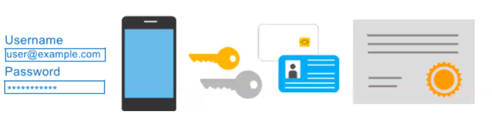

## Role-Based Access Control (RBAC)
การจัดการสิทธิในระดับในการเข้าถึง Resources ภายใน Subscription ด้วยการรวมสิทธิเข้าด้วยกันเป็นกลุ่มและเรียกกลุ่มนั้นว่า Role โดย Azure เตรียม Built-in Role มาให้ให้เราเลือกใช้ได้เยอะเลยครับ
Azure Governance and Compliance คือการกำหนดสิทธิ กำหนด Policy ในระดับที่สูงกว่า Subscription เช่นการใช้ Azure Blueprint

### Azure Governance and Compliance
คือการกำหนดสิทธิ กำหนด Policy ในระดับที่สูงกว่า Subscription เช่นการใช้ Azure Blueprint

### Privileged Identity Management
การกำหนดสิทธิให้ User ภายในช่วงเวลาที่กำหนดเท่านั้น เช่นให้สิทธิในการใช้งาน Azure App Service ในระยะเวลาแค่ 5 วัน น่าสนใจมาก แต่มีบริการอยู่ใน Azure AD PREMIUM P2 นะครับ Free Edition อดดดดด(เศร้า)

## Encryption
### Symmetric Encryption
เข้าและถอดรหัสด้วย Key เดียวกัน ทำงานเร็ว

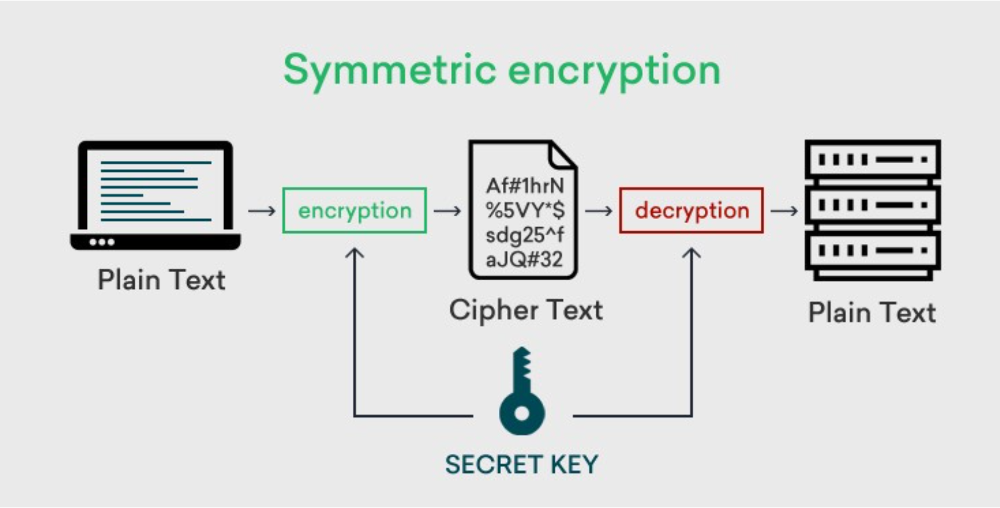

ภาพจาก  
 <a href="https://www.clickssl.net/blog/symmetric-encryption-vs-asymmetric-encryption">clickssl.net</a>

 ### Asymmetric Encryption
 เป็นการเข้าและถอดรหัสด้วย Key-Pair คือเข้าด้วย Key นึง และถอดรหัสด้วย Key อีกอันนึง เช่น Public , Private key

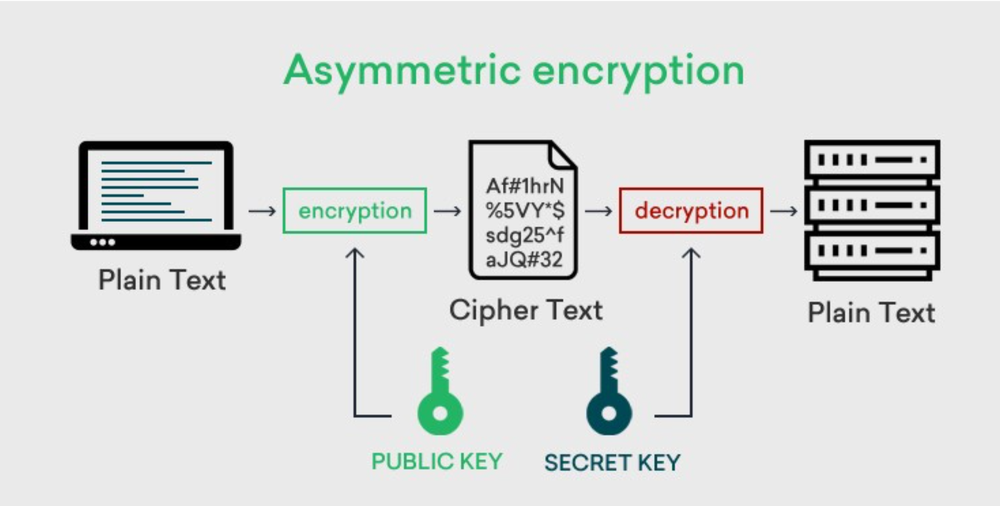

ภาพจาก  
 <a href="https://www.clickssl.net/blog/symmetric-encryption-vs-asymmetric-encryption">clickssl.net</a>

## Encryption on Azure Storage

### Encryption at Rest
เป็นการ Encrypt Data ใน State ใด State นึง เช่น Data ที่เก็บอยู่ใน Storage Account
- Storage จะถูก Encrypt ด้วย Storage Service Encryption (SSE)
- Disk จะถูก Encryption ด้วย Azure Disk Encryption (ADE)
- Database จะถูก Encrypt ด้วย Transparent Data Encryptioin (TDE)

### Encryption In Transit
การ Encrypt Data ในการรับส่งข้อมูล

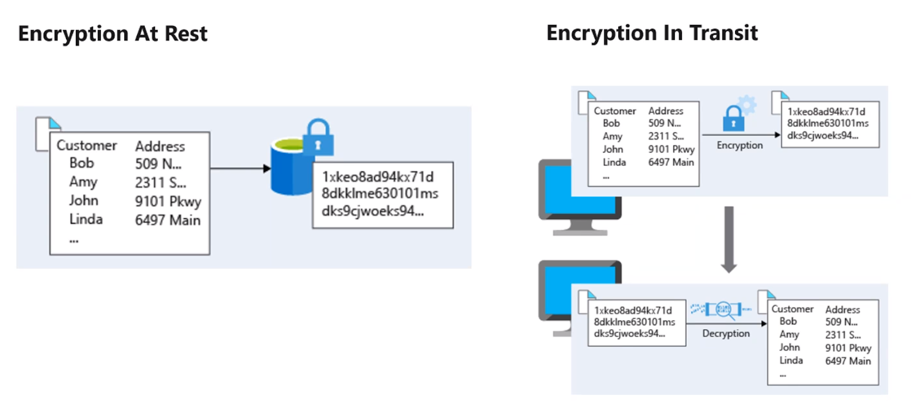

## Azure Certificate
Certificates ใน Azure จะใช้ Cryptography แบบ x.509 v3 โดยสามารถถูก Sign ได้ทั้งจาก Trusted Certificate Authority (CA)หรือ Self-Signed

## Azure Key Vault
ช่วยเก็บรักษาข้อมูลที่ต้องการความปลอดภัยสูง เช่น Security Key หรือ Azure Certificate

## Protect Your Network

### Azure Firewall (PaaS) 
การจัดการ Request ที่เข้าออก (Inbound/Outbound)

###  Azure Application Gateway 
ใช้ในกรณีที่ต้องการกันในระดับ Application Layer โดยเน้นการป้องกัน HTTP traffic โดยเฉพาะ รวมถึงกัน Cyber Threat ต่างๆด้วยครับ

### Network Virtual Appliances (NVAs)
จัดการ Network ประเภท Non-HTTP services ต่างๆ

### DDos (Distributed Denial of Service) 
ที่มีจุดประสงค์เพื่อทำให้เป้าหมายใช้งานไม่ได้ โดยการยิง Request มาจากหลายๆที่เข้ามาที่ระบบเรา

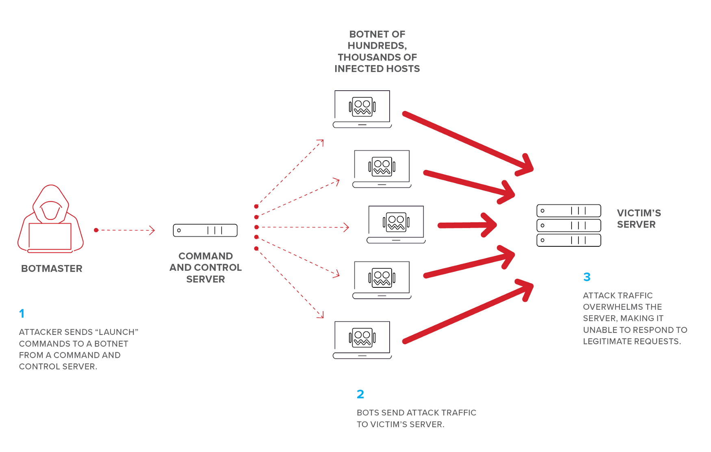

DDoS จาก 
 <a href="https://www.f5.com/labs/articles/education/what-is-a-distributed-denial-of-service-attack-">f5.com</a>

### Azure DDos Protection
เป็นบริการที่เข้ามาช่วยกันการโจมตีจาก DDoS โดยเฉพาะเลยครับ

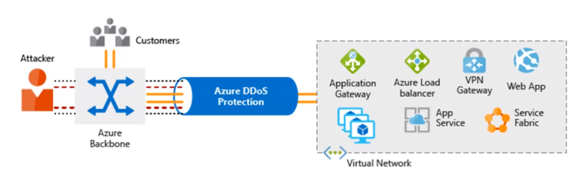

### Traffic inside VMs
จัดการ Traffic ภายใน Virtual Machine ได้ด้วย Network Security Group (NSG)เช่น Virtual Network อยู่กันคนล่ะ Subnet ทำยังไงให้เชื่อมกันได้

Express Route ต่างจาก VPN Gateway ตรงที่ไม่ได้ใช้ Public Link แต่ใช้ Link พิเศษที่เชื่อมต่อเข้า Azure กับ On-Premise ตรงๆ เพื่อ Bandwidth ที่เยอะขึ้น, Latency ที่น้อยลง, Secure ที่มากขึ้น แต่…….ราคาก็จะสูงกว่าแบบ VPN Gateway มากน่ะครับ

### Protect Shared Document
Azure มีบริการชื่อ Microsoft Azure Information Protection (AIP) ที่ช่วยป้องกันเอกสารและ Email ให้อยู่ในขอบเขตของการใช้งานที่ต้องการได้น่ะครับ เช่น อ่านเอกสารได้อย่างเดียวห้าม Print, อ่าน Email อ่านได้อย่างเดียวห้ามส่งต่อ

โดยเราจะกำหนด Label เพื่อเป็นกลุ่มของ Policy ที่ต้องการได้ เช่น Label Confidential ซึ่งจะอยู่ใน Azure Active Directory PREMIUM P1/P2 เพราะงั้น Free Edition ก็อดอีกแล้ววววว

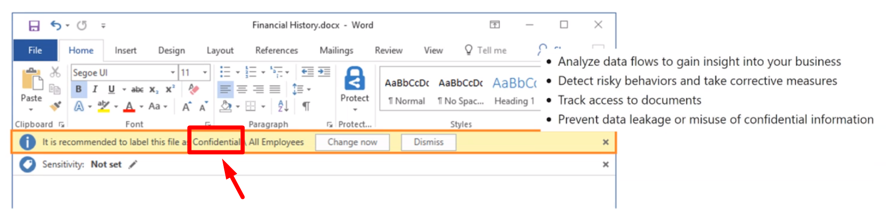

### Azure Advanced Threat Protection (ATP)
ช่วยหาพฤติกรรมที่ไม่พึงประสงค์ในระบบและแจ้งเตือนเรา เช่นมีการ Sign in ด้วย User เราจาก ต่างประเทศ และมาจากหลายๆ Computer ทาง ATP ก็จะ Block ให้เบย

### Understand Security Considerations for Application Lifecycle Management Solution
Microsoft มีบริการในการส่งเสริมการออกแบบและพัฒนาระบบที่เน้นความปลอดภัย ที่ชื่อว่า Microsoft Security Development Lifecycle (SDL)

โดยมีแนวทางแนะนำ, Best Practice และมีชุดเครื่องมือในการตรวจสอบ เพื่อช่วยให้เราพัฒนาระบบที่ได้ความปลอดภัยสูงครับ

ศึกษาเพิ่มเติมได้ที่นี้นะครับ
- [Microsoft Security Development Lifecycle (SDL)](https://www.microsoft.com/en-us/securityengineering/sdl)

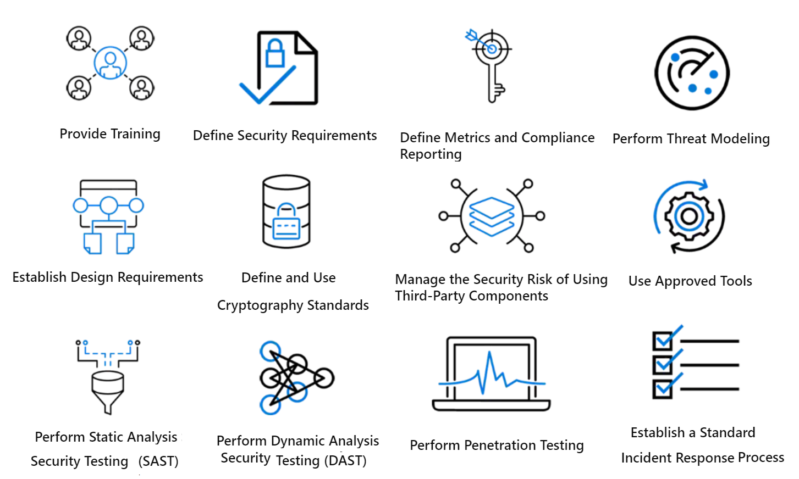

## เนื้อหาเพิ่มเติมที่เกี่ยวข้องกับการสอบครับ
- [Digital Skill — Azure Fundamentals (ภาษาไทย)](https://course.digitalskill.org/courses/course-v1:Microsoft+AZ-LEARN-0+2019/about)
- [ExamTopics — AZ-900 Exam Actual Questions](https://www.examtopics.com/exams/microsoft/az-900/view/1/)
- [Facebook — Data TH.com — Data Science ชิลชิล (ภาษาไทย)](https://www.facebook.com/datasciencechill/posts/872166769835048/)
- [Github — Microsoft Certified Azure Fundamentals (ภาษาไทย)](https://github.com/Tizcom/AZ-900/blob/main/Microsoft%20Azure%20Fundamentals_Handout.pdf)
- [Medium — Azure AZ-900 Exam Preparation Guide: How to pass in 3 days](https://medium.com/weareservian/azure-az-900-exam-preparation-guide-how-to-pass-in-3-days-dabf5534507a)
- [Medium — วีธีลงทะเบียนสอบ AZ-900 Online ที่บ้านด้วย Azure Exam Voucher](https://medium.com/@ponggun/%E0%B8%A7%E0%B8%B5%E0%B8%98%E0%B8%B5%E0%B8%A5%E0%B8%87%E0%B8%97%E0%B8%B0%E0%B9%80%E0%B8%9A%E0%B8%B5%E0%B8%A2%E0%B8%99%E0%B8%AA%E0%B8%AD%E0%B8%9A-az-900-online-%E0%B8%97%E0%B8%B5%E0%B9%88%E0%B8%9A%E0%B9%89%E0%B8%B2%E0%B8%99%E0%B8%94%E0%B9%89%E0%B8%A7%E0%B8%A2-azure-exam-voucher-c0d027253d34)
- [Medium — AZ-900 รีวิวแนวข้อสอบและวิธีลงสอบที่ศูนย์สอบ](https://link.medium.com/bX2BY3vin8)
- [Medium — AZ-900 สรุปละเอียดสุดๆ](https://medium.com/@manita.swwp/virtual-academy-for-microsoft-azure-fundamental-in-thai-language-f5354c2f8634)
- [Microsoft Learn-Azure Fundamentals](https://docs.microsoft.com/en-us/learn/paths/azure-fundamentals/)
- [Udemy — Microsoft Azure — Beginner’s Guide + AZ-900 (มีค่าใช้จ่าย)](https://www.udemy.com/course/microsoft-azure-beginners-guide)
- [WhizLabs — AZ-900 (มีค่าใช้จ่าย)](https://www.whizlabs.com/learn/course/microsoft-azure-az-900)
- [Workshop เล็กๆจาก Microsoft สำหรับ AZ-900 ครับผม](https://microsoftlearning.github.io/AZ-900T0x-MicrosoftAzureFundamentals/)

## สรุป
ในบทนี้เราได้เรียนรู้ในเรื่องของ Security, Responsibility and Trust in Azure
ด้วยแนวทาง Defense-In-Depth ทั้ง 7 Layes (Physical, Identity & Access, Perimeter, Network, Compute, Application, Data)

ตัวอย่างของบริการ เช่น Azure Security Center, Azure Active Directory, Azure Key Vault, Azure DDos Protection, Microsoft Azure Information Protection
