# Standards Infrastructure, Resources Organization

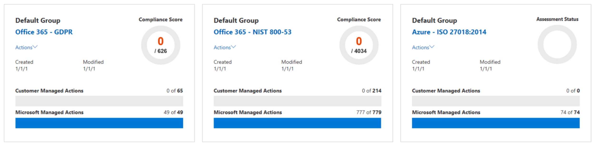

## Apply and Monitor Infrastructure Standards with Azure Policy
คือการตรวจสอบระบบหลังจากที่ทำงานไปได้ระยะนึงแล้ว ว่าทำงานได้ปรกติไหม, Performance, Availability, Security เป็นยังไง รวมถึง ประเมินการใช้งาน Azure Resource ว่าเป็นไปตามมาตราฐานขององค์กรหรือไม่

## Governance and Compliance
เป็นการออกแบบ Policy เพื่อให้ผู้ใช้งานสร้าง Azure Resources บนมาตราฐานที่องค์กรกำหนดไว้ และ ออกแบบ Access Control เพื่อจัดการกับสิทธิในการเข้าถึง Azure Resources

โดยเราจำเป็นต้องรู้ Requirements ให้ครบก่อนถึงจะสามารถออกแบบ Governance and Compliance ได้

ตัวอย่าง Policy เช่น การควบคุมการสร้าง Azure VM ได้เฉพาะ Size ที่กำหนด และ Region ต้องเป็น Southeast Asia เท่านั้น, Web ต้องเป็น HTTPS เท่านั้น, VM ต้องติดตั้ง Antivirus

ตัวอย่าง Access Control เช่นให้สิทธิผู้ใช้บางคนในการเข้าถึง Resource Group, Subscription

Enterprise Governance Management
ก่อนที่เราจะเปิดใช้งาน Governance and Compliance ได้นั้น เราต้องติดตั้ง Azure Management Group เพื่อเป็น Container สำหรับจัดการกับโครงสร้างของ Policy ครับ โดย Azure Management Group จะถูกวางอยู่เหนือ Subscription อีกทีนะครับ

รูปแบบโครงสร้างของ Azure Management Group
- ระดับบนสุดคือ Root Manage Group (ลบไม่ได้ทำได้แค่เปลี่ยนชื่อ)
- ระดับถัดลงมาคือ Child Management Group
- ระดับล่างสุดคือ Resources ต่างๆ Subscription, Resource Group, Resources

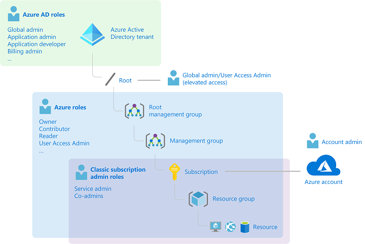

ภาพ จาก  
 <a href="https://docs.microsoft.com/en-us/azure/role-based-access-control/rbac-and-directory-admin-roles">docs.microsoft.com</a>

ถ้าเรา Assign Policy ที่ Root Management Group ก็จะ Apply ไปทั้ง Child Management Group, Resources ทั้งหมด
แต่ถ้า Assign Policy ที่ Child Management Group ก็จะ Apply ลงไปยัง Resources ทั้งหมด ของ Child Management Group นั้นเท่านั้น

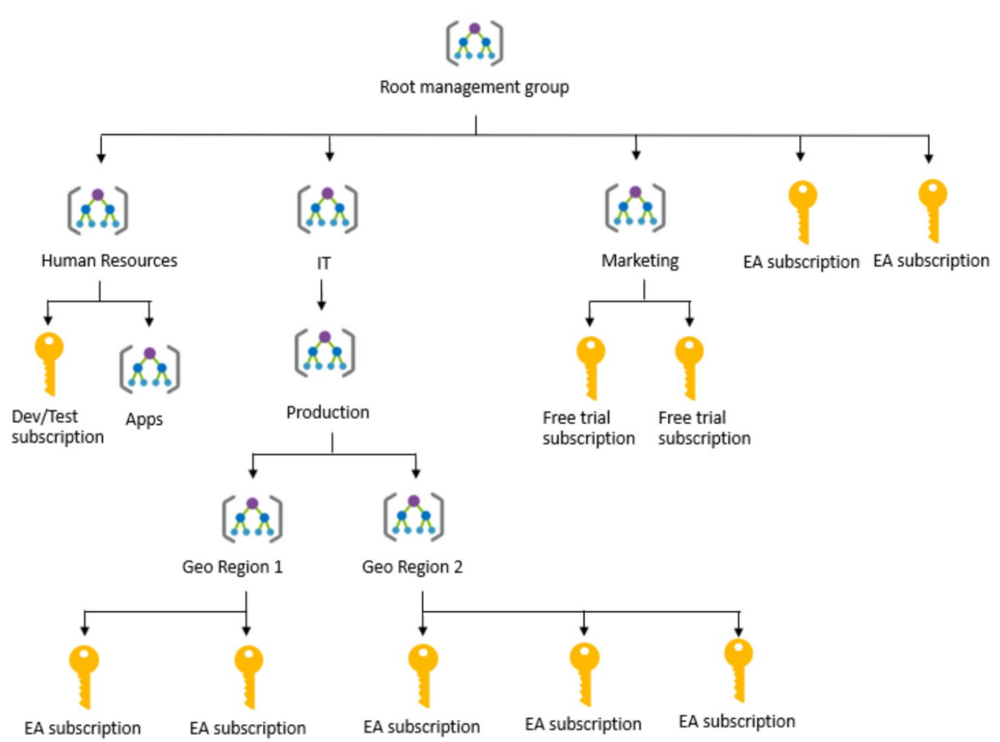

> ไม่ควรให้ Management Group ลึกเกิน 6 Levels เพราะจะทำให้ Policy มีความซับซ้อนจนเกินไป ยากต่อการจัดการในภายหลัง

## Azure Policy
เป็นบริการที่ช่วย สร้าง (Create), มอบหมาย (Assign) และจัดการ (Manage) Policy ให้กับบริการบน Azure โดย Azure จะทำการประเมินการใช้งาน Resources ของเราว่ามีตัวไหนบ้างที่ตรงตาม Policy (Compliance) และตัวไหนที่ไม่ตรงตาม Policy (Non-Compliance)

**ขั้นตอนการใช้งาน Policy**
1. Policy Definition เป็นการเลือกเงื่อนไขต่างๆเพื่อให้ตอบโจทย์กับกฎเกณฑ์มาตราฐานในองค์กร เช่นการกำหนด VM Size โดยการจัดการจะอยู่ในรูปแบบ File JSON ซึ่งเราสามารถเลือกได้ว่าจะสร้าง Policy ใหม่ (Initiative Definition) หรือเลือกจาก Policy Built-in ที่ Azure เตรียมไว้ให้ได้เลยครับ (Policy Definition)

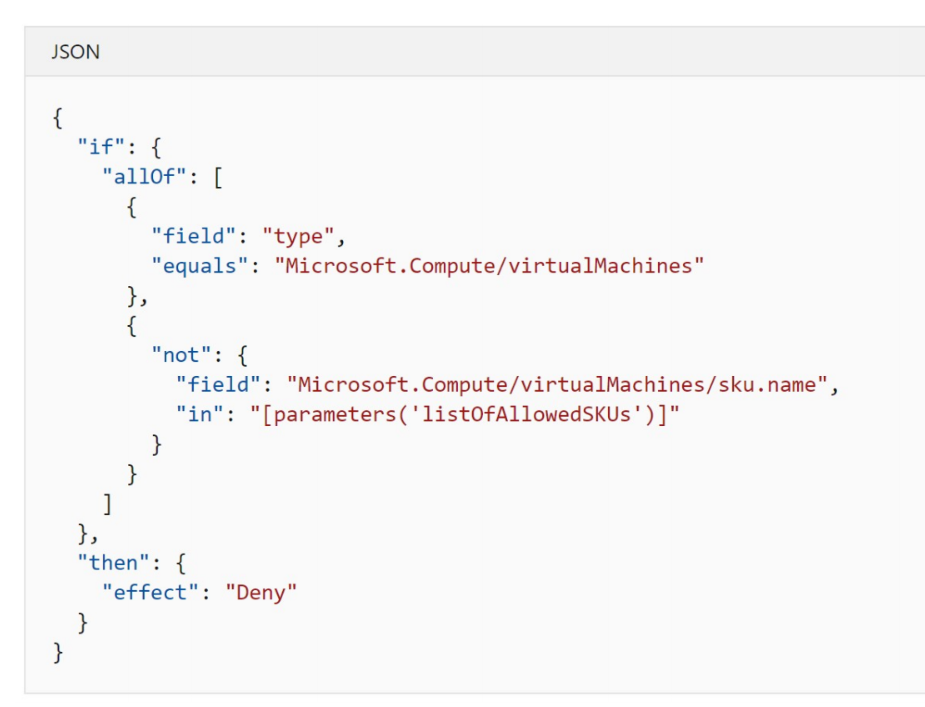

 
ตัวอย่าง Policy ในรูปแบบไฟล์ JSON

ภายใน Policy Definition นั้นจะประกอบไปด้วย Policy หลายๆอันรวมกันเช่น
- ตรวจสอบ SQL Database ที่ไม่มีการทำ Encryption
- ตรวจสอบ OS บน VM ที่มีช่องโหว่ด้านความปลอดภัย (Vulnerabilities)

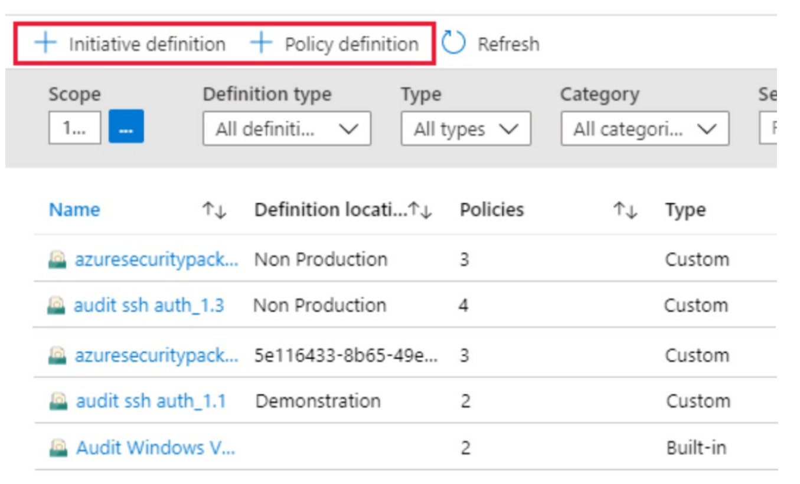

 
ตัวอย่าง Policy ทั้งแบบ Initiative Definition (Custom) และแบบ Policy Definition (Built-in)

2. นำ Policy Definition ไปปรับใช้กับ Resources เช่น Azure Subscription, Resource Group และ Resources

3. ทำการตรวจสอบผลการประเมิน Resources ว่ามี Resources ใดที่ Non-Compliance หรือไม่ เพื่อแก้ไขให้ตรงตาม Policy ต่อไป

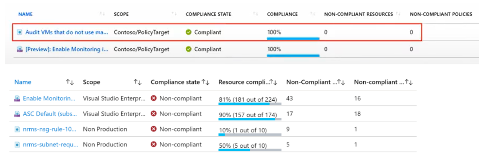

 
ตัวอย่าง Compliance และ Non-compliance Resources ตาม Policy ทีเรากำหนดไว้

## Azure Blueprints

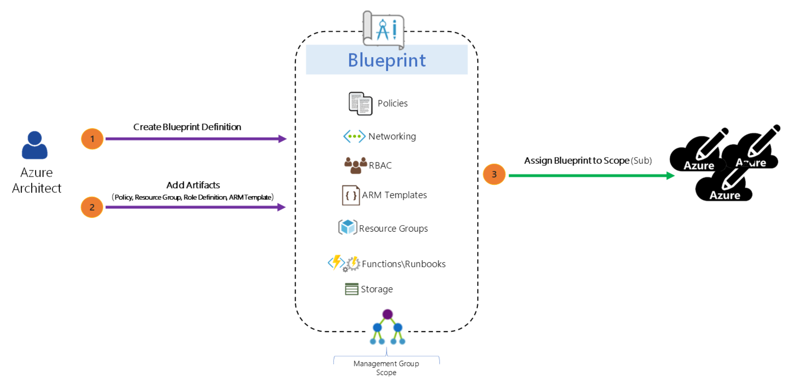

ภาพจาก  
 <a href="http://www.buchatech.com/2018/09/architect-your-cloud-with-azure-blueprints/">buchatech.com</a>

คือการออกแบบโครงสร้างของ Resources ที่เราต้องการไว้ล่วงหน้า โดยมีข้อดีคือเราสามารถนำโครงสร้างนี้ไปติดตั้งเป็น Resources จริงๆในภายหลัง สามารถทำซ้ำได้และยังสามารถควบคุมให้สอดคล้องกับ Governance and Compliance ในองค์กรด้วยได้อีกด้วยครับ

ตัวอย่างเช่น ออกแบบการสร้าง VM ไว้ล่วงหน้าว่าถ้าสร้างแล้วต้องติดตั้ง Antivirus, Agent สำหรับการ Backup, ให้ User ที่ดูแลระบบ Remote Access เข้า VM ได้, ต้องอยู่ใน Region Southeast Asia, Encrypt Disk ใน Virtual Machine

ซึ่งเราจะเห็นว่าเกี่ยวกับทั้ง VM, Policy, Azure Access Control ซึ่งถ้าเราสร้างเองผ่าน Azure Portal ทุกครั้งจะค่อนข้างช้าและอาจจะได้ผลลัพธ์ที่ไม่เหมือนกันทุกครั้ง (Human Error)

การสร้าง Blueprint หรือ Template ไว้ล่วงหน้าจะช่วยให้เราติดตั้ง Resources ซ้ำๆได้อย่างสะดวกในจัดการ Deploy Template ของทรัพยากรต่างๆ และ Artifacts อื่นๆ เช่น
- การกำหนดบทบาท (Role Assignments)
- การกำหนดนโยบาย (Policy Assignments)
- Azure Resource Manager Templates
- กลุ่มทรัพยากร (Resource Groups)

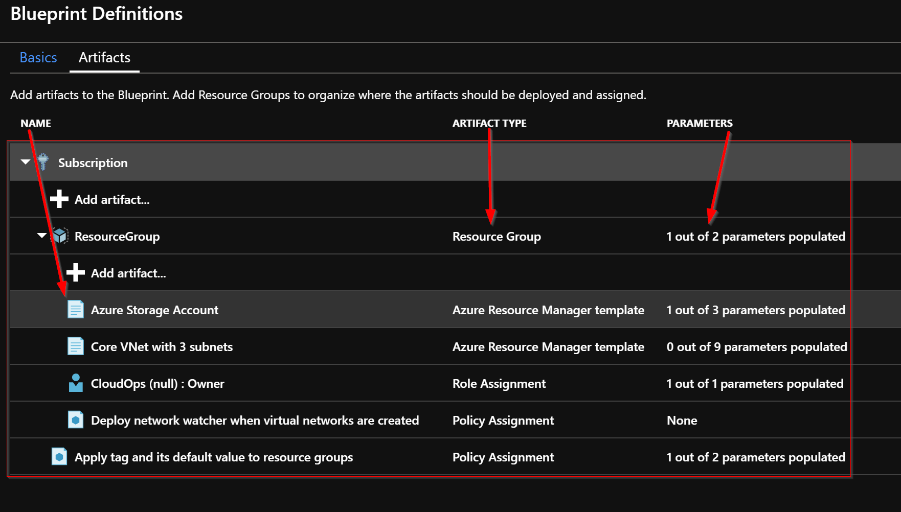

ภาพจาก  
 <a href="http://www.buchatech.com/2018/09/architect-your-cloud-with-azure-blueprints/">http://buchatech.com</a>

 > การสร้าง Blueprints Definitions ด้วย Role Assignment, Policy Assignment, Azure Resource Manager Template และ Resource Group

 ## Service Compliance
เป็นช่องทางในการสืบค้นหาข้อมูลว่าบริการต่างๆบน Azure นั้นสอดคล้องกับ Compliance ขององค์กรต่างๆหรือไม่ เช่น GDPR, ISO โดยจะประกอบด้วยบริการดังนี้

### Microsoft Privacy Statement 
เพื่อแจ้งวัตถุประสงค์ของการขอข้อมูลลูกค้าที่ใช้บริการ Azure เพื่อความโปร่งใสและมั่นใจได้ว่า Microsoft ไม่นำข้อมูลของลูกค้าไปเปิดเผยต่อแน่นอน

### Microsoft Trust Center 
เป็นช่องทางในการค้นหารายละเอียดของ บริการใน Azure ที่เกี่ยวข้องกับ Security, Privacy และ Compliance

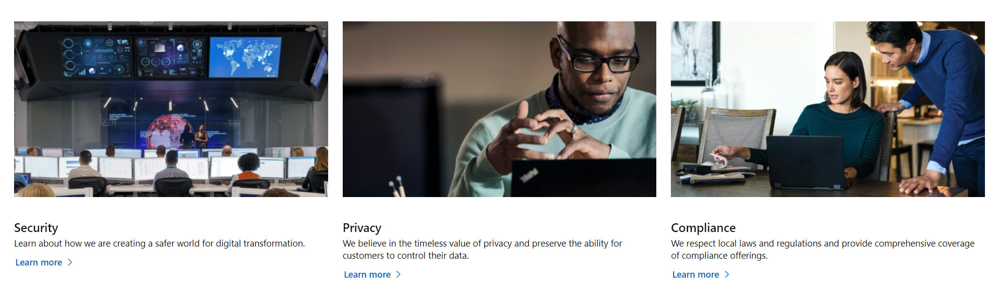

ภาพจาก 
 <a href="https://www.microsoft.com/en/trust-center">Microsoft Trust Center</a>

 ### Service Trust Portal (STP)
 ดู Audit Reports ว่าบริการของ Azure นั้น Comply Data Protection Standards และผ่านมาตราฐานจาก Regulator ต่างๆได้ เช่น SOC, FedRAMP, ISO 27001, PCI/DSS

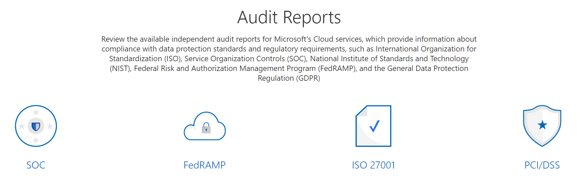

ภาพจาก 
 <a href="https://servicetrust.microsoft.com/">Service Trust Portal (STP)</a>

 ### Compliance Manager
 เป็น Risk Assessment Tool แบบ Workflow คือจะมีบริการเป็นขั้นตอนให้เราเลือกเพื่อวิเคราะห์ว่าบริการบน Azure ที่เราติดตั้งอยู่นั้นตรงกับ Compliance หรือไม่ โดยเราจะเห็นคะแนน Assessment ออกมาครับ

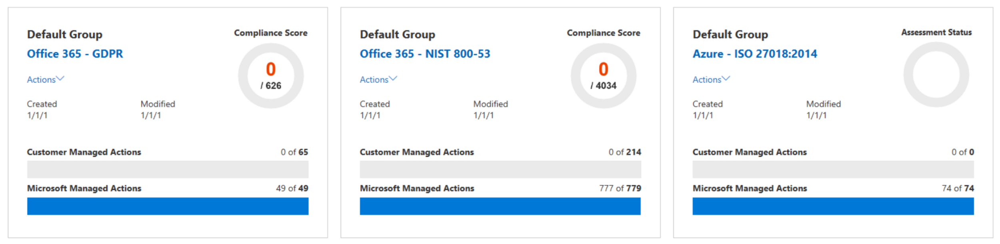

## Resource Monitoring
บริการในการตรวจสอบการใช้งานบริการบน Azure ซึ่งจะมี 2 ส่วนหลักๆ

### Azure Monitor
ใช้เพื่อตรวจสอบบริการในมุมของ Performance และ Availability โดยเฉพาะ

#### แหล่งข้อมูลของ Azure Monitor
- **Application**	ข้อมูลเกี่ยวกับประสิทธิภาพและการทำงานของ Code ที่เราเขียนโดยไม่คำนึงถึงแพลตฟอร์ม
- **Operating **	ข้อมูลเกี่ยวกับระบบปฏิบัติการ(OS) ระบบเรารันอยู่สามารถดึงได้จาก Azure , Cloud Provider เจ้าอื่น , On-Premises
- **Azure Resources**	ข้อมูลเกี่ยวกับการดำเนินการของทรัพยากร Azure
- **Azure Subscription**	ข้อมูลเกี่ยวกับการดำเนินและจัดการ Azure Subscription
- **Azure Tenant**	ข้อมูลเกี่ยวกับการดำเนินการของบริการ Azure ระดับผู้เช่า (Tenant) เช่น Azure Active Directory

#### การตั้งค่า Azure Monitoring เพื่อรวบรวมข้อมูล (Diagnostic settings)

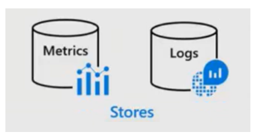

การทำงานเบื้องต้นของ Azure Monitor จะเริ่มจากการรวบรวมข้อมูลของ Resources ที่เราใช้งาน โดย
- Activity Logs จะบันทึกข้อมูุลเมื่อมีการแก้ไข Resources
- Metrics จะนำข้อมูลไปวัดผลว่า Resources มีการทำงานอย่างไร, ใช้งานไปแล้วเท่าไหร่

เราสามารถเพิ่มข้อมูลที่ต้องการรวบรวม โดยการเปิดใช้งาน Diagnostics และเพิ่ม Agent ไปยัง Resources ที่เกี่ยวข้อง เช่น
- เปิดใช้งาน Guest-Level Monitoring
- Performance Counters: รวบรวมข้อมูลของประสิทธิภาพ
- Event Logs: เปิดใช้งานบันทึก logs เหตุการณ์ต่างๆ
- Crash Dumps: รวบรวม Dumps Logs เมื่อระบบทำงานผิดพลาด (Crash)
- Sinks: ส่งข้อมูลการ Diagnostic ของคุณไปยังบริการอื่นๆ เพื่อการวิเคราะห์เพิ่มเติม
- Agent: กำหนดค่าการตั้งค่าAgent

#### บริการแสดงผลข้อมูลที่ได้จาก Azure Monitor

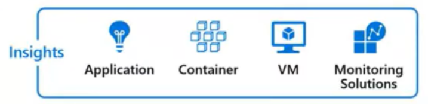

- **Application Insights**
เป็นบริการที่ตรวจสอบเรื่องความพร้อมใช้งาน, ประสิทธิภาพ บน Azure หรือ On-Premise เพื่อให้ข้อมูลเชิงลึกเกี่ยวกับการทำงานของระบบเรา ผมชอบใช้มากๆเลยครับติดตั้งง่าย เหมาะสำหรับ Azure App Service โดยเฉพาะเลยครับ

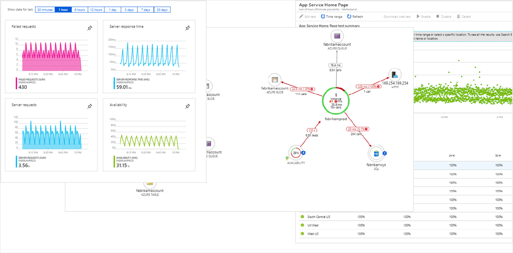

Application Insights 
 <a href="https://docs.microsoft.com/en-us/azure/azure-monitor/insights/insights-overview">docs.microsoft.com</a>

- **Azure Monitor for containers** เป็นบริการที่ออกแบบมาเพื่อตรวจสอบประสิทธิภาพของ container workload ที่ถูก deploy บน Kubernetes clusters ซึ่งโฮสต์บน Azure Kubernetes Service (AKS) โดย Azure Monitor for containers ช่วยให้เห็นประสิทธิภาพการทำงานได้โดยการรวบรวมหน่วยความจำและหน่วยประมวลผลจาก controllers, nodes และ containers ซึ่งมีอยู่ใน Kubernetes ผ่าน metrics API โดยมีการเก็บ container log ไว้ด้วย

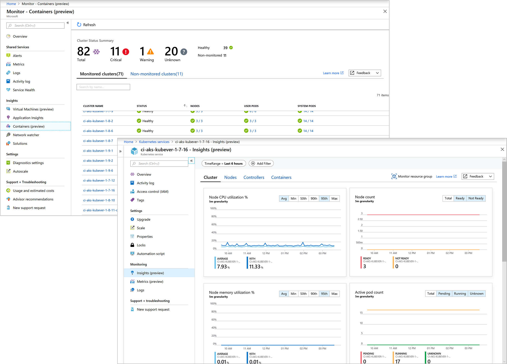

Azure Monitor Container 
 <a href="https://docs.microsoft.com/en-us/azure/azure-monitor/insights/insights-overview">docs.microsoft.com</a>

- **Azure Monitor for VMs** เป็นบริการที่ตรวจสอบ Azure VM ในภาพรวม โดยการวิเคราะห์ประสิทธิภาพและความสมบูรณ์ของ Windows และ Linux VM (รวมถึงกระบวนการทำงานต่างๆ และการอาศัยการเชื่อมโยงบนทรัพยากรอื่นๆ และกระบวนการภายนอก) นอกจากนี้ Azure Monitor for VMs ยังรองรับการตรวจสอบประสิทธิภาพและแอปพลิเคชันอื่นๆ ที่เกี่ยวข้องบน VM on-premise และ VM ที่โฮสต์กับผู้ให้บริการคลาวด์อื่นๆ ด้วย

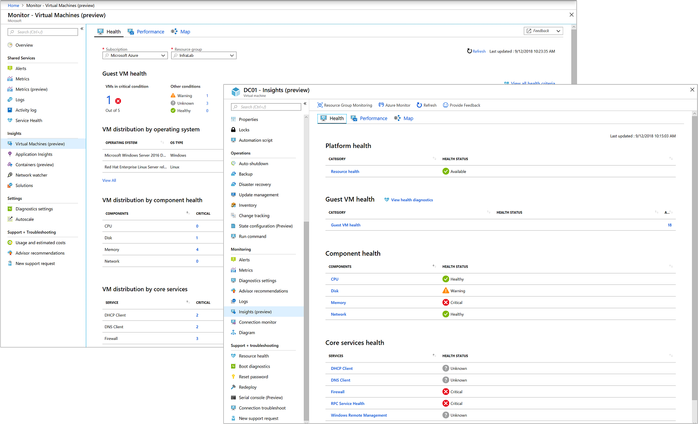

Azure Monitor for VMs 
 <a href="https://docs.microsoft.com/en-us/azure/azure-monitor/insights/insights-overview">docs.microsoft.com</a>

#### ภาพรวมการทำงานของ Azure Monitor

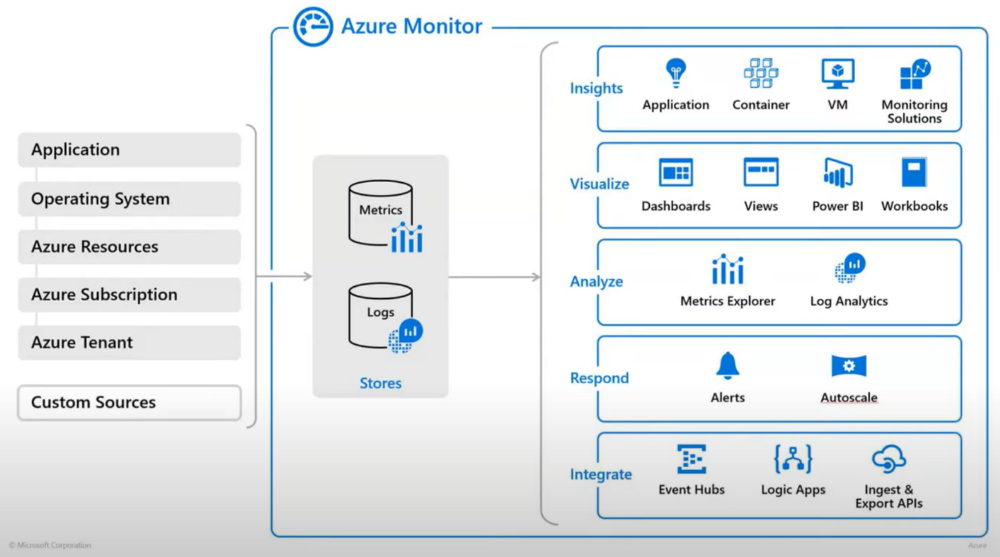

### Azure Service Health
ช่วยตรวจสอบ Data Center ที่เราใช้งานอยู่ ถ้า Data Center นั้นมีปัญหากระทบ Resources ที่เราใช้งาน ทาง Service Health จะแจ้งเตือนเราอัตโนมัติ

## Control and organize Azure resources with Azure Resource Manager

### Azure Resource Manager
เป็นบริการที่ใช้ในการ Deploy และ Management บริการบน Azure ทั้งหมดน่ะครับ

### Resource Group
เป็นบริการฟรีที่รวบรวม Resources เข้าด้วยกันเพื่อง่ายต่อการจัดการและดูแลโดยทุกครั้งที่เราสร้าง Resource เราจะต้องเลือก Resource Group เสมอนะครับ

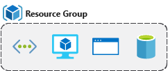

1 Resource อยู่ได้แค่ 1 Resource Group เท่านั้น และ Resource Group จะรวบรวมเฉพาะ Resources เท่านั้น ไม่สามารถมี Sub Resource Group ได้อีก (Nested Resource Group)

การออกแบบ Resource Group จะขึ้นอยู่กับลักษณะของการใช้งาน เช่นอาจจะแยกตาม Site ลูกค้า, แยกตาม Project, แยกตามแผนก

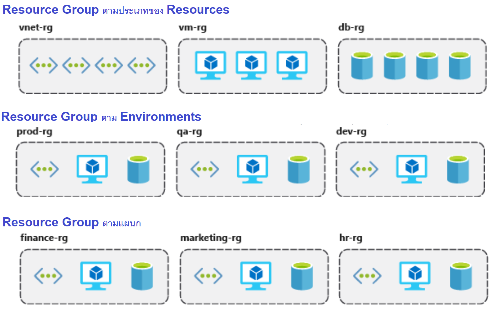

การลบผ่าน Resource Group จะทำให้ Resources ทั้งหมดในนั้นถูกลบไปด้วยน่ะครับ ซึ่งผมชอบมากเพราะทำให้เรามั่นใจว่าเวลาที่เราจะลบ Resources นั้นเราลบเฉพาะกลุ่มของ Resources ที่เกี่ยวข้องกัน ไม่เผลอไปลบ Resources อื่นที่ไม่เกี่ยวข้องครับ

Resource Group ยังช่วยให้เราจัดการกับสิทธิในการเข้าถึง Resources ได้สะดวกด้วยครับ โดยเมื่อเรามอบสิทธิให้กับผู้ใช้เข้าถึง Resources Group แล้วผู้ใช้คนนั้นก็จะสามารถเข้าถึง Resources ภายในนั้นได้ทั้งหมดเลยครับสะดวกมาก

การจัดการกับค่าใช้จ่ายด้วย Resource Group ก็ทำได้สะดวกมากเลยครับ เพราะใน เราสามารถดูค่าใช้จ่ายรวมที่เคยขึ้นใน Resource Group นั้นได้เลย

### Tag
ช่วยในการ Query หา Resources ที่เราต้องการครับ โดยการแปะ Tag ลงไปยัง Resources ที่สร้าง เสร็จแล้วเราก็ Query Resources ตาม Tag นั้นครับ เช่น
- Department (Finance, Marketing)
- Environment (Production, Test, Dev)

รวมถึงยังสามารถนำไปใช้ในการกำหนด Policy, ตรวจสอบค่าใช้จ่าย ตาม Tag ได้ด้วยน่ะครับ

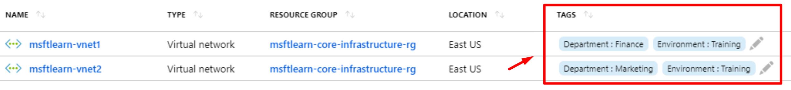

### Role-Based Access Control (RBAC)
เป็นการจัดการกับ Access Control ให้กับ Resources ของเราครับ โดยเลือก Built-in Role ที่ Azure เตรียมมาให้แล้ว

ตัวอย่างการใช้งาน
- อนุญาตให้ผู้ใช้รายหนึ่งจัดการ VMs ใน Subscription และผู้ใช้อีกรายจัดการ Virtual Networks
- อนุญาตให้กลุ่มผู้ดูแลระบบฐานข้อมูล (DBA) จัดการฐานข้อมูล SQL ใน Subscription
- อนุญาตให้ผู้ใช้จัดการทรัพยากรทั้งหมดใน Resource group หนึ่งๆ เช่น VMs, เว็บไซต์ และ Virtual Subnets
- อนุญาตให้แอปพลิเคชันเข้าถึงทรัพยากรทั้งหมดใน resource group หนึ่งๆ ได้

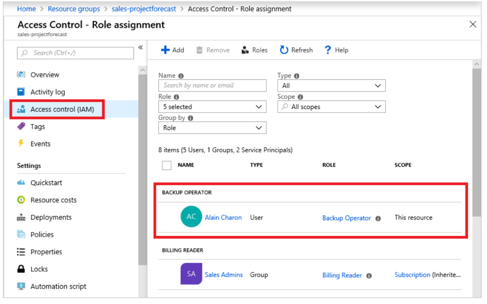

#### แนวทางปฏิบัติที่ดีที่สุดสำหรับ RBAC
- แยกหน้าที่และให้สิทธิ์การเข้าถึงกับผู้ใช้งานเท่าที่จำเป็น
- ควรให้สิทธิ์ผู้ใช้งานในระดับต่ำสุดที่พวกเขาต้องใช้ในการทำงาน
- ใช้ Resource Locks เพื่อให้แน่ใจว่า ไม่มีการแก้ไขหรือลบทรัพยากรที่สำคัญ

### Resource Lock
Azure ช่วยป้องกันความผิดพลาดในการเผลอลบ Resource ได้ด้วยการปรับให้ Resource อยู่ในสถานะ Lock เหมาะกับ Resources ที่สำคัญมากๆที่ห้ามถูกลบนะครับ

สามารถนำ Resource Lock ไปใช้กับ Subscription, Resource Group และ Resource โดยสามารถสืบทอดไปยังระดับล่างได้เมื่อกำหนด Resource Lock ในระดับที่สูงกว่า

#### Resource Lock Mode
- **Delete** คือการอนุญาตให้เข้าถึงและใช้งาน Resources ได้ทุกอย่าง ยกเว้นไม่สามารถที่จะลบได้
- **Read-only** จะอนุญาตเฉพาะการอ่าน (Read) Resources เท่านั้น ไม่สามารถแก้ไขหรือการลบทรัพยากรได้
ตัวอย่างการติดตั้ง Resource Lock ไปยัง Resource Group

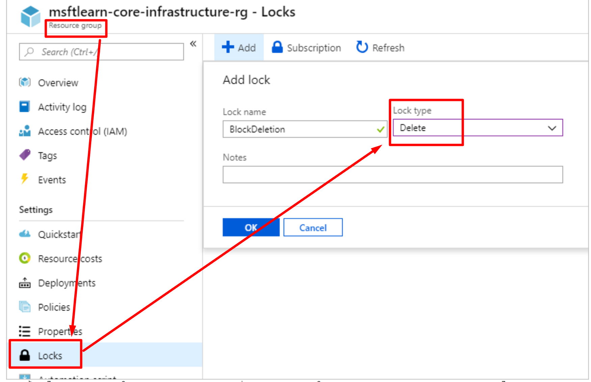

ตัวอย่างการติดตั้ง Resource Lock ไปยัง Resource Group

เมื่อเราทดลองลบ Resources ที่อยู่ใน Resource Group ที่เราติดตั้ง Resource Lock ไว้จะพบ Error ว่าไม่สามารถลบได้ดังนี้

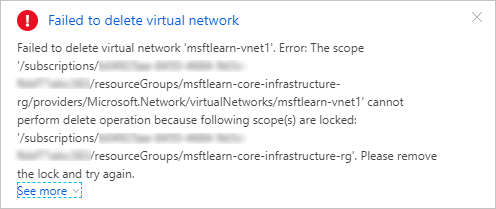

ลบไม่ได้นะฮ้าบบบบ เรากันไว้แร้น

## เนื้อหาเพิ่มเติมที่เกี่ยวข้องกับการสอบครับ
- [Digital Skill — Azure Fundamentals (ภาษาไทย)](https://course.digitalskill.org/courses/course-v1:Microsoft+AZ-LEARN-0+2019/about)
- [ExamTopics — AZ-900 Exam Actual Questions](https://www.examtopics.com/exams/microsoft/az-900/view/1/)
- [Facebook — Data TH.com — Data Science ชิลชิล (ภาษาไทย)](https://www.facebook.com/datasciencechill/posts/872166769835048/)
- [Github — Microsoft Certified Azure Fundamentals (ภาษาไทย)](https://github.com/Tizcom/AZ-900/blob/main/Microsoft%20Azure%20Fundamentals_Handout.pdf)
- [Medium — Azure AZ-900 Exam Preparation Guide: How to pass in 3 days](https://medium.com/weareservian/azure-az-900-exam-preparation-guide-how-to-pass-in-3-days-dabf5534507a)
- [Medium — วีธีลงทะเบียนสอบ AZ-900 Online ที่บ้านด้วย Azure Exam Voucher](https://medium.com/@ponggun/%E0%B8%A7%E0%B8%B5%E0%B8%98%E0%B8%B5%E0%B8%A5%E0%B8%87%E0%B8%97%E0%B8%B0%E0%B9%80%E0%B8%9A%E0%B8%B5%E0%B8%A2%E0%B8%99%E0%B8%AA%E0%B8%AD%E0%B8%9A-az-900-online-%E0%B8%97%E0%B8%B5%E0%B9%88%E0%B8%9A%E0%B9%89%E0%B8%B2%E0%B8%99%E0%B8%94%E0%B9%89%E0%B8%A7%E0%B8%A2-azure-exam-voucher-c0d027253d34)
- [Medium — AZ-900 รีวิวแนวข้อสอบและวิธีลงสอบที่ศูนย์สอบ](https://link.medium.com/bX2BY3vin8)
- [Medium — AZ-900 สรุปละเอียดสุดๆ](https://medium.com/@manita.swwp/virtual-academy-for-microsoft-azure-fundamental-in-thai-language-f5354c2f8634)
- [Microsoft Learn-Azure Fundamentals](https://docs.microsoft.com/en-us/learn/paths/azure-fundamentals/)
- [Udemy — Microsoft Azure — Beginner’s Guide + AZ-900 (มีค่าใช้จ่าย)](https://www.udemy.com/course/microsoft-azure-beginners-guide)
- [WhizLabs — AZ-900 (มีค่าใช้จ่าย)](https://www.whizlabs.com/learn/course/microsoft-azure-az-900)
- [Workshop เล็กๆจาก Microsoft สำหรับ AZ-900 ครับผม](https://microsoftlearning.github.io/AZ-900T0x-MicrosoftAzureFundamentals/)

## สรุป
ในบทความนี้เราจะได้เรียนรู้การจัดการกับ Governance and Compliance เพื่อบังคับการใช้งานบน Azure ให้เป็นไปตามมาตราฐานที่องค์กรกำหนดน่ะครับ โดยจะมีบริการที่เกี่ยวข้องคือ Azure Manage Group, Azure Policy และ Azure Blueprints

Azure ยังเตรียมช่องทางในตรวจสอบบริการว่าสอดคล้องกับ Compliance หรือไม่ เช่น GDPR, ISO โดยจะประกอบด้วยบริการที่เกี่ยวข้องคือ Microsoft Privacy Statement, Microsoft Trust Center, Service Trust Portal (STP) และ Compliance Manager

เรายังได้ทราบถึงบริการด้าน Monitoring บน Azure เช่น Azure Monitor และ Azure Service Health

ในส่วนของการจัดการกับบริการทั้งหมดของ Azure เราจะทำผ่าน Azure Resource Manager ครับ ซึ่งจะมีบริการย่อยๆที่ช่วยเราจัดการ Resources เช่น Resource Group, Tag, Role-Based Access Control และ Resource Lock ครับ

หวังว่าเนื้อหาในบทความนี้จะช่วยให้เราเข้าใจ Governance and Compliance, Monitoring และการจัดการ Resources มากขึ้นน่ะครับ