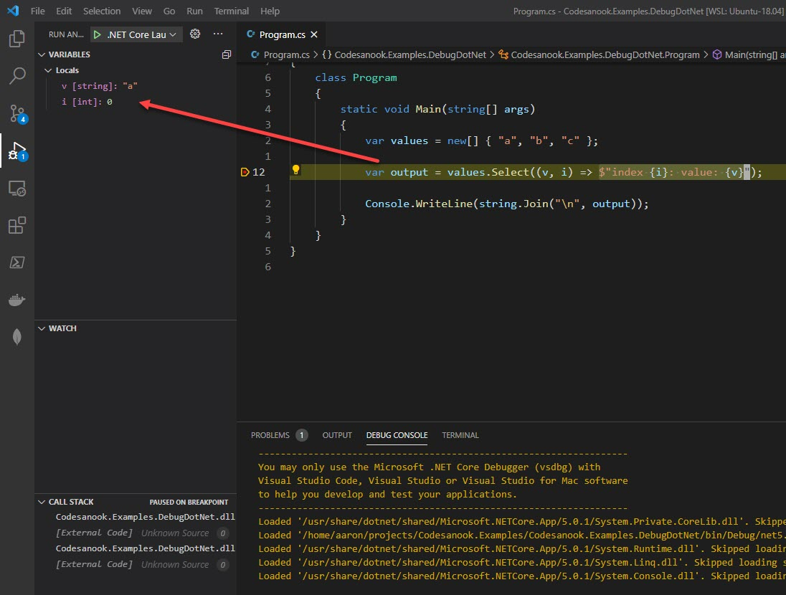

# Debug C# Code

- Create `.vscode/launch.json` file.
- Add the following content and change program value to your output file.
  ```json
  {
    "version": "0.2.0",
    "configurations": [
      {
        "name": ".NET Core Launch (console)",
        "type": "coreclr",
        "request": "launch",
        "preLaunchTask": "build",
        // TODO Change program value to your output file.
        // If you have changed target frameworks, make sure to update the program path.",
        "program": "${workspaceFolder}/bin/Debug/net5.0/MyProgram.dll",
        "args": [],
        "cwd": "${workspaceFolder}",
        "console": "internalConsole",
        "stopAtEntry": false
      }
    ]
  }
  ```

- Create `.vscode/tasks.json` file.
- Add the following content and use your project file.
  ```json
  {
    "version": "2.0.0",
    "tasks": [
      {
        "label": "build",
        "command": "dotnet",
        "type": "process",
        "args": [
          "build",
          // TODO Change a value to your project file.
          "${workspaceFolder}/MyProgram.csproj",
          "/property:GenerateFullPaths=true",
          "/consoleloggerparameters:NoSummary"
        ],
        "problemMatcher": "$msCompile"
      }
    ]
  }
  ```

- Alternatively you can use VS Code to generate launch.json and tasks.json.
  1. Click Debug icon.
  2. Click create a launch.json file.
  3. Click .NET Core.

  

- Open a project with VS Code.
- Put a breakpoint (F9) on a line that you want to pause a program and inspect value of a variable.
- Start a program by pressing F5 or go to `Run > Start Debugging`.
  - If you want to debug LINQ, put a cursor on Lambda expression and go to `Run > New Breakpoint > Inline Breakpoint`.
  - You can also put a cursor on a lambda expression and press F9.
- A program will be launched and pause on a line that you put a breakpoint.
- You can inspect current values of variables in variable window, add variable to watch and see call stack.

  

# Debug with an external terminal WSL2
- If we set `"console": "externalTerminal"` option in launch.json, we will get `Unable to launch debugger worker process (vsdbg) through the terminal. spawn xterm ENOENT` error message.
- We can use `dotnet run` in an external terminal to run our .NET project and then attach a debugger.
- For a console app, we may need to add checking `Debugger.IsAttached` at the beginning of the main method as the following code:
  ```csharp
      public static void Main(string[] args)
      {
          while (!Debugger.IsAttached)
          {
              Thread.Sleep(100);
          }
      }
  ```
- Add `.NET Core Attach` configuration to launch.json file.
  ```json
  {
    "version": "0.2.0",
    "configurations": [
      {
        "name": ".NET Core Attach",
        "type": "coreclr",
        "request": "attach"
      }
    ]
  }
  ```
- In an external terminal, CD to the root of our project and execute `dotnet run`.
  ```sh
  $ dotnet run
  ```
- Go back to VS Code. Put a breakpoint to a line that you want a pause a program.
- Click Debug icon.
- Change to .NET Core Attach configuration.
- Click Start Debugging button or press F5.
- Select a process that has a name matches to our project name.

  

- A program has been paused at a breakpoint and we can now start debugging, inspecting a value.

  


# Credit & useful resources
- https://dotnetcoretutorials.com/2021/04/03/i-wish-i-knew-about-debugger-launch-earlier/
