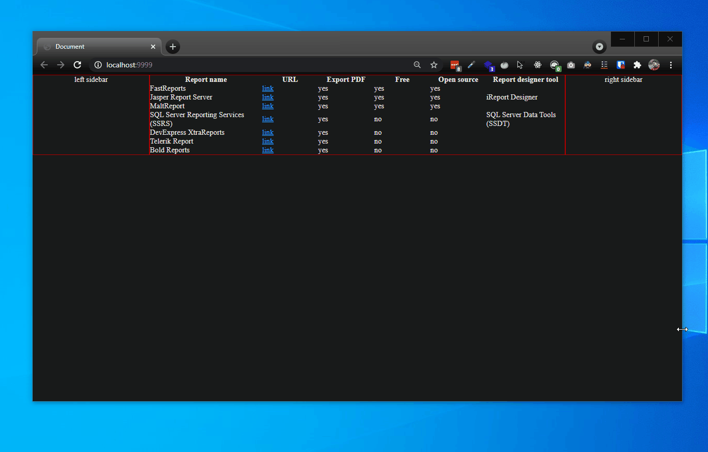

# Basic Flexbox

- [A Complete Guide to Flexbox](https://css-tricks.com/snippets/css/a-guide-to-flexbox/)

# flex-basis

- The final value of flex-basic is `content's width —> width value —> flex-basis (limited by max|min-width)`.
- Use `flex-shrink` to make flex items fit flex container.
- Use `flex-grow` to make flex items to fill flex container.
- Read more https://mastery.games/post/the-difference-between-width-and-flex-basis/

# Flex trouble shooting

- [CSS Flex positioning gotchas: child expands to more than the width allowed by the parent](https://gaurav5430.medium.com/css-flex-positioning-gotchas-child-expands-to-more-than-the-width-allowed-by-the-parent-799c37428dd6)

## Flex item size glow beyond flex container and table not show scroll x.
- Start from a screen size 1200px.
- Left and right sidebars take 500 px, then main content has available space more than minimum 600px of child content (assume we have table child item.
- The main content grows to fit available space. It ends up 700px. (1200 - (2\* 250))
- Next, on a smaller screen 1000px width.
- We need at least 1100px, left sidebar 250px + table 600px + right side 250px.
- No width or min-width of main content which is a flex item. A table forces main content flex item to expand and get browser to have page scroll x.
- The main content width is set to 600px which is the same width as a child content (table).
- After, setting min-width 1% to main content on 1000px screen size.
- The main content has set width to available space which is 500px and not expand to 600px because we only has flex shrink on it.
- Table has width 600px as a minimum width (sum of 100 min width of 6 columns) and show scroll-x at wrapper div of it.

