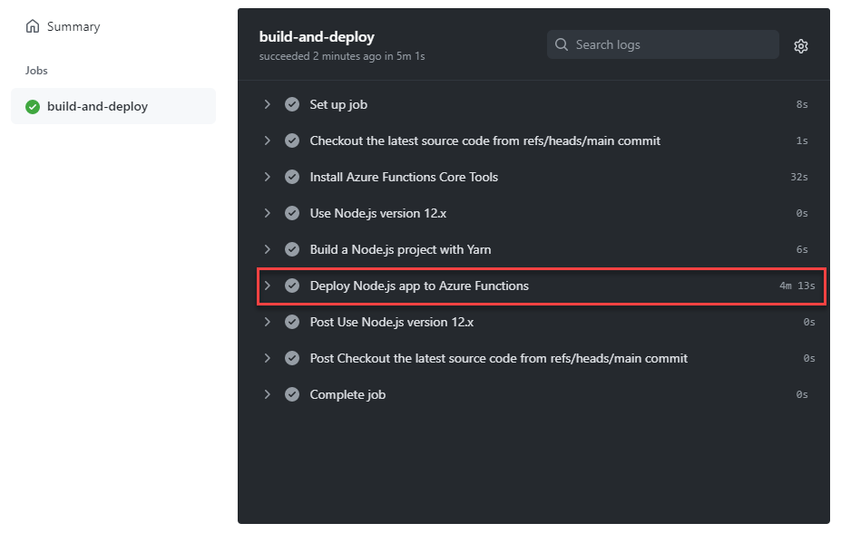

# Overview of a workflow
- Pushing a new commit to a main branch triggers a workflow.
- Use Yarn to build a project and publish to Azure App Service with [Azure/functions-action](https://github.com/Azure/functions-action).
- A workflow is defined by a YAML (.yml) file in the `.github/workflows/` directory in your repository.
- We use a Node.js project from [a code example in Azure Functions content](/cloud-hosting/azure/azure-functions).

# All required GitHub secrets
- `AZURE_FUNCTIONS_APP_PUBLISH_PROFILE`, set to a value of publish profile content that we download from Azure portal.
- `AZURE_FUNCTIONS_APP_NAME`, set to a name of Azure Functions that you are about to deploy.

# Example of a workflow script
```yaml
# .github/workflows/deploy-node-js-app-to-azure-functions.yml
name: Deploy Node.js app to Azure Functions

on:
  push:
    branches:
      - main # Change to any branch to appropriate your project.

env:
  AZURE_FUNCTIONS_APP_PACKAGE_PATH: '.' # Set this to the path of your function app project, defaults to the repository root.
  NODE_VERSION: 12.x # Set Node.js version to use.

jobs:
  build-and-deploy:
    # Find more virtual environments
    # https://www.dotnetthailand.com/programming-cookbook/github-actions/github-actions-fundamentals#findmorevirtualenvironments
    runs-on: ubuntu-18.04

    # You can use default run to set a default working directory
    # https://docs.github.com/en/free-pro-team@latest/actions/reference/workflow-syntax-for-github-actions#jobsjob_iddefaultsrun
    defaults:
      run:
        working-directory: ${{ env.AZURE_FUNCTIONS_APP_PACKAGE_PATH }}

    steps:
      - name: Checkout the latest source code from ${{ github.ref }} commit
        uses: actions/checkout@v2 # https://github.com/actions/checkout

      - name: Install Azure Functions Core Tools
        # Yarn's already installed on a virtual environment https://github.com/actions/virtual-environments/blob/main/images/linux/Ubuntu1804-README.md#package-management
        run: |
          # Install the Microsoft package repository GPG key, to validate package integrity.
          curl https://packages.microsoft.com/keys/microsoft.asc | gpg --dearmor > microsoft.gpg
          sudo mv microsoft.gpg /etc/apt/trusted.gpg.d/microsoft.gpg

          # Set up the APT source list before doing an APT update.
          sudo sh -c 'echo "deb [arch=amd64] https://packages.microsoft.com/repos/microsoft-ubuntu-$(lsb_release -cs)-prod $(lsb_release -cs) main" > \
            /etc/apt/sources.list.d/dotnetdev.list'

          # Install the Core Tools package.
          sudo apt-get update
          sudo apt-get install azure-functions-core-tools-3

      - name: Use Node.js version ${{ env.NODE_VERSION }}
        uses: actions/setup-node@v2 # https://github.com/actions/setup-node
        with:
          node-version: ${{ env.NODE_VERSION }}

      - name: Build a Node.js project with Yarn
        # Yarn's already installed on a virtual environment https://github.com/actions/virtual-environments/blob/main/images/linux/Ubuntu1804-README.md#package-management
        run: |
          yarn install
          yarn run build:production

      - name: Deploy Node.js app to Azure Functions
        uses: Azure/functions-action@v1 # https://github.com/Azure/functions-action
        with:
          app-name: ${{ secrets.AZURE_FUNCTIONS_APP_NAME }}
          package: ${{ env.AZURE_FUNCTIONS_APP_PACKAGE_PATH }}
          publish-profile: ${{ secrets.AZURE_FUNCTIONS_APP_PUBLISH_PROFILE }}
```

# Output after pushing a new commit to GitHub


# Credit & Reference
- https://docs.microsoft.com/en-us/azure/azure-functions/functions-how-to-github-actions?tabs=javascript
