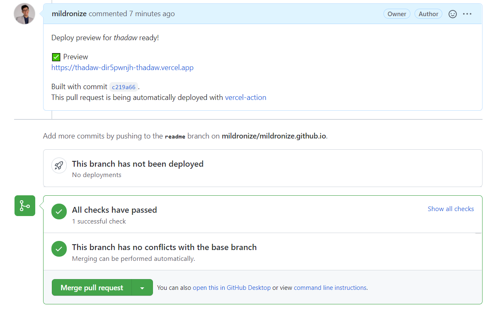

[ตัวอย่าง Pull request](https://github.com/mildronize/mildronize.github.io/pull/29)
## How to use
1. ถ้ามีการเชื่อมต่อ Vercel กับ Github ให้ปิดการเชื่อมต่อก่อน
เพราะว่าเราต้องการให้ github actions build and deploy แทนที่ Vercel (ซึ่งโดยปกติ Vercel จะ build และ deploy ให้อัตโนมัติ) [Read More](https://github.com/marketplace/actions/vercel-action#disable-vercel-for-github)
2. You should link Github Project with Vercel [locally](https://github.com/marketplace/actions/vercel-action#project-linking) (For Vercel CLI 17)
3. Define Github Actions

  ```yaml
  # https://github.com/marketplace/actions/vercel-action
  name: Preview deploy
  on:
    pull_request:
      branches:
        - main
    pull_request_target:
  jobs:
    deploy:
      runs-on: ubuntu-latest
      steps:
        - uses: actions/checkout@v2
        - uses: amondnet/vercel-action@v20
          id: vercel-action
          with:
            vercel-token: ${{ secrets.VERCEL_TOKEN }} # Required
            github-token: ${{ secrets.PUBLIC_REPO_ACCESS_TOKEN }} #Optional
            vercel-org-id: ${{ secrets.VERCEL_ORG_ID}}  #Required
            vercel-project-id: ${{ secrets.VERCEL_PROJECT_ID}} #Required
        - name: preview-url
          run: |
            echo ${{ steps.vercel-action.outputs.preview-url }}
  ```

4. กำหนดค่าที่ต้องใช้ ทั้ง GitHub Secrets และ Vercel

  | Secret key               | Secret value                                                                                         |
  |--------------------------|------------------------------------------------------------------------------------------------------|
  | VERCEL_TOKEN             | ต้องสร้างจาก https://vercel.com/account/tokens                                                         |
  | PUBLIC_REPO_ACCESS_TOKEN | ต้องกำหนด **repo** access โดยกำหนด Token ของ github [read more](https://docs.github.com/en/github/authenticating-to-github/keeping-your-account-and-data-secure/creating-a-personal-access-token)               |
  | VERCEL_ORG_ID            | ID ของ team ที่เราใช้ แต่ถ้าใช้ Personal ให้เอาจาก [account setting](https://vercel.com/account) ใน Your ID |
  | VERCEL_PROJECT_ID        | เอามาจาก Project ID ใน Project Setting                                                               |

สำหรับการตั้งค่าอื่นๆ เพิ่มเติมที่ [Vercel Action - GitHub Action](https://github.com/amondnet/vercel-action)

# Read More
- [Deploy your pull requests with GitHub Actions and GitHub Deployments](https://sanderknape.com/2020/05/deploy-pull-requests-github-actions-deployments/)
