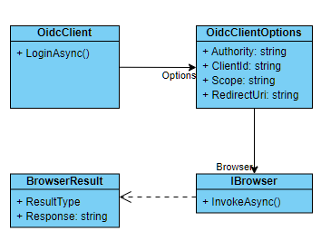

# Introduction

บทความนี้สรุปวิธีการต่อ Auth0 ขา Authorization Code Flow สำหรับ .NET MAUI ซึ่งนำมาจาก[ตัวอย่างของ Auth0](https://auth0.com/blog/add-authentication-to-dotnet-maui-apps-with-auth0/)

## Pre-requisites

คนเขียน assume ว่าผู้อ่านเข้าใจเรื่องเหล่านี้มาแล้ว

* [การพัฒนา application ด้วย .NET MAUI รวมถึงโครงสร้าง project](https://learn.microsoft.com/en-us/training/paths/build-apps-with-dotnet-maui/)
* [การสร้าง Application profile ใน Auth0](https://auth0.com/docs/get-started/auth0-overview/create-applications)
    * สามารถดูจากหัวข้อ "Register with Auth0" ใน [ตัวอย่างของ Auth0](https://auth0.com/blog/add-authentication-to-dotnet-maui-apps-with-auth0/) เช่นกัน
* [Illustrated guide to OpenID Connect (OIDC)](https://developer.okta.com/blog/2019/10/21/illustrated-guide-to-oauth-and-oidc)

# How-To (Android/iOS)

ตัวอย่างของ Auth0 ใช้ .NET library ชื่อ [IdentityModel.OidcClient](https://github.com/IdentityModel/IdentityModel.OidcClient) ในการทำ OIDC Service Discovery,
handle Authorization Code flow, และสร้าง ClaimsPrincipal จาก ID token ให้

OidcClient lib มี class หลักคือ `IdentityModel.OidcClient.OidcClient` สำหรับ login, logout, etc. และมี helper class `IdentityModel.OidcClient.Browser.IBrowser` ที่ dev จะต้องช่วย implement เพื่อ handle เรื่องของการเปิด browser และทำ Authorization Code flow ฝั่งที่เป็น UI ความสัมพันธ์ของ class เหล่านี้ แสดงไว้ในรูปด้านล่าง

<figure>



<figcaption align="center">ความสัมพันธ์ของ OidcClient และ IBrowser</figcaption>
</figure>

ในการต่อ OIDC ด้วย `OidcClient` นี้ เราจะต้องเตรียม/ลงทะเบียนข้อมูลเหล่านี้ให้พร้อม

* Client ID - ได้จากการลงทะเบียน application ใน Auth0
* Authority URI - เช่น `https://myapp.auth0.com` หรือ domain อะไรก็ตามที่ provide `.well-known/oidc-configuration`

(มันไม่ใช้ Client Secret เลยเข้าใจว่าน่าจะเป็น Authorization Code + PKCE flow)

## Auth0 helper classes

ตามตัวอย่างของ Auth0 เค้าสร้าง helper class ขึ้นมา ซึ่งขั้นตอนนี้ไม่จำเป็น เราสามารถใช้ `OidcClient` ได้โดยตรง แต่ wrap ไว้เป็น util class เพื่อ reusable ไว้ก็ได้ 
บทความนี้จะใช้ pattern เดียวกันกับบทความต้นฉบับ

### Auth0 client options

เริ่มจาก create option class ซึ่ง properties แทบจะเหมือน `OidcClientOptions` 😔

```cs
public sealed record Auth0ClientOptions(string Domain, string ClientId, string RedirectUri = "myapp://callback",
                                        string Scope = "openid");
```

### Auth0 Client

```cs
public sealed class Auth0Client
{
    readonly Auth0ClientOptions options;
    readonly OidcClient oidcClient;
    readonly string authority;

    public Auth0Client(Auth0ClientOptions opts, IBrowser browser) {
        options = opts;
        authority = $"https://{opts.Domain}";
        oidcClient = new(new(){
            Authority = authority,
            ClientId = opts.ClientId,
            Scope = opts.Scope,
            RedirectUri = opts.RedirectUri,
            Browser = browser
        });
    }

    [MethodImpl(MethodImplOptions.AggressiveInlining)]
    public Task<LoginResult> LoginAsync() => oidcClient.LoginAsync();
}
```

หลักๆก็คือแค่ wrap `OidcClient` (แต่จริงๆความซับซ้อนจะอยู่ในจังหวะ Logout อยู่ใน Section หลังๆ)

สังเกตุว่า constructor มี `IBrowser` ซึ่งเป็น helper class ที่มันต้องใช้

### MAUI Native IBrowser helper

```cs
public class WebBrowserAuthenticator : IBrowser
{
    public async Task<BrowserResult> InvokeAsync(BrowserOptions options,
                                                 CancellationToken cancellationToken = new()) {
        try {
            var result = await WebAuthenticator.AuthenticateAsync(new(options.StartUrl), new(options.EndUrl));
            var url = new RequestUrl(options.EndUrl).Create(new (result.Properties));
            return new(){ ResultType = BrowserResultType.Success, Response = url };
        }
        catch (TaskCanceledException) {
            return new() { ResultType = BrowserResultType.UserCancel,
                           ErrorDescription = "Login cancelled by the user"};
        }
    }
}
```

Note: type `IBrowser`, `BrowserResult`, `BrowserOptions`, `RequestUrl` เป็นของ `OidcClient` library

`IBrowser` มีอยู่ method เดียวคือ `InvokeAsync` ซึ่งจะถูก call จาก `OidcClient` หลังจากที่มัน discover service endpoints ต่างๆแล้ว โดยที่ `options.StartUrl` จะเป็น URL ของ
Authorization Code flow (ในที่นี้ จะเป็นของ Auth0) และ `options.EndUrl` เป็น callback URL ที่เราส่งไปให้

`result.Properties` เป็น dictionary ของ query string ที่ได้จากการ authorization code call back ขาแรก (parameter เช่น `code` และ `state`)

ส่วน `WebAuthenticator` เป็น authentication helper class ของ .NET MAUI เอง โดยถ้าเป็น Android/iOS มันจะแสดง browser สำหรับ login ให้เลย แต่ปัญหาคือสำหรับ Windows platform ณ เวลาที่เขียนนี้ [`WebAuthenticator` ยังใช้กับ Windows ไม่ได้](https://github.com/dotnet/maui/issues/2702) (มี suggested workaround แต่ยังไม่ได้ลอง https://github.com/dotMorten/WinUIEx/blob/main/src/WinUIEx/WebAuthenticator.cs)

ดังนั้นสำหรับ Windows platform จะต้องใช้ browser ที่เป็น "WebView" แทน ซึ่งจะพูดถึงใน section หลังๆ

## ประกอบร่าง!

ขั้นแรก register `Auth0ClientOptions` ใน `MauiProgram` ก่อน ขั้นตอนนี้ต้องใช้ OIDC domain และ client ID (และ scope ที่คุณอยากได้)

```cs
public static class MauiProgram
{
	public static MauiApp CreateMauiApp()
	{
		var builder = MauiApp.CreateBuilder();
		builder
			.UseMauiApp<App>()
			.ConfigureFonts(fonts =>
			{
				fonts.AddFont("OpenSans-Regular.ttf", "OpenSansRegular");
				fonts.AddFont("OpenSans-Semibold.ttf", "OpenSansSemibold");
			});

        builder.Services.AddSingleton<MainPage>();

        // register here
        builder.Services.AddSingleton(new Auth0ClientOptions("yours.auth0.com", "YOUR_CLIENT_ID", Scope:"openid any_scopes_you_want",
                                                           RedirectUri: "myapp://callback"
                                                           ));

		return builder.Build();
	}
}
```

ขั้นที่สอง ไปสร้าง `Auth0Client` ในหน้าที่เราทำ login (ในตัวอย่างเดิมของ Auth0 เค้าพยายามจะ register `Auth0Client` ใน IoC container ตรงๆเลย แต่มันจะติดประเด็นเรื่อง
`IBrowser` เมื่อเราจะต้องใช้ WebView) สำหรับตัวอย่างนี้ผู้เขียนทำ login ในหน้า `MainPage`

```cs
public partial class MainPage
{
    readonly Auth0Client client;
    int count;

	public MainPage(Auth0ClientOptions auth0Options) {
        InitializeComponent();

        client = new (auth0Options, new WebBrowserAuthenticator());
    }

	private void OnCounterClicked(object sender, EventArgs e)
	{
		count++;

		if (count == 1)
			CounterBtn.Text = $"Clicked {count} time";
		else
			CounterBtn.Text = $"Clicked {count} times";

		SemanticScreenReader.Announce(CounterBtn.Text);
	}

    async void OnLoginClicked(object sender, EventArgs e) {
        btnLogin.IsEnabled = false;
        try {
            var loginResult = await client.LoginAsync();
            if (loginResult.IsError)
                await DisplayAlert("Error", loginResult.ErrorDescription, "OK");
            else {
                viewHome.IsVisible = true;
                viewLogin.IsVisible = false;
            }
        }
        finally {
            btnLogin.IsEnabled = true;
        }
    }
}
```

จะเห็นเวลา เวลา login ก็เพียงแค่เรียก `client.LoginAsync()` ซึ่งเราจะได้ `ClaimsPrincipal` กับ Access Token กลับมา

**แต่เดี๋ยวก่อน.. Platform specific settings needed!**

จาก code ข้างบนจะเห็นว่าเราใช้ callback URI ว่า `myapp://callback` ซึ่งเรา make มันขึ้นมาเอง! ดังนั้นแต่ละ platform จะต้อง register URI Scheme นี้ด้วย

### Android Settings

สร้าง code นี้ไว้ใน folder `Platforms/Android`

```cs
[Activity(NoHistory = true, LaunchMode = LaunchMode.SingleTop, Exported = true)]
[IntentFilter(new[] { Android.Content.Intent.ActionView },
              Categories = new[] { Android.Content.Intent.CategoryDefault, Android.Content.Intent.CategoryBrowsable },
              DataScheme = CALLBACK_SCHEME)]
public class WebAuthenticationCallbackActivity : WebAuthenticatorCallbackActivity
{
    const string CALLBACK_SCHEME = "myapp";

}
```

และเพิ่ม intent ใน `Platforms/Android/AndroidManifest.xml` ด้วย

```xml
<!-- Platforms/Android/AndroidManifest.xml -->

<?xml version="1.0" encoding="utf-8"?>
<manifest xmlns:android="http://schemas.android.com/apk/res/android">
    <application android:allowBackup="true" 
               android:icon="@mipmap/appicon" 
               android:roundIcon="@mipmap/appicon_round" 
               android:supportsRtl="true"></application>
    <uses-permission android:name="android.permission.ACCESS_NETWORK_STATE" />
    <uses-permission android:name="android.permission.INTERNET" />
  <!-- 👇 new code -->
  <queries>
    <intent>
      <action android:name="android.support.customtabs.action.CustomTabsService" />
    </intent>
  </queries>
  <!-- 👆 new code -->
</manifest>
```

### iOS/Mac settings

ให้แก้ `Platforms/MacCatalyst/Info.plist`

```xml
<!-- Platforms/MacCatalyst/Info.plist -->

<?xml version="1.0" encoding="UTF-8"?>
<!DOCTYPE plist PUBLIC "-//Apple//DTD PLIST 1.0//EN" "http://www.apple.com/DTDs/PropertyList-1.0.dtd">
<plist version="1.0">
<dict>
  
  <!-- ...existing keys... -->
  
  <!-- 👇 new code -->
  <key>CFBundleURLTypes</key>
  <array>
    <dict>
      <key>CFBundleURLName</key>
      <string>MauiAuth0App</string>
      <key>CFBundleURLSchemes</key>
      <array>
        <string>myapp</string>
      </array>
      <key>CFBundleTypeRole</key>
        <string>Editor</string>
    </dict>
  </array>
  <!-- 👆 new code -->
</dict>
</plist>
```

## ลอง run ใน Android หรือ iOS

เมื่อกดปุ่ม Login แล้ว ควรจะเห็นหน้า Auth0 ขึ้นมาใน app

# How-To (Windows)

อย่างที่อธิบายไว้ข้างบน Windows เรา่ต้องใช้ WebView ดังนั้นเราจะมี `IBrowser` สำหรับ Web view หน้าตาดังนี้

```cs
public sealed class WebViewBrowserAuthenticator : IBrowser
{
    readonly WebView webView;
    public WebViewBrowserAuthenticator(WebView webView) {
        this.webView = webView;
    }
    
    public Task<BrowserResult> InvokeAsync(BrowserOptions options, CancellationToken cancellationToken = new()) {
        var tcs = new TaskCompletionSource<BrowserResult>();

        void onNavigate(object? _, WebNavigatedEventArgs e) {
            if (e.Url.StartsWith(options.EndUrl)) {
                tcs.SetResult(new(){ ResultType = BrowserResultType.Success, Response = e.Url });
                webView.Navigated -= onNavigate;
                webView.IsVisible = false;
            }
        }
        webView.Navigated += onNavigate;
        webView.Source = new UrlWebViewSource{ Url = options.StartUrl };
        return tcs.Task;
    }
}
```

ซึ่งใช้วิธีแอบดักดู URI ว่ามันเป็น URI callback หรือยัง ถ้าใช่ก็ assume ว่า login สำเร็จ

แต่สังเกตุว่ามันต้อง pass parameter ที่เป็น `WebView` เข้ามา ซึ่งเราได้มาจากการฝัง component `WebView` ไว้ในหน้าที่่เราอยาก login ในที่นี้คือ MainPage

```xml
<?xml version="1.0" encoding="utf-8" ?>
<ContentPage xmlns="http://schemas.microsoft.com/dotnet/2021/maui"
             xmlns:x="http://schemas.microsoft.com/winfx/2009/xaml"
             x:Class="OneDeliveryRunner.MainPage">

    <ScrollView>
        <VerticalStackLayout
            Spacing="25"
            Padding="30,0"
            VerticalOptions="Center">
            
            <StackLayout x:Name="viewLogin">
                <Button x:Name="btnLogin" Text="Log In" SemanticProperties.Hint="Click to log in" HorizontalOptions="Center" Clicked="OnLoginClicked" />
                <WebView x:Name="WebViewInstance" WidthRequest="600" HeightRequest="900" IsVisible="False" />
            </StackLayout>
            ... ตัดให้สั้น ...
        </VerticalStackLayout>
    </ScrollView>
</ContentPage>
```

เราใส่ `WebViewInstance` เข้าไปโดยให้ `IsVisible="False"` เป็น default เพราะเราไม่อยากให้มัน show ใน Android หรือ iOS

แก้ code ของ MainPage ให้เข้ากับ Windows

```cs
public partial class MainPage
{
    readonly Auth0Client client;
    int count;

	public MainPage(Auth0ClientOptions auth0Options) {
        InitializeComponent();

#if WINDOWS
        client = new (auth0Options, new WebViewBrowserAuthenticator(WebViewInstance));
#else
        client = new (auth0Options, new WebBrowserAuthenticator());
#endif
    }

    /* ตัดออกให้สั้น */

    async void OnLoginClicked(object sender, EventArgs e) {
#if WINDOWS
        WebViewInstance.IsVisible = true;
#endif
        btnLogin.IsEnabled = false;
        try {
            var loginResult = await client.LoginAsync();
            if (loginResult.IsError)
                await DisplayAlert("Error", loginResult.ErrorDescription, "OK");
            else {
                viewHome.IsVisible = true;
                viewLogin.IsVisible = false;
            }
        }
        finally {
            btnLogin.IsEnabled = true;
        }
    }
}
```

จะเห็นว่าต้องเริ่มใส่ `#if WINDOWS` เพื่อให้ไปใช้ WebView แทน

ขั้นสุดท้าย ต้องแก้ redirect URI ให้ valid ที่ฝั่ง `MauiProgram.cs`

```cs
public static class MauiProgram
{
	public static MauiApp CreateMauiApp()
	{
		var builder = MauiApp.CreateBuilder();
		builder
			.UseMauiApp<App>()
			.ConfigureFonts(fonts =>
			{
				fonts.AddFont("OpenSans-Regular.ttf", "OpenSansRegular");
				fonts.AddFont("OpenSans-Semibold.ttf", "OpenSansSemibold");
			});

        builder.Services.AddSingleton<MainPage>();
        builder.Services.AddSingleton(new Auth0ClientOptions("ruxoz.auth0.com", "6KwAXoBk3lI3TWg9KWIk1zctxE3suByF", Scope:"openid profile",
#if WINDOWS
                                                           RedirectUri: "http://localhost/callback"
#else
                                                           RedirectUri: "myapp://callback"
#endif
                                                           ));

		return builder.Build();
	}
}
```

เท่านี้ ลอง run ฝั่ง windows ควรจะขึ้น WebView ให้ login ได้

# สรุป

* การ authen ควบคุมโดย `IdentityModel.OidcClient` library
* MAUI `WebAuthenticator` ยังใช้ไม่ได้กับ Windows ทำให้ต้อง implement WebView สำหรับ Windows โดยเฉพาะ
* Android กับ iOS จะต้อง register scheme `myapp` (หรือชื่อ app อะไรก็ตามของเราเอง) เพราะให้ redirect ได้
