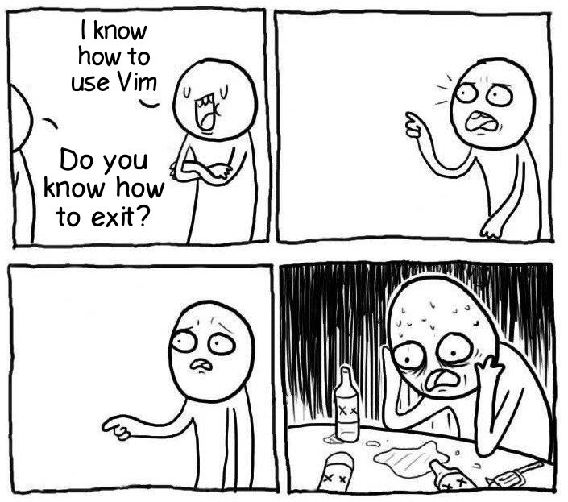

## How to exit vim?

Well it be like the meme above, Loll

> Don't worry We'll tell you the way how to exit vim like a charm!!

* Basically you should be `Normal Mode` then press colon + q `:q`
  * Wait... if you exit vim with `:q` it not be saved what you edit.
  * Incase you would like to save and exit so just do this way `:wq`
  * Incase you would like to **discard** everything of change type `:q!`
  * It's have alternative way of `:wq` is `:x`
    * `:x` command won't save the file if you didn't make any changes

* If you don't want to enter `Command-line Mode`?
  * You can type `ZZ` yep, double **z** it's same like `:x`
  * `ZQ` press Z then Q it's same like `:q!`

Yay, Finally You don't unplug your computer to exit vim anymore!
