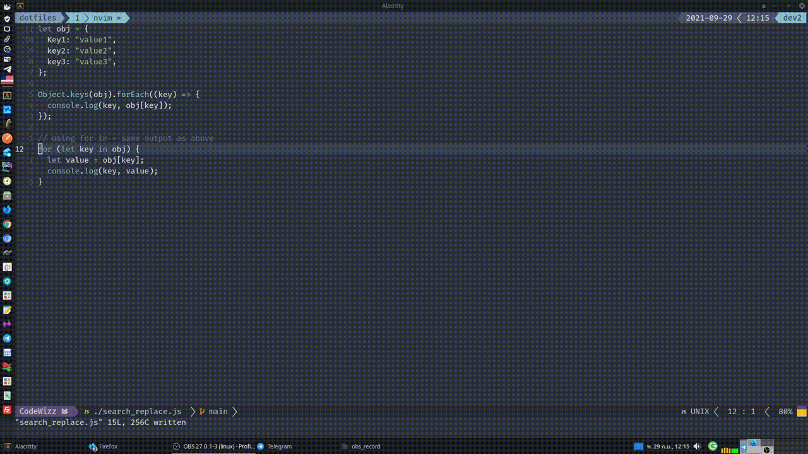

## Replacement Inside Visual Selection

When you are on visual selection and you want to replace some word

```js
//Example

for (let key in obj) {
  let value = obj[key];
  console.log(key, value);
}
```

## How to do with vim?

### Steps

- `shift + v` select what ever line do you want to
- then `:s/let/var/g <CR>`

### Explaination

- `:s/let/var/g <CR>`
  Search word "let" then replace with "var" global scope

```js
//Example

for (var key in obj) {
  var value = obj[key];
  console.log(key, value);
}
```

<!--  -->
