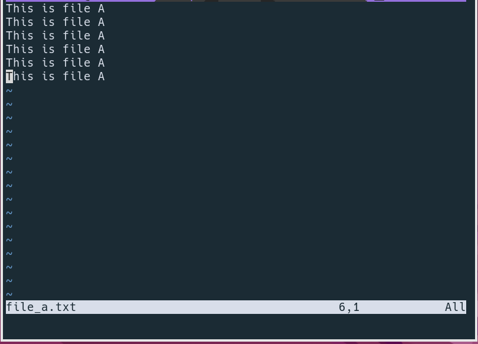
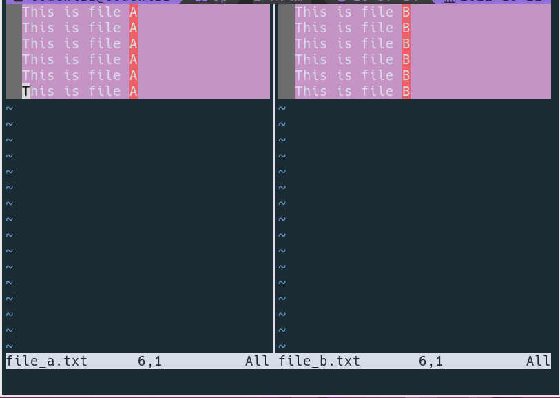
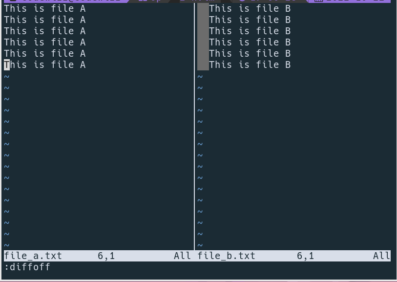

> A small trick to diff 2 files with vim

## Demo

* First open `file_a.txt` in vim.

* Then open another file, `file_b.txt` in split mode (:vsp file_b.txt).

* Incase we need to diff `file_a.txt` with `file_b.txt` then press `<Ctrl-W> + w`
(press control button + w then w).

* We are in `file_a.txt`, run `:diffthis`.

* Go to `file_b.txt` press `<Ctrl-W> + w` and run `:diffthis`.

* Wala..magic right!, it's show diff between 2 files.

* After that we can disable diff by run `:diffoff` both of file...done.

