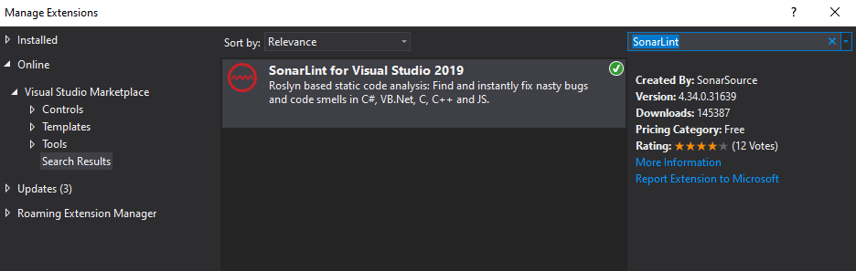
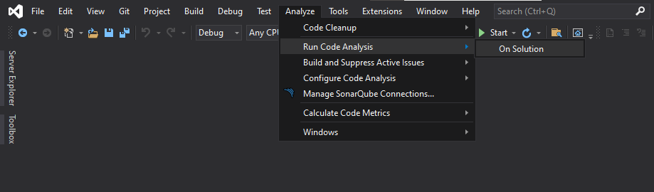
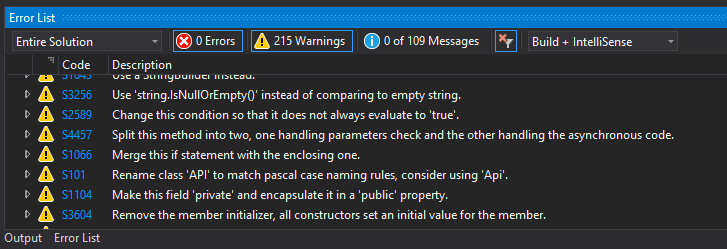

## Code Analysis
Reference: https://docs.microsoft.com/en-us/dotnet/fundamentals/code-analysis/overview

## How do we know our code has great coverage of quality standards?
This content we'll use Code Analysis with SonarLint extension.
About SonarLint https://www.sonarlint.org/visualstudio/

Let's setup!

## Steps
1. Go to Extensions and install SonarLint (We use Visual Studio 2019)
   Visual Studio will need to close and install

2. Open project and go to Analyze => Run Code Analysis => On Solution

3. When done.
   Go to Error List tab.

## Let's fix it!
